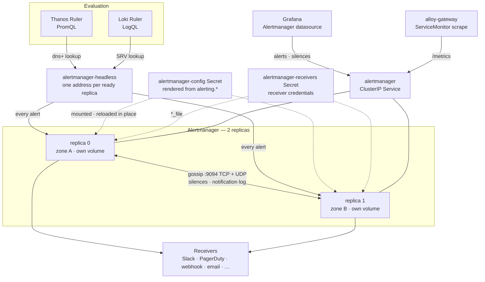
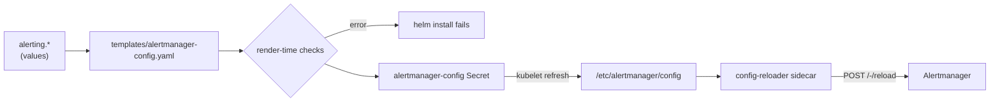

# Alert Architecture

This page describes how an alert moves through `materialize-monitoring`: evaluated by one of two rulers, sent to every
replica of the bundled Alertmanager, routed by a configuration the chart renders from `alerting`, and delivered to a receiver.
It covers why the notifier is shaped the way it is, what state it holds, and what happens to that state when things fail.

The other pages in this section cover each part in depth:

| Page | Covers |
|---|---|
| [Configuring](../configuring/) | The two rule evaluators, what each reads, and how each is wired |
| [Alert Channels](../channels/) | Receivers, receiver classes, severity presets, credentials, and extra routes |
| [Maintenance Windows](../maintenance/) | Silences, recurring mute windows, and inhibition |

The production checklist for this component is [Production Best Practices > Alertmanager](../../operating/production-best-practices/#alertmanager).

<!--
Agent note: the claims on this page were verified against a live two-replica install (gossip convergence,
both rulers discovering both replicas, silence replication, in-place reload, replica loss, and the 1→2
upgrade window). Re-verify before changing them rather than reasoning from the values file alone: the
"alerts are not gossiped" point is the one most often gotten wrong, and it is why the rulers address the
headless Service.
-->

## End-to-end flow

Five properties of that shape are the design.

**Alertmanager is the single notification surface.**
Both rulers notify it, so an operator configuring where alerts go configures one thing, whether the alert came from a metric or a log line.

**Every replica receives every alert.**
The rulers resolve the headless Service to one address per replica and send each alert to all of them.
See [Why the rulers address every replica](#every-replica).

**The replicas gossip, and deduplicate.**
Silences and the notification log replicate between them, so a notification goes out once and either replica can send it.

**The configuration is rendered, not written.**
The chart builds Alertmanager's configuration from `alerting`, checks it at render time, and reloads it in place.
See [Configuration](#configuration).

**Nothing about alerting lives in Grafana.**
Grafana reads and writes Alertmanager's alerts and silences through a datasource, and keeps none of that state itself.

## Why the rulers address every replica {#every-replica}

Alertmanager's gossip replicates two things between replicas: **silences** and the **notification log**, which records what was sent to whom and when.
It does not replicate **alerts**.
A replica knows about an alert only if a ruler sent that alert to it.

That makes the address a ruler notifies part of the HA design rather than a detail.

| Ruler notifies | What happens when one replica is lost |
|---|---|
| The load-balanced ClusterIP Service | Each send reaches one replica, and a kept-alive connection can pin every send to the same one. The survivor may hold none of the firing alerts, and notifies nothing until the ruler's next resend reaches it. |
| Every replica, through the headless Service | Both replicas hold every firing alert. The survivor carries on notifying with no gap. |

So both rulers address the headless Service through DNS discovery, and re-resolve it as replicas come and go.

| Ruler | Setting | Discovery |
|---|---|---|
| Thanos Ruler | `thanos.ruler.alertmanagers.config` | `dns+alertmanager-headless.<namespace>.svc.<domain>:9093`, an A-record lookup re-resolved every 30s |
| Loki Ruler | `loki.loki.rulerConfig.alertmanager_url` with `enable_alertmanager_discovery: true` | `http://_http._tcp.alertmanager-headless.<namespace>.svc.<domain>`, an SRV lookup re-resolved every `alertmanager_refresh_interval` (30s) |

The headless Service publishes only ready replicas, so a replica that is starting or terminating drops out of both rulers' target lists on its own.

The Loki ruler creates a tenant's notifier only once that tenant has rule groups.
Until then it has discovered nothing, and `loki_prometheus_notifications_alertmanagers_discovered` is absent rather than zero.

## How two replicas send one notification {#deduplication}

Each replica evaluates the same routing tree against the same alerts and would notify independently.
Gossip is what stops that.

A replica sends a group's notification only after waiting its position in the cluster multiplied by
`--cluster.peer-timeout` (15s by default), and only if the notification log does not already record that notification as sent.
The first replica sends at once and gossips the log entry; the second finds it and stays quiet.
If the first replica is down or cannot deliver, the second sends 15 seconds later.

**This depends on the mesh port being open on both TCP and UDP.**
Memberlist joins peers and pushes full state over TCP, and gossips updates over UDP.
With either one blocked the replicas do not converge, and every notification goes out once per replica.
The failure presents as duplicate pages, which reads like a routing problem rather than a network one.
The chart's NetworkPolicy opens `9094` on both transports, and a validator warns when a narrowed policy does not.

## High availability {#high-availability}

Two replicas is the default shape rather than a hardening step.
A single Alertmanager is lost to an ordinary node drain, holds the only copy of every silence, and cannot report its own absence.
A second replica survives the first and can report it gone.

Three is not the default.
Gossip tolerates a partition by notifying from both sides rather than by electing a leader, so a third replica adds little availability.
It adds a third copy of every notification whenever gossip is broken.

| Setting | Default | Role |
|---|---|---|
| `alertmanager.replicaCount` | `2` | Above one, the subchart passes `--cluster.peer` for every ordinal and opens the mesh ports on the headless Service |
| `alertmanager.podDisruptionBudget` | `maxUnavailable: 1` | A drain evicts one replica at a time |
| `alertmanager.topologySpreadConstraints` | hard across zones, soft across hosts | Keeps the two replicas out of one failure domain |
| `alertmanager.extraArgs.cluster.label` | `materialize-monitoring` | Stamped on every gossip message, so a peer from another Alertmanager cluster that inherits a recycled pod IP is rejected |
| `alertmanager.readinessProbe` | `/-/ready` | A StatefulSet rollout replaces one replica at a time and waits on it |

### What each failure costs

| Failure | Outcome |
|---|---|
| One replica restarts, or its node is drained | The other keeps notifying. The replacement joins the mesh and pulls its peer's silences and notification log before it serves. |
| One zone is lost | The replica in that zone stays `Pending` until the zone returns, because its volume is zonal. The other replica, in another zone, keeps notifying. |
| Both replicas are lost at once | Each comes back from its own volume with the silences and notification log it last saved. Nothing is lost that was written before the failure. |
| The mesh port is blocked | Both replicas notify independently, so every notification arrives twice. Nothing is dropped. |
| A configuration Alertmanager rejects | The previous configuration keeps running, and `alertmanager_config_last_reload_successful` drops to 0. On a fresh start, the pods crash-loop instead. |

### Zones and volumes {#zones-and-volumes}

The zone rule is `whenUnsatisfiable: DoNotSchedule`.
A replica that cannot satisfy it goes `Pending`, which is the signal the cluster autoscaler reads to add a node in the deficient zone.

Each replica's volume is zonal, which is compatible with a hard rule only under `volumeBindingMode: WaitForFirstConsumer`.
That binding mode creates each volume in whichever zone the scheduler placed its pod, so each replica lands in its own zone and stays there.
It is the default for every managed-cloud CSI class.
Under `Immediate` binding both volumes can be provisioned in one zone before scheduling, and the second replica then
stays `Pending` while the first keeps notifying.

Two differences from the zone rule on Thanos Receive are deliberate.

| Difference | Why |
|---|---|
| No `minDomains` | A single-zone cluster schedules both replicas. Only a cluster whose nodes carry no zone label at all needs `no-zone-spread`, or `min_zones = 0` on Terraform. |
| No `matchLabelKeys: [controller-revision-hash]` | It would let a new replica ignore an old-revision peer when first scheduled, which is exactly what an upgrade from one replica to two does. The new replica could land in the peer's zone, and the peer — pinned there by its volume — would then never reschedule. |

## State and storage {#state}

Alertmanager holds three kinds of state.

| State | Created by | Replicated by gossip | Survives losing both replicas |
|---|---|---|---|
| Alerts | The rulers, resent every evaluation | No — each replica receives them directly | Rebuilt from the rulers' next resend |
| Silences | Operators, through Grafana or `amtool` | Yes | Yes, from each replica's volume |
| Notification log | Alertmanager, on each notification | Yes | Yes, from each replica's volume |

Gossip is what makes one replica's loss invisible.
The volume is what makes losing both survivable: silences exist nowhere else, and without the notification log the first
evaluation after a total loss re-sends every notification that had already gone out.

Each replica keeps a 4Gi volume.
Alertmanager needs kilobytes; 4Gi is the smallest disk GCP Hyperdisk and Azure managed disks provision.
Both the volume's existence and its size render into the StatefulSet's `volumeClaimTemplates`, which Kubernetes refuses to change after install.
Changing either requires deleting the StatefulSet with `--cascade=orphan` before the upgrade.

`--data.retention` (120h) is how long expired silences and notification-log entries are kept.

## The `cluster` label {#cluster-label}

Every alert carries a `cluster` label naming the Kubernetes cluster it came from.
The value is `clusterName`, which Terraform's `cluster_name` sets, and which is also stamped on every log
line and every metric this stack collects.

| Ruler | How it stamps `cluster` |
|---|---|
| Thanos Ruler | `--label=cluster="$(CLUSTER_NAME)"`, an external label, added to every alert it sends and every sample it writes |
| Loki Ruler | An `alert_relabel_configs` entry, because the Loki ruler has no external labels |

Both fill the label only where an alert lacks it.
An alert whose expression kept `cluster` from its series keeps that value, which is the same one wherever the series came from this cluster.
Neither subchart can read `pipeline.env`, so the chart renders the name into a `ruler-env` ConfigMap in each ruler's
namespace, and each ruler reads it as an environment variable.

Within one cluster the label is constant, and it matters as soon as two clusters share anything downstream.

| Shared downstream | Without `cluster` |
|---|---|
| A chat channel | A notification does not say which cluster it is about |
| An incident tool | An Alertmanager group key is built from the route and the group labels, and PagerDuty's `dedup_key` and Opsgenie's `alias` are hashes of it. Two clusters sending one condition open one incident, and either cluster's resolution closes it |
| One Alertmanager | Identical label sets from two clusters are the same alert, so each overwrites the other's state |

The default `alerting.routes.root.group_by` includes `cluster` for the second row.
All three depend on `clusterName` being unique per cluster.
Left at its default, `default`, on several clusters, the label is present and distinguishes nothing.

## Configuration {#configuration}

The chart renders Alertmanager's configuration itself, from `alerting`, rather than passing it to the subchart.

The subchart renders its `config` block into a ConfigMap with `toYaml`, so nothing in it can be computed.
The severity presets, the receiver classes and the render-time checks all have to be.
So `alertmanager.config.enabled` is off, and the chart renders the `alertmanager-config` Secret and mounts it at `/etc/alertmanager/config`.

A change to `alerting` reaches the running replicas without a restart.
The kubelet refreshes the mounted Secret, the config-reloader sidecar sees the change and asks Alertmanager to reload,
and the whole path takes seconds to about a minute.
The sidecar is needed because the subchart rolls its pods on a checksum of the ConfigMap it no longer renders.

`alertmanager.baseURL` is left empty by default and is not pointed at Grafana: Alertmanager builds links into its own UI
from it, and Grafana serves none of those paths.
`extraArgs.web.route-prefix: /` keeps every endpoint at the root whatever `baseURL` is set to.
[Alert Channels](../channels/#links) shows how to link notifications to Grafana instead.

### The routing tree

The rendered tree has the same shape in every install.

| Order | Route | Source |
|---|---|---|
| 1 | Each route in `alerting.routes.extra`, verbatim | The operator |
| 2 | One route per severity in the selected preset, delivering that severity's class | `alerting.preset`, `alerting.presets` and the receivers' `class` |
| 3 | A catch-all delivering the class of `alerting.unknownSeverity` | So an alert with no recognised `severity` still reaches somebody |

The root route's receiver is `mzmon-null`, which notifies nobody.
While `alerting.receivers` is empty, rows 2 and 3 are left out and every alert lands there.
Alerts on `mzmon-null` still fire and still show in Alertmanager and Grafana.

A class served by one receiver is a single route.
A class served by several is a parent route with one child per receiver, each set to `continue`, because an Alertmanager
route names exactly one receiver.

[Alert Channels](../channels/) covers configuring each part.

### What is checked, and when

| Check | Where | Catches |
|---|---|---|
| Structural validators | Every `helm template` and `helm install` | An unroutable severity, an undefined receiver or time interval, an inline credential, a credential file no volume mounts, a receiver key that is not an integration, a template Alertmanager would not load |
| `amtool check-config` | CI, over representative scenarios (`make alertmanager-config-check`) | The chart generating a tree Alertmanager rejects |
| Alertmanager itself | Each reload | Anything else in a receiver body, which the chart passes through without modelling |

The chart does not model receiver types.
A receiver's `config` passes through verbatim, which is why every integration Alertmanager supports works, and why the last row exists.

## Credentials {#credentials}

Receiver credentials are referenced by path, never inlined.
Nearly every Alertmanager credential field has a `_file` variant, and the chart mounts Secrets for those fields to read.

One Secret is mounted by default: `alertmanager-receivers`, at `/etc/alertmanager/secrets/alertmanager-receivers/`.
It is optional, so the pods start before it exists.
Alertmanager reads a `*_file` credential each time it sends, so creating or rotating the Secret takes effect without a restart.

The render fails when a receiver carries an inline credential, unless `alerting.assertNoInlineCredentials` is turned off.
It also fails when a `*_file` path falls under no mounted volume, since that notification would fail at send time.

Amazon SNS is the one integration that uses the pod's cloud identity instead, through IRSA or EKS Pod Identity on the `alertmanager` ServiceAccount.
[Cloud provider services](../channels/#cloud) lists the permissions for it and for the cloud email services.

## Observing Alertmanager {#observing}

Alertmanager is scraped through a ServiceMonitor, once per replica.
Both Services the subchart renders carry the same labels, so the monitor drops the headless Service's targets to avoid scraping each replica twice.

| Series | Healthy value | Means when it is not |
|---|---|---|
| `alertmanager_cluster_members` | `2` on each replica | A replica is down, or the mesh has partitioned |
| `alertmanager_config_last_reload_successful` | `1` | The last configuration change was rejected, and the previous one is still running |
| `rate(alertmanager_notifications_failed_total[5m])` | `0` | A receiver is refusing or unreachable, per `integration` |
| `alertmanager_notifications_total` | rising while alerts fire | Nothing is being delivered |

Grafana's **Alertmanager** datasource (`connections.datasources.alertmanager`) gives the alert list and the silence editor.
It points at the ClusterIP Service, which is correct for a reader: every replica holds the same alerts and silences.

None of these series is alerted on yet.
The deadman's switch and the meta-alerts that read them arrive with the rule set.

## Resource map {#resources}

| Resource | Name | From |
|---|---|---|
| StatefulSet | `alertmanager` | Subchart |
| Service (ClusterIP) | `alertmanager` | Subchart |
| Service (headless) | `alertmanager-headless` | Subchart |
| PodDisruptionBudget | `alertmanager` | Subchart |
| ServiceMonitor | `alertmanager` | Subchart |
| PersistentVolumeClaim | `storage-alertmanager-<ordinal>` | StatefulSet, retained after uninstall |
| Secret | `alertmanager-config` | Chart, from `alerting` |
| NetworkPolicy | `mzmon-alertmanager`, `mzmon-alertmanager-egress-dns` | Chart |
| GrafanaDatasource | `mzmon-alertmanager-datasource` | Chart |
| ConfigMap | `ruler-env`, in each ruler's namespace | Chart, from `clusterName` |
| Secret | `alertmanager-receivers` | The operator |

The subchart's names are pinned by `alertmanager.fullnameOverride`, like Loki's, Thanos's and Grafana's, so they do not depend on the release name.
That is what lets both rulers address `alertmanager-headless` literally, from inside subcharts where this chart's helpers cannot run.
The render warns when the rulers' addresses and the pinned name disagree.

## What is not built yet {#gaps}

| Missing | Consequence |
|---|---|
| The shipped rule set | Only rules an operator applies, and the Thanos subchart's own mixin rules, reach Alertmanager |
| A deadman's switch, and meta-alerts on the series above | Alertmanager being unable to deliver is visible on a dashboard, and pages nobody |
| Rollout-signal inhibition | Upgrade noise is suppressed with a silence or a mute window, by hand. See [Maintenance Windows](../maintenance/) |
| `alerting.alertmanager.mode: external` | A deployment with its own Alertmanager overrides both rulers' addresses by hand. See [Configuring](../configuring/#what-an-operator-configures-today) |
| TLS on Alertmanager's own listener | The chart issues a certificate for it, and nothing serves it yet |
| Terraform inputs for receivers and the preset | The Terraform path configures `alerting` through `additional_values` |
