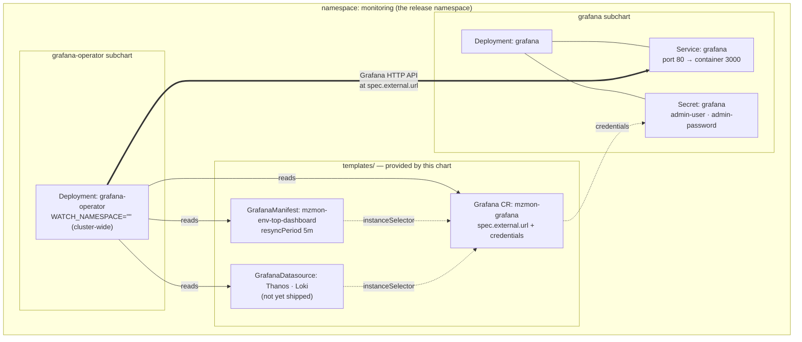

# Grafana Architecture

`materialize-monitoring` installs **two** Grafana-related subcharts, and they do different jobs.
This page explains what each one owns, how they are wired together, and which knobs you are expected to set.

| Subchart | Upstream | Role |
|---|---|---|
| `grafana` | [`grafana`](https://github.com/grafana-community/helm-charts/tree/main/charts/grafana) | Runs a Grafana **server** — the Deployment, Service, ConfigMap, and admin Secret |
| `grafana-operator` | [`grafana-operator`](https://github.com/grafana/grafana-operator) | Runs a **controller** that pushes dashboards, datasources, and folders *into* a Grafana server over its HTTP API |

The operator is a **client** of a Grafana server, not a replacement for one.
Installing only the operator gives you dashboards-as-code with nowhere to put the dashboards.
Installing only the Grafana server gives you a Grafana with no Materialize content in it.

## Why the server is installed directly instead of through the operator

The Grafana Operator can also deploy a Grafana server itself (a `Grafana` resource with no `spec.external`).
This chart deliberately does not use that path for the bundled instance.

Deploying the server from the `grafana` subchart means the Deployment is part of the Helm release, so:

* `helm install --wait` / `helm upgrade --wait` actually block on Grafana becoming ready.
* `helm status` and `helm test` reflect Grafana's health.
* GitOps tools that read Helm release state (Argo CD, Flux) see Grafana's rollout as part of the release, not as a downstream reconcile they cannot observe.

If Grafana were deployed by the operator, Helm would only wait for the *operator* to be ready.
The Grafana Deployment would appear some seconds later, out of band, and a failed rollout would not fail the release.
Readiness is the reason for the split — it is not incidental.

## Connection modes

Whichever server you use, the chart always creates one `Grafana` custom resource.
That resource is the operator's handle on "the Grafana that Materialize dashboards belong in".
It is selected with `connections.grafana.mode`.

| `connections.grafana.mode` | Grafana server comes from | `Grafana` CR points at |
|---|---|---|
| `bundled` (default) | the `grafana` subchart in this release | the in-cluster bundled Service |
| `external` | somewhere else — Grafana Cloud, a shared platform Grafana, another cluster | `connections.grafana.external.url` |
| `operator` | the Grafana Operator itself | the instance the operator creates |

`bundled` and `external` both render the CR as an **external** instance from the operator's point of view.
"External" here means "the operator did not create this server", not "outside the cluster".
The bundled Grafana is external in exactly this sense: the `grafana` subchart owns it, so the operator connects to it as a client.

### `bundled`

```yaml
connections:
  grafana:
    mode: bundled
```

Nothing else is required.
The chart derives the in-cluster URL and the admin-credential Secret reference from the `grafana` subchart's own values, so the two always agree.
Both subcharts pin a static `fullnameOverride` — `grafana` and `grafana-operator` — the same way `loki` and `thanos` do, so the Deployment, Service, and Secret are all just `grafana` regardless of what the release is called.

The derivation reads `grafana.service.port` (80 by default, routed to the container's 3000) and `grafana.namespaceOverride`, so overriding either keeps the operator pointed at the right place.

> [!WARNING]
> The bundled Grafana ships **no persistence** — the `grafana` subchart mounts `emptyDir` for `/var/lib/grafana` by default, so all of Grafana's own state is lost on pod restart.
> Give it a real backing store before treating it as anything but a demo: see [State and persistence](#state-and-persistence).

### `external`

Point the operator at a Grafana you already run.
Use the `existing-grafana` profile as a starting point:

```bash
helm upgrade --install mzmon charts/materialize-monitoring -n monitoring --create-namespace -f charts/materialize-monitoring/profiles/existing-grafana.values.yaml
```

That profile disables the bundled server and supplies connection details:

```yaml
grafana:
  # Circuit breaker — takes precedence over tags.
  enabled: false

connections:
  grafana:
    mode: external
    external:
      url: https://grafana.example.com
      # Either an apiKey secret, or adminUser + adminPassword secrets.
      apiKey:
        name: external-grafana-api-key
        key: apiKey
```

Credentials are always **secret references**, never inline values.
The referenced Secret must exist in the release namespace before install; the chart does not create it.

For Grafana Cloud, `url` is your stack URL and `apiKey` should reference a service account token with dashboard write scope.

### `operator`

Lets the Grafana Operator own the server lifecycle.

> [!WARNING]
> This mode is not yet production-ready — see [Known gaps](#known-gaps).
> Use `bundled` or `external`.

## Resource map

Shown in the default shared-namespace layout, where everything lands in the release namespace.



The operator reconciles in one direction: Kubernetes resources are the source of truth, and it writes them into Grafana over the HTTP API.
Nothing reads state back out of Grafana into the cluster.

## Namespaces

Both Grafana subcharts pin a static `fullnameOverride`, the same way `loki` and `thanos` do, so their resource names never move with the release name.
That makes the namespace the only thing that varies between layouts.

| Layout | Grafana | Grafana Operator | `Grafana` resource | Dashboards |
|---|---|---|---|---|
| Shared (default) | `grafana.monitoring` | `grafana-operator.monitoring` | `monitoring` | `monitoring` |
| Split (`split-namespace` profile) | `grafana.grafana` | `grafana-operator.grafana-operator` | `grafana` | `monitoring` |

`monitoring` is the recommended release namespace; substitute whatever you install into.
See [Namespace layout](../../../operating/production-best-practices/#namespace-layout) for the trade-off between the two.

Two things shift automatically under `split-namespace`, both to keep `mode: bundled` working:

* **The `Grafana` resource follows Grafana, not the release.**
  It has to: the admin credentials on it are a `SecretKeySelector`, which carries no namespace and cannot reach across one, so the resource must sit beside the Secret the `grafana` subchart owns.
* **The dashboards stay in the release namespace and gain `allowCrossNamespaceImport: true`**, so they can still match an instance that is now elsewhere.

The operator watches all namespaces by default (`WATCH_NAMESPACE=""`), so it sees both regardless of layout.
Scoping that watch is a separate decision — see [Watch scope](../grafana-operator/#watch-scope).

Datasource URLs are the piece that does *not* adjust itself, because the chart does not ship datasources yet.
Under `split-namespace` they must name the backend's own namespace (`thanos-query.thanos`, `loki-query-frontend.loki`), and cross-namespace NetworkPolicy has to permit the operator to reach Grafana and Grafana to reach the backends.

## Dashboards

Dashboards are **pre-rendered** into the chart, not generated at template time.
Sources live in `packages/grafana-dashboards/` (Python + `grafana-foundation-sdk`), and `make dashboards` renders them to `charts/materialize-monitoring/pre-rendered/dashboards/grafana/*.yaml`.
The chart embeds them with `.Files.Get`.
See [Dashboards as Code](../../../reference/internal/dashboard/) for the authoring workflow.

Which dashboards get installed is controlled by glob patterns:

```yaml
dashboards:
  selected:
    - env-*
  config:
    grafana:
      enabled: true
      mode: operator
      manifest:
        resyncPeriod: 5m
        instanceSelector: {}
        apiTarget: dashboard.grafana.app/v2
```

Each match becomes one `GrafanaManifest` resource wrapping the dashboard body in `spec.template`.

`GrafanaManifest` is used rather than `GrafanaDashboard` because the dashboards target the **v2 dashboard schema** (`dashboard.grafana.app/v2`), which requires Grafana 12 or later.
`GrafanaManifest` applies an arbitrary Grafana API object as-is, so the schema version travels with the dashboard instead of being reinterpreted by the operator.

`resyncPeriod` is how often the operator re-pushes the dashboard, which is also how quickly a hand-edit in the Grafana UI gets reverted.
Treat operator-managed dashboards as read-only: copy to a new dashboard rather than editing in place.

Currently one dashboard ships: **Materialize Environment Overview** (`env-top` → dashboard UID `mz-mon-env-top`).

### Instance selection

`instanceSelector` decides which `Grafana` resources a dashboard is pushed to.
When `dashboards.config.grafana.manifest.instanceSelector` is unset, it falls back to the labels on the `Grafana` resource this chart creates, so the two sides are rendered from one source and cannot drift.

That label set is a static `monitoring.materialize.cloud/grafana-instance: mzmon`, plus anything in `connections.grafana.labels` merged over it.
The static label is load-bearing: grafana-operator reads an **empty `matchLabels` as every `Grafana` resource**, not none, and it watches all namespaces by default.
An empty selector would push the Materialize dashboards into every Grafana in the cluster.

Add to `connections.grafana.labels` to narrow the selector further — for example, to scope per release when two `materialize-monitoring` releases share a cluster:

```yaml
connections:
  grafana:
    labels:
      dashboards.materialize.com/release: team-a
```

Both the `Grafana` resource and the selector pick the addition up.

### Cross-namespace matching

A `GrafanaManifest` only matches a `Grafana` in its **own namespace** unless `allowCrossNamespaceImport` is set.
The chart infers it: the flag is emitted only when the `Grafana` resource lands somewhere other than the release namespace, which is what happens under `split-namespace`.
Set `dashboards.config.grafana.manifest.allowCrossNamespaceImport` explicitly when pointing `instanceSelector` at an instance the chart did not create.

> [!WARNING]
> The CRDs forbid turning `allowCrossNamespaceImport` back off in place — the resource has to be recreated.

## Datasources

The dashboards do not hardcode datasource UIDs.
`env-top` declares a `DatasourceVariable` named `metricsDatasource` with `pluginId: prometheus` and **no pinned current value**, so Grafana resolves it to the instance's **default Prometheus-type datasource**.
This is deliberate: pinning a specific named datasource would leave the variable unresolved on any other Grafana and silently break every query on the board.

The consequence is a hard requirement: **exactly one Prometheus-type datasource must be marked default** in the target Grafana.
If none is default, every panel on the dashboard renders empty with no obvious error.

Two datasources are in scope for the bundled stack.

| Datasource | Type | In-cluster endpoint | Notes |
|---|---|---|---|
| Thanos | `prometheus` | `http://thanos-query.<namespace>:9090` | Must be the default datasource |
| Loki | `loki` | `http://loki-query-frontend.<namespace>:3100` | Requires a tenant header — see below |

Both backends use static `fullnameOverride` values (`thanos`, `loki`), so the service names do not carry a release prefix.
In the default shared-namespace layout, `<namespace>` is the release namespace.

### Loki is multi-tenant

The bundled Loki runs with `auth_enabled: true`, so **every read must carry an `X-Scope-OrgID` header**.
A Loki datasource without it gets a `no org id` error on every query.

The tenant to read from depends on how the pipeline writes.
`pipeline.logging.tenancy.tenantMap` defaults to `static` for all four streams, writing everything to `pipeline.logging.tenancy.staticTenant` (`loki` by default), so a single datasource with a fixed header is sufficient:

```yaml
jsonData:
  httpHeaderName1: X-Scope-OrgID
secureJsonData:
  httpHeaderValue1: loki
```

Under `byNamespace`, `byEnvironment`, or `byLabel` tenancy, logs are spread across many tenants and one fixed header only reads one of them.
Those modes need either a datasource per tenant or a multi-tenant read path in front of Loki.

The Loki **gateway is disabled by default** (`loki.gateway.enabled: false`) — writes go through `alloy-gateway` and reads go straight to the query frontend.
Do not point a datasource at a `loki-gateway` service; it does not exist.

> [!INFO]
> Neither datasource is shipped by the chart yet.
> Until they are, create them by hand in the target Grafana, or apply your own `GrafanaDatasource` resources with an `instanceSelector` matching the `Grafana` resource above.

## State and persistence

Grafana keeps its own state — users, orgs, service accounts and tokens, annotations, dashboard versions and permissions, preferences, and alert-rule state — in a database of its own.
This is separate from the observability data, which lives in Thanos and Loki and is never at risk here.

Note what is *not* at risk either: dashboards this chart installs are re-pushed by the operator every `resyncPeriod`, so they come back on their own.
Everything a human created through the UI does not.

| Backing store | Set with | Replicas | Suitable for |
|---|---|---|---|
| SQLite on `emptyDir` (**default**) | — | 1 | demos; state is lost on every pod restart |
| SQLite on a PersistentVolume | `grafana.persistence.enabled: true` | 1 | a single small instance |
| External PostgreSQL | the `[database]` section of `grafana.ini` | 2+ | production |

SQLite tolerates exactly one writer, so both SQLite options pin you to a single replica.
On a `ReadWriteOnce` volume a rolling update also deadlocks — the new pod cannot attach the volume until the old one releases it — so a PVC additionally needs `grafana.deploymentStrategy.type: Recreate`.
External PostgreSQL is the only option that lifts both constraints.

### Wiring PostgreSQL

Grafana reads its database config from the `[database]` section of `grafana.ini`, which the `grafana` subchart renders from a values block of the same name:

```yaml
grafana:
  replicas: 2
  grafana.ini:
    database:
      type: postgres
      # Host must include the port.
      host: grafana-db.example.internal:5432
      name: grafana
      user: grafana
      ssl_mode: verify-full
      ca_cert_path: /etc/secrets/grafana-db/ca.pem
```

> [!WARNING]
> Do not put `password` in this block.
> `grafana.ini` renders into a **ConfigMap**, so the password would sit in plaintext in the release manifest, in `helm get values`, and in whatever Git repo holds your values file.

### Supplying the password

Everything under `grafana.ini` is config, not secret material.
The password has to arrive by one of two routes, both of which keep it in a Secret you create out of band.

**Environment variable.** Grafana maps `GF_DATABASE_PASSWORD` onto `[database].password`:

```yaml
grafana:
  envValueFrom:
    GF_DATABASE_PASSWORD:
      secretKeyRef:
        name: grafana-db
        key: password
```

**Mounted file.** Grafana's `$__file{}` provider reads a value from disk at startup, which keeps the secret out of the process environment:

```yaml
grafana:
  grafana.ini:
    database:
      password: $__file{/etc/secrets/grafana-db/password}
  extraSecretMounts:
    - name: grafana-db
      secretName: grafana-db
      mountPath: /etc/secrets/grafana-db
      readOnly: true
```

The file route is the better default: it also carries the CA certificate that `ca_cert_path` needs, from the same Secret.

### The Secret

The chart does not create it — provision it with your secret tooling (External Secrets Operator, Vault Agent, SOPS, or the cloud's own CSI driver) so the value never lands in Git.
It must exist in the namespace the **Grafana pod** runs in, which under `split-namespace` is `grafana`, not the release namespace.

| Key | Required | Contents |
|---|---|---|
| `password` | yes | The database user's password |
| `ca.pem` | with `ssl_mode: verify-full` | CA bundle for the server certificate |

```bash
kubectl create secret generic grafana-db -n monitoring --from-literal=password="$GRAFANA_DB_PASSWORD" --from-file=ca.pem=./rds-ca.pem
```

Use a dedicated database user that owns only Grafana's database.
Grafana runs its own schema migrations on startup, so the user needs DDL on that database — a read/write-only grant will fail the migration.

> [!INFO]
> Rotating the password requires a Grafana restart either way.
> Neither the env var nor `$__file{}` is re-read while the process is running.

### Why IAM does not replace the secret

Managed Postgres offerings **do** support IAM-based database authentication — RDS and Aurora have IAM database authentication for PostgreSQL, and Cloud SQL has IAM database authentication.
The blocker is Grafana, not the database.

IAM auth works by exchanging your cloud identity for a short-lived token used as the password: 15 minutes on RDS, an hour on Cloud SQL.
Grafana reads its password **once at startup** and has no hook to refresh it, so the first reconnect after the token expires fails authentication.
The feature request for Grafana to call `generate-db-auth-token` itself has been open in some form since 2020 and is tracked in [grafana/grafana#75965](https://github.com/grafana/grafana/issues/75965).

So on AWS, a static secret is the practical answer today.
Keep the blast radius small by storing it in Secrets Manager and syncing it in with External Secrets Operator rather than committing it — IRSA still earns its keep there, authenticating the *sync*, just not the database connection.

On GCP there is a real passwordless path, because the token refresh moves out of Grafana: run the [Cloud SQL Auth Proxy](https://docs.cloud.google.com/sql/docs/postgres/iam-authentication) as a sidecar with `--auto-iam-authn`, point Grafana at `127.0.0.1:5432` with only a `user`, and let the proxy handle IAM and token renewal via Workload Identity.
That trades a managed secret for an extra container.

## Known gaps

Tracked under [CLO-111](https://linear.app/materializeinc/issue/CLO-111/establish-grafana-production-values).

| Gap | Impact |
|---|---|
| No `GrafanaDatasource` resources are shipped | Dashboards resolve to nothing until datasources are created out of band |
| `mode: operator` is unconfigurable | The operator builds the instance from stock defaults — unpinned version, no persistence, no admin secret, no resource requests — none of it reachable from this chart's values |
| `dashboards.config.grafana.mode` documents a `standalone` value, but only `operator` is implemented | Setting `standalone` silently renders no dashboards |
| Bundled Grafana defaults to `emptyDir` storage, and the chart ships no profile for an external database | All UI-created state is lost on restart until you wire up [State and persistence](#state-and-persistence) by hand |
| `mzmon.validate` covers Loki only | Grafana misconfiguration surfaces at reconcile time rather than at template time |
| Leader-election leases are namespaced, but the operator watches cluster-wide | Two releases in different namespaces both reconcile every `Grafana` in the cluster; scope `WATCH_NAMESPACE` or add a per-release label to `connections.grafana.labels` |
