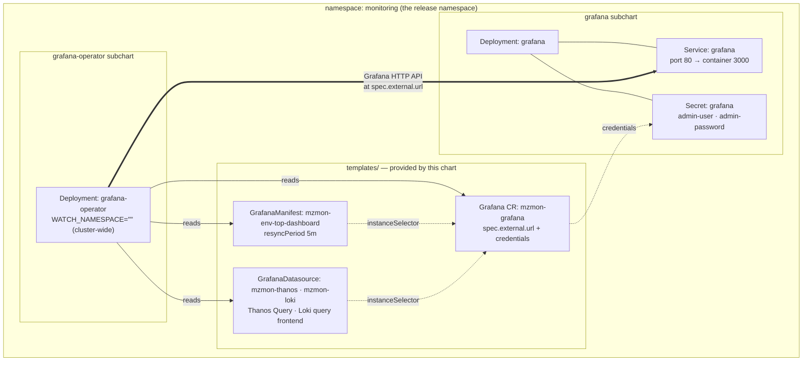

# Grafana Architecture

`materialize-monitoring` installs **two** Grafana-related subcharts, and they do different jobs.
This page explains what each one owns, how they are wired together, and which knobs you are expected to set.

| Subchart | Upstream | Role |
|---|---|---|
| `grafana` | [`grafana`](https://github.com/grafana-community/helm-charts/tree/main/charts/grafana) | Runs a Grafana **server** — the Deployment, Service, ConfigMap, and admin Secret |
| `grafana-operator` | [`grafana-operator`](https://github.com/grafana/grafana-operator) | Runs a **controller** that pushes dashboards, datasources, and folders *into* a Grafana server over its HTTP API |

The operator is a **client** of a Grafana server, not a replacement for one.
Installing only the operator gives you dashboards-as-code with nowhere to put the dashboards.
Installing only the Grafana server gives you a Grafana with no Materialize content in it.

## Why the server is installed directly instead of through the operator

The Grafana Operator can also deploy a Grafana server itself (a `Grafana` resource with no `spec.external`).
This chart deliberately does not use that path for the bundled instance.

Deploying the server from the `grafana` subchart means the Deployment is part of the Helm release, so:

* `helm install --wait` / `helm upgrade --wait` actually block on Grafana becoming ready.
* `helm status` and `helm test` reflect Grafana's health.
* GitOps tools that read Helm release state (Argo CD, Flux) see Grafana's rollout as part of the release, not as a
  downstream reconcile they cannot observe.

If Grafana were deployed by the operator, Helm would only wait for the *operator* to be ready.
The Grafana Deployment would appear some seconds later, out of band, and a failed rollout would not fail the release.
Readiness is the reason for the split — it is not incidental.

## Connection modes

Whichever server you use, the chart always creates one `Grafana` custom resource.
That resource is the operator's handle on "the Grafana that Materialize dashboards belong in".
It is selected with `connections.grafana.mode`.

| `connections.grafana.mode` | Grafana server comes from | `Grafana` CR points at |
|---|---|---|
| `bundled` (default) | the `grafana` subchart in this release | the in-cluster bundled Service |
| `external` | somewhere else — Grafana Cloud, a shared platform Grafana, another cluster | `connections.grafana.external.url` |
| `operator` | the Grafana Operator itself | the instance the operator creates |

`bundled` and `external` both render the CR as an **external** instance from the operator's point of view.
"External" here means "the operator did not create this server", not "outside the cluster".
The bundled Grafana is external in exactly this sense: the `grafana` subchart owns it, so the operator connects to it as a client.

### `bundled`

```yaml
connections:
  grafana:
    mode: bundled
```

Nothing else is required.
The chart derives the in-cluster URL and the admin-credential Secret reference from the `grafana` subchart's own values, so the two always agree.
Both subcharts pin a static `fullnameOverride` — `grafana` and `grafana-operator` — the same way `loki` and `thanos` do,
so the Deployment, Service, and Secret are all just `grafana` regardless of what the release is called.

The derivation reads `grafana.service.port` (80 by default, routed to the container's 3000) and
`grafana.namespaceOverride`, so overriding either keeps the operator pointed at the right place.

> [!WARNING]
> The bundled Grafana ships **no persistence** — the `grafana` subchart mounts `emptyDir` for `/var/lib/grafana` by
  default, so all of Grafana's own state is lost on pod restart.
> Give it a real backing store before treating it as anything but a demo: see [State and persistence](#state-and-persistence).

### `external`

Point the operator at a Grafana you already run.
Use the `existing-grafana` profile as a starting point:

```bash
helm upgrade --install mzmon charts/materialize-monitoring -n monitoring --create-namespace -f charts/materialize-monitoring/profiles/existing-grafana.values.yaml
```

That profile disables the bundled server and supplies connection details:

```yaml
grafana:
  # Circuit breaker — takes precedence over tags.
  enabled: false

connections:
  grafana:
    mode: external
    external:
      url: https://grafana.example.com
      # Either an apiKey secret, or adminUser + adminPassword secrets.
      apiKey:
        name: external-grafana-api-key
        key: apiKey
```

Credentials are always **secret references**, never inline values.
The referenced Secret must exist in the release namespace before install; the chart does not create it.

For Grafana Cloud, `url` is your stack URL and `apiKey` should reference a service account token with dashboard write scope.

### `operator`

Lets the Grafana Operator own the server lifecycle.

> [!WARNING]
> This mode is not yet production-ready — see [Known gaps](#known-gaps).
> Use `bundled` or `external`.

The operator builds the instance from its own stock defaults, and none of the production defaults on the `grafana` block
reach it — not the pinned image, not the resource requests, not the PodDisruptionBudget, not the persistence guardrails.
`connections.grafana.operator.spec` is the break-glass for configuring it anyway: whatever it holds is emitted verbatim
as the `Grafana` resource's `spec`.

```yaml
connections:
  grafana:
    mode: operator
    operator:
      spec:
        version: "13.0.2"
        config:
          database:
            type: postgres
            host: grafana-db.example.internal:5432
```

Nothing in it is validated or defaulted, which is the trade: it exists so the mode is not a dead end, not because it is
a good place to configure Grafana.
See the [`GrafanaSpec` reference](https://grafana.github.io/grafana-operator/docs/api/#grafanaspec) for the shape.

## Resource map

Shown in the default shared-namespace layout, where everything lands in the release namespace.



The operator reconciles in one direction: Kubernetes resources are the source of truth, and it writes them into Grafana over the HTTP API.
Nothing reads state back out of Grafana into the cluster.

## Namespaces

Both Grafana subcharts pin a static `fullnameOverride`, the same way `loki` and `thanos` do, so their resource names never move with the release name.
That makes the namespace the only thing that varies between layouts.

| Layout | Grafana | Grafana Operator | `Grafana` resource | Dashboards |
|---|---|---|---|---|
| Shared (default) | `grafana.monitoring` | `grafana-operator.monitoring` | `monitoring` | `monitoring` |
| Split (`split-namespace` profile) | `grafana.grafana` | `grafana-operator.grafana-operator` | `grafana` | `monitoring` |

`monitoring` is the recommended release namespace; substitute whatever you install into.
See [Namespace layout](../../../operating/production-best-practices/#namespace-layout) for the trade-off between the two.

Two things shift automatically under `split-namespace`, both to keep `mode: bundled` working:

* **The `Grafana` resource follows Grafana, not the release.**
  It has to: the admin credentials on it are a `SecretKeySelector`, which carries no namespace and cannot reach across
  one, so the resource must sit beside the Secret the `grafana` subchart owns.
* **The dashboards stay in the release namespace and gain `allowCrossNamespaceImport: true` **, so they can still match
  an instance that is now elsewhere.

The operator watches all namespaces by default (`WATCH_NAMESPACE=""`), so it sees both regardless of layout.
Scoping that watch is a separate decision — see [Watch scope](../grafana-operator/#watch-scope).

Datasource URLs are the piece that does *not* adjust itself, because the chart does not ship datasources yet.
Under `split-namespace` they must name the backend's own namespace (`thanos-query.thanos`, `loki-query-frontend.loki`),
and cross-namespace NetworkPolicy has to permit the operator to reach Grafana and Grafana to reach the backends.

## Dashboards

Dashboards are **pre-rendered** into the chart, not generated at template time.
Sources live in `packages/dashboards/` (Rust), and `make dashboards` renders them to
`charts/materialize-monitoring/pre-rendered/dashboards/grafana/*.yaml`.
The chart embeds them with `.Files.Get`.
See [Dashboards as Code](../../../reference/internal/dashboard/overview/) for the authoring workflow.

Which dashboards get installed is controlled by glob patterns:

```yaml
dashboards:
  selected:
    - env-*
  config:
    grafana:
      enabled: true
      mode: operator
      manifest:
        resyncPeriod: 5m
        instanceSelector: {}
        apiTarget: dashboard.grafana.app/v2
```

Each match becomes one `GrafanaManifest` resource wrapping the dashboard body in `spec.template`.

`GrafanaManifest` is used rather than `GrafanaDashboard` because the dashboards target the **v2 dashboard schema**
(`dashboard.grafana.app/v2`), which requires Grafana 12 or later.
`GrafanaManifest` applies an arbitrary Grafana API object as-is, so the schema version travels with the dashboard
instead of being reinterpreted by the operator.

`resyncPeriod` is how often the operator re-pushes the dashboard, which is also how quickly a hand-edit in the Grafana UI gets reverted.
Treat operator-managed dashboards as read-only: copy to a new dashboard rather than editing in place.

Two dashboards are rendered, and `dashboards.selected` decides which of them a release installs:

- **Materialize Environment Overview** (`env-top` → `mz-mon-env-top`), matched by the default `env-*` pattern.
- **Materialize Upgrade** (`upgrade` → `mz-mon-upgrade`), which is *not* selected by default.
  Its Events tab reads Kubernetes events out of Loki; its Generations and Reconciliation tabs read metrics out of
  Thanos.
  Both halves need a Materialize operator new enough to emit them — see the `min-mz-version` annotation on the
  rendered dashboard.
  Add `upgrade` to `dashboards.selected` to install it.

### Instance selection

`instanceSelector` decides which `Grafana` resources a dashboard is pushed to.
When `dashboards.config.grafana.manifest.instanceSelector` is unset, it falls back to the labels on the `Grafana`
resource this chart creates, so the two sides are rendered from one source and cannot drift.

That label set is a static `monitoring.materialize.cloud/grafana-instance: mzmon`, plus anything in `connections.grafana.labels` merged over it.
The static label is load-bearing: grafana-operator reads an **empty `matchLabels` as every `Grafana` resource**, not
none, and it watches all namespaces by default.
An empty selector would push the Materialize dashboards into every Grafana in the cluster.

Add to `connections.grafana.labels` to narrow the selector further — for example, to scope per release when two
`materialize-monitoring` releases share a cluster:

```yaml
connections:
  grafana:
    labels:
      dashboards.materialize.com/release: team-a
```

Both the `Grafana` resource and the selector pick the addition up.

### Cross-namespace matching

A `GrafanaManifest` only matches a `Grafana` in its **own namespace** unless `allowCrossNamespaceImport` is set.
The chart infers it: the flag is emitted only when the `Grafana` resource lands somewhere other than the release
namespace, which is what happens under `split-namespace`.
Set `dashboards.config.grafana.manifest.allowCrossNamespaceImport` explicitly when pointing `instanceSelector` at an
instance the chart did not create.

> [!WARNING]
> The CRDs forbid turning `allowCrossNamespaceImport` back off in place — the resource has to be recreated.

## Datasources

The dashboards do not hardcode datasource UIDs.
`env-top` declares a `DatasourceVariable` named `metricsDatasource` with `pluginId: prometheus` and **no pinned current
value**, so Grafana resolves it to the instance's **default Prometheus-type datasource**.
This is deliberate: pinning a specific named datasource would leave the variable unresolved on any other Grafana and
silently break every query on the board.

The consequence is a hard requirement: **exactly one Prometheus-type datasource must be marked default** in the target Grafana.
If none is default, every panel on the dashboard renders empty with no obvious error.

`upgrade` declares a second one, `logsDatasource` with `pluginId: loki`, on the same terms.
Two variables rather than one because a `DatasourceVariable` resolves against a single plugin id, so one cannot offer
both a Prometheus and a Loki datasource; a dashboard mixing engines needs one of each, and each panel's dataquery names
the one matching its engine.
The same requirement follows: **exactly one Loki-type datasource must be marked default**, or every panel on the
Events tab renders empty.

The chart ships two, as `GrafanaDatasource` resources targeting the same instance as the dashboards.

| Datasource | Type | UID | In-cluster endpoint | Notes |
|---|---|---|---|---|
| Thanos | `prometheus` | `mzmon-thanos` | `http://thanos-query.<namespace>.svc:9090` | Default datasource; `prometheusType: Thanos` |
| Loki | `loki` | `mzmon-loki` | `http://loki-query-frontend.<namespace>.svc:3100` | Carries a tenant header — see below |

Both backends use static `fullnameOverride` values (`thanos`, `loki`), so the service names do not carry a release prefix.
`<namespace>` is each backend's own, which is the release namespace unless `split-namespace` moved it.

Each datasource is provisioned only when the backend it points at is part of the release.
Set `enabled` explicitly to point Grafana at storage this chart does not deploy:

```yaml
connections:
  datasources:
    thanos:
      enabled: true
      name: AMP
      url: https://aps-workspaces.us-east-1.amazonaws.com/workspaces/ws-EXAMPLE
```

Credentials go through `valuesFrom`, which the operator resolves from a Secret rather than rendering into the manifest:

```yaml
connections:
  datasources:
    thanos:
      valuesFrom:
        - targetPath: secureJsonData.basicAuthPassword
          valueFrom:
            secretKeyRef:
              name: thanos-basic-auth
              key: password
```

Datasources are provisioned with `editable: false` and re-pushed every `resyncPeriod`, the same as dashboards.

### Loki is multi-tenant

The bundled Loki runs with `auth_enabled: true`, so **every read must carry an `X-Scope-OrgID` header**.
A Loki datasource without it gets a `no org id` error on every query.

The tenant to read from depends on how the pipeline writes, so the chart derives it from
`pipeline.logging.tenancy.staticTenant` (`loki` by default) rather than making you keep the two in sync.
Override with `connections.datasources.loki.tenant`, or set it to `""` to send no header at all — correct only against
a Loki with `auth_enabled: false`.

Grafana models a custom header as a numbered pair, with the value always in `secureJsonData` regardless of how secret it is:

```yaml
jsonData:
  httpHeaderName1: X-Scope-OrgID
secureJsonData:
  httpHeaderValue1: loki
```

`tenantMap` defaults to `static` for all four streams, which is the only shape one datasource can serve.
Under `byNamespace`, `byEnvironment`, or `byLabel`, logs are spread across many tenants and a fixed header reads
exactly one of them — the chart emits an install-time warning saying which.
Those modes need a datasource per tenant, or a multi-tenant read path in front of Loki.

The Loki **gateway is disabled by default** (`loki.gateway.enabled: false`) — writes go through `alloy-gateway` and
reads go straight to the query frontend.
Do not point a datasource at a `loki-gateway` service; it does not exist.

## Reaching Grafana

The Service is `ClusterIP` by default, so a fresh install is reachable only through `kubectl port-forward`.
That is the safe default rather than an oversight: the only account is the generated admin, and every datasource behind
Grafana reads every metric in Thanos and every log in the tenant.

Two values open it up, and they are the upstream subchart's own — the chart surfaces them rather than inventing a path,
so a Helm-only install has the same capability the Terraform path does.
The `grafana-ingress` profile is the assembled shape.

### Which layer you set it at

The values are the same either way; what differs is who fills in the cloud specifics.

| | Set | Cloud specifics |
|---|---|---|
| Helm | `grafana.ingress` / `grafana.service` directly, or layer the `grafana-ingress` profile | Yours — annotations, certificate reference, allowlist |
| Terraform | `grafana_load_balancer` on the per-cloud monitoring module — the same variable on all three clouds. AWS adds `grafana_nlb_name` and `grafana_service_port` | The wrapper's — it renders the annotations and passes them as chart values |

The Terraform wrapper does not invent a path around the chart: it computes these same values and appends them ahead of
your `additional_values`, so every render-time check below still applies, and anything the wrapper does not model stays
reachable.
See [Reaching Grafana](../../../getting-started/terraform/#reaching-grafana) on the Terraform side for the variables and what each one implies.

### Ingress and Service are not interchangeable

It is tempting to read `grafana.ingress` and `grafana.service.type: LoadBalancer` as two ways of asking for the same thing.
On AWS they nearly are — the Load Balancer Controller builds an **ALB** from an Ingress and an **NLB** from an annotated
Service, and either can hold a certificate.
Everywhere else the choice decides the protocol layer, and a Service cannot be talked into L7.

| | `grafana.ingress` | `grafana.service` |
|---|---|---|
| AWS | ALB — **L7** | NLB — **L4** |
| GCP | Application Load Balancer — **L7** | passthrough NLB — **L4** |
| Azure | Application Gateway — **L7** | Azure Load Balancer — **L4** |
| Needs a controller installed | yes, except on GKE (built in) | no |
| Terminates TLS | yes, at the load balancer | not at the load balancer — bytes pass through to the pod |
| Host-based routing | yes | no — one load balancer, one backend |
| Allowlist the chart can read | no; it lives in controller annotations | `loadBalancerSourceRanges` |

The consequence that matters: **on a Service, nothing in front of Grafana terminates TLS** — so TLS either terminates at
the Grafana pod, or not at all.
Both are supported, and the chart can issue Grafana the certificate the first one needs. See [Terminating TLS](#terminating-tls) below.

Get that settled before setting `security.cookie_secure`: it marks the session cookie `Secure`, and over a plain-HTTP
connection the browser then refuses to send the cookie back, so nobody can log in.

**Pick by what your platform's controllers consume, and by whether you need what L7 adds.**
A WAF, rate limiting, and authentication at the edge are the things L4 cannot do at all, and they are the reason to take
on an ingress controller for a Grafana that faces the internet.
Against that, L4 has no request-timeout ceiling — an L7 backend timeout of 30–60 seconds will cut off the long Thanos
and Loki queries a dashboard panel makes, and it does so in a way that reads as a flaky panel rather than a
load-balancer setting.

> [!INFO]
> The [Terraform wrappers](../../../getting-started/terraform/#reaching-grafana) are L4 on all three clouds, so that
  they agree with each other and with the Materialize console.
  GCP and Azure use the `LoadBalancer` Service above; AWS builds the NLB in Terraform and attaches it to a `ClusterIP`
  Service with a `TargetGroupBinding`, which is how that repo gets a load-balancer address it knows at plan time.
>
> L7 is the intended end state for public exposure and is deferred rather than rejected — Azure has no
  ingress-controller module yet, and this chart's Gateway API support is still marked BETA.

### Internal by default, public against an allowlist

This follows the convention the Terraform repo already uses for load balancers, and copies the *enforcement*, not just the default:

* Nothing is exposed unless you ask.
* A `LoadBalancer` Service with no `loadBalancerSourceRanges` is a render-time **error**.
  So is a `NodePort`, which has no allowlist mechanism of its own.
* `connections.grafana.allowPublicAccess: true` is the escape hatch for an allowlist the chart cannot see — a security
  group, an egress firewall, an authenticating proxy.
  It downgrades the error to a warning.
  It is an acknowledgement, not a silencer.

On the Terraform path the same rule is enforced a second time, one layer up: the wrapper's `ingress_cidr_blocks` carries
a `validation` block copied from the load-balancer module the Materialize console already uses, so a public exposure
with no allowlist fails at `terraform plan` rather than at chart render.
An internal load balancer still passes an allowlist there, because the chart cannot see the internal-scheme annotation —
the CIDR list is the only thing that makes the intent legible to it.

Note what that enforcement does and does not buy.
It requires you to *state* an allowlist; it cannot judge whether the one you stated is narrow.
The examples inherit `["0.0.0.0/0"]` from the variable the Materialize load balancers use, which is a reasonable default
only while the load balancer is internal — on a public one it is open to the internet, and passes both checks.

An Ingress is the case the chart genuinely cannot characterize, because the scope lives in the controller's annotations.
So it checks the things it can see instead, all as warnings: no `tls` block, no `server.root_url`, no identity provider configured.

### Terminating TLS {#terminating-tls}

Grafana authenticates with a session cookie, so without TLS that cookie and the admin password cross the network in the clear.
There are three shapes, and which one applies follows from the layer you exposed it at.

| | Where TLS terminates | What you set |
|---|---|---|
| **L4 load balancer** (the Terraform default, all three clouds) | The Grafana pod | `certificates.external` — the chart issues the certificate |
| **L7 load balancer** with a cloud-managed certificate | The load balancer | An ARN or resource ID in `grafana.service.annotations` / the Ingress controller's annotations |
| **Ingress** with cert-manager | The ingress controller | An Ingress `tls` block naming the Secret |

**Behind an L4 load balancer the material has to exist in the cluster**, because the load balancer passes TCP through
and the pod is the only thing left that can terminate.
That is what `certificates.external` is for, and it is why it is a separate `issuerRef` from `certificates.internal`: a
public ACME issuer cannot sign `grafana.monitoring.svc`, and a self-signed root means nothing to a browser.

```yaml
certificates:
  enabled: true
  external:
    issuerRef:
      name: letsencrypt-prod   # or a private CA that signs your public names
      kind: ClusterIssuer
    dnsNames:
      - grafana.example.com    # what users type, and what root_url says
```

That renders a second `Certificate` for Grafana — `<release>-grafana-external-tls` — alongside its internal one, and
adds the same public names to the internal certificate's SANs so an in-cluster client dialing the public name still
matches.

> [!INFO]
>   The chart **issues** the certificate; it does not wire Grafana to serve it.
>   Mount the Secret with `grafana.extraSecretMounts` and point `grafana.ini.server` at the files (`protocol`, `cert_file`, `cert_key`).
>   `grafana.ini` is an arbitrary-config passthrough, so anything Grafana understands can go there.

For an **L7** load balancer holding a cloud-managed certificate (ACM, Google Certificate Manager, Azure Key Vault), the
key never enters the cluster — leave `certificates.external` unset and attach the certificate by annotation.
Setting `dnsNames` without an `issuerRef.name` renders nothing and warns, precisely so this case is stated rather than assumed.

Once TLS is in place, set `security.cookie_secure: true` — and not before.

### What to set alongside

**DNS.** Neither object publishes the hostname, and the chart has no view of your zone, so the record is a separate step.
It is easy to forget until an ACME challenge fails against a name that does not resolve.

**`server.root_url`.** Grafana builds share links, alert notification links, and OAuth redirect URIs from it.
All three break silently when it disagrees with the host users actually reach.

**An identity provider.** Until one exists, the generated admin password is the whole of the access control.
See [Authentication](../auth/).

> [!WARNING]
> Grafana's own roles are **not a data boundary**.
> Every datasource is queryable by anyone who can reach Grafana, so a Viewer still reads every metric in Thanos and every log in the tenant.
> Exposure decisions should be made against that, not against what a role appears to permit.

## State and persistence

Grafana keeps its own state — users, orgs, service accounts and tokens, annotations, dashboard versions and permissions,
preferences, and alert-rule state — in a database of its own.
This is separate from the observability data, which lives in Thanos and Loki and is never at risk here.

Note what is *not* at risk either: dashboards this chart installs are re-pushed by the operator every `resyncPeriod`, so they come back on their own.
Everything a human created through the UI does not.

| Backing store | Set with | Replicas | Suitable for |
|---|---|---|---|
| SQLite on `emptyDir` (**chart default**) | — | 1 | demos; state is lost on every pod restart |
| SQLite on a PersistentVolume | the `grafana-pvc` profile | 1 | a single small instance |
| External PostgreSQL | the `grafana-postgres` profile | 2+ | production |

On the **Terraform path this is not a choice you have to make**: the per-cloud wrapper modules provision a dedicated
small PostgreSQL instance and wire it up, and the examples turn that on wherever `enable_observability` is on.
The chart default stands where nothing else decides — a plain `helm install`, which is also where `port-forward` is the
access path and losing UI state matters least.
See [Reaching Grafana](../../../getting-started/terraform/#1-give-it-somewhere-to-keep-state) for the variables.

SQLite tolerates exactly one writer, so both SQLite options pin you to a single replica.
On a `ReadWriteOnce` volume a rolling update also deadlocks — the new pod cannot attach the volume until the old one
releases it — so a PVC additionally needs `grafana.deploymentStrategy.type: Recreate`.
External PostgreSQL is the only option that lifts both constraints.

All three of those are enforced rather than documented.
The chart refuses to render more than one replica — including an HPA whose ceiling is above one — without a shared
database, refuses a `ReadWriteOnce` volume paired with a rolling update, and warns when an exposed Grafana is still on
the `emptyDir` default.

### Wiring PostgreSQL

The `grafana-postgres` profile is the assembled version of everything below — the config block, the secret mount, two
replicas behind an HPA, and notes on Grafana-managed alerting in HA.
Layer it over your platform profile and fill in the host:

```bash
helm upgrade --install mzmon charts/materialize-monitoring -n monitoring -f charts/materialize-monitoring/profiles/aws-example.values.yaml -f charts/materialize-monitoring/profiles/grafana-postgres.values.yaml
```

Grafana reads its database config from the `[database]` section of `grafana.ini`, which the `grafana` subchart renders
from a values block of the same name:

```yaml
grafana:
  replicas: 2
  grafana.ini:
    database:
      type: postgres
      # Host must include the port.
      host: grafana-db.example.internal:5432
      name: grafana
      user: grafana
      ssl_mode: verify-full
      ca_cert_path: /etc/secrets/grafana-db/ca.pem
```

> [!WARNING]
> Do not put `password` in this block.
> `grafana.ini` renders into a **ConfigMap**, so the password would sit in plaintext in the release manifest, in
  `helm get values`, and in whatever Git repo holds your values file.

### Supplying the password

Everything under `grafana.ini` is config, not secret material.
The password has to arrive by one of two routes, both of which keep it in a Secret you create out of band.

> [!INFO]
> On the Terraform path the module does this for you: it generates the password, creates the Secret, and wires the
  mounted-file route below.
  Terraform is one of the few delivery targets where generating a credential actually works, which is the same reason it
  owns the Grafana admin Secret.
  Read it back with `terraform output -raw grafana_database_password`.

**Environment variable.** Grafana maps `GF_DATABASE_PASSWORD` onto `[database].password`:

```yaml
grafana:
  envValueFrom:
    GF_DATABASE_PASSWORD:
      secretKeyRef:
        name: grafana-db
        key: password
```

**Mounted file.** Grafana's `$__file{}` provider reads a value from disk at startup, which keeps the secret out of the process environment:

```yaml
grafana:
  grafana.ini:
    database:
      password: $__file{/etc/secrets/grafana-db/password}
  extraSecretMounts:
    - name: grafana-db
      secretName: grafana-db
      mountPath: /etc/secrets/grafana-db
      readOnly: true
```

The file route is the better default: it also carries the CA certificate that `ca_cert_path` needs, from the same Secret.

### The Secret

The chart does not create it — provision it with your secret tooling (External Secrets Operator, Vault Agent, SOPS, or
the cloud's own CSI driver) so the value never lands in Git.
It must exist in the namespace the **Grafana pod** runs in, which under `split-namespace` is `grafana`, not the release namespace.

| Key | Required | Contents |
|---|---|---|
| `password` | yes | The database user's password |
| `ca.pem` | with `ssl_mode: verify-full` | CA bundle for the server certificate |

```bash
kubectl create secret generic grafana-db -n monitoring --from-literal=password="$GRAFANA_DB_PASSWORD" --from-file=ca.pem=./rds-ca.pem
```

Use a dedicated database user that owns only Grafana's database.
Grafana runs its own schema migrations on startup, so the user needs DDL on that database — a read/write-only grant will fail the migration.

> [!INFO]
> Rotating the password requires a Grafana restart either way.
> Neither the env var nor `$__file{}` is re-read while the process is running.

### Why IAM does not replace the secret

Managed Postgres offerings **do** support IAM-based database authentication — RDS and Aurora have IAM database
authentication for PostgreSQL, and Cloud SQL has IAM database authentication.
The blocker is Grafana, not the database.

IAM auth works by exchanging your cloud identity for a short-lived token used as the password: 15 minutes on RDS, an hour on Cloud SQL.
Grafana reads its password **once at startup** and has no hook to refresh it, so the first reconnect after the token expires fails authentication.
The feature request for Grafana to call `generate-db-auth-token` itself has been open in some form since 2020 and is
tracked in [grafana/grafana#75965](https://github.com/grafana/grafana/issues/75965).

So on AWS, a static secret is the practical answer today.
Keep the blast radius small by storing it in Secrets Manager and syncing it in with External Secrets Operator rather
than committing it — IRSA still earns its keep there, authenticating the *sync*, just not the database connection.

On GCP there is a real passwordless path, because the token refresh moves out of Grafana: run the
[Cloud SQL Auth Proxy](https://docs.cloud.google.com/sql/docs/postgres/iam-authentication) as a sidecar with
`--auto-iam-authn`, point Grafana at `127.0.0.1:5432` with only a `user`, and let the proxy handle IAM and token
renewal via Workload Identity.
That trades a managed secret for an extra container.

## Known gaps

Tracked under [CLO-111](https://linear.app/materializeinc/issue/CLO-111/establish-grafana-production-values).

| Gap | Impact |
|---|---|
| `mode: operator` is modelled only as a raw spec | `connections.grafana.operator.spec` is passed through unvalidated; nothing the chart knows about Grafana applies inside it. Prefer `mode: bundled` |
| `dashboards.config.grafana.mode` documents a `standalone` value, but only `operator` is implemented | Setting `standalone` silently renders no dashboards |
| Bundled Grafana defaults to `emptyDir` storage | All UI-created state is lost on restart unless you apply the `grafana-postgres` or `grafana-pvc` profile — see [State and persistence](#state-and-persistence) |
| The Grafana subchart's NetworkPolicy takes one port | Its template emits a single ingress rule, on `service.targetPort`, so anything else the pod needs has to come from a policy this chart renders alongside — which is what `networkPolicies.grafanaGossip` is for. Ingress also defaults to `allowExternal: true`, because every way a human reaches Grafana is unselectable by pod label; narrow it with `explicitNamespacesSelector` / `explicitIpBlocks` |
| Grafana-managed unified alerting is not HA | Each replica evaluates every rule independently, so alerts notify once per replica unless gossip is configured — see the note in the `grafana-postgres` profile |
| No datasource is shipped for a non-static Loki tenancy | `byNamespace` / `byEnvironment` / `byLabel` installs get one datasource reading one tenant, plus a warning; the rest need adding by hand |
| Leader-election leases are namespaced, but the operator watches cluster-wide | Two releases in different namespaces both reconcile every `Grafana` in the cluster; scope `WATCH_NAMESPACE` or add a per-release label to `connections.grafana.labels` |
