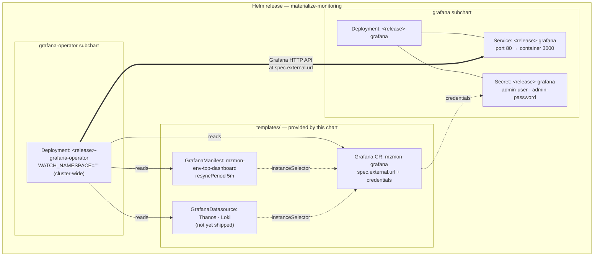

# Grafana Structure

`materialize-monitoring` installs **two** Grafana-related subcharts, and they do different jobs.
This page explains what each one owns, how they are wired together, and which knobs you are expected to set.

| Subchart | Upstream | Role |
|---|---|---|
| `grafana` | [`grafana`](https://github.com/grafana-community/helm-charts/tree/main/charts/grafana) | Runs a Grafana **server** — the Deployment, Service, ConfigMap, and admin Secret |
| `grafana-operator` | [`grafana-operator`](https://github.com/grafana/grafana-operator) | Runs a **controller** that pushes dashboards, datasources, and folders *into* a Grafana server over its HTTP API |

The operator is a **client** of a Grafana server, not a replacement for one.
Installing only the operator gives you dashboards-as-code with nowhere to put the dashboards.
Installing only the Grafana server gives you a Grafana with no Materialize content in it.

## Why the server is installed directly instead of through the operator

The Grafana Operator can also deploy a Grafana server itself (a `Grafana` resource with no `spec.external`).
This chart deliberately does not use that path for the bundled instance.

Deploying the server from the `grafana` subchart means the Deployment is part of the Helm release, so:

* `helm install --wait` / `helm upgrade --wait` actually block on Grafana becoming ready.
* `helm status` and `helm test` reflect Grafana's health.
* GitOps tools that read Helm release state (Argo CD, Flux) see Grafana's rollout as part of the release, not as a downstream reconcile they cannot observe.

If Grafana were deployed by the operator, Helm would only wait for the *operator* to be ready.
The Grafana Deployment would appear some seconds later, out of band, and a failed rollout would not fail the release.
Readiness is the reason for the split — it is not incidental.

## Connection modes

Whichever server you use, the chart always creates one `Grafana` custom resource.
That resource is the operator's handle on "the Grafana that Materialize dashboards belong in".
It is selected with `connections.grafana.mode`.

| `connections.grafana.mode` | Grafana server comes from | `Grafana` CR points at |
|---|---|---|
| `bundled` (default) | the `grafana` subchart in this release | the in-cluster bundled Service |
| `external` | somewhere else — Grafana Cloud, a shared platform Grafana, another cluster | `connections.grafana.external.url` |
| `operator` | the Grafana Operator itself | the instance the operator creates |

`bundled` and `external` both render the CR as an **external** instance from the operator's point of view.
"External" here means "the operator did not create this server", not "outside the cluster".
The bundled Grafana is external in exactly this sense: the `grafana` subchart owns it, so the operator connects to it as a client.

### `bundled`

```yaml
connections:
  grafana:
    mode: bundled
```

Nothing else is required.
The chart derives the in-cluster URL from the release name and namespace, and reads admin credentials from the Secret the `grafana` subchart creates.

> [!WARNING]
> The bundled Grafana ships **no persistence** — the `grafana` subchart mounts `emptyDir` for `/var/lib/grafana` by default.
> Operator-managed dashboards resync automatically, but anything created in the UI (users, annotations, saved dashboards, preferences, starred items) is lost on pod restart.
> Set `grafana.persistence.enabled: true` before treating the bundled instance as anything but a demo.

### `external`

Point the operator at a Grafana you already run.
Use the `existing-grafana` profile as a starting point:

```bash
helm upgrade --install mzmon charts/materialize-monitoring -n monitoring --create-namespace -f charts/materialize-monitoring/profiles/existing-grafana.values.yaml
```

That profile disables the bundled server and supplies connection details:

```yaml
grafana:
  # Circuit breaker — takes precedence over tags.
  enabled: false

connections:
  grafana:
    mode: external
    external:
      url: https://grafana.example.com
      # Either an apiKey secret, or adminUser + adminPassword secrets.
      apiKey:
        name: external-grafana-api-key
        key: apiKey
```

Credentials are always **secret references**, never inline values.
The referenced Secret must exist in the release namespace before install; the chart does not create it.

For Grafana Cloud, `url` is your stack URL and `apiKey` should reference a service account token with dashboard write scope.

### `operator`

Lets the Grafana Operator own the server lifecycle.

> [!WARNING]
> This mode is not yet production-ready — see [Known gaps](#known-gaps).
> Use `bundled` or `external`.

## Resource map



The operator reconciles in one direction: Kubernetes resources are the source of truth, and it writes them into Grafana over the HTTP API.
Nothing reads state back out of Grafana into the cluster.

## Dashboards

Dashboards are **pre-rendered** into the chart, not generated at template time.
Sources live in `packages/grafana-dashboards/` (Python + `grafana-foundation-sdk`), and `make dashboards` renders them to `charts/materialize-monitoring/pre-rendered/dashboards/grafana/*.yaml`.
The chart embeds them with `.Files.Get`.
See [Dashboards as Code](../../../reference/internal/dashboard/) for the authoring workflow.

Which dashboards get installed is controlled by glob patterns:

```yaml
dashboards:
  selected:
    - env-*
  config:
    grafana:
      enabled: true
      mode: operator
      manifest:
        resyncPeriod: 5m
        instanceSelector: {}
        apiTarget: dashboard.grafana.app/v2
```

Each match becomes one `GrafanaManifest` resource wrapping the dashboard body in `spec.template`.

`GrafanaManifest` is used rather than `GrafanaDashboard` because the dashboards target the **v2 dashboard schema** (`dashboard.grafana.app/v2`), which requires Grafana 12 or later.
`GrafanaManifest` applies an arbitrary Grafana API object as-is, so the schema version travels with the dashboard instead of being reinterpreted by the operator.

`resyncPeriod` is how often the operator re-pushes the dashboard, which is also how quickly a hand-edit in the Grafana UI gets reverted.
Treat operator-managed dashboards as read-only: copy to a new dashboard rather than editing in place.

Currently one dashboard ships: **Materialize Environment Overview** (`env-top` → dashboard UID `mz-mon-env-top`).

### Instance selection

`instanceSelector` decides which `Grafana` resources a dashboard is pushed to.
When `dashboards.config.grafana.manifest.instanceSelector` is unset, it falls back to `matchLabels: connections.grafana.labels`.

> [!WARNING]
> `connections.grafana.labels` defaults to `{}`, which makes the selector `matchLabels: {}` — an **empty selector matches every `Grafana` resource**, not none.
> Combined with the operator's default cluster-wide watch (`WATCH_NAMESPACE=""`), the Materialize dashboards are pushed into every Grafana instance in the cluster.
> On a cluster with any other Grafana, set a distinguishing label:
>
> ```yaml
> connections:
>   grafana:
>     labels:
>       dashboards.materialize.com/instance: mzmon
> ```
>
> The label is applied to the `Grafana` resource and used as the selector, so both sides stay in sync.

## Datasources

The dashboards do not hardcode datasource UIDs.
`env-top` declares a `DatasourceVariable` named `metricsDatasource` with `pluginId: prometheus` and **no pinned current value**, so Grafana resolves it to the instance's **default Prometheus-type datasource**.
This is deliberate: pinning a specific named datasource would leave the variable unresolved on any other Grafana and silently break every query on the board.

The consequence is a hard requirement: **exactly one Prometheus-type datasource must be marked default** in the target Grafana.
If none is default, every panel on the dashboard renders empty with no obvious error.

Two datasources are in scope for the bundled stack.

| Datasource | Type | In-cluster endpoint | Notes |
|---|---|---|---|
| Thanos | `prometheus` | `http://thanos-query.<namespace>:9090` | Must be the default datasource |
| Loki | `loki` | `http://loki-query-frontend.<namespace>:3100` | Requires a tenant header — see below |

Both backends use static `fullnameOverride` values (`thanos`, `loki`), so the service names do not carry a release prefix.
In the default shared-namespace layout, `<namespace>` is the release namespace.

### Loki is multi-tenant

The bundled Loki runs with `auth_enabled: true`, so **every read must carry an `X-Scope-OrgID` header**.
A Loki datasource without it gets a `no org id` error on every query.

The tenant to read from depends on how the pipeline writes.
`pipeline.logging.tenancy.tenantMap` defaults to `static` for all four streams, writing everything to `pipeline.logging.tenancy.staticTenant` (`loki` by default), so a single datasource with a fixed header is sufficient:

```yaml
jsonData:
  httpHeaderName1: X-Scope-OrgID
secureJsonData:
  httpHeaderValue1: loki
```

Under `byNamespace`, `byEnvironment`, or `byLabel` tenancy, logs are spread across many tenants and one fixed header only reads one of them.
Those modes need either a datasource per tenant or a multi-tenant read path in front of Loki.

The Loki **gateway is disabled by default** (`loki.gateway.enabled: false`) — writes go through `alloy-gateway` and reads go straight to the query frontend.
Do not point a datasource at a `loki-gateway` service; it does not exist.

> [!INFO]
> Neither datasource is shipped by the chart yet.
> Until they are, create them by hand in the target Grafana, or apply your own `GrafanaDatasource` resources with an `instanceSelector` matching the `Grafana` resource above.

## Split-namespace layout

The `split-namespace` profile moves each subchart into its own namespace, including `grafana` and `grafana-operator`.
Datasource URLs must then use the backend's own namespace (`thanos-query.thanos`, `loki-query-frontend.loki`) rather than the release namespace, and cross-namespace NetworkPolicy has to permit the operator to reach Grafana and Grafana to reach the backends.

> [!WARNING]
> `mode: bundled` does not currently work under `split-namespace` — see [Known gaps](#known-gaps).
> Use `mode: external` with an explicit `connections.grafana.external.url` instead.

## Known gaps

Tracked under [CLO-111](https://linear.app/materializeinc/issue/CLO-111/establish-grafana-production-values).

| Gap | Impact |
|---|---|
| `bundled` mode derives the Grafana URL from `mzmon.fullname` (pinned to `mzmon`), but the `grafana` subchart derives its Service name from the **release name** | Any release not named `mzmon` produces a URL that does not resolve |
| `bundled` mode targets port `3000`, but the `grafana` Service listens on port `80` | Connection refused even when the hostname is right |
| `bundled` mode references a Secret `<fullname>-grafana-admin-credentials` with keys `GF_SECURITY_ADMIN_USER` / `GF_SECURITY_ADMIN_PASSWORD`; the `grafana` subchart creates `<release>-grafana` with keys `admin-user` / `admin-password` | The referenced Secret does not exist, so the operator cannot authenticate |
| `bundled` mode hardcodes `.Release.Namespace` in the URL | Breaks under `split-namespace`, where Grafana moves to its own namespace |
| `mode: operator` renders `spec.external:` as null with an otherwise empty spec | The operator falls through to creating a Grafana with stock defaults — unpinned version, no persistence, no admin secret, no resource requests — and none of it is configurable from this chart |
| `dashboards.config.grafana.mode` documents a `standalone` value, but only `operator` is implemented | Setting `standalone` silently renders no dashboards |
| No `GrafanaDatasource` resources are shipped | Dashboards resolve to nothing until datasources are created out of band |
| `mzmon.validate` covers Loki only | None of the above fails at template time |
| Bundled Grafana uses `emptyDir` storage | All UI-created state is lost on restart |
| Leader-election leases are namespaced, but the operator watches cluster-wide | Two releases in different namespaces both reconcile every `Grafana` in the cluster |
