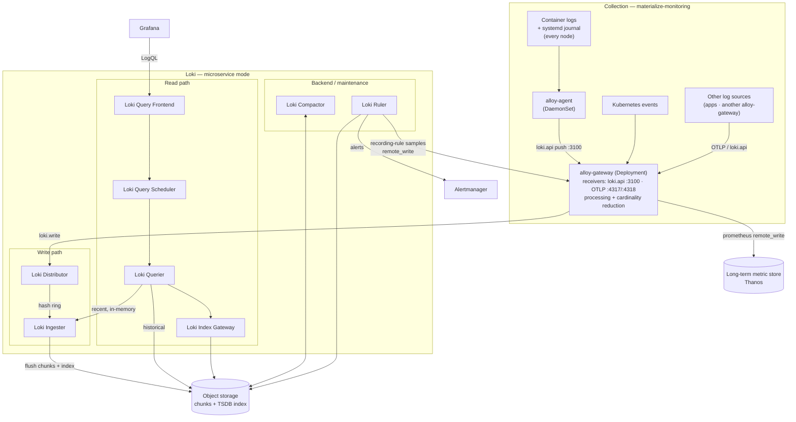
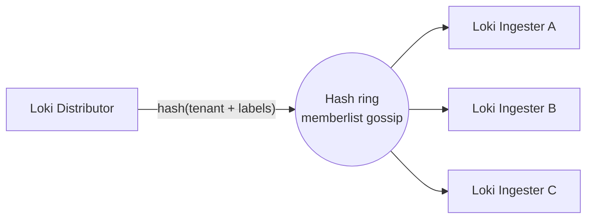
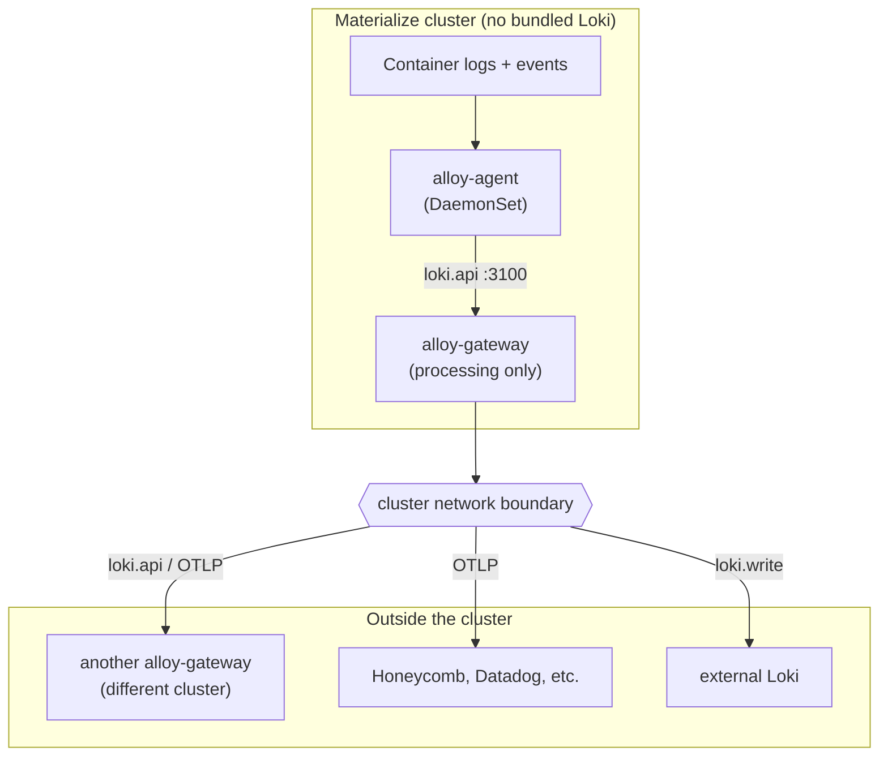

# Logs & Events

This section covers how container logs and Kubernetes [events](../o11y-glossary/#logs-and-events) move through `materialize-monitoring`: collected at the edge by [Alloy](../o11y-glossary/#collection-and-pipeline), stored in [Loki](../o11y-glossary/#stack-components) (the default logging backend), and queried through Grafana.

This page describes the **architecture**.
The subpages cover each stage in depth, including its day-2 and customization operations:

- [Collecting](collecting/) — how logs and events are gathered, what the agent and gateway do, and how to send your own logs in.
- [Storing](storing/) — object storage, the index, compaction, retention, and disaster recovery.
- [Querying](querying/) — the read path and LogQL through Grafana.
- [Rules](rules/) — alerting and recording rules evaluated against logs.

## Logging Architecture

Two Alloy roles sit in front of Loki.
The Alloy [agent](#alloy-agent) (a DaemonSet, one per node) tails container logs and the systemd journal and forwards them to the Alloy [gateway](#alloy-gateway).
The gateway also watches the Kubernetes events API, does the heavy [log processing](../reference/internal/pipelines/logging/) — level normalization and [cardinality](../o11y-glossary/#observability-foundations) reduction — and pushes the result into Loki.

Loki is a [log store modeled after Prometheus](../o11y-glossary/#stack-components): it indexes only the **labels** on each [log stream](../o11y-glossary/#logs-and-events), never the log contents.
That is what keeps it cheap at high volume, and it is why the gateway works to keep label cardinality under control before logs ever reach Loki — high-cardinality attributes belong in the log body or in [structured metadata](#storage), not in stream labels.

> [!NOTE]
>   Loki can run as a single binary (**monolithic**), as three scalable targets (**simple scalable**: read/write/backend), or in **microservice / distributed** mode where every component scales independently.
>   `materialize-monitoring` runs **microservice / distributed** mode by default, and the rest of this page describes those components.
>   Integration tests instead use the single-binary + filesystem shape, since Loki is treated as a black box there.

### End-to-end dataflow

Writes flow left-to-right: the gateway pushes to the [Loki Distributor](#loki-distributor), which fans each stream out to [Loki Ingesters](#loki-ingester), which buffer logs and flush them to [object storage](#storage).
Reads flow from Grafana into the [Loki Query Frontend](#loki-query-frontend), which queues and splits the query for [Loki Queriers](#loki-querier) that pull recent data from ingesters and historical data from object storage.
In the background, the [Loki Compactor](#loki-compactor) maintains the index and retention, and the [Loki Ruler](#ruler) evaluates rules — sending alerts to Alertmanager and recording-rule samples back through `alloy-gateway` to the long-term metric store.

### Collection components {#collection}

#### alloy-agent

The **`alloy-agent`** is a [Grafana Alloy](../o11y-glossary/#collection-and-pipeline) DaemonSet — one pod per node.
It discovers the pods scheduled on its own node, tails their container log files, and reads the host's systemd journal.
It does only light work locally — attaching node and pod metadata, basic relabeling, and a per-node rate limit — then forwards everything to the gateway over the Loki push API.
Because it is a DaemonSet, collection scales with the number of nodes, and no application needs a logging sidecar.

*See more:* [Collecting](collecting/) and the [logging pipeline reference](../reference/internal/pipelines/logging/).

#### alloy-gateway

The **`alloy-gateway`** is a Grafana Alloy Deployment that does the central log processing and forwarding.
It receives logs from the agents (and optionally other sources — see [Ingestion interfaces](#ingestion)), collects Kubernetes events, normalizes log levels, moves high-cardinality fields into [structured metadata](#storage), enforces drop and rate-limit policies, and then writes the result to Loki.
It is the single place where the [cardinality](../o11y-glossary/#observability-foundations) and label-family decisions are made, which is what keeps the log store stable and cheap.

The gateway is also the egress point for the [remote-only topology](#alternative-topologies) and the conduit the [Loki Ruler](#ruler) uses to remote-write recording-rule samples to the long-term metric store.

*See more:* [Collecting](collecting/) and the [logging pipeline reference](../reference/internal/pipelines/logging/).

### The hash ring

Loki components coordinate through a **consistent hash ring** whose membership is shared over a gossip protocol ([memberlist](https://grafana.com/docs/loki/latest/get-started/hash-rings/)) — so there is no external Consul or etcd to operate.
Each ingester registers a set of tokens on the ring.
When the distributor receives a stream, it hashes the stream's identity (tenant plus its label set) onto the ring to pick which ingesters own it, and writes to several of them according to the **replication factor** (default 3).

Replication gives durability and quorum: a single ingester can be lost or restarted without dropping writes, and queriers deduplicate the copies on read.
The ring is also what makes scaling and rolling restarts safe — components join and leave the ring and traffic rebalances around them.
A replication factor of 3 implies you run **at least three ingesters**.

> [!INFO]
>   `memberlist` is the default ring backend in current Loki.
>   Older deployments and some documentation reference a Consul- or etcd-backed ring instead; the behavior is the same, only the membership store differs.

### Loki write path {#write-path}

The write path is where the gateway's processed logs land — the destination for the [Collecting](collecting/) stage.

#### Loki Distributor

The **Loki Distributor** is the stateless front door for writes.
It validates incoming streams against per-tenant limits, enforces rate limits, and normalizes labels, then splits the batch into individual streams and forwards each to the owning ingesters via the [hash ring](#the-hash-ring).
Because it holds no state, you place a load balancer (or a Kubernetes Service) in front of it and scale it horizontally; distributors register on the ring so the fleet can divide each tenant's rate limit across however many are currently running.

*See more:* [Distributor](https://grafana.com/docs/loki/latest/get-started/components/#distributor) (official).

#### Loki Ingester

The **Loki Ingester** is the stateful heart of the write path, and it also serves the most recent reads.
It buffers incoming entries into per-stream in-memory chunks, compresses them, and periodically flushes those chunks and their index to [object storage](#storage).
It keeps a [write-ahead log](https://grafana.com/docs/loki/latest/operations/storage/wal/) (WAL) on local disk so a restart does not lose un-flushed data — which is why ingesters need persistent volumes.
Each ingester holds tokens on the ring and moves through lifecycle states (joining, active, leaving) as it starts and stops; queriers read not-yet-flushed logs directly from it.

> [!WARNING]
>   Because un-flushed data lives in memory and the WAL, ingester rollouts must flush or hand off cleanly.
>   A careless restart of all ingesters at once can lose recent logs — see [Storing](storing/) and the upgrade guidance in [Operating](../operating/upgrading/).

*See more:* [Ingester](https://grafana.com/docs/loki/latest/get-started/components/#ingester) (official).

### Loki read path {#read-path}

The read path serves the [Querying](querying/) stage — almost always reached through Grafana.

#### Loki Query Frontend

The **Loki Query Frontend** is an optional but recommended stateless service that exposes the query API.
Rather than executing queries itself, it queues them, splits large or long-range queries into smaller pieces for parallel execution, and caches results and statistics.
Actual execution happens on queriers that pull work from it.
Run a small number of replicas (two or more) so per-tenant queue fairness works as intended.

*See more:* [Query frontend](https://grafana.com/docs/loki/latest/get-started/components/#query-frontend) (official).

#### Loki Query Scheduler

The **Loki Query Scheduler** is an optional stateless component that takes the queueing responsibility out of the query frontend.
It holds the in-memory queue of split queries and lets you scale frontends and the queue independently while preserving advanced per-tenant fairness.
When present, queriers connect to the scheduler to pull work; run two or more for availability.

*See more:* [Query scheduler](https://grafana.com/docs/loki/latest/get-started/components/#query-scheduler) (official).

#### Loki Querier

The **Loki Querier** is the stateless worker that actually executes [LogQL](../o11y-glossary/#dashboards-and-queries).
For each query it fetches recent in-memory data from the ingesters and historical data from object storage, using the index to find the right chunks, then merges and **deduplicates** the results (replication means it sees multiple copies).
It pulls work from the frontend or scheduler, and you scale it horizontally with query load.

*See more:* [Querier](https://grafana.com/docs/loki/latest/get-started/components/#querier) (official).

#### Loki Index Gateway

The **Loki Index Gateway** serves index lookups so that queriers and the frontend do not each download the whole index from object storage.
Given a query, it identifies which chunks a querier needs to fetch and helps the frontend estimate log volume.
It runs in a *simple* mode (each replica answers for all index) or a *ring* mode (the index is sharded across replicas via consistent hashing), and it is used with the shipper-based index store this stack runs.

*See more:* [Index gateway](https://grafana.com/docs/loki/latest/get-started/components/#index-gateway) (official).

### Loki backend and maintenance {#backend}

#### Loki Compactor

The **Loki Compactor** runs as a **singleton**.
It merges the many small per-ingester index files into a single compacted index per tenant per day, which keeps reads efficient, and it owns **retention** — deleting log data past its retention period and processing deletion requests.
Because it coordinates against shared object storage, exactly one compactor should be active.
Retention, tiered retention, and deletion are covered in [Storing](storing/).

*See more:* [Compactor](https://grafana.com/docs/loki/latest/get-started/components/#compactor) (official).

#### Loki Ruler {#ruler}

The **Loki Ruler** evaluates LogQL [alerting and recording rules](rules/) on a schedule against stored logs.

- **Alerting rules** emit alerts to [Alertmanager](../alerting/), which routes and notifies.
- **Recording rules** turn a LogQL expression into a metric sample. Because that output is a metric — not a log — the ruler **remote-writes those samples back through `alloy-gateway`**, which forwards them to the long-term metric store ([Thanos](../o11y-glossary/#stack-components)) alongside the rest of the metrics pipeline. This keeps log-derived metrics in the same place you query everything else.

Rule definitions live in object storage, and when multiple rulers run they shard rule groups across themselves via a consistent hash ring.
A ruler can delegate query execution to the query frontend to benefit from splitting and caching.

*See more:* [Ruler](https://grafana.com/docs/loki/latest/get-started/components/#ruler) (official) and [Logs & Events > Rules](rules/).

#### Caches

Loki leans on caches — a chunk cache, a results cache, and an index/stats cache — to cut object-storage round-trips and speed up repeated queries.
This stack ships its own [memcached](https://grafana.com/docs/loki/latest/operations/caching/) for these rather than assuming an external cache.

### Storage {#storage}

All durable log data lives in a single **object storage** backend (S3-compatible, GCS, or Azure Blob).
Ingesters flush compressed log **chunks** there, and the **index** that maps labels to chunks is stored alongside them using the [TSDB](https://grafana.com/docs/loki/latest/operations/storage/tsdb/) index format.
Queriers and the index gateway read both back out of object storage; the compactor maintains and prunes the index in place.
Bucket layout, the index format, retention, and disaster recovery are detailed in [Storing](storing/).

> [!INFO]
>   **Structured metadata**
>   Current Loki (with the TSDB index schema this stack uses) lets each log line carry **structured metadata** — arbitrary key-value pairs attached to a line *without* becoming stream labels.
>   This is the right home for high-cardinality attributes such as trace or request IDs: they stay queryable but are kept out of the label index, so they do not inflate [stream cardinality](../o11y-glossary/#logs-and-events).
>   The gateway pipeline routes most non-identifying fields here.
>   See [Structured metadata](https://grafana.com/docs/loki/latest/get-started/labels/structured-metadata/) (official).

> [!INFO]
>   Current Loki also ships **accelerated filtering via bloom filters** and a **pattern ingester** for automatic log-pattern detection.
>   Both are **experimental**, carry no stability guarantees, and are **not enabled** in this stack's default topology — they are noted here only so the components are recognizable if you encounter them upstream.

### Ingestion interfaces {#ingestion}

The gateway accepts logs on two endpoints, so sources beyond the agent can feed the same processing pipeline:

| Protocol | Endpoint | Used by |
|---|---|---|
| Loki push API | `alloy-gateway.$namespace:3100` (`/loki/api/v1/push`) | the `alloy-agent`; any Loki-push client |
| OTLP | `alloy-gateway.$namespace:4317` (gRPC), `:4318` (HTTP) | OpenTelemetry-instrumented applications; OTLP forwarders |

Anything sent to these endpoints goes through the same normalization, cardinality-reduction, and structured-metadata processing as node logs, so log shape stays consistent regardless of source.

This is also what enables a **chained-gateway (gateway → gateway) topology**: one `alloy-gateway` can forward to another `alloy-gateway` (for example, a per-cluster gateway forwarding to a central one) using either endpoint.
See [Collecting](collecting/) for how to point an additional source or a downstream gateway at these endpoints.

### Alternative topologies {#alternative-topologies}

The bundled Loki is **optional**.
Because the gateway can write to any Loki-push or OTLP destination, you can run a **remote-only** topology: collect and process logs in-cluster, then ship them across the cluster network boundary to a destination you do not operate here — another cluster's `alloy-gateway`, or a managed backend such as Honeycomb or Datadog.

In this shape the in-cluster footprint is just the agent and the gateway; everything from the [write path](#write-path) onward lives elsewhere.
The processing the gateway applies is identical, so logs arrive at the remote destination already normalized.

### Day 2 operations {#day-2}

Beyond the steady-state read and write paths, each stage documents its ongoing operations:

- **Collecting** — adding log sources, gateway chaining, and tuning rate limits: [Collecting](collecting/).
- **Storing** — retention and tiered retention, compaction, scaling ingesters and storage, and disaster recovery: [Storing](storing/).
- **Querying** — query-performance tuning and the Grafana datasource: [Querying](querying/).
- **Rules** — managing alerting and recording rule groups: [Rules](rules/).

Cross-cutting operational guidance (upgrades, securing, tuning) lives under [Operating](../operating/).

## See more

- [Loki components](https://grafana.com/docs/loki/latest/get-started/components/) — the upstream reference for every Loki component above.
- [Loki architecture](https://grafana.com/docs/loki/latest/get-started/architecture/) — how the components fit together end to end.
- [Loki deployment modes](https://grafana.com/docs/loki/latest/get-started/deployment-modes/) — monolithic vs. simple scalable vs. microservice.
- [Loki hash rings](https://grafana.com/docs/loki/latest/get-started/hash-rings/) — ring membership and replication in detail.
- [Loki storage](https://grafana.com/docs/loki/latest/operations/storage/) — object storage, the index, and retention.
- [Logging pipeline reference](../reference/internal/pipelines/logging/) (internal) — the authoritative gateway/agent pipeline definition.
- [o11y Glossary](../o11y-glossary/) — definitions for the vocabulary used on this page.
