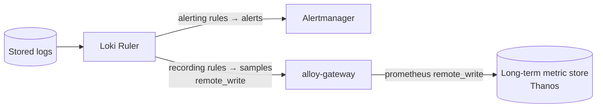

# Log and Event Rules

Alerting and recording rules over logs are evaluated by the [Loki Ruler](../#ruler) on a schedule.
This page covers the two rule kinds, where their output goes, and how rules are stored and scaled.
See the [logging architecture](../) for where the ruler sits in the pipeline.

## Two kinds of rule

### Alerting rules

An **alerting rule** is a LogQL expression that, when it crosses a threshold for a configured duration, fires an [alert](../../o11y-glossary/#alerting).
The ruler sends fired alerts to [Alertmanager](../../alerting/), which groups, routes, and notifies through the configured channels.
This is how log-based conditions — a spike in `ERROR` lines, a specific failure pattern — page the on-call alongside metric-based alerts.

### Recording rules

A **recording rule** evaluates a LogQL expression and turns the result into a **metric sample** (for example, the per-minute rate of error lines for a service).

Because that output is a metric, not a log, the ruler **remote-writes the samples back through [`alloy-gateway`](../#alloy-gateway)**, which forwards them to the long-term metric store ([Thanos](../../o11y-glossary/#stack-components)) along with the rest of the metrics pipeline.
The result: log-derived metrics live in the same place — and are queried the same way — as everything else, so a dashboard can mix them freely with native metrics.

> [!INFO]
>   Recording rules are the bridge from logs to metrics.
>   Keeping their output in the metric store (rather than re-deriving it from logs on every query) is what makes log-based SLI panels cheap to render.

## Rule storage and evaluation

- **Definitions** live in object storage under the `/loki/ruler` prefix (see [Storing](../storing/)).
- **Sharding.** When more than one ruler runs, rule groups are distributed across the instances via a consistent [hash ring](../#the-hash-ring), so evaluation scales horizontally.
- **Delegated execution.** A ruler can hand query execution to the [Loki Query Frontend](../#loki-query-frontend) to benefit from query splitting and caching.

## Managing rules

- Group related rules so the ring can balance evaluation across rulers.
- Keep recording-rule output label sets small — they become metric series and carry the same [cardinality](../../o11y-glossary/#observability-foundations) cost as any other metric.
- Alert routing, grouping, silences, and notification channels are configured in Alertmanager — see [Alerting](../../alerting/).

## See more

- [Logging Architecture](../) — the ruler in context.
- [Alerting](../../alerting/) — routing and notifying on fired alerts.
- [Metrics > Rules](../../metrics/rules/) — the metrics-side equivalent (recording and alerting rules over PromQL).
- [Loki rules](https://grafana.com/docs/loki/latest/alert/) (official).
