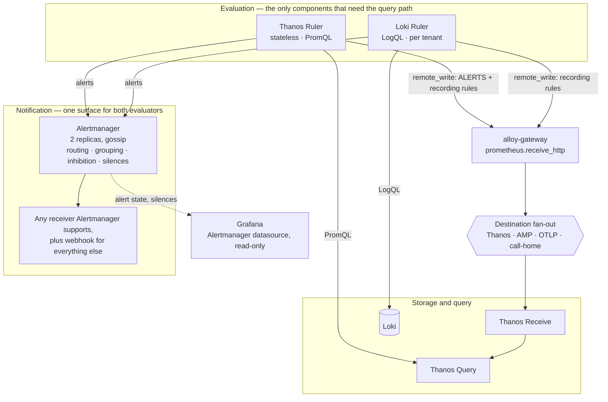

# Alerting in Self-Managed: Evaluation, Routing, and Customer Extension



This doc proposes that **a default install of this chart page somebody when Materialize breaks**, and describes what has to exist for that sentence to be true.

<!-- more -->


Three things stand between here and there, and they are independent problems that happen to share a workstream.

**Nothing evaluates rules.**
Every component needed to alert is in the chart, and no two of them are connected.
Alertmanager is deployed and receives nothing, the Loki ruler runs with an empty rule store, the Thanos ruler is off, and the values key that claims to install Prometheus rules is read by no template.

**The rules that exist are the wrong rules.**
The query registry carries 85 alert definitions ported from Materialize Cloud, and roughly a quarter of them name components a self-managed deployment does not run.
A rule set where one alert in four can never fire is not a starting point that can be trimmed; it is a starting point that has to be re-derived.

**A whole class of alert has never been code anywhere.**
Log-derived alerting — panics, correctness violations, data-corruption patterns — exists only as rules clicked into a Grafana UI, because Cloud's alert pipeline emits PromQL rule groups and has no path for LogQL.
Self-managed is the first deployment shape where that class can be defined, reviewed, and shipped like everything else.

The central claim is that **alerting is where composability has to stop meaning optional and start meaning replaceable.**
Every other component in this stack can be turned off and a customer's own put in its place, and turning them all off yields a stack that collects nothing, which is obviously broken.
Turning alerting off yields a stack that looks complete and is silent, which is not obviously anything.

<!--
Agent note: this doc records decisions and their *why*. When a decision lands in code, update the section and
check the matching row in "Chart-side prerequisites".

Five things here are easy to get wrong and are stated deliberately: that `PrometheusRule` has exactly one
consumer in this stack and it is off by default ("Nothing evaluates rules"); that the alerting path runs
through the query path and therefore fails with it ("The evaluator depends on the query path"); that severity
and urgency are different properties owned by different people ("Severity belongs to the alert"); that
`$__range` does not survive the move out of Grafana ("The range trap"); and that `cloud-only` names the
operator rather than the requirement ("`cloud-only` is the wrong axis"). Revise those rather than softening them.

This page uses RFC 2119 keywords. They are load-bearing on the credential rule, the deadman's-switch
exemption, the override restriction, and the runbook annotation; elsewhere the prose is descriptive and
lowercase on purpose. Do not uppercase a keyword to add emphasis.

No customer names, organization identifiers, or environment identifiers appear on this page, including in
examples. The survey of clicked-in rules that motivates "The class that has never been code" found several;
they are described by shape only, and they are the reason "Customer-specific rules never enter this
repository" is a Must rather than a Should.
-->

## Goals

Functional requirements, framed as value-first user stories.
Priority tags (**Must** / **Should** / **Could**) are relative to the first shipped version.

- **[Must] As an operator,** I want a default install to notify somebody when Materialize is unreachable, so that installing the monitoring stack is not the same as installing a dashboard viewer.
- **[Must] As an operator,** I want every rule that ships enabled to be one that can fire in my deployment, so that the rule list is not mostly a list of things that will never happen.
- **[Must] As an operator for whom Materialize is critical infrastructure,** I want a critical alert to reach a pager.
- **[Must] As an operator evaluating Materialize,** I want that same alert to reach a chat channel and nothing else, without editing a rule.
- **[Must] As an operator,** I want to configure whichever notification tools are already in use — a chat channel, a pager, an incident-management product, an internal webhook — so that adopting this stack does not mean adopting a new incident tool.
- **[Must] As an operator,** I want my own alert rules installed alongside the shipped ones, so that the deployment-specific alerting every real deployment needs has a supported home.
- **[Must] As a Materialize support engineer,** I want a customer-specific alert to be expressible without being committed to this repository, so that a public repository never carries a customer's name.
- **[Must] As an operator,** I want to retune, relabel, or disable a shipped rule from values, so that disagreeing with one default is not a reason to fork the chart.
- **[Must] As an operator,** I want an alert that fires when alerting itself has stopped working, so that silence and health are distinguishable.
- **[Must] As an operator,** I want a notifier that survives a node being drained, because a drain is an ordinary Tuesday and a missed page is not.
- **[Must] As an operator woken at 03:00,** I want the alert to link to a runbook, so that the notification tells me what to do and not only what happened.
- **[Must] As a security reviewer,** I want notification credentials to be referenced rather than inlined, so that a values file is not a place a Slack token can be committed.
- **[Should] As a Materialize support engineer,** I want log-derived alerts defined as code, so that the rules that catch data-correctness bugs are reviewed rather than clicked.
- **[Should] As an operator,** I want the alert noise from a Materialize upgrade suppressed by the rollout itself rather than by a wall-clock window, because the schedule is mine.
- **[Should] As an operator who already runs Alertmanager,** I want the rulers to notify the one I have.
- **[Should] As a maintainer,** I want the alert-state series to traverse the gateway, so that the call-home alerts level has something to forward.
- **[Should] As a maintainer,** I want one rule definition to serve the docsite, the chart, and Cloud, so that three surfaces cannot disagree about what an alert means.
- **[Should] As an operator running a component Materialize Cloud also runs,** I want the rules for it, so that a rule is selected by what my deployment contains rather than by who operates it.
- **[Could] As an operator,** I want a rule that references a metric my install does not collect to be excluded automatically, rather than shipped and silent.
- **[Could] As an operator,** I want alerts grouped so that one bad node produces one notification rather than forty.

## Technical BLUF

**Two evaluators, one notifier.**
Thanos Ruler evaluates PromQL and Loki Ruler evaluates LogQL, because they are different languages and no component evaluates both.
Both notify a single Alertmanager, which is the only place routing, grouping, inhibition, and silences are configured.

**Thanos Ruler runs stateless.**
It remote-writes its evaluation results to the Alloy gateway rather than keeping a TSDB, matching what the Loki ruler already does.
That puts `ALERTS` in Thanos *and* in front of the gateway's destination fan-out, which is what the call-home alerts level needs and what a ruler shipping blocks to object storage would not give.

**Severity is a property of the alert; urgency is a property of the deployment.**
Rules carry `severity`, which is what the condition means.
A single values key, `alerting.criticality`, selects one of three severity-to-route mappings, which is what the deployment has decided that means.
The same rule set serves a critical-infrastructure install and an evaluation install, and the difference is a routing table.

**The shipped rule set is re-derived rather than inherited.**
A rule ships enabled only when it can fire in a stock self-managed install, means the same thing in every install, and has a runbook.
Rules that need more than that declare it with **capability tags** — `crdb-dedicated`, `cilium`, `aws` — rather than being written off as Cloud-only, because the thing that makes a CockroachDB rule inapplicable is not running CockroachDB rather than not being Cloud.
Applicability is checked at build time against the metric registry rather than asserted by a hand-maintained label, because the hand-maintained label already exists and is already wrong.

**Alert names are a committed surface**, from the release that first ships rules.
Three extension points name alerts, and an unstable name makes all three unstable.

**Every alert carries a runbook link**, to a page under `operating/runbooks/` in this repository, promoted to the product documentation once the practice stops changing.

**Alertmanager ships HA.**
Two replicas with gossip, in the default configuration rather than behind a hardening profile, because a single notifier lost to an ordinary node drain is the failure this design exists to prevent.

**The chart does not model receiver types.**
Alertmanager's own receiver configuration passes through, so every integration it supports works and every one it gains later works too.
The chart owns only which class a receiver serves and where its credentials are mounted from.

**Extension is additive in four places**, each independently useful: extra rules, rule overrides, extra receivers, and extra routes.
Customer-specific alerting composes out of those and never enters this repository.

**Log-derived alerts become first-class**, defined in the query registry beside the metric ones and rendered into Loki ruler rule files.
This is the first place at Materialize where they can be.

**Grafana-managed alerting stays supported and is not the default**, because Grafana is the most replaceable component in this stack and alerting is the least.

## Non-goals

- **An incident-management product.** Alertmanager notifies; escalation, acknowledgement, and on-call rotation belong to whatever the notification reaches.
- **SLO definition and error budgets.** Worth having and a separate design; burn-rate alerting needs recording rules and a stated objective, neither of which exists yet.
- **Anomaly detection or forecasting.** Every rule here is a threshold over a signal with a documented meaning.
- **Alerting on Materialize's SQL-level introspection.** The alerts here read metrics and logs. `mz_internal` is reachable only from a SQL session and belongs to a different collection path.
- **Migrating Materialize Cloud onto this alerting path.** Cloud adopts these rules when it adopts this stack's Alertmanager, which is scoped as separate work. This design is what that adoption lands on, and sequencing it is not part of it.
- **Routing to Materialize.** Forwarding alert state to a Materialize-operated control plane is [call-home](../20260917-call-home-self-managed/), which depends on this and is not part of it.

## What exists today

The honest summary is that every component is present and none of them are wired to each other.

| Surface | State | Consequence |
|---|---|---|
| `packages/queries/materialize-alerts.yaml` | 30 alert definitions | Rendered to the docsite; not deployed |
| `packages/queries/infra-alerts.yaml` | 55 alert definitions | Rendered to the docsite; not deployed |
| `charts/materialize-monitoring/templates/alerts/` | `.gitkeep` | No template emits any alerting resource |
| `charts/materialize-monitoring/pre-rendered/rules/{prometheus,loki,thanos}/` | `.gitkeep` | Nothing is rendered into them; there is no `gen-rules` command |
| `config.rules.prometheus.enabled` | `true` | Read by no template |
| `config.rules.loki.enabled` / `config.rules.thanos.enabled` | `false` | Also read by no template |
| `config.alerts.enabled` | `true` | Also read by no template |
| `thanos.ruler.enabled` | `false` | The PromQL evaluator is off |
| `loki.ruler.enabled` | `true`, 2 replicas, 5Gi PVC | Running. The chart sets no `loki.rulerConfig`, so it has no Alertmanager URL and no rules |
| `tags.alertmanager` | `false`, but in `bundled-backends` and `default` | Deployed by a default install. Configured with a priority class and a 4Gi PVC, and nothing else |
| Alertmanager replicas | Subchart default, one | A single notifier holding the only copy of every silence, lost to any node drain |
| Alertmanager scrape | Absent | The component is emitting metrics that reach nothing. The roadmap already records this as the smallest and most embarrassing of the collection gaps |
| `docs/content/alerting/` | Four pages, three of which are a heading or the word `TODO` | The customer-facing documentation is a stub |

The alert definitions themselves are good work and are not the problem.
They carry structured descriptions, a `severity` label, a `component` label, `for` durations that look considered, and an inline or referenced query from the registry.
Rendering them into rule files is a small change.

### `PrometheusRule` has exactly one consumer, and it is off

This is the non-obvious part, and it is worth stating before anyone writes the template that the empty `templates/alerts/` directory invites.

The chart installs the Prometheus Operator CRDs, so `PrometheusRule` is a valid resource on any cluster running this stack.
It does not install the Prometheus Operator, and it does not run Prometheus.
The one component that consumes `ServiceMonitor` and `PodMonitor` is Alloy, through `prometheus.operator.servicemonitors` in the gateway pipeline, and Alloy has no rule evaluator at all — it is a collector.

So a template emitting `PrometheusRule` resources today would render valid YAML, apply cleanly, pass every check in CI, and do nothing.

There is one consumer, and it arrives with the Thanos ruler.
The vendored Thanos subchart ships `ruler.autoImportPrometheusRules`, defaulted `true`, which runs a `kubectl` sidecar that watches `PrometheusRule` resources and writes them into the ruler's rule directory.
That is a real path, it needs no Prometheus Operator controller, and it is inert until `thanos.ruler.enabled` is `true`.

The design consequence is that **`thanos.ruler.enabled` is the switch that makes alerting exist**, and every other decision on this page is downstream of turning it on.

### The rule set is Materialize Cloud's rule set

The 85 definitions were ported from `infra/prometheus/alerting.py` in the Cloud repository, where they are deployed as an AWS Managed Prometheus `RuleGroupNamespace` and routed by `tier` and `team` labels.
That provenance shows.

| Group | Count | Present in a stock self-managed install? | What it actually depends on |
|---|---|---|---|
| `crdb` | 15 | No. Self-managed uses PostgreSQL for consensus | Running a dedicated CockroachDB |
| `egress_gateway` | 5 | No. A Cloud networking component | The cloud-specific egress path |
| `external_uptime` | 3 | No. Marked `deploymentMode: cloud-only` | An external synthetic checker |
| `launchdarkly` | 2 | No. Marked `deploymentMode: cloud-only` | A feature-flag service in the request path |
| `cilium` | 2 | Only on a cluster that runs Cilium | Cilium as the CNI, exporting its metrics |
| `coredns` | 1 | Usually, as a cluster-provided component | CoreDNS being scraped |

That is 28 of 85 that a stock install cannot fire, and only five of them carry the `deploymentMode: cloud-only` label that exists to say so.

The fourth column is the point, and it is why the label is the wrong shape rather than merely incomplete.
Every one of those dependencies is a property of a *deployment*, and each is a property a self-managed deployment may well have.
[`cloud-only` is the wrong axis](#cloud-only-is-the-wrong-axis) takes that up.
A further set is shaped by Cloud even where the component exists: `env-uptime-sla` and `env-uptime-slo` read `v2_mz_can_connect`, which is produced by a Cloud-side synthetic checker, and `new-clusterd-restarts` is scoped to a release window that self-managed does not have.

None of this is a criticism of the port, which preserved definitions that were worth preserving.
It is an argument that **the default-enabled set has to be chosen rather than inherited**, and that the choosing needs a mechanism rather than a review pass, because a review pass decays.

### The class that has never been code

A survey of the Grafana instance Materialize operates for Cloud found 98 Grafana-managed alert rules.
Fourteen of them query Loki.

They detect panics, a persist filter-pushdown correctness violation, a set of data-corruption error strings, a hanging-query error string, and trace-level logging left enabled.
That list is roughly the highest-severity failure modes the product has, and it is the one list with no definition in any repository.

The reason is structural rather than an oversight.
Cloud's alert pipeline builds a Prometheus rule group and hands it to a managed Prometheus, which evaluates PromQL.
There has never been a place to put a LogQL rule, so log-derived alerts were clicked into Grafana, which will evaluate a query against any datasource.

Three properties of that set are worth recording, because each is a direct consequence of the rules being clicked rather than written.

**They are duplicated per region.** One rule per Loki datasource, three copies of each, kept in agreement by hand.

**The copies have drifted.** Two carry a routing label that sends them to a test receiver rather than the on-call one, and their titles still end in `(copy)` and `(copy 2)`. The three copies of the panic detector do not agree on their own aggregation: two group by namespace, one by namespace and pod.

**Deployment-specific exclusions are compiled into the query.** Two of the panic detectors carry a hardcoded namespace exclusion naming a single environment, inside the LogQL, where nothing reviews it and nothing expires it.

The same survey found alert rules filed in folders named after individual customers, and a notification route matching a customer-specific label.
Those are the load-bearing evidence for two requirements on this page: that customer-specific alerting is a real and recurring need rather than a hypothetical one, and that it must have a home that is not this repository.

## Architecture



Four properties of that shape are the design.

**Alertmanager is the single notification surface.**
An operator configuring where alerts go configures one thing, whether the alert came from a metric or a log line.

**Both rulers remote-write through the gateway.**
The Loki ruler already does this for recording-rule samples.
Thanos Ruler joining it is what makes alert state a signal the destination fan-out can see, rather than a series that exists only inside Thanos.

**Grafana reads Alertmanager rather than owning alerts.**
An `alertmanager` datasource gives Grafana the alert list, the silence UI, and the ability to put firing alerts on a dashboard, with no alert state in Grafana's own database.
This is also how the Cloud Grafana instance is already configured against the managed Alertmanagers, so the shape is familiar.

**The rulers are the only components that need to reach the query path.**
Nothing else in the alerting path depends on Thanos Query or the Loki query frontend being healthy, which bounds the blast radius of the failure described next.

### The evaluator depends on the query path

Thanos Ruler evaluates by issuing PromQL to Thanos Query over the network.
There is no local TSDB to fall back on, because there is no Prometheus in this stack — Alloy scrapes and remote-writes, and Thanos Receive is where the data lands.

The consequence is that **an outage in the query path stops alert evaluation**, and stopping alert evaluation looks exactly like nothing being wrong.
The same is true of the Loki ruler and the Loki read path.

This is not avoidable within this architecture, and it is the strongest argument on this page for the deadman's switch described in [Alerting about alerting](#alerting-about-alerting).
It is also an argument for sizing the query path with the alerting dependency in mind, which is a note the Thanos sizing profiles do not currently carry.

## Two evaluators, one notifier

**Decision: Thanos Ruler for PromQL, Loki Ruler for LogQL, one Alertmanager for both.**

The alternative worth taking seriously is Grafana-managed alerting through the grafana-operator CRDs, and it is treated on its own below.
The alternative *not* worth taking seriously is a single evaluator: no component evaluates both PromQL and LogQL, and building one is not a monitoring-chart project.

| | Thanos Ruler | Loki Ruler |
|---|---|---|
| Language | PromQL | LogQL |
| In the chart today | Present, `enabled: false` | Present, `enabled: true`, no rules |
| Rule source | `ruler.rules` (inline files), or `PrometheusRule` via the import sidecar | The ruler object-storage bucket, or a local rule directory |
| Alertmanager | `ruler.alertmanagers.config`, Thanos format | `loki.rulerConfig.alertmanager_url` |
| Recording rules | Yes, remote-written in stateless mode | Yes, already remote-written to the gateway |
| Tenancy | None | Per tenant. See [Multi-tenant Loki](#multi-tenant-loki-multiplies-the-rule-set) |

Two evaluators is more moving parts than one and it is the honest shape.
The cost is paid in the chart, once, and an operator configuring notifications never sees it.

### Thanos Ruler runs stateless

**Decision: the ruler remote-writes to the Alloy gateway and keeps no TSDB. It MUST NOT be configured with an object-store bucket of its own.**

Thanos Ruler has two modes.
The default keeps a local TSDB of rule results and ships blocks to object storage, which is why the subchart defaults it a 10Gi PVC.
Stateless mode remote-writes results instead and holds nothing.

Stateless is correct here for three reasons, in ascending order of how much they matter.

**It removes a stateful workload.** A PVC per replica, with the sizing, storage-class, and portability concerns every PVC in this chart has already generated.

**It puts rule results on the same path as everything else.** Every other series in this stack arrives at Thanos through the gateway. A ruler shipping its own blocks is a second writer into object storage with its own compaction interaction, and the Loki ruler already established the other pattern.

**It is what makes alert state forwardable.** The [call-home](../20260917-call-home-self-managed/#where-the-series-has-to-come-from) design needs `ALERTS` to traverse the gateway, because the destination fan-out is a gateway component. A ruler shipping blocks to object storage puts `ALERTS` in Thanos and out of reach of every destination except Thanos. That design flagged this as a checkable requirement rather than an assumption; this is the check, and the answer is that it constrains the ruler's mode.

**The subchart does not model this.**
`thanos.ruler` exposes no `remoteWrite` key.
It exposes `ruler.extraArgs`, so `--remote-write.config` is reachable, and reaching it that way leaves the PVC and the objstore flag configured for a mode the ruler is no longer in.
Modeling stateless ruler properly is a prerequisite rather than a values trick, and it is the kind of subchart gap this repository has fixed upstream before.

### Alertmanager runs HA by default

**Decision: two replicas with gossip enabled, in the default configuration rather than behind a hardening profile.**

The roadmap files Alertmanager HA under production hardening and ranks it below adoption, on the reasoning that until routing exists nobody is paged.
That ordering was right while there was no routing.
Once there is, shipping a single-replica notifier as the default is shipping the failure this whole page exists to prevent.

A single Alertmanager is a single point at which alerting stops, and it stops the way alerting always stops: quietly.
Node disruption is the ordinary case rather than the exotic one — a drain, an autoscaler consolidation, a spot reclaim, a kernel patch — and each of them is a window during which a notification is dropped rather than delayed.
**That window is exactly the condition an operator most needs to be able to see**, and one replica cannot report its own absence.
A surviving peer can, which is what makes the second replica a visibility improvement and not only an availability one.

Three consequences follow from making it the default rather than an upgrade.

**Deduplication has to be right from the start.** Gossiped Alertmanagers deduplicate notifications between themselves, and a configuration that scales to two replicas without gossip configured sends every notification twice. The existing NetworkPolicy already opens `9094` on both TCP and UDP for this, and its values comment already warns that the alternative is a cluster that silently doubles every notification the day someone scales it up. Making two the default is what turns that warning into a tested path.

**Silences and the notification log replicate.** A silence created on one replica reaches the other through gossip, which removes the current shape's worst property: a single replica holding the only copy of every silence, on a PVC, with no second copy anywhere.

**Two is the number, not three.** Alertmanager's gossip tolerates a partition by notifying from both sides rather than by electing, so the availability argument for a third replica is weak, and the cost of a third is a third set of duplicate notifications when gossip is misconfigured. Two replicas with a PodDisruptionBudget of one is the shape that survives a node disruption, which is the failure being designed against.

The stack's own meta-alerting then has something to say when it breaks: `alertmanager_cluster_members` below the expected count is a real alert, and it is only writable once the expected count is more than one.

## Severity belongs to the alert, urgency belongs to the deployment

This is the requirement that a Materialize deployment can be critical infrastructure or a thing somebody is playing with, and the rules should not know which.

**Decision: rules carry `severity`; a single values key selects the severity-to-route mapping.**

The rules already carry `severity`, with three values.
Their meanings should be written down, because a label with an intuitive name and no definition drifts within two releases.

| `severity` | Means | Not |
|---|---|---|
| `critical` | Materialize is not doing its job, or is about to stop | A component is unhealthy but the service is not affected |
| `warning` | A condition that will become `critical` if unattended, or a degradation a user can perceive | Something an operator would want to know eventually |
| `notice` | A condition worth knowing about, with no deadline | A condition nobody would act on, which should not be a rule |

`alerting.criticality` then selects what those mean for this deployment.

| `severity` | `critical-infrastructure` | `important` (default) | `evaluation` |
|---|---|---|---|
| `critical` | Page | Notify, high priority | Notify, normal priority |
| `warning` | Notify, high priority | Notify, normal priority | Notify, normal priority |
| `notice` | Notify, normal priority | Notify, low priority | Suppressed |

The columns are receiver *classes*, not receivers.
An operator maps `page`, `high`, `normal`, and `low` onto their own contact points once, and the matrix does the rest.
That indirection is what lets the same values file work for a deployment with a pager and one with a single Slack channel.

Four notes on the table.

**`important` is the default** because it is the assumption that is wrong in the least damaging direction.
A deployment that is really critical infrastructure and routes `critical` to a notification instead of a page has a delayed response.
A deployment that is really an evaluation and pages on `critical` has an operator who turns alerting off.

**`Suppressed` is not dropped.**
The alert still fires, still appears in Alertmanager and on the alerts dashboard, and generates no notification.
The distinction matters during an incident, when the question is what else was true at the time.

**The matrix is values, not a template.**
An operator who wants `warning` on `evaluation` to be low rather than normal edits one cell, and does not have to understand the routing tree to do it.

**Cells that agree are not the same cell.**
`critical` and `warning` both reach `normal` on an `evaluation` deployment, and the temptation is to read that as evidence the two levels have collapsed and one of them could go.
They MUST stay distinct.
A level is a statement about the condition, and the matrix is one deployment's current opinion of it — an operator who later splits those two cells has to be able to, and an operator whose external Alertmanager routes on `severity` directly never saw the matrix at all.
The same argument keeps `notice` even where it routes identically to `warning`: collapsing a level to save a row in a table removes a distinction that cannot be recovered without re-editing every rule that carried it.

## Notification channels

**Decision: the chart does not model receiver types. It passes Alertmanager's own receiver configuration through, and owns only the parts Alertmanager cannot know about — which class a receiver serves, and where its credentials come from.**

The instinct is to type the common shapes and call the rest an escape hatch.
It is the wrong trade here.
Alertmanager already supports around twenty receiver integrations and documents every one of them, it gains more on its own release cadence, and a typed subset in this chart is a promise to track that cadence in exchange for slightly shorter YAML.
Worse, the subset decides for an operator which tools are first-class, and the tool a given customer runs is exactly the thing this chart cannot know.

```yaml
alerting:
  criticality: important
  receivers:
    oncall:
      class: page
      # Everything below `config` is an Alertmanager receiver, verbatim.
      config:
        pagerduty_configs:
          - service_key_file: /etc/alertmanager/secrets/mzmon-alerting/pagerduty-key
    platform-alerts:
      class: [high, normal]
      config:
        slack_configs:
          - channel: "#platform-alerts"
            api_url_file: /etc/alertmanager/secrets/mzmon-alerting/slack-url
    ticketing:
      class: [normal, low]
      config:
        webhook_configs:
          - url: https://example.invalid/hooks/alerts
            http_config:
              authorization:
                credentials_file: /etc/alertmanager/secrets/mzmon-alerting/ticketing-token
  # Secrets mounted into the Alertmanager pod, referenced by the paths above.
  secrets:
    - name: mzmon-alerting
```

> [!NOTE]
>   **As built, `alerting.secrets` does not exist.**
>   The Secret mounts are a subchart value, `alertmanager.extraSecretMounts`, which the subchart renders with `toYaml`
>   and which the umbrella therefore cannot compute from anything else.
>   The chart instead mounts one conventional, optional Secret by default — `alertmanager-receivers`, at
>   `/etc/alertmanager/secrets/alertmanager-receivers/` — and further Secrets are added to that list directly.
>   A render-time check fails any `*_file` path that no mount covers, which recovers the safety the key was meant to provide.

Three properties make this more than a passthrough.

**`class` is the chart's one addition**, and it is what attaches a receiver to the severity matrix.
It takes a list, because one channel absorbing several classes is the common small-deployment case.
A class with no receiver MUST be a render-time error rather than a silent drop, since an unroutable severity is the kind of misconfiguration that gets discovered during the incident it should have reported.

**Every receiver an operator already knows how to configure works on day one**, including ones that did not exist when this was written, and the documentation for configuring them is Alertmanager's.
`alerting/channels.md` then documents the *pattern* and links out, rather than restating a schema that will drift.

**The chart still validates.**
A `config` block is checked with `amtool check-config` at render, so a malformed receiver fails the install rather than the reload.
As built, Helm cannot run `amtool`, so this splits in two: render-time validators check the structure the chart can see
— integration keys, receiver and time-interval references, credential fields and paths — and `amtool check-config` runs
in CI over representative renders, in the Alertmanager image the chart pins.

### Credentials are referenced, never inlined

**A receiver's credentials MUST come from a mounted Secret. The chart SHOULD reject a rendered configuration containing an inline credential field.**

Alertmanager's own configuration is a Secret, so an inline token is not exposed at rest.
It is exposed in the values file, and values files are committed, diffed, pasted into support threads, and rendered into Terraform plans.
Grafana's `assertNoLeakedSecrets` guard exists in this chart for the same reason on a neighbouring surface, and the argument has already been won there.

Alertmanager makes this easy to hold to, because nearly every credential field has a `_file` variant — `api_url_file`, `service_key_file`, `credentials_file`, `password_file`.
`alerting.secrets` names Secrets to mount, the `_file` paths reference them, and no credential passes through values at all.

The cost is that an operator creates a Secret before configuring a receiver.
The Terraform module MAY create it from a variable marked `sensitive`, which is where the ergonomics belong.

### Vendors get profiles, not types

A vendor with a well-known configuration is worth shipping guidance for, and a profile is the right vehicle.
Profiles are documentation in this chart, a convention the [Terraform modules design](../20260803-terraform-modules/#profiles-are-documentation-with-one-exception) established.

An incident-management vendor consuming Alertmanager's native webhook — incident.io, Opsgenie via webhook, or an internal receiver — needs the URL shape, a bearer token in a Secret, and grouping that produces one incident per condition rather than one per series.
That is four lines of values and a paragraph of explanation, and a customer using a different vendor copies the profile and changes the URL.
None of that is reachable if the chart has instead typed a receiver around one vendor's assumptions.

Which vendors get a shipped profile is a question about demand rather than about design, and it is left open.

### External Alertmanager

**Decision: `alerting.alertmanager.mode` takes `bundled` or `external`, mirroring `connections.grafana.mode`.**

A customer running Alertmanager already has routing, receivers, silences, escalation policy, and a team that knows them.
Deploying a second one beside it and asking which alerts arrive from which is a worse outcome than sending ours to theirs.

In `external` mode the chart configures both rulers to notify the given endpoints, renders no Alertmanager, and skips the routing tree entirely — the routing matrix above is bundled-mode configuration, and an external Alertmanager's tree belongs to its owner.
What the chart still owes that operator is the **label contract**: which labels the rules emit, what values they take, and what they mean, so that routing can be written against them.
That contract MUST be documented and MUST move only under the deprecation cycle, because an external routing tree is written against it and cannot be migrated by this chart.
That contract is a documentation deliverable and is listed as one.

As built, the contract has one label every alert carries whatever its rule says: `cluster`, stamped by both rulers from `pipeline.env.CLUSTER_NAME`.
It is filled only where a rule's result lacks it, and the default `group_by` includes it, because an Alertmanager group
key feeds PagerDuty's `dedup_key` and Opsgenie's `alias`.
Without it, two clusters routing one condition to one service share an incident, and an external Alertmanager shared by
several clusters merges their identical label sets into one alert.

## Choosing what ships enabled

**Decision: every rule declares the capabilities it requires; `rules.selected` selects by capability and by name; applicability is checked at build time.**

### `cloud-only` is the wrong axis

The registry marks a handful of rules `deploymentMode: cloud-only`, and the label is wrong twice over.

It is wrong about coverage — 28 rules cannot fire in a stock self-managed install and five carry the label.
More importantly it is wrong about the *question*.
A CockroachDB rule is not a Cloud rule; it is a rule for a deployment that runs CockroachDB, which a self-managed customer on a dedicated CockroachDB cluster does.
A Cilium rule is not a Cloud rule; it is a rule for a cluster whose CNI is Cilium, which is a choice any operator can make.
Marking either `cloud-only` throws away a rule that some self-managed deployments want, and encodes today's Cloud topology as though it were a property of the rule.

**Decision: rules carry `requires`, a list of capability tags naming what must be true for the rule to be meaningful.**

| Tag | Means | Example rules |
|---|---|---|
| `crdb-dedicated` | Consensus is a dedicated CockroachDB cluster | The 15 `crdb` rules |
| `cilium` | The cluster CNI is Cilium and exports its metrics | BPF map pressure, drop rate |
| `aws` | Running on AWS, with the cloud-specific signals that implies | Egress-gateway traffic shape |
| `synthetic-uptime` | An external connection checker is writing uptime series | `env-uptime-sla`, `env-uptime-slo` |
| `feature-flags` | A feature-flag service is in the request path | The flag-staleness rules |

The tags describe the deployment, not the vendor of it.
A Cloud region satisfies several at once, which is why the rules looked Cloud-shaped, and a self-managed deployment that satisfies one gets the rules that go with it.

Two consequences worth stating.
**`deploymentMode: cloud-only` goes away**, replaced by the tags that say what it was actually standing for.
**No rule is deleted**, which resolves the disposal question by dissolving it: a rule nobody can currently run stays in the registry, tagged, documented, and off.

### Three mechanisms, in the order they apply

**Build-time applicability.** A rule whose query names a metric family that no scrape source in this chart produces cannot fire, and the build knows this. `extract_metrics` already walks the registry and resolves every metric a query names, and `metric-tiers.yaml` already groups the result. A rule with no `requires` tag whose metrics are unreachable MUST fail the build, because it is either mistagged or broken. A rule whose tags are not satisfied is excluded quietly, which is the tag doing its job.

**Selection.** `rules.selected` takes capability tags and glob patterns over rule-group names, following the `dashboards.selected` shape that contributors and operators already know. An operator running a dedicated CockroachDB adds `crdb-dedicated` and gets fifteen rules.

**Per-rule disable.** `rules.disabled` takes a list of alert names, because the common case is disagreeing with one rule rather than a category.

The build-time check is the load-bearing one.
Selection and disabling are how an operator expresses a preference; the check is what keeps a rule that cannot possibly fire from shipping as though it might.

### Alert names are a committed surface

**Decision: an alert name is a customer-facing surface subject to the deprecation cycle, from the release that first ships rules — not from this design.**

The [roadmap records this as open](../../roadmap/#versioning-changelog-and-releases) and notes the decision is free only until the alerting path ships.
This is the decision, and the reason to make it now is that three of the extension points on this page name alerts: `rules.disabled` names them, an external Alertmanager's routing tree matches on them, and a runbook link is built from them.
An unstable name makes all three unstable, and an operator who cannot rely on a name cannot build a route.

The cycle does not begin immediately, and pretending otherwise would be a promise nobody could keep.
Names will churn while the default set is being derived and the log-derived rules are being written, and the churn SHOULD be visible: a renamed alert during that period still owes a changelog entry, so that an operator tracking pre-release versions can follow it.
Once the alerting path ships in a release, a rename owes the full `**Deprecated:**` cycle the [committed-surface check](../../releasing/) already enforces for dashboards and Terraform variables.

Recording-rule names acquire the same status at the same time, and for the same reason: a recording rule is a metric name to anyone querying it.

### Runbooks live in this repository

**Decision: every shipped alert MUST carry a `runbook_url` annotation resolving to a page under `operating/runbooks/` in this docsite.**

An alert whose annotation says what fired but not what to do is half an alert, and the roadmap's base-alert-set row has carried "runbook stubs" as a deliverable since FCO-M2 without a home for them.

Three properties of putting them here.

**They are reviewed with the rule.** A rule and its runbook change in one pull request, which is the only arrangement under which they stay in agreement.

**They are linkable and stable.** The annotation is a URL built from the alert name, which is a surface the section above just committed to, so the link is as stable as the rule.

**Stable ones graduate.** A runbook that has stopped changing and describes a practice rather than a workaround SHOULD be promoted to the customer-facing product documentation. This docsite is where a runbook is written and iterated; it is not where the good ones should end up.

One caveat the annotation cannot solve.
A deployment on an air-gapped network cannot follow a link to a hosted docsite, so the `summary` annotation MUST remain self-contained enough to act on — what fired, on what, and the first thing to check — with the runbook carrying the depth rather than the whole content.

### Log-pattern rules are best-effort by construction

A rule matching `|~ "(?i)panic"` depends on a string in a log line, and a log line is not an interface.
Materialize can reword a message in a patch release and silently disable the alert that was watching for it.

Two things follow.

**Every log-pattern rule MUST be `stability: best-effort`**, and none of them graduate to `canonical` while the contract is a string.
The registry's stability field already means "how much this repository commits to it", and a string match is not something to commit to.

**The real fix is upstream.** A structured error code in the log line — a stable field, versioned like a metric name — turns a pattern match into a label match, and turns a rule that decays silently into one that fails loudly. That belongs on the metrics-contract dependency list beside the other asks, and the correctness-violation alerts are the strongest case for it, because they are the ones whose silent decay costs the most.

Until then, the mitigation is a test asserting the patterns still match a corpus of real log lines, which is weaker than a contract and much better than nothing.

## Extension, in four places

The requirement is that a customer can extend and override at the Helm level, and that customer-specific alerting never enters this repository.
That decomposes into four extension points, each small, and the fourth is the one that is usually missing.

### Extra rules

```yaml
rules:
  extra:
    my-pipeline-slas:
      engine: promql
      groups:
        - name: ingest-freshness
          rules: [...]
    my-log-detectors:
      engine: logql
      groups: [...]
```

Passed through verbatim into the rule files the corresponding ruler loads, validated for syntax at render, and otherwise untouched.
This is where a customer's own alerting lives, and where a Materialize support engineer puts a deployment-specific rule — in that deployment's values, reviewed by the people who run it, with a name nobody else has to see.

### Rule overrides

```yaml
rules:
  overrides:
    environment-pod-pending-critical:
      for: 30m
      severity: warning
      labels:
        team: platform
```

**Decision: overrides MAY change `for`, `severity`, `labels`, `annotations`, and `keepFiringFor`. They MUST NOT change the expression.**

The tempting next step is threshold parameterization — exposing the numbers inside an expression as values.
It is deliberately not proposed, because doing it generically requires the renderer to know which literal in an arbitrary PromQL expression is the threshold, and doing it specifically requires every rule author to remember to name one.
Neither is free, and the first is not reliable.

An operator who needs a different threshold disables the shipped rule and adds their own through `rules.extra`, which is three more lines and is honest about what has happened: the rule is now theirs, and a chart upgrade will not change it.
Named thresholds are a reasonable later refinement, added per rule where the demand is demonstrated, and they are not a foundation.

### Extra receivers

Covered above.
A receiver added under `alerting.receivers` participates in the class matrix like any other.

### Extra routes

This is the point that is usually missing, and its absence is what forces forks.

```yaml
alerting:
  routes:
    extra:
      - matchers: ['component="storage"', 'severity="critical"']
        receiver: data-team
        continue: false
```

Extra routes MUST be spliced into the tree **ahead of** the severity matrix, so a specific match wins and the matrix remains the fallback.
That ordering is the whole value: a customer with one team that owns sources and another that owns everything else expresses it in four lines, and every alert not matching still routes correctly.

There is prior art for exactly this problem in the operator CRDs this chart already installs.
`GrafanaNotificationPolicy` carries a `routeSelector` that merges in `GrafanaNotificationPolicyRoute` resources by label, so a route can be added by an object that the chart does not own and does not need to know about.
For the Alertmanager path, a values list is the equivalent and is enough.
For deployments where routes are managed by a separate GitOps pipeline, the CRD path is available and is one of the reasons the Grafana-managed alternative stays supported.

## Log-derived alerts

This class becomes first-class here, and three things about it need stating before someone ports the clicked-in rules.

### The range trap

Every clicked-in Loki rule is shaped like this:

```
sum by (namespace) (count_over_time({namespace=~"environment.+", level="ERROR"} |~ "(?i)panic" [$__range]))
```

`$__range` is a Grafana variable.
It resolves to whatever relative time range the alert rule's query is configured with, and it does not exist in LogQL.
A Loki ruler evaluating that expression fails to parse it.

Porting these rules means writing an explicit window, and an explicit window is a semantic decision rather than a transcription.
The clicked-in rules pair a range with `for: 0s`, so the alert fires on the first evaluation where the count over the range exceeds zero — meaning the range, not `for`, is what controls how long a condition persists after the last matching line.
A ruler rule written as `count_over_time(...[5m]) > 0` with `for: 0s` behaves the same way, and the `5m` is now a number someone chose.

This is worth an explicit note because the failure mode of getting it wrong is an alert that is far noisier or far quieter than the one it replaced, with no indication that anything changed.

### Multi-tenant Loki multiplies the rule set

The bundled Loki runs `auth_enabled: true`, and the pipeline's `tenancy.tenantMap` decides which tenant a log stream is written to.
The default is `static` across all four classes, so a default install has one tenant and one rule set.

`byNamespace` and `byEnvironment` are supported values, and under either of them **every Materialize environment is its own tenant**, the tenant set changes as environments are created, and a Loki rule group is per tenant.
The ruler does not evaluate across tenants.

Two consequences.
**The chart must render the log rule set once per tenant** under those modes, which means the tenant list has to be knowable at render time — it is, for `byEnvironment` against a configured environment list, and it is not for `byNamespace` against namespaces created later.
**A deployment on `byNamespace` may not be able to have complete log alerting**, and saying so is better than shipping a rule set that covers the environments that existed when Helm last ran.

This is a genuine constraint of the tenancy model rather than a gap, and the honest resolution may be that log alerting requires `static` or `byEnvironment`, stated as a documented requirement.

### Where log rules live

In the query registry, beside the metric alerts, in a `materialize-log-alerts.yaml` and an `infra-log-alerts.yaml`.
The registry already models LogQL — `env-logs` and `env-upgrade` are built on LogQL families — and an alert already carries either an inline query or a `queryId`.

That gets the class four things it has never had: review, a docsite entry beside the metric alerts, a single definition rendered to both the chart and, eventually, Cloud, and the ability to change a pattern in one place rather than in three regions' worth of clicked-in copies.

## Maintenance windows do not work when the customer picks the time

The `docs/content/alerting/maintenance.md` page is an empty heading, and the obvious thing to put on it is wrong for this audience.

Cloud suppresses upgrade noise with wall-clock mute timings — a named weekly window per region, during which the SLO routes are muted.
That works because Cloud chooses when to upgrade.

A self-managed customer upgrades when they decide to, which makes a weekly window either useless or permanently open.

**Decision: suppress upgrade noise by inhibition on a rollout signal, with mute timings available as a fallback.**

Alertmanager inhibition suppresses one alert while another is firing.
A rollout-in-progress alert — `notice` severity, routed nowhere, existing only to be inhibited against — turns "an upgrade is happening" into a condition the routing tree can read.

The signal exists, and picking the right one matters more than it looks.

**The signal is the generation count, not the hydration count.**
`materialize.generations.active` counts the deployment generations currently running, and the registry already states its meaning exactly: one between rollouts, two for as long as a rollout takes.
`> 1` is therefore a rollout and nothing else.

The hydrating-collection count is the obvious candidate and is the wrong one.
It is the `env-upgrade` dashboard's centrepiece because it answers *has the new generation caught up*, which is the question a rollout poses — but hydration also spikes on an ordinary pod restart, on replica creation, and after DDL.
Inhibiting on it would suppress restart and pending-pod alerts during any of those, which is to say it would hide the incidents those alerts exist to report, at the moment they are most likely to be real.

The two signals compose rather than compete: generation count gates the inhibition, and hydration says how far along the gated rollout is.
Only the first belongs in a routing decision.

Two properties make this better than a window and they are worth stating.
**It closes itself.** A window that a customer opens by hand is a window somebody forgets to close, and the alerts that were suppressed for the upgrade stay suppressed for the incident.
**It suppresses the right alerts.** A window mutes a route; inhibition can be written to suppress pod-restart and pending-pod alerts while leaving an unreachable-environment alert firing, which is the distinction an operator actually wants during an upgrade.

Wall-clock mute timings stay available, because a customer with a change-management process and a standing window is a real case and Alertmanager supports it directly.
They are the fallback rather than the recommendation.

## Alerting about alerting

A stack that notices everything except its own failure to notice is the failure mode that makes alerting untrustworthy, and this stack currently has three ways to fail silently.

| Failure | Detected by |
|---|---|
| Alertmanager cannot deliver to a receiver | `alertmanager_notifications_failed_total`, which requires the scrape that does not exist |
| A ruler stops evaluating | `up` on the ruler, plus rule-evaluation failure counters |
| The query path is down, so evaluation returns nothing | Nothing inside the cluster |

The third is the one that matters and it is the one a self-contained stack cannot solve.

**Decision: ship a deadman's switch, and document what it is worth.**

An always-firing `notice`-severity alert, routed to its own receiver, on a short group interval.
Its value is entirely on the receiving side: something outside the cluster has to notice that the periodic notification stopped.

For a deployment routing to incident.io or PagerDuty, that is a heartbeat monitor those products provide, and the switch is genuinely load-bearing.
For a deployment routing to a Slack channel, it is a message every few minutes that somebody mutes within a week.
For a deployment with no external receiver at all, it is worth nothing, and saying so is better than shipping it as a checkbox.

The deadman's switch MUST be exempt from the severity matrix and from `alerting.criticality`, because a `notice` suppressed on `evaluation` is a deadman's switch that is always dead.

**Alertmanager also has to be scraped.**
The roadmap records this as an open collection gap and calls it the most embarrassing of them, which is fair — it is our own component, deployed by our own chart, emitting metrics to nothing.
It is a prerequisite here rather than a nice-to-have, because two of the three rows above depend on it.

## What this owes call-home

The [call-home design](../20260917-call-home-self-managed/#the-alerts-level) places `alerts` as the lowest genuinely useful consent level and records that it is blocked on rule evaluation rather than on anything in that design.
This is the unblocking, and it carries two obligations.

**`ALERTS` has to traverse the gateway.**
That design flagged it as a checkable requirement; the check is that Thanos Ruler must run stateless and remote-write, which is a decision made here for independent reasons and happens to satisfy it.
A ruler left in its default mode would put `ALERTS` in Thanos and out of reach of every destination in the fan-out, and the level would render correctly and forward nothing.

**Silences are part of the signal.**
An alert silenced locally still produces an `ALERTS` series in the firing state, so a control plane consuming the state series will see firing where a customer has deliberately decided not to care.
The state series alone therefore over-reports, and the design of the alerts level should assume that until the Alertmanager webhook path exists.

## Grafana-managed alerting as an alternative

**Decision: supported, documented, not the default.**

The grafana-operator CRDs this chart already installs cover the whole surface: `GrafanaAlertRuleGroup`, `GrafanaContactPoint`, `GrafanaNotificationPolicy`, `GrafanaNotificationPolicyRoute`, `GrafanaMuteTiming`, and `GrafanaNotificationTemplate`.
It is a complete alternative, not a partial one, and it has two real advantages.

**One rule model across both datasources.** A Grafana alert rule queries whatever datasource it names, so metric rules and log rules are the same kind of object — no second evaluator, no second rule format, no `$__range` trap.

**It is closer to existing practice.** The clicked-in rules are Grafana rules. Codifying them as `GrafanaAlertRuleGroup` resources is a smaller step than porting them to a Loki ruler.

The obvious argument against it is that Grafana's alert state lives in Grafana's database, and the chart's stock Grafana is SQLite on an `emptyDir`.
**That argument is weaker than it looks and should not be the one this rests on.**
A stateful Grafana is strongly recommended regardless — for service accounts, annotations, dashboard versions, and anything a human creates — so a production deployment has `grafana-postgres` or `grafana-pvc` applied before alerting enters the picture.
Resting the decision on a default that production deployments are already told not to use would make it an argument about the ephemeral case only, which is not the case that matters.

The reason it is not the default is the composability posture, and it survives a stateful Grafana intact.

**Grafana is the most replaceable component in this stack, and alerting is the least.**
`connections.grafana.mode: external` is a supported and expected configuration — a shared platform Grafana, or Grafana Cloud — and in that mode the chart holds no credentials with which to install rules.
The `existing-grafana` profile exists precisely for customers who will not run ours.
Making the one guarantee that has to hold depend on the one component a customer is most likely to bring their own of is the inversion.

**The failure modes differ in kind.**
Grafana restarting costs a reload; this chart's own guidance describes it as losing nothing important.
That is only true while nothing load-bearing runs inside it.
Routing through Grafana's embedded Alertmanager makes a Grafana restart an alerting outage, and changes the priority class Grafana should carry — it sits in `monitoring-scalable` today on the stated grounds that a surviving replica or a retry absorbs its loss.

The documented shape for a customer who wants it: enable Grafana-managed alerting, turn off the rulers and the bundled Alertmanager, and apply a persistence profile.
That is a profile, and it is worth shipping as one.
A customer already standardized on Grafana alerting is a real case, and the argument above is about which default serves the most deployments rather than about the approach being wrong.

## Chart-side prerequisites

Work in this repository, roughly in dependency order.

| Item | Why it blocks |
|---|---|
| `gen-rules` command in `mz-monitoring-build`, rendering the registry's alerts into `pre-rendered/rules/{prometheus,loki}/` | Nothing renders rules today; every item below consumes the output |
| Capability tags (`requires`) on rules, and the schema change behind them | Replaces `deploymentMode: cloud-only` with what it was standing for |
| Build-time applicability check against the extracted metric set | Decides the default-enabled set, and catches an untagged rule that cannot fire |
| `thanos.ruler` enabled by default, wired to Thanos Query and Alertmanager | ✅ done. The switch that makes PromQL alerting exist |
| Stateless Thanos Ruler modeled in the subchart (`remoteWrite`, no PVC, no objstore) | 🔨 The ruler runs stateless, reached through `extraArgs` and an umbrella-rendered ConfigMap, with the PVC off. The subchart still models no `remoteWrite` and still passes `--objstore.config-file`, so a shipper scans an empty agent directory. The upstream fix is outstanding |
| `loki.rulerConfig` with `alertmanager_url` and the rule store | ✅ done, for the notification half. The rule store was already configured and nothing writes rules into it yet |
| Alertmanager configuration surface: receivers passthrough with `class`, the criticality matrix, inhibition, mute timings | ✅ done. `templates/alertmanager-config.yaml` renders the tree; inhibition and time intervals pass through. The rollout-signal inhibition is a rule and waits for the rule set |
| `amtool check-config` over the rendered configuration | ✅ done, in CI (`make alertmanager-config-check`) rather than at render, which Helm cannot do. Render-time validators cover what the chart can see |
| `alerting.secrets` mounting, and the `_file` credential convention | ✅ done, through `alertmanager.extraSecretMounts` rather than `alerting.secrets` — see the note under [Notification channels](#notification-channels). Inline credentials and unmounted `*_file` paths both fail the render |
| Alertmanager at two replicas with gossip, and a PDB of one | ✅ done ([DEP-226](https://linear.app/materializeinc/issue/DEP-226)), with hard zone spread. Both rulers address the headless Service by DNS discovery so every replica receives every alert — gossip does not replicate alerts, which this table did not anticipate |
| Alertmanager ServiceMonitor | ✅ done |
| Alertmanager NetworkPolicy egress review | The existing policy is deliberately wide; the receiver set now makes the destinations knowable per deployment |
| Deadman's switch rule, exempt from the severity matrix | Distinguishes silence from health |
| `operating/runbooks/`, and the `runbook_url` annotation built from the alert name | An alert with no stated action is half an alert |
| Alert names added to the committed-surface check | Three extension points name alerts |
| `rules.selected` / `rules.disabled` / `rules.extra` / `rules.overrides` | The extension surface |
| `alerting.routes.extra`, spliced ahead of the matrix | ✅ done |
| `alerting.alertmanager.mode: external` | A customer with Alertmanager should not get a second one |
| Log-alert registry files and the LogQL render path | The class that has never been code |
| Rollout-inhibition rule over `materialize.generations.active` | Maintenance windows that close themselves; the hydration count is not rollout-specific |
| Alertmanager datasource in Grafana, and an alerts dashboard | 🔨 The datasource is done, which gives Grafana the alert list and the silence editor. The dashboard is not |
| A vendor receiver profile, and a `grafana-managed-alerting` profile | Profiles are documentation |
| Terraform module surface for receivers and criticality, with `sensitive` credential variables | Where the Secret-creation ergonomics belong |
| Remove `config.rules.*` / `config.alerts.enabled` or make them load-bearing | Four values keys currently read by nothing |

## Testing

The kind E2E tiers can prove most of this, and the parts they cannot are worth naming rather than pretending.

- **Rules render and parse.** Every rendered group is checked with `promtool check rules` and Loki's rule validator, in CI, without a cluster. A rule that does not parse is loaded by a ruler that then serves none of its group.
- **Every shipped rule's metrics exist.** The applicability check, asserted as a test rather than only as a build step, so that a rule added later cannot quietly reintroduce the problem.
- **The rulers load what the chart rendered.** Assert against each ruler's own API that the group count and names match the render, rather than asserting the ConfigMap exists. A ruler that rejected a group reports healthy.
- **An alert reaches Alertmanager.** Install a rule that fires on `vector(1)`, assert it appears in Alertmanager's API within the evaluation and group-wait interval. This is the end-to-end assertion the whole page exists for.
- **The routing matrix routes.** For each of the three criticality settings, assert that a synthetic alert at each severity lands on the expected receiver, read from Alertmanager's own routing-tree API rather than from the rendered config. Rendering the tree correctly and Alertmanager interpreting it as intended are different claims.
- **Extra routes take precedence.** A route added through `alerting.routes.extra` wins over the matrix for a matching alert, and a non-matching alert still reaches the matrix. Ordering bugs here are invisible until the wrong team is paged.
- ✅ **An unroutable class fails the render.** A receiver set missing a class that the matrix references is a render-time error, tested as one.
- ✅ **A malformed receiver fails the render.** As built, in two halves: validators at render for the structure the chart
  sees, and `amtool check-config` in CI (`make alertmanager-config-check`). `amtool check-config` over the rendered
  configuration, asserted on a deliberately broken passthrough. The chart does not model these blocks, so this is the
  only thing standing between a typo and a failed reload in a running Alertmanager.
- 🔨 **Gossip converges and deduplicates.** Convergence is asserted by `alertmanager::mesh_converged` in the E2E suite,
  and `alertmanager::thanos_ruler_reaches_every_replica` asserts the prerequisite this list missed: that each ruler
  reaches every replica. Deduplication and silence replication were verified by hand on a live install, not automated.
  Create a silence on one replica and assert it is visible on the other; fire an alert and assert one notification
  rather than two. The second half is the check that a two-replica default does not double every page.
- **Losing a replica keeps notifying.** Delete one Alertmanager pod and assert an alert still reaches its receiver, which is the node-drain case the HA default exists for.
- **Every shipped alert has a reachable runbook.** Assert each `runbook_url` resolves to a page that exists in the built docsite, in CI without a cluster. A dead runbook link is discovered at 03:00 otherwise.
- **Capability-tagged rules stay out until selected.** Assert a `crdb-dedicated` rule is absent by default and present once the tag is selected, since a tag that fails open is worse than no tag.
- ✅ **Credentials do not appear in the render.** Assert no receiver credential is present in any rendered object except
  by Secret reference, which is the mechanical half of the inlining rule.
- **`ALERTS` arrives through the gateway.** Assert the series is queryable in Thanos *and* visible to a gateway destination, because landing in Thanos by a second path would satisfy a naive version of this test.
- **The deadman's switch fires and keeps firing.** Assert it is present at every `alerting.criticality` setting, which is the exemption that is easy to lose in a refactor.
- **Silences suppress notification and not state.** Silence an alert, assert no notification and a firing `ALERTS` series. This is the over-reporting behaviour the call-home level inherits, and pinning it keeps it a known property rather than a surprise.
- **Inhibition suppresses a rollout and not a restart.** Stand up a second generation and assert the restart alerts are inhibited; restart a pod without a rollout and assert they are not. The second half is the assertion, since an inhibition rule that fires too widely is indistinguishable from one that works until the day it hides something.
- **Log rules fire on real lines.** Write a line matching each shipped pattern into Loki and assert the rule fires. This is the test that catches an upstream reword, and it is only as good as the corpus.
- **Not covered by any tier:** that a notification reaches a receiver. Every receiver is a third-party endpoint, and a test that posts to a real one is a test that pages somebody. A local webhook receiver proves Alertmanager's delivery path and proves nothing about a vendor's ingestion.

## Documentation to update

- **`alerting/configuring.md`** — 🔨 written, covering the two evaluators, what each is wired to, and what an operator sets today. Still owed once routing exists: the severity table, the criticality matrix, and the receiver map. This is the page an operator reads once and configures from.
- **`alerting/channels.md`** — ✅ written: the `class` concept, the Secret-mounting and `_file` convention, worked
  examples, and a link to Alertmanager's own receiver reference for everything else. It documents a pattern rather than a schema, deliberately.
- **`alerting/maintenance.md`** — 🔨 written for silences, mute windows and inhibition. Inhibition on the rollout signal
  leads it once that rule exists.
- **`alerting/architecture.md`** — ✅ written, as the section's landing page: the notifier's shape, why the rulers
  address every replica, state, and failure modes.
- **A label contract page** — every label a shipped rule emits, its values, and its meaning. Owed to anyone routing in an external Alertmanager, and to anyone writing an extra route.
- **A rule reference** — the shipped set, with what fires it and what to do about it. `reference/stable-metrics/common-alerts.md` renders the definitions today and carries a warning that many of them do not suit every deployment; once the set is tagged that warning should become a statement about which set is default and which capability tag brings in the rest.
- **`operating/runbooks/`** — a new section, one page per shipped alert, and the convention that a stable runbook graduates to the product documentation.
- **`operating/production-best-practices.md`** — 🔨 an Alertmanager section exists; the deadman's-switch item in it waits
  for the switch. The deadman's switch is worth nothing without an external receiver, and that belongs on a checklist.
- **`architecture.md`** — ✅ the Alertmanager entry describes the notifier and points at the alerting section.
- **`reference/internal/roadmap.md`** — ✅ done. The [Rules & alerts](../../roadmap/#rules--alerts) section and a follow-up-documentation entry point here.
- **`reference/internal/versioning.md`** and **`reference/stability.md`** — alert and recording-rule names join the committed surface, and the roadmap's open naming decision closes. Both pages list what is and is not covered, and neither mentions alerts today.
- **A migration note for Cloud** — Cloud adopts these rules when it adopts this stack's Alertmanager. The note that is owed is what changes for the definitions in the process, since per-region duplication, the `tier`/`team` label vocabulary, and the stack-type exclusions have no equivalent here.

## Open questions

Settled in review and recorded in the sections above rather than here: alert names are committed, `notice` stays, Alertmanager runs two replicas with gossip by default, runbooks live under `operating/runbooks/`, receiver types are Alertmanager's rather than the chart's, and the `cloud-only` rules become capability-tagged rather than deleted.

- [ ] **Which rules are in the default-enabled set, exactly?** The mechanism is proposed; the list is not. It SHOULD be short enough that an operator reads all of it, and every entry SHOULD have a runbook.
- [ ] **What is the full capability-tag vocabulary?** Five tags are named as examples. The set wants deriving from the rules rather than inventing, and a tag that applies to one rule is a label pretending to be a category.
- [ ] **Does the build-time applicability check exclude or fail for an untagged rule?** Failing is proposed, on the grounds that an untagged unreachable rule is mistagged or broken. It turns a scrape-config change into a broken build in an unrelated area, which is the cost.
- [ ] **Is `severity` itself on the deprecation cycle?** Alert names are, as of this design. External routing matches on `severity` too, which makes adding a fourth value a change to somebody's routing tree, and the same argument that committed the names applies to the label values.
- [ ] **Does the chart render log rules per tenant, and is `byNamespace` supportable at all?** A namespace created after the last Helm run has no rules under it, and there may be no version of this that is complete.
- [ ] **What is the grouping key?** `[alertname, namespace]` produces one notification per condition per environment, which is right for most rules and wrong for a node-level condition affecting forty pods. Grouping may need to be per rule rather than global.
- [ ] **Does the stateless ruler need a WAL?** The Loki ruler keeps a PVC specifically so its remote-write WAL survives a gateway outage. The same argument applies to the Thanos ruler, and it undercuts the "removes a stateful workload" reason for going stateless.
- [ ] **Which vendor profiles ship?** The design says vendors get profiles rather than receiver types and deliberately does not pick them. This is a question about demand.
- [ ] **Does the deadman's switch ship enabled?** It is worth nothing without an external receiver, and shipping it disabled means the deployments most likely to need it are the ones that never turn it on.
- [ ] **What does Cloud's adoption change about the definitions?** Cloud adopts these rules when it adopts this stack's Alertmanager, which is separately scoped. What is not yet known is how much of the Cloud-shaped detail survives the move — per-region duplication, the `tier`/`team` label vocabulary, and the stack-type exclusions are all Pulumi-side concepts with no equivalent here, and each is either a capability tag, a route, or something that goes away.
- [ ] **Do capability tags reach the dashboards?** The same argument — a CockroachDB panel is for deployments running CockroachDB, not for Cloud — applies to `dashboards.selected`, and solving it once in two places is better than solving it twice differently.
