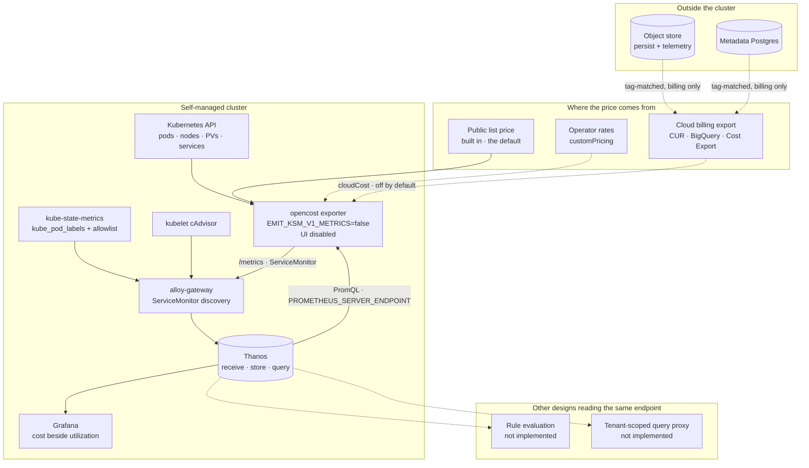

# Cost Visibility: Optional OpenCost for Self-Managed and BYOC



This doc proposes **an optional OpenCost component in the `materialize-monitoring` chart**, so that a self-managed operator can see what a Materialize deployment costs, attributed to the Materialize objects they can act on.
Nothing here is ticketed yet.



OpenCost is a CNCF incubating project that computes Kubernetes cost allocation and exports it as Prometheus metrics.
It is the cost model Kubecost open-sourced and donated, and Kubecost is the commercial product built on top of it.
Two things follow from that lineage.
The data model a customer already running Kubecost is familiar with is this one, and a large part of the public documentation for OpenCost's behaviour is written in Kubecost's terms.

Deploying OpenCost is a subchart, a ServiceMonitor and a values block, and that part of this design is a day of work.

The central claim of this doc is that **deploying OpenCost is the easy half, and making the number mean something is the feature.**
Two things stand between a running OpenCost and a number an operator can act on.
The first is **provenance**: OpenCost's default price for a node is a public list price, which is not what the customer was billed and MUST NOT be presented as though it were.
The second is **attribution**: OpenCost attributes cost to namespaces, pods and containers, and a Materialize operator asks about clusters, replicas and cost centers.
The design that follows is organized around those two, with the deployment treated as a prerequisite rather than as the deliverable.

<!--
Agent note: this doc records decisions and their *why*. When a decision lands in code, update the section and
check the matching row in "Chart-side prerequisites".

Three claims here are load-bearing, verifiable today, and easy to get wrong in either direction:

1. `kube_pod_labels` carries no Materialize identity. The vendored kube-state-metrics subchart defaults
   `metricLabelsAllowlist: []` and this chart does not override it, so the join that attributes cost to a
   cluster or replica does not exist yet. This is also an existing parity gap against Cloud (internal).
2. OpenCost emits its own kube-state-metrics v1 families by default. Do NOT overstate this: the registry's
   outer-`max` de-duplication convention exists because the recommended shape runs several kube-state-metrics
   replicas, and it absorbs a second producer. The reason to disable the copy is that a different
   implementation is not a replica, not that queries would immediately double.
3. Cost is not the first design to read from Thanos. Rule evaluation and the tenant-scoped query proxy both
   do, and neither is implemented. The sizing question is common to all three.

Two things this doc deliberately does not do. It does not restate the BYOC pipeline or the call-home consent
ladder; cost is a metric family that travels on those channels. It does not describe customer deployment
profiles, because this page is public.
-->

## Goals

Functional requirements, framed as value-first user stories.
Priority tags (**Must** / **Should** / **Could**) are relative to the first shipped version.

Four stakeholder classes consume this.

- **Self-managed operators**, who own the cloud bill for a cluster they run and cannot today say how much of it is Materialize.
- **Materialize platform owners inside a customer**, who are asked to justify a cluster, defend a resize, or apportion the platform across the departments using it.
- **Materialize support and field engineering**, who are asked whether a deployment is oversized and answer from utilization alone.
- **Materialize as the operator of BYOC**, where right-sizing decisions are ours to make and the bill lands in an account we provisioned.

- **[Must] As a self-managed operator,** I want cost attributed to a Materialize cluster and replica, so that the number lines up with the object I can resize.
- **[Must] As a self-managed operator,** I want to know where a price came from, so that I do not present a list-price estimate to a finance team as an invoice.
- **[Must] As a self-managed operator,** I want the component to be absent unless I enable it, so that a monitoring upgrade never adds a workload that talks to a billing API.
- **[Must] As a platform owner,** I want cost beside utilization on the same dashboard, so that "this replica is expensive" and "this replica is idle" are one observation rather than two.
- **[Must] As a platform owner tuning a system cluster,** I want the price of a replica size, so that the standing trade between price, performance and reliability is made against all three.
- **[Should] As a self-managed operator,** I want the price reconciled against my actual cloud bill, so that the number survives a conversation with whoever owns that bill.
- **[Should] As a platform owner considering a machine-class upgrade,** I want cost per unit of work across node generations, so that moving to a newer instance type is a measurement rather than a guess.
- **[Should] As a platform owner considering sharding a workload,** I want the cost of one large replica beside the cost of several smaller ones, so that the shape decision includes its price.
- **[Should] As a platform owner in a large company,** I want cost apportioned to the departments using Materialize, so that a chargeback or showback conversation starts from data.
- **[Should] As a self-managed operator,** I want the object store and the metadata database included, so that the number covers the deployment rather than only the part of it that runs in pods.
- **[Should] As a Materialize account team,** I want a total-cost-of-ownership figure that includes the platform supporting Materialize, so that the commercial conversation is honest in both directions.
- **[Should] As Materialize operating BYOC,** I want per-environment cost as a fleet signal, so that an oversized environment is visible as a trend rather than at renewal.
- **[Could] As a platform owner,** I want a cost anomaly to alert, so that a runaway cluster is noticed by the stack rather than by an invoice.
- **[Could] As a platform owner,** I want a right-sizing recommendation, so that the dashboard proposes an action rather than only reporting a number.

## Technical BLUF

- **OpenCost ships as an optional subchart, off by default, enabled by a `cost` tag.** It is a new workload that makes claims about money, and the repository's stated goal is that every component can be turned off.
- **Cost is a metric family, not a product.** OpenCost's exporter writes to `/metrics`, the gateway scrapes it through the ServiceMonitor discovery that already runs, and the number lands in Thanos beside everything else. The OpenCost UI is not installed.
- **Attribution to a Materialize cluster or replica does not work today.** The vendored kube-state-metrics subchart defaults `metricLabelsAllowlist: []`, so `kube_pod_labels` carries no `cluster-id` or `replica-id` and there is nothing to join against. This is an existing parity gap against Cloud (internal), not a new requirement cost invents.
- **Pricing provenance is a declared value, not an inference.** Two sources that matter — list price and reconciled cloud billing — with the source named on every panel that displays a currency figure.
- **The default source is list price, and the default presentation is showback.** A list-price number is directionally correct for comparing two replicas and wrong for anything an auditor reads.
- **OpenCost emits kube-state-metrics v1 families by default and SHOULD be told not to.** The reason is narrower than it first appears: the registry's outer-`max` convention already de-duplicates across kube-state-metrics replicas, so a second producer does not immediately double any answer. A different implementation emitting v1-shaped copies is not a replica, which is why the copy is still wrong to ship.
- **No second Prometheus.** OpenCost reads PromQL back from `PROMETHEUS_SERVER_ENDPOINT`, and Thanos Query serves the Prometheus HTTP API. The bundled Thanos is the endpoint.
- **Three active designs now assume a read path into Thanos and none is implemented** — rule evaluation, the [tenant-scoped query proxy](../20260916-tenant-query-api/), and this one. The sizing question is common to all three and SHOULD be settled once.
- **Cost families belong in the `recommended` tier.** The registry already rolls importance up from the queries that reference a metric, so a cost family carrying an alert reaches `essential` without a second decision.
- **The largest costs in a Materialize deployment may be outside the cluster.** Persist lives in an object store and the metadata backend is a managed Postgres, and neither is a pod. Reaching them means cloud billing integration and a tag contract the downstream Terraform wrappers are the right place to satisfy.
- **The monitoring stack's cost rolls up into infrastructure rather than into a line of its own.** Everything supporting Materialize is part of what Materialize costs, and an itemized observability figure invites a saving measured in tens of dollars and paid for in the next incident.
- **Cost makes an existing dashboard answer a different question.** [Resizing](../../roadmap/#dashboards) is already planned and today would answer "can I"; with cost beside utilization it answers "should I".
- **BYOC is the case where the cost owner and the operator are the same party.** Right-sizing decisions there are Materialize's, which raises the priority of the signal and lowers the consent question that dominates self-managed telemetry.

## Non-goals

- **A cost management product.** This design exposes an existing exporter's output through the dashboards and backends already shipped. Budgets, forecasts, approval flows and invoicing are not in scope.
- **The OpenCost UI.** Grafana is the interface for everything else in this stack, and a second web surface would need its own reachability, persistence and authentication story.
- **Replacing a customer's existing cost tooling.** An operator already running Kubecost, Cloudability or a cloud-native cost console keeps it. Cost is optional on the same terms as every other component here.
- **Currency for capital-expenditure hardware.** On-premises deployments are typically capex, where there is no hourly rate to apply and the useful output is share of a fixed pool rather than a dollar figure. Operator-supplied rates remain available to anyone who has computed an amortization; nothing here computes one.
- **Designing for spot capacity.** The recommended cluster shape is on-demand, and the shipped AWS wrapper pins its Karpenter NodePool accordingly. Spot appears only where Materialize is installed into a cluster somebody else built, and that case is not designed for here.
- **Pricing accuracy Materialize can certify.** The design states where a number came from. Whether a reconciled figure matches an invoice is between the customer and their cloud provider.
- **Cost data crossing to Materialize by default.** In self-managed, cost is a local signal. It travels only on the [call-home ladder](../20260917-call-home-self-managed/) and only at a level the customer chose.
- **Per-query or per-object cost inside Materialize.** Attributing spend to a materialized view rather than to the replica running it needs a model of Materialize's own resource accounting, and that model is upstream work.
- **Rightsizing automation.** Nothing here resizes anything. A recommendation is a **Could**, and acting on one is not proposed at all.
- **Re-specifying the BYOC or call-home channels.** Cost is a metric family that rides those channels at a tier.

## What exists today

| Capability | State | Where |
|---|---|---|
| Container CPU, memory and network usage | ✅ Shipped | cAdvisor scraped from every kubelet by the gateway, ~24.6k `container_*` series on a real cluster |
| Node capacity and utilization | ✅ Shipped | node-exporter subchart, ~282 `node_*` families |
| Kubernetes object state | ✅ Shipped | kube-state-metrics subchart, with `honorLabels: true` |
| De-duplication across kube-state-metrics replicas | ✅ Shipped as a convention | Every aggregating query keeps `instance` in the inner step and collapses it with an outer `max` |
| Requests beside limits, per pod | ✅ Shipped | `infra-nodes` **Pods** tab |
| Node instance type and zone | ⚠️ Partial | Node labels reach `kube_node_labels`; they are deliberately excluded from the Materialize PodMonitors, which copy pod labels only |
| A Prometheus-compatible query endpoint | ✅ Shipped | Thanos Query, reachable in-cluster as a `ClusterIP` Service |
| ServiceMonitor discovery on the collection path | ✅ Shipped | `prometheus.operator.servicemonitors` in the gateway pipeline |
| Metric importance tiers, rolled up from the queries that reference a metric | ✅ Shipped | `metricImportanceHint` plus `metricOverrides`, generated into `pre-rendered/metrics/metric-tiers.yaml` |
| **Any notion of price** | ❌ Absent | Nothing in this repository knows what a CPU-hour costs |
| **Materialize identity on `kube_pod_labels`** | ❌ Absent | The vendored subchart defaults `metricLabelsAllowlist: []`, and this chart does not override it |
| **Object-store and database cost** | ❌ Absent | Both are provisioned by the downstream wrappers and neither is observable as spend |
| **A cost dashboard or cost alerts** | ❌ Absent | No `cost-*` family in the query registry |

Two rows are the design.
`kube_pod_labels` carrying no Materialize identity is what blocks attribution, and it is a one-line values change with a cardinality cost.
Nothing knowing what a CPU-hour costs is what OpenCost supplies, and the whole question is where that price came from.

## Architecture

Dashed edges are optional and absent in the default enabled shape.



Four properties of this diagram carry the design.

**The loop through Thanos is a read, and it is not the only one coming.**
OpenCost queries PromQL to compute allocation over a window, so enabling cost puts a scheduled query load on Thanos Query.
Rule evaluation and the tenant-scoped proxy put their own load on the same endpoint, and neither has landed, so the three are sizing the same component independently.

**OpenCost sits beside kube-state-metrics, not in front of it.**
Both watch the Kubernetes API and both can emit `kube_*` families.
The design disables OpenCost's copy, and that is a property of the architecture rather than a setting because this chart's Kubernetes-object surface assumes one implementation behind however many replicas serve it.

**The price is an input, not a measurement.**
Everything on the left of the diagram is observed; everything in the pricing box is asserted by whoever configured it.
A design that blurs the two produces a dashboard that looks like telemetry and is partly an assumption.

**The out-of-cluster path reaches the bill and never reaches the cluster.**
The object store and the metadata database are visible only through a billing export, matched by tag.
They are dashed for a reason beyond optionality: that half of the number has a different latency, a different accuracy and a different failure mode than the in-cluster half.

## The questions this is asked to answer

Cost visibility is often justified by a generic appeal to efficiency.
The demand here is more specific than that, and the specifics decide what has to be built.

| Question | What it needs beyond a cost number |
|---|---|
| **Is this replica the right size?** | Cost beside utilization, at replica granularity. The standing case, and the sharpest for system clusters, which are continuously tuned across price, performance and reliability |
| **Should we move to a newer machine class?** | Cost per unit of work, compared across node generations. Needs the node's instance type on the series and a stable denominator |
| **Should this workload be sharded?** | The cost of one large replica beside the cost of several smaller ones delivering the same result |
| **Which department is using Materialize?** | Allocation grouped by a customer-chosen ownership label, which is the same join that produces per-cluster cost |
| **What does Materialize actually cost us?** | Everything above, plus the object store, the metadata database, and the platform that supports all of it |

The last row is the one that shapes the rest.
A total-cost conversation that quietly excludes the object store, the database or the monitoring stack is not a total-cost conversation, and a customer who discovers the omission stops trusting the parts that were included.

**Machine-class comparison and sharding are the same measurement in two shapes.**
Both ask what a given amount of work costs under a different arrangement of hardware, and both need a denominator that survives the change.
Choosing that denominator is the hard part and is an [open question](#open-questions); cost per hydrated collection, per byte of maintained state, and per unit of ingest each answer a different version of the question.

**Cost centers are attribution with a different label.**
Apportioning Materialize across departments needs an ownership label on the pods, joined the same way a cluster id is.
Materialize does not supply that label, so the design exposes the join and documents how to add one rather than inventing a convention customers would have to adopt.

## The number and its provenance

A cost figure is a measurement multiplied by a price.
This stack already produces the measurement to a standard it can defend.
The price is supplied from outside and is the part a reader will trust more than it deserves.

**Decision: pricing sources are named, one values key selects one, and the selected source MUST be stated on every panel that renders a currency.**

| Source | What sets the price | Accuracy | Latency | Default |
|---|---|---|---|---|
| `listPrice` | OpenCost's built-in public on-demand rates for the detected cloud and instance type | Directionally correct. Ignores committed-use discounts, enterprise agreements, and anything negotiated | Immediate | ✅ |
| `cloudBilling` | The cloud provider's billing export, reconciled against actual charges | Matches the invoice, within the provider's own granularity | Several hours to a day | |
| `custom` | Operator-supplied hourly rates | Exactly as accurate as the rates supplied | Immediate | |

`listPrice` is the default because it works with no credentials, no cross-account configuration and no extra provisioning.
It is also the source most likely to be wrong, in the customer's favour or against it, so the presentation MUST carry the caveat rather than the release notes.

The statement of provenance belongs in the query definition rather than in prose a panel author writes.
The query registry already supplies both the expression and the description to the panel, so this uses the existing mechanism.

**`cloudBilling` is the source the design is aiming at**, and it is what makes the number defensible in front of a finance team.
`listPrice` is the rung that works on day one.

**`custom` is a narrow case and SHOULD be documented as one.**
It covers an operator with negotiated rates they would rather state than reconcile, and an operator who has computed an amortization for owned hardware.
Neither is the common shape, and the second is rarer than a reading of the OpenCost documentation suggests, because capital-expenditure clusters have no hourly rate to state.

Two consequences of list pricing are worth stating before someone discovers them on a dashboard.

**Committed-use and enterprise discounts are invisible to list pricing.**
A customer with a substantial commitment sees a number higher than they pay and reasonably concludes the dashboard is broken.
This is the common case and it argues for reaching `cloudBilling` sooner than the feature otherwise needs to.

**Relative comparison survives list pricing; absolute figures do not.**
Two replicas on the same instance type compare correctly under any consistent price, which is why right-sizing works on day one and a total-cost conversation does not.

## Attribution: from pods to clusters and replicas

OpenCost attributes cost to the Kubernetes objects it can see.
A Materialize operator does not ask what the `materialize-environment` namespace costs.
They ask what a named cluster costs, whether a replica size is worth it, and which department is responsible for the bill.

Those questions are answerable, and the join that answers them does not exist yet.

**What the labels look like today.**
`clusterd` pods carry `cluster.environmentd.materialize.cloud/cluster-id` and `.../replica-id`, plus the `materialize.cloud/organization-*` set.
The PodMonitors in this repository copy those onto scraped metrics through `podTargetLabels`, which is why every Materialize dashboard can filter by cluster.
OpenCost's allocation metrics carry `namespace`, `pod`, `container` and `node`, and nothing else.

**The blocker stated precisely.**
The bridge between the two is `kube_pod_labels`, which exposes pod labels as `label_*` dimensions.
kube-state-metrics v2 drops pod labels by default and requires `--metric-labels-allowlist` to expose any.
The vendored subchart ships `metricLabelsAllowlist: []` and this chart sets no override, so `kube_pod_labels` today carries name and namespace and nothing that identifies a Materialize object.

**This is an existing parity gap, not a requirement cost invents.**
The equivalent Cloud setup (internal) already carries these labels, and several planned dashboards want the same join for reasons unrelated to price.
The gap is worth closing on its own schedule, and cost is the thing that makes it urgent rather than the thing that makes it necessary.

**Decision: the chart MUST allowlist the Materialize identity labels on pods, and MUST NOT use the wildcard form.**

```yaml
kube-state-metrics:
  metricLabelsAllowlist:
    - pods=[cluster.environmentd.materialize.cloud/cluster-id,cluster.environmentd.materialize.cloud/replica-id,materialize.cloud/organization-name,materialize.cloud/organization-id]
```

A named list, because `pods=[*]` exposes every label on every pod and multiplies the cardinality of a family that already has one series per pod.
The upstream documentation calls out the performance implication of the wildcard directly, and the Cloud setup (internal) carries more labels than it needs, which is the shape to avoid rather than to copy.

An operator MAY extend the list with an ownership label for cost-center allocation.
The chart SHOULD expose the list as a values key rather than hard-coding it, so that extension does not require `additional_values`.

**The join shape**, once the labels are present, is the standard `group_left` against a label-carrier series.
The registry already establishes this pattern for name enrichment through `mz_object_info`, and the cost families follow it rather than inventing a second convention.

**Four levels of attribution are worth exposing**, and they are not the same question.

| Level | Question it answers | Available from |
|---|---|---|
| Namespace | What does Materialize cost on this cluster, against everything else running here | OpenCost alone |
| Cluster | Which of my Materialize clusters is expensive | The `kube_pod_labels` join |
| Replica | Is this replica size worth what it delivers | The same join, plus replica size from the replica's own labels |
| Ownership | Which department or team is responsible for this spend | The same join, on a customer-supplied label |

**Replica is the level where cost becomes actionable**, because a replica size is a thing an operator changes in one statement.
It is actionable today rather than after the upstream hydration and freshness signals land.
System clusters are the clearest case: they are tuned continuously across price, performance and reliability, and today that tuning is a size decision taken with two of those three visible.

## What is in the cluster, and what is not

OpenCost computes the cost of Kubernetes resources: nodes, persistent volumes, load balancers, and the network traffic it can attribute.
A Materialize deployment spends money in two places OpenCost cannot see from inside the cluster.

| Out-of-cluster dependency | Why it matters | Reachable how |
|---|---|---|
| The persist object store | Materialize's durability layer. Storage volume grows with the deployment, and request charges scale with activity | Cloud billing export, matched by resource tag |
| The metadata Postgres | A managed database instance billed hourly whether or not it is busy | Cloud billing export, matched by resource tag |
| The monitoring stack's own telemetry bucket | Loki and Thanos block storage, provisioned by the same wrappers | Cloud billing export, matched by resource tag |
| Cross-zone and egress network charges | A multi-zone deployment pays for traffic between zones | Partly in-cluster, largely billing-export only |

Out-of-cluster attribution in OpenCost works by matching cloud resources to Kubernetes workloads through tags.
That is normally the hard part, because the resources were created by someone who did not know the tag contract existed.

**Materialize owns both ends of this problem**, which is unusual and is the strongest argument for doing it properly.
The downstream per-cloud wrappers provision the buckets and the databases, and they already apply tags.
What is missing is a *known* tag key, stable across clouds, that the cost queries can rely on.

**Decision: the downstream wrappers MUST apply a documented tag contract**, and it is part of the cost feature rather than Terraform housekeeping.
The contract needs a key naming the Materialize deployment and a key naming the component.
Landing it as part of the design means the first customer who enables `cloudBilling` finds their bucket already attributable, rather than discovering that the tags were applied to a different scheme.

This bounds the claim the dashboards may make.
In-cluster cost alone is a real number for a real question, and it is not the cost of running Materialize.
A panel titled as though it were the whole bill while reading only in-cluster allocation is the quiet kind of inaccuracy that ends a feature's credibility, so the two halves MUST be labelled separately until both are configured.

**The monitoring stack rolls up into infrastructure, not into a line of its own.**
Loki, Thanos, their buckets and the collection path are part of what supports Materialize, and so are the operator and the control-plane components.
An itemized "observability costs this much" figure invites a saving measured in tens of dollars against a stack whose absence is paid for during the next incident.
The honest presentation is the platform supporting Materialize as one figure, with the breakdown available to anyone who goes looking rather than offered as the headline.

## Thanos as a read surface

Every component this chart deploys today either writes to the metric store or exposes an endpoint for the gateway to scrape.
Three designs now assume a read path into Thanos, and none of them is implemented.

| Design | Read shape | Status |
|---|---|---|
| Rule evaluation | Continuous evaluation over short windows | Not implemented. `pre-rendered/rules/prometheus/` is empty and `thanos.ruler.enabled` is `false` |
| [Tenant-scoped query proxy](../20260916-tenant-query-api/) | Served reads on behalf of Console and customer Grafana | Not implemented |
| Cost | Scheduled PromQL over allocation windows | This doc |

Against Thanos Query, a long window reaches the store gateway and therefore object storage, which is the expensive path.
The upstream OpenCost documentation is explicit that the exporter does not scale well over long time windows on large clusters.

Three consequences follow, and the first is the important one.

**The sizing question is common to all three and SHOULD be settled once.**
The `thanos-small` profile is sized for a stack whose only reader is a Grafana with a human in front of it.
Three designs independently sizing the same component against that assumption is how a profile ends up wrong for every one of them, and the profile documentation SHOULD state the assumption it was written under.

**The query window is a lever and SHOULD be documented as one.**
A shorter window costs less to compute and answers fewer questions.
The default SHOULD favour the window the dashboards actually use.

**No reader may degrade the rest of the stack.**
This is the isolation property the [BYOC design](../20260813-byoc-observability/#per-destination-isolation-is-a-hard-requirement-not-a-nicety) states for destinations, reached from the read side.
A component issuing expensive queries in a loop SHOULD be visible in the meta-monitoring and SHOULD be sheddable.

## On by default, or not

The repository's convention is that `tags.default` enables the recommended stack, and that a component outside it is one most clusters already have or one not everybody wants.

**Decision: a `cost` tag, not in `default`, in the first version.**

Three reasons, in order of weight.

- **The number is not reconciled by default.** Shipping a list-price figure to everyone who upgrades the chart puts a money number in front of people who did not ask for one and cannot tell how accurate it is.
- **Attribution does not work yet.** Until the `kube_pod_labels` join lands, cost is per-namespace, and per-namespace cost is a weaker answer than the one this design promises.
- **`cloudBilling` introduces public-internet egress.** Nothing else this chart deploys talks to an endpoint outside the cluster in its normal configuration, and that deserves an explicit decision by whoever runs the cluster.

**The intent is to move it into `default` once the number is trustworthy**, which means attribution landed and the pricing source stated on every panel.
Stating the intent matters, because "optional forever" and "optional until it is good" produce different work.

**OpenCost's own footprint is not a reason either way.**
A self-managed Materialize deployment is commonly sized in hundreds of gigabytes of memory, and one more exporter is not a line item against that.
The envelope is still worth measuring, because an unmeasured request is how a workload gets evicted on a full node, and because the upstream default is an evaluation figure rather than a sizing opinion.

**A customer with a solid grasp of their usage SHOULD be able to turn this off and lose nothing**, on the same terms as every other component here.
The limits of the alternatives are worth documenting rather than arguing.
A cloud provider's cost console sees instances, disks and buckets, which is the right granularity for infrastructure and the wrong one for a shared Kubernetes cluster: it cannot say which share of a node a Materialize cluster used, and it has no notion of a replica at all.
That gap is what a Kubernetes-aware cost model closes, and it is the honest case for this feature rather than a claim that the console is deficient.

## Cost in BYOC

BYOC inverts the party structure that makes self-managed cost a delicate feature.

In self-managed the customer owns the bill, operates the cluster, and makes the resize decision.
Materialize's interest in their cost data is secondary, and any of it crossing the boundary is governed by the [call-home ladder](../20260917-call-home-self-managed/).

In BYOC the infrastructure runs in the customer's cloud account and **Materialize operates it**.
Right-sizing is Materialize's decision, taken on the customer's bill, which makes cost an operational signal rather than a courtesy.

Three things follow, and none of them needs new pipeline work.

**Cost is a metric family on a channel that already exists.**
It crosses at an importance tier like everything else, and the tier assignment is the whole integration.

**The tier is `recommended`.**
Cost families power dashboards rather than alerts, which is what the `recommended` tier is for, and the registry rolls a metric up to `essential` on its own if an alert comes to reference it.
That means the tier decision is made once in the family's `metricImportanceHint` and does not need revisiting when cost alerting lands.

**Per-environment cost is the fleet question.**
A single environment's cost is visible to whoever looks at it.
The value of the fleet view is noticing that one environment's cost is drifting against its own history or against comparable environments.
That is the shape of the fleet questions the call-home design names, and it SHOULD reuse whatever answers them rather than building a cost-specific view.

In self-managed, cost sits at the top of the call-home ladder or off it.
Nothing about a customer's spend is required for support, and a support-motivated request for cost data is a harder conversation than a support-motivated request for logs.

## Cost and the dashboards that already exist

Cost is not a dashboard of its own in the first version.
It is a column and a row on dashboards that already answer neighbouring questions, plus one place where it becomes the subject.

| Dashboard | What cost adds |
|---|---|
| [Resizing](../../roadmap/#dashboards) (planned, Day 2) | The change from "can I resize this" to "should I". Cost beside utilization is the decision, and neither half is sufficient alone |
| `infra-nodes` | Node hourly cost beside the capacity and reservation panels already there. The scheduler's promise, the kernel's ceiling, and the price |
| `env-top` | A cost figure per cluster on the Cluster tab, at the level an operator already filters by |
| **Meta-monitoring** (planned) | The platform rollup, presented as infrastructure supporting Materialize rather than as an observability line item |
| A `cost` family in the query registry | The expressions and descriptions, including the pricing-source statement, shared by all of the above |

**The registry entry comes first**, before any panel.
Panels in this repository take both their expression and their prose from the query registry, so a cost family defined once is what keeps the pricing caveat identical everywhere it appears.
A caveat restated by four panel authors is a caveat that will differ in four places.

Cost alerting is deliberately last.
A cost anomaly alert needs a baseline to be meaningful, and the alerting path in this repository [does not evaluate rules yet](../20260917-call-home-self-managed/#nothing-evaluates-alerting-rules-today).

## Chart-side prerequisites

Work in **this** repo, except where noted.
Ordered roughly by dependency.
None of it is ticketed yet.

| Item | Why it is needed | Blocking? |
|---|---|---|
| **`metricLabelsAllowlist` on kube-state-metrics**, naming the Materialize pod labels explicitly and exposed as a values key | `kube_pod_labels` carries no Materialize identity today, so there is nothing to join cost against. Also closes an existing parity gap against Cloud (internal) | **Blocking** for attribution |
| **The OpenCost subchart, its `cost` tag, and its values block** — UI off, Thanos Query as the read endpoint, ServiceMonitor on | The component | **Blocking** |
| **`EMIT_KSM_V1_METRICS=false`**, asserted by a render test | A second implementation emitting v1-shaped `kube_*` families is not a replica, and the de-duplication convention assumes one implementation behind however many replicas serve it | **Blocking** |
| **A NetworkPolicy with an explicit egress set** — DNS, API server, Thanos Query, and the billing endpoint only when `cloudBilling` is on | Every workload here carries one, and this is the first with public-internet egress in a normal configuration | **Blocking** |
| **A `cost` query-registry family** at `metricImportanceHint: recommended`, carrying the expressions, descriptions and pricing-source statement | The caveat has to live in one place or it will differ everywhere it appears, and the tier decision is made once | **Blocking** |
| **The `cost.pricing.source` values surface** — `listPrice`, `cloudBilling`, `custom` — with render-time validation that the selected source has what it needs | A `cloudBilling` selection with no credentials configured renders an empty dashboard with no explanation | **Blocking** |
| **Separate labelling for the in-cluster and out-of-cluster halves** of any total | A panel reading in-cluster allocation and titled as the whole bill is the failure that ends the feature's credibility | **Blocking** |
| **A measured resource envelope**, replacing the upstream evaluation defaults | The upstream request is `10m` / `55Mi` against a `1Gi` limit, which is not a sizing opinion. The absolute cost is immaterial; the eviction risk is not | **Blocking** |
| **Thanos Query sizing guidance for scheduled and served readers**, stated once and referenced by all three designs | The profiles are sized for a Grafana with a human in front of it, and three designs are independently assuming otherwise | **Blocking** for the `thanos-small` shape |
| **A tag contract in the downstream wrappers** (`materialize-terraform-self-managed`), naming deployment and component on every provisioned resource | Out-of-cluster attribution matches by tag, and Materialize provisions both ends | **Blocking** for `cloudBilling` |
| **Terraform variables** for the tag, the pricing source and the billing-integration secret reference, with credentials outside the values | `helm get values` reads values, and they land in state. This follows the [DEP-204](https://linear.app/materializeinc/issue/DEP-204) pattern | Blocking for the Terraform path |
| **A denominator for cost per unit of work**, chosen and documented | Machine-class comparison and sharding both need one, and the choice decides what those panels can claim | Blocking for those two questions |
| Cost panels on `infra-nodes`, `env-top`, and the planned Resizing dashboard | The delivery surface | After the registry family |
| A platform rollup on the planned Meta-monitoring dashboard | The TCO framing, with monitoring inside infrastructure rather than beside it | After Meta-monitoring |
| Documentation for an operator-supplied ownership label | Cost-center allocation is the same join on a label Materialize does not supply | Should land with attribution |
| Cost anomaly alerting | Needs a baseline, and [nothing evaluates rules yet](../20260917-call-home-self-managed/#nothing-evaluates-alerting-rules-today) | After rule evaluation |

## Testing

The kind tiers extend to cover this.
The assertions that matter most are the ones about not breaking what already works.

- **Enabling cost does not change any `kube_*` answer.** Record a set of `kube_pod_*` and `kube_node_*` counts with cost disabled, enable it, and assert the counts are identical. The de-duplication convention is expected to absorb a second producer, and this asserts that rather than assuming it.
- **The de-duplication convention holds across implementations, or the copy is off.** Assert `EMIT_KSM_V1_METRICS=false` on the render, because `max` over two producers is idempotent only while they agree.
- **The default install deploys no OpenCost.** A render assertion, re-checked on every values change, in the same shape as the other default-off components.
- **The exporter's metrics reach Thanos.** A tier-2 assertion that `node_total_hourly_cost` and `container_cpu_allocation` are queryable and non-empty, which proves the ServiceMonitor discovery path rather than the render.
- **The read endpoint is Thanos, and it works.** Assert OpenCost's own query path succeeds against Thanos Query rather than assuming a Prometheus-compatible endpoint behaves like a Prometheus. This is the assertion most likely to fail for an interesting reason.
- **Attribution produces a cluster.** With the label allowlist on, assert that cost joined through `kube_pod_labels` yields a series per Materialize cluster rather than one per namespace.
- **Cardinality does not explode.** Assert the `kube_pod_labels` series count against a bound after the allowlist change, because the failure mode of the wildcard form is a slow one.
- **A misconfigured pricing source fails visibly.** Select `cloudBilling` with no credentials and assert the render refuses or the panel renders an explicit unknown. Assert it does not render zero.
- **The NetworkPolicy permits exactly the egress set.** Including the negative half: with `cloudBilling` off, assert the billing endpoint is not reachable from the pod.
- **Cost does not degrade Thanos for other readers.** Drive the exporter over a long window and assert dashboard query latency stays within its envelope. This is the isolation property, tested from the read side, and it is the test the other two read-path designs will want to reuse.
- **Upgrade preserves the enablement state.** Install with cost off, upgrade across a chart version, and assert it is still off.

## Documentation to update

- A **customer-facing cost page** under `metrics/`: what the number includes, what it does not, the pricing sources and how to select one, what showback means here, and the explicit statement that a list-price figure is not an invoice. This is the page that prevents the most support conversations.
- A **pricing-provenance statement** rendered from the query registry alongside the [Common Alerts](../../../stable-metrics/common-alerts/) page, so the caveat is generated rather than maintained.
- A **cost-center guide**: which label to add, where to add it, and how the allocation query consumes it.
- `operating/production-best-practices.md` — a cost row in the shared responsibility model, and the billing-egress decision in the checklist.
- [Securing](../../../../operating/securing/) — the public-internet egress that `cloudBilling` introduces, and the credential handling for the billing integration.
- `reference/helm/` — the `cost` tag, its values block, and the kube-state-metrics allowlist change with its cardinality note.
- The Thanos sizing profile documentation — the reader assumption the profiles were written under, referenced by all three read-path designs.
- `reference/internal/roadmap.md` — a cost section and a follow-up-documentation entry pointing here.
- The downstream wrappers' documentation, for the tag contract.

## Open questions

- [ ] **Should cost be in `default` once attribution lands, or stay opt-in permanently?** This doc proposes opt-in now and `default` later. The counter-argument is that cost is among the most-asked questions about a self-managed deployment, and an off-by-default feature answers nobody.
- [ ] **What is the denominator for cost per unit of work?** Machine-class comparison and sharding both need one. Cost per hydrated collection, per byte of maintained state, and per unit of ingest each answer a different question, and the choice decides what those panels may claim.
- [ ] **Who owns the Thanos read-path sizing question?** Three designs assume it and none owns it. Settling it inside whichever lands first is how it ends up sized for one reader.
- [ ] **Is the `kube_pod_labels` allowlist worth landing independently of cost?** It closes a parity gap against Cloud (internal) and unblocks any panel wanting to group a Kubernetes-object metric by Materialize cluster. It also adds cardinality to a family that already has one series per pod.
- [ ] **What query window does OpenCost run, and who owns that choice?** A shorter window is cheaper against Thanos and answers fewer questions. Whether it is a values key or a profile depends on how much variation real installs need.
- [ ] **How is the tag contract versioned?** It is a cross-repository interface between the Terraform wrappers and the cost queries, and it is not covered by the [deprecation policy](../20260823-deprecation-policy/), which grades surfaces this repository ships.
- [ ] **Does the platform rollup include the Materialize operator and control-plane components**, or only the workloads this chart deploys? The honest answer is the former, and it requires attributing components this repository does not install.
- [ ] **Should an ownership label be a documented convention or left entirely to the customer?** A convention is easier to support and harder to retrofit onto a company that already has one.
- [ ] **Should a right-sizing recommendation ship at all?** A recommendation a customer follows and regrets is a support burden, and a dashboard that shows cost beside utilization and stops short may be the more defensible product.
- [ ] **What does BYOC do with cost that self-managed does not?** Materialize operating the infrastructure makes right-sizing ours to act on, and whether that becomes an automated signal or an internal dashboard is undecided.
