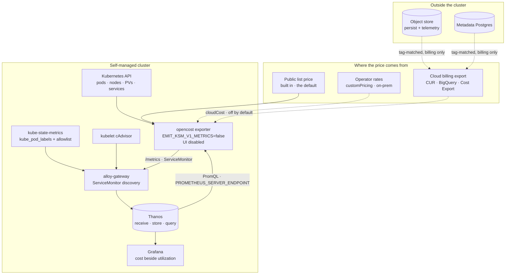

# Cost Visibility: Optional OpenCost for Self-Managed and BYOC



This doc proposes **an optional OpenCost component in the `materialize-monitoring` chart**, so that a self-managed operator can see what a Materialize deployment costs, attributed to the Materialize objects they can act on.
Nothing here is ticketed yet.

OpenCost is a CNCF incubating project that computes Kubernetes cost allocation and exports it as Prometheus metrics.
Deploying it is a subchart, a ServiceMonitor and a values block, and that part of this design is a day of work.

The central claim of this doc is that **deploying OpenCost is the easy half, and making the number mean something is the feature.**
Two things stand between a running OpenCost and a number an operator can act on.
The first is **provenance**: OpenCost's default price for a node is a public list price, which is not what the customer was billed and should never be presented as though it were.
The second is **attribution**: OpenCost attributes cost to namespaces, pods and containers, and a Materialize operator asks about clusters and replicas.
The design that follows is organized around those two, with the deployment treated as a prerequisite rather than as the deliverable.

<!--
Agent note: this doc records decisions and their *why*. When a decision lands in code, update the section and
check the matching row in "Chart-side prerequisites".

Four claims here are load-bearing, verifiable today, and easy to soften by accident:

1. OpenCost emits its own kube-state-metrics v1 families by default. This chart already ships kube-state-metrics,
   so enabling OpenCost without `EMIT_KSM_V1_METRICS=false` double-counts every `kube_*` query in this repository.
2. `kube_pod_labels` carries no Materialize identity today. The vendored kube-state-metrics subchart defaults
   `metricLabelsAllowlist: []` and this chart does not override it, so the join that attributes cost to a cluster
   or replica does not exist yet.
3. OpenCost *reads* PromQL on a schedule. Every other component in this chart writes to the metric store or
   scrapes an exporter; this is the first bundled workload that queries Thanos.
4. The default pricing source is public list price. It is directionally useful and it is not an invoice.

Do not restate the BYOC pipeline work or the call-home consent ladder. Cost is a metric family that travels on
those channels; anything about how the channel works belongs in 20260813-byoc-observability.md and
20260917-call-home-self-managed.md.
-->

## Goals

Functional requirements, framed as value-first user stories.
Priority tags (**Must** / **Should** / **Could**) are relative to the first shipped version.

Four stakeholder classes consume this.

- **Self-managed operators**, who own the cloud bill for a cluster they run and cannot today say how much of it is Materialize.
- **Materialize platform owners inside a customer**, who are asked to justify a cluster or defend a resize and have no number to bring.
- **Materialize support and field engineering**, who are asked whether a deployment is oversized and answer from utilization alone.
- **Materialize as the operator of BYOC**, where right-sizing decisions are ours to make and the bill lands in an account we provisioned.

- **[Must] As a self-managed operator,** I want cost attributed to a Materialize cluster and replica, so that the number lines up with the object I can resize.
- **[Must] As a self-managed operator,** I want to know where a price came from, so that I do not present a list-price estimate to a finance team as an invoice.
- **[Must] As a self-managed operator,** I want the component to be absent unless I enable it, so that a monitoring upgrade never adds a workload that talks to a billing API.
- **[Must] As a self-managed operator,** I want enabling it to not corrupt the metrics I already have, so that turning on cost does not change the answer to an unrelated question.
- **[Must] As a platform owner,** I want cost beside utilization on the same dashboard, so that "this replica is expensive" and "this replica is idle" are one observation rather than two.
- **[Should] As a self-managed operator,** I want the price to be reconciled against my actual cloud bill, so that the number survives a conversation with whoever owns that bill.
- **[Should] As an operator on bare metal or a private cloud,** I want to state my own rates, so that a deployment with no cloud billing API is not excluded.
- **[Should] As a self-managed operator,** I want the cost of the monitoring stack itself to be visible, so that observability spend is a decision rather than a surprise.
- **[Should] As a self-managed operator,** I want the object store and the metadata database included, so that the number covers the deployment rather than only the part of it that runs in pods.
- **[Should] As Materialize operating BYOC,** I want per-environment cost as a fleet signal, so that an oversized environment is visible as a trend rather than at renewal.
- **[Could] As a platform owner,** I want a cost anomaly to alert, so that a runaway cluster is noticed by the stack rather than by an invoice.
- **[Could] As a self-managed operator,** I want a right-sizing recommendation, so that the dashboard proposes an action rather than only reporting a number.

## Technical BLUF

- **OpenCost ships as an optional subchart, off by default, enabled by a `cost` tag.** It is a new workload that makes claims about money, and the repository's stated goal is that every component can be turned off.
- **Cost is a metric family, not a product.** OpenCost's exporter writes to `/metrics`, the gateway scrapes it through the ServiceMonitor discovery that already runs, and the number lands in Thanos beside everything else. The OpenCost UI is not installed.
- **OpenCost emits kube-state-metrics v1 families by default, and this chart already ships kube-state-metrics.** `EMIT_KSM_V1_METRICS=false` is the single most important default in this design, because without it every `kube_*` query in this repository reads double.
- **No second Prometheus.** OpenCost reads PromQL back from `PROMETHEUS_SERVER_ENDPOINT`, and Thanos Query serves the Prometheus HTTP API. The bundled Thanos is the endpoint.
- **This is the first bundled component that reads the metric store on a schedule.** Every other workload here writes or exposes. Thanos Query sizing is a consequence of enabling cost, not a separate concern.
- **Attribution to a Materialize cluster or replica does not work today.** The vendored kube-state-metrics subchart defaults `metricLabelsAllowlist: []`, so `kube_pod_labels` carries no `cluster-id` or `replica-id` and there is nothing to join against.
- **Pricing provenance is a declared value, not an inference.** Three sources — list price, reconciled cloud billing, and operator-supplied custom rates — with the source named on every panel that displays a currency figure.
- **The default source is list price, and the default presentation is showback.** A list-price number is directionally correct for relative comparison between two replicas and wrong for anything an auditor reads.
- **The largest costs in a Materialize deployment may be outside the cluster.** Persist lives in an object store and the metadata backend is a managed Postgres, and neither is a pod. Reaching them means cloud billing integration and a tag contract the downstream Terraform wrappers are the right place to satisfy.
- **The downstream wrappers already provision and tag both.** Materialize owns both ends of the out-of-cluster attribution problem, which is unusual and is the strongest argument for doing this properly rather than shipping in-cluster cost alone.
- **Cost makes an existing dashboard answer a different question.** [Resizing](../../roadmap/#dashboards) is already planned and today would answer "can I"; with cost beside utilization it answers "should I".
- **BYOC is the case where the cost owner and the operator are the same party.** Right-sizing decisions there are Materialize's, which raises the priority of the signal and lowers the consent question that dominates self-managed telemetry.
- **Cost families are registered in the query registry with an importance tier**, so they participate in the existing fan-out selection rather than arriving as an unclassified family that every destination either takes whole or drops.

## Non-goals

- **A cost management product.** This design exposes an existing exporter's output through the dashboards and backends already shipped. Budgets, forecasts, chargeback workflows and approval flows are not in scope.
- **The OpenCost UI.** Grafana is the interface for everything else in this stack, and a second web surface would need its own reachability, persistence and authentication story.
- **Replacing a customer's existing cost tooling.** An operator already running Kubecost, Cloudability or a cloud-native cost console keeps it. Cost is optional on the same terms as every other component here.
- **Pricing accuracy Materialize can certify.** The design states where a number came from. Whether a reconciled figure matches an invoice is between the customer and their cloud provider.
- **Cost data crossing to Materialize by default.** In self-managed, cost is a local signal. It travels only on the [call-home ladder](../20260917-call-home-self-managed/) and only at a level the customer chose.
- **Per-query or per-object cost inside Materialize.** Attributing spend to a materialized view rather than to the replica running it needs a model of Materialize's own resource accounting, and that model is upstream work.
- **Rightsizing automation.** Nothing here resizes anything. A recommendation is a **Could**, and acting on one is not proposed at all.
- **Re-specifying the BYOC or call-home channels.** Cost is a metric family that rides those channels at a tier.

## What exists today

| Capability | State | Where |
|---|---|---|
| Container CPU, memory and network usage | ✅ Shipped | cAdvisor scraped from every kubelet by the gateway, ~24.6k `container_*` series on a real cluster |
| Node capacity and utilization | ✅ Shipped | node-exporter subchart, ~282 `node_*` families |
| Kubernetes object state | ✅ Shipped | kube-state-metrics subchart, with `honorLabels: true` |
| Requests beside limits, per pod | ✅ Shipped | `infra-nodes` **Pods** tab |
| Node instance type and zone | ⚠️ Partial | Node labels reach `kube_node_labels`; they are deliberately excluded from the Materialize PodMonitors, which copy pod labels only |
| A Prometheus-compatible query endpoint | ✅ Shipped | Thanos Query, reachable in-cluster as a `ClusterIP` Service |
| ServiceMonitor discovery on the collection path | ✅ Shipped | `prometheus.operator.servicemonitors` in the gateway pipeline |
| Metric importance tiers driving per-destination selection | ✅ Shipped | `pre-rendered/metrics/metric-tiers.yaml`, generated from the query registry |
| **Any notion of price** | ❌ Absent | Nothing in this repository knows what a CPU-hour costs |
| **Materialize identity on `kube_pod_labels`** | ❌ Absent | The vendored subchart defaults `metricLabelsAllowlist: []`, and this chart does not override it |
| **Object-store and database cost** | ❌ Absent | Both are provisioned by the downstream wrappers and neither is observable as spend |
| **A cost dashboard or cost alerts** | ❌ Absent | No `cost-*` family in the query registry |

Two rows deserve emphasis because they are the design.
`kube_pod_labels` carrying no Materialize identity is what blocks attribution, and it is a one-line values change with a cardinality cost.
Nothing knowing what a CPU-hour costs is what OpenCost supplies, and the whole question is where that price came from.

## Architecture

Dashed edges are optional and absent in the default enabled shape.



Four properties of this diagram carry the design.

**The loop through Thanos is a read, and it is new.**
OpenCost queries PromQL to compute allocation over a window, so enabling cost puts a scheduled query load on Thanos Query that nothing else in this chart produces.
That is a sizing consequence of the feature rather than an unrelated capacity question.

**OpenCost sits beside kube-state-metrics, not in front of it.**
Both watch the Kubernetes API and both can emit `kube_*` families.
The design disables OpenCost's copy, and the reason that is a property of the architecture rather than a setting is that this chart's entire Kubernetes-object surface depends on exactly one producer of those series.

**The price is an input, not a measurement.**
Everything on the left of the diagram is observed; everything in the pricing box is asserted by whoever configured it.
A design that blurs the two produces a dashboard that looks like telemetry and is partly an assumption.

**The out-of-cluster path reaches the bill and never reaches the cluster.**
The object store and the metadata database are visible only through a billing export, matched by tag.
They are dashed for a reason that is not optionality alone: that half of the number has a different latency, a different accuracy and a different failure mode than the in-cluster half.

## The number and its provenance

A cost figure is a measurement multiplied by a price.
This stack already produces the measurement to a standard it can defend.
The price is supplied from outside and is the part a reader will trust more than it deserves.

**Decision: three named pricing sources, one values key, and the source named on every panel that renders a currency.**

| Source | What sets the price | Accuracy | Latency | Default |
|---|---|---|---|---|
| `listPrice` | OpenCost's built-in public on-demand rates for the detected cloud and instance type | Directionally correct. Ignores committed-use discounts, enterprise agreements, spot, and anything negotiated | Immediate | ✅ |
| `custom` | Operator-supplied hourly rates for CPU, memory, storage and load balancers | Exactly as accurate as the rates supplied | Immediate | |
| `cloudBilling` | The cloud provider's billing export, reconciled against actual charges | Matches the invoice, within the provider's own granularity | Several hours to a day | |

`listPrice` is the default because it works with no credentials, no cross-account configuration and no extra provisioning.
It is also the source most likely to be wrong in the customer's favour or against it, so the presentation has to carry the caveat rather than the release notes.

**Every panel rendering a currency states its source in the panel description**, which in this repository means the source is part of the query definition rather than prose a panel author writes.
The query registry already supplies both the expression and the description to the panel, so this is the existing mechanism rather than a new one.

Three consequences follow from the pricing ladder and are worth stating before someone discovers them on a dashboard.

**Spot capacity breaks list pricing hardest.**
The shipped AWS wrapper pins its Karpenter NodePool to `karpenter.sh/capacity-type: on-demand`, which is the case where list price is closest to correct.
An operator who widens that to spot gets a list-price figure that overstates, sometimes by a multiple, and no warning that it has.
Detecting spot capacity from node labels and marking the panel accordingly is cheap and belongs in the first version.

**Committed-use and enterprise discounts are invisible to list pricing** in the other direction.
A customer with a substantial commitment sees a number higher than they pay and reasonably concludes the dashboard is broken.

**On-premises deployments have no list price at all.**
`custom` is the only source that works there, and the rates are a capital-cost amortization the operator computes rather than anything Materialize can supply.
An on-premises install with no rates configured should render an empty cost panel with a description saying why, rather than a zero.

## Attribution: from pods to clusters and replicas

OpenCost attributes cost to the Kubernetes objects it can see.
A Materialize operator does not ask what the `materialize-environment` namespace costs.
They ask what a named cluster costs, whether the `xlarge` replica is worth it, and which of their clusters is the expensive one.

Those questions are answerable, and the join that answers them does not exist yet.

**What the labels look like today.**
`clusterd` pods carry `cluster.environmentd.materialize.cloud/cluster-id` and `.../replica-id`, plus the `materialize.cloud/organization-*` set.
The PodMonitors in this repository copy those onto scraped metrics through `podTargetLabels`, which is why every Materialize dashboard can filter by cluster.
OpenCost's allocation metrics carry `namespace`, `pod`, `container` and `node`, and nothing else.

**The blocker stated precisely.**
The bridge between the two is `kube_pod_labels`, which exposes pod labels as `label_*` dimensions.
kube-state-metrics v2 drops pod labels by default and requires `--metric-labels-allowlist` to expose any.
The vendored subchart ships `metricLabelsAllowlist: []` and this chart sets no override, so `kube_pod_labels` today carries name and namespace and nothing that identifies a Materialize object.

**Decision: allowlist the Materialize identity labels on pods, and only those.**

```yaml
kube-state-metrics:
  metricLabelsAllowlist:
    - pods=[cluster.environmentd.materialize.cloud/cluster-id,cluster.environmentd.materialize.cloud/replica-id,materialize.cloud/organization-name,materialize.cloud/organization-id]
```

A named list rather than `pods=[*]`, because the wildcard form exposes every label on every pod and multiplies the cardinality of a family that already has one series per pod.
The upstream documentation calls out the performance implication of the wildcard directly.

This change is useful on its own, which is an argument for landing it ahead of the rest.
Any panel wanting to group a Kubernetes-object metric by Materialize cluster needs the same join, and several planned dashboards will.

**The join shape**, once the labels are present, is the standard `group_left` against a label-carrier series.
The registry already establishes this pattern for name enrichment through `mz_object_info`, and the cost families follow it rather than inventing a second convention.

**Three levels of attribution are worth exposing**, and they are not the same question.

| Level | Question it answers | Available from |
|---|---|---|
| Namespace | What does Materialize cost on this cluster, against everything else running here | OpenCost alone |
| Cluster | Which of my Materialize clusters is expensive | The `kube_pod_labels` join |
| Replica | Is this replica size worth what it delivers | The same join, plus replica size from the replica's own labels |

Replica is the level where cost becomes actionable, because a replica size is a thing an operator changes in one statement.
It is also the level where cost beside hydration and freshness tells a complete story, and those signals are still [gated upstream](../../roadmap/#metrics-contract-upstream-dependency).

## What is in the cluster, and what is not

OpenCost computes the cost of Kubernetes resources: nodes, persistent volumes, load balancers, and the network traffic it can attribute.
A Materialize deployment spends money in two places OpenCost cannot see from inside the cluster.

| Out-of-cluster dependency | Why it matters | Reachable how |
|---|---|---|
| The persist object store | Materialize's durability layer. Storage volume grows with the deployment, and request charges scale with activity | Cloud billing export, matched by resource tag |
| The metadata Postgres | A managed database instance billed hourly whether or not it is busy | Cloud billing export, matched by resource tag |
| The monitoring stack's own telemetry bucket | Loki and Thanos block storage, provisioned by the same wrappers | Cloud billing export, matched by resource tag |
| Cross-zone and egress network charges | A multi-zone deployment pays for traffic between zones | Partly in-cluster, largely billing-export only |

Out-of-cluster attribution in OpenCost works by matching cloud resources to Kubernetes workloads through tags.
That is normally the hard part, because the resources were created by someone who did not know the tag contract existed.

**Materialize owns both ends of this problem**, which is unusual and is the strongest argument for doing it properly.
The downstream per-cloud wrappers provision the buckets and the databases, and they already apply tags.
What is missing is a *known* tag key, stable across clouds, that the cost queries can rely on.

**Decision: define a tag contract in the downstream wrappers, and treat it as part of the cost feature rather than as Terraform housekeeping.**
The contract needs a key naming the Materialize deployment and a key naming the component.
Making it part of the design means the first customer who enables `cloudBilling` finds their bucket already attributable, rather than discovering that the tags were applied to a different scheme.

This bounds the claim the dashboards can make.
In-cluster cost alone is a real number for a real question, and it is not the cost of running Materialize.
A panel titled as though it were the whole bill while reading only in-cluster allocation is the kind of quiet inaccuracy that ends a feature's credibility, so the two halves are labelled separately until both are configured.

## Deploying it: the opinionated defaults

Upstream defaults are tuned for a standalone evaluation install with its own Prometheus.
Almost every one of them is wrong in an umbrella chart that already ships the surrounding components.

**Decision: `opencost/opencost-helm-chart` as the subchart**, rather than the minimal `prometheus-opencost-exporter` chart in the prometheus-community repository.

| | `opencost/opencost` | `prometheus-community/prometheus-opencost-exporter` |
|---|---|---|
| Registry | `https://opencost.github.io/opencost-helm-chart`, a new repository entry | `oci://ghcr.io/prometheus-community/charts`, already registered here |
| Cloud billing integration | Supported (`cloudCost`, `cloudIntegrationSecret`) | Not exposed |
| Custom pricing | Supported (`customPricing`) | Not exposed |
| NetworkPolicy | Shipped, default off | Not shipped |
| UI | Shipped, default on and disableable | Absent by construction |

The community chart is the better registry fit and cannot express the pricing sources this design is organized around.
Choosing it would mean the reconciliation path lives in `additional_values` forever, which is where a feature goes to stop being supported.
The cost is a new `https://` repository entry for `bin/helm-deps.sh` to register, which is the same shape as the two already there.

**The defaults, and why each one differs from upstream.**

| Setting | This chart | Upstream | Why |
|---|---|---|---|
| `EMIT_KSM_V1_METRICS` | `false` | Emits them | This chart ships kube-state-metrics. Two producers of `kube_pod_*` double every count in this repository |
| `opencost.ui.enabled` | `false` | `true` | Grafana is the interface. A second web surface needs its own reachability, persistence and auth |
| `opencost.prometheus.internal` | Disabled, pointed at Thanos Query | An in-cluster `prometheus-server` | There is no Prometheus here. Thanos Query serves the Prometheus HTTP API |
| `opencost.metrics.serviceMonitor.enabled` | `true` | `false` | The gateway discovers ServiceMonitors. This is the entire collection story |
| `networkPolicies.enabled` | `true`, with an explicit egress set | `false` | Every workload in this chart carries one |
| `priorityClassName` | `monitoring-scalable` | Unset | Matches kube-state-metrics. Cost is not load-bearing for the stack's own health |
| `opencost.cloudCost.enabled` | `false` | `false` | Agrees with upstream. Turning it on means credentials and a billing export |
| Resource requests | Sized against a measured install | `cpu: 10m`, `memory: 55Mi`, `memory` limit `1Gi` | The upstream request is an evaluation default and the gap to the limit is 19× |

**The NetworkPolicy egress set is where this component differs from every other one here.**
kube-state-metrics reaches DNS and the API server, and that closed set is what made restricting its egress safe.
OpenCost needs DNS, the API server, and Thanos Query.
With `cloudBilling` enabled it additionally needs the cloud provider's billing endpoint, which makes it **the first workload this chart deploys with egress to the public internet as part of its normal operation.**
That is worth stating in the customer-facing documentation rather than discovering in a policy review, and it is an argument for the billing integration staying opt-in on its own key rather than riding the component's enablement.

**Resource sizing is measured, not assumed.**
OpenCost's footprint scales with the number of Kubernetes objects it watches and with the query windows it computes, and the upstream request-to-limit gap suggests upstream knows the request is not a real number.
The first version sizes against the tier-2 cluster and a real install, the same way the rest of this chart's envelopes were established.

## Reading back into Thanos is a new kind of load

Every other component in this chart either writes to the metric store or exposes an endpoint for the gateway to scrape.
OpenCost does both, and the read half has no precedent here.

OpenCost computes allocation by issuing PromQL over a window, on a schedule, against the endpoint named in `PROMETHEUS_SERVER_ENDPOINT`.
Against Thanos Query, a long window reaches the store gateway and therefore object storage, which is the expensive path.
The upstream documentation is explicit that the exporter does not scale well over long time windows on large clusters.

Three consequences follow.

**Thanos Query sizing is part of enabling cost.**
The `thanos-small` profile is sized for a stack whose only reader is Grafana with a human in front of it.
A scheduled reader changes that, and the profile documentation should say so rather than leaving an operator to discover it as query latency on an unrelated dashboard.

**The query window is a lever and should be a documented one.**
A shorter window costs less to compute and answers fewer questions.
The default should favour the window the dashboards actually use.

**Cost must not be able to degrade the rest of the stack.**
This is the same isolation property the [BYOC design](../20260813-byoc-observability/#per-destination-isolation-is-a-hard-requirement-not-a-nicety) states for destinations, reached from the read side.
An OpenCost instance issuing expensive queries in a loop should be visible in the meta-monitoring and should be sheddable, and the first version at minimum documents the failure mode.

## On by default, or not

The repository's convention is that `tags.default` enables the recommended stack, and that a component outside it is one most clusters already have or one not everybody wants.

**Decision: a `cost` tag, not in `default`, in the first version.**

Four reasons, in order of weight.

- **The number is not reconciled by default.** Shipping a list-price figure to everyone who upgrades the chart puts a money number in front of people who did not ask for one and cannot tell how accurate it is.
- **It reads from Thanos on a schedule.** Turning it on for every install changes the sizing envelope of a component every other feature depends on.
- **It is the only workload with billing-API egress in its configured shape.** That deserves an explicit decision by whoever runs the cluster.
- **Attribution does not work yet.** Until the `kube_pod_labels` join lands, cost is per-namespace, and per-namespace cost is a weaker answer than the one this design promises.

**The intent is to move it into `default` once the number is trustworthy**, which means: attribution landed, the pricing source stated on every panel, and the resource envelope measured.
Stating the intent matters, because "optional forever" and "optional until it is good" produce different work.

The counter-argument is real and is recorded as an [open question](#open-questions).
Cost is the question customers ask most often about a self-managed deployment, and a feature nobody enables answers nobody.

## Cost in BYOC

BYOC inverts the party structure that makes self-managed cost a delicate feature.

In self-managed the customer owns the bill, operates the cluster, and makes the resize decision.
Materialize's interest in their cost data is secondary, and any of it crossing the boundary is governed by the [call-home ladder](../20260917-call-home-self-managed/).

In BYOC the infrastructure runs in the customer's cloud account and **Materialize operates it**.
Right-sizing is Materialize's decision, taken on the customer's bill, which makes cost an operational signal rather than a courtesy.

Three things follow, and none of them needs new pipeline work.

**Cost is a metric family on a channel that already exists.**
It crosses at an importance tier like everything else, and the tier assignment is the whole integration.

**The tier assignment is a real decision rather than a formality.**
Cost families are low-volume and high-value for a fleet view, which argues for a tier that crosses early.
They also carry node instance types and counts, which is infrastructure detail about a customer's account, which argues the other way.

**Per-environment cost is the fleet question.**
A single environment's cost is visible to whoever looks at it; the value of the fleet view is noticing that one environment's cost is drifting against its own history or against comparable environments.
That is the same shape as the fleet questions the call-home design names, and it should reuse whatever answers them rather than building a cost-specific view.

In self-managed, cost sits at the top of the ladder or off it.
Nothing about a customer's spend is required for support, and a support-motivated request for cost data is a harder conversation than a support-motivated request for logs.

## Cost and the dashboards that already exist

Cost is not a dashboard of its own in the first version.
It is a column and a row on dashboards that already answer neighbouring questions, plus one place where it becomes the subject.

| Dashboard | What cost adds |
|---|---|
| [Resizing](../../roadmap/#dashboards) (planned, Day 2) | The change from "can I resize this" to "should I". Cost beside utilization is the decision, and neither half is sufficient alone |
| `infra-nodes` | Node hourly cost beside the capacity and reservation panels already there. The scheduler's promise, the kernel's ceiling, and the price |
| `env-top` | A cost figure per cluster on the Cluster tab, at the level an operator already filters by |
| **Meta-monitoring** (planned) | What the monitoring stack costs. An honest answer to a question customers ask about observability spend |
| A `cost` family in the query registry | The expressions and descriptions, including the pricing-source statement, shared by all of the above |

**The registry entry comes first**, before any panel.
Panels in this repository take both their expression and their prose from the query registry, so a cost family defined once is what keeps the pricing caveat identical everywhere it appears.
A caveat restated by four panel authors is a caveat that will differ in four places.

Cost alerting is deliberately last.
A cost anomaly alert is straightforward to write and needs a baseline to be meaningful, and the alerting path in this repository [does not evaluate rules yet](../20260917-call-home-self-managed/#nothing-evaluates-alerting-rules-today).

## Chart-side prerequisites

Work in **this** repo, except where noted.
Ordered roughly by dependency.
None of it is ticketed yet.

| Item | Why it is needed | Blocking? |
|---|---|---|
| **`EMIT_KSM_V1_METRICS=false` on the OpenCost exporter**, asserted by a render test | This chart ships kube-state-metrics. Two producers of `kube_pod_*` double every count in this repository, silently and plausibly | **Blocking** |
| **`metricLabelsAllowlist` on kube-state-metrics**, naming the Materialize pod labels explicitly | `kube_pod_labels` carries no Materialize identity today, so there is nothing to join cost against | **Blocking** for attribution |
| **The OpenCost subchart, its tag, and its values block** — UI off, Thanos Query as the read endpoint, ServiceMonitor on | The component | **Blocking** |
| **A NetworkPolicy with an explicit egress set** — DNS, API server, Thanos Query, and the billing endpoint only when `cloudBilling` is on | Every workload here carries one, and this is the first with public-internet egress in a normal configuration | **Blocking** |
| **A `cost` query-registry family** carrying the expressions, the descriptions and the pricing-source statement | The caveat has to live in one place or it will differ everywhere it appears | **Blocking** |
| **The `cost.pricing.source` values surface** — `listPrice`, `custom`, `cloudBilling` — with render-time validation that the selected source has what it needs | A `cloudBilling` selection with no credentials configured renders an empty dashboard with no explanation | **Blocking** |
| **A measured resource envelope**, replacing the upstream evaluation defaults | The upstream request is `10m` / `55Mi` against a `1Gi` limit, which is not a sizing opinion | **Blocking** |
| **Thanos Query sizing guidance for a scheduled reader**, and a note on the sizing profiles | The profiles are sized for Grafana with a human in front of it | **Blocking** for the `thanos-small` shape |
| **A spot-capacity detector**, marking panels where list pricing does not apply | Spot is where list pricing is wrong by a multiple, with no indication on the panel | **Blocking** for `listPrice` honesty |
| **An empty-state for on-premises installs with no rates configured** | A zero and an unknown must not look the same | **Blocking** for on-prem |
| **A tag contract in the downstream wrappers** (`materialize-terraform-self-managed`), naming deployment and component on every provisioned resource | Out-of-cluster attribution matches by tag, and Materialize provisions both ends | **Blocking** for `cloudBilling` |
| **Terraform variables** for the tag, the pricing source and the billing-integration secret reference, with credentials outside the values | `helm get values` reads values, and they land in state. This follows the [DEP-204](https://linear.app/materializeinc/issue/DEP-204) pattern | Blocking for the Terraform path |
| **An importance tier for the cost families** | Otherwise every destination takes them whole or drops them, including the BYOC and call-home channels | Blocking for BYOC |
| Cost panels on `infra-nodes`, `env-top`, and the planned Resizing dashboard | The delivery surface | After the registry family |
| A cost row on the planned Meta-monitoring dashboard | What the stack costs, which is a question customers ask | After Meta-monitoring |
| Cost anomaly alerting | Needs a baseline, and [nothing evaluates rules yet](../20260917-call-home-self-managed/#nothing-evaluates-alerting-rules-today) | After rule evaluation |

## Testing

The kind tiers extend to cover this.
The assertions that matter most are the ones about not breaking what already works.

- **Enabling cost does not change any `kube_*` answer.** Record a set of `kube_pod_*` and `kube_node_*` counts with cost disabled, enable it, and assert the counts are identical. This is the double-emission failure, and it is the one that would present as a plausible wrong number rather than as an error.
- **The default install deploys no OpenCost.** A render assertion, re-checked on every values change, in the same shape as the other default-off components.
- **The exporter's metrics reach Thanos.** A tier-2 assertion that `node_total_hourly_cost` and `container_cpu_allocation` are queryable and non-empty, which proves the ServiceMonitor discovery path rather than the render.
- **The read endpoint is Thanos, and it works.** Assert OpenCost's own query path succeeds against Thanos Query rather than assuming that a Prometheus-compatible endpoint is a Prometheus. This is the assertion most likely to fail for an interesting reason.
- **Attribution produces a cluster.** With the label allowlist on, assert that cost joined through `kube_pod_labels` yields a series per Materialize cluster rather than one per namespace.
- **Cardinality does not explode.** Assert the `kube_pod_labels` series count against a bound after the allowlist change, because the failure mode of the wildcard form is a slow one.
- **A misconfigured pricing source fails visibly.** Select `cloudBilling` with no credentials and assert the render refuses or the panel renders an explicit unknown. Assert it does not render zero.
- **The NetworkPolicy permits exactly the egress set.** Including the negative half: with `cloudBilling` off, assert the billing endpoint is not reachable from the pod.
- **Cost does not degrade Thanos for other readers.** Drive the exporter over a long window and assert dashboard query latency stays within its envelope. This is the isolation property, tested from the read side.
- **Upgrade preserves the enablement state.** Install with cost off, upgrade across a chart version, and assert it is still off.

## Documentation to update

- A **customer-facing cost page** under `metrics/`: what the number includes, what it does not, the three pricing sources and how to select one, what "showback" means here, and the explicit statement that a `listPrice` figure is not an invoice. This is the page that prevents the most support conversations.
- A **pricing-provenance statement** rendered from the query registry alongside the [Common Alerts](../../../stable-metrics/common-alerts/) page, so the caveat is generated rather than maintained.
- `operating/production-best-practices.md` — a cost row in the shared responsibility model, and the billing-egress decision in the checklist.
- [Securing](../../../../operating/securing/) — the public-internet egress that `cloudBilling` introduces, and the credential handling for the billing integration.
- `reference/helm/` — the `cost` tag, its values block, and the kube-state-metrics allowlist change with its cardinality note.
- The Thanos sizing profile documentation — that a scheduled reader changes the envelope.
- `reference/internal/roadmap.md` — a cost section and a follow-up-documentation entry pointing here.
- The downstream wrappers' documentation, for the tag contract.

## Open questions

- [ ] **Should cost be in `default` once attribution lands, or stay opt-in permanently?** This doc proposes opt-in now and `default` later. The counter-argument is that cost is the most-asked question about a self-managed deployment, and an off-by-default feature answers nobody. Measuring how many installs enable it would settle it, which requires the [call-home heartbeat](../20260917-call-home-self-managed/) to exist.
- [ ] **Which importance tier do cost families get?** Low volume and high fleet value argue for crossing early. Node instance types and counts are infrastructure detail about a customer's account, and argue the other way.
- [ ] **Is the `kube_pod_labels` allowlist worth landing independently of cost?** It unblocks any panel wanting to group a Kubernetes-object metric by Materialize cluster, and several planned dashboards will want exactly that. It also adds cardinality to a family that already has one series per pod.
- [ ] **What query window does OpenCost run, and who owns that choice?** A shorter window is cheaper against Thanos and answers fewer questions. Whether it is a values key or a profile depends on how much variation real installs need.
- [ ] **Does the cost of the monitoring stack belong on the same dashboard as the cost of Materialize?** Showing it is honest and it puts a number on observability that somebody will use to argue against it. Not showing it invites the question anyway.
- [ ] **How is the tag contract versioned?** It is a cross-repository interface between the Terraform wrappers and the cost queries, and it is not covered by the [deprecation policy](../20260823-deprecation-policy/), which grades surfaces this repository ships.
- [ ] **Is per-replica cost meaningful before hydration and freshness land?** Cost beside utilization is a weaker argument than cost beside whether the replica is keeping up, and those signals are [gated upstream](../../roadmap/#metrics-contract-upstream-dependency).
- [ ] **Does OpenCost's own resource footprint scale with environment count or with cluster size?** A Materialize deployment with many small environments and one with a few large ones present differently to an object watcher, and the sizing envelope should be measured against the shape customers actually run.
- [ ] **Should a right-sizing recommendation ship at all?** A recommendation that a customer follows and regrets is a support burden, and a dashboard that shows cost beside utilization and stops short may be the more defensible product.
- [ ] **Is Kubecost's or a cloud console's presence a reason to skip this?** A customer already running cost tooling gains the Materialize attribution and nothing else, which may be the whole value or may not justify a second exporter.
- [ ] **What does BYOC do with cost that self-managed does not?** Materialize operating the infrastructure makes right-sizing ours to act on, and whether that becomes an automated signal or an internal dashboard is undecided.
