# Secret Filtering: A Last Line of Defense for Stored and Egressed Logs



This doc proposes a **last line of defense against credentials in logs**.
Every log line the gateway receives passes a secret filter before it is parsed or stored.
Every line bound for a Materialize control plane, over [BYOC](../20260813-byoc-observability/) or
[call-home](../20260917-call-home-self-managed/), passes a second and stricter filter on its own branch, immediately before the writer.
It is the credentials half of [DEP-220](https://linear.app/materializeinc/issue/DEP-220).
The BYOC design applies pattern redaction
["as defense in depth rather than as the primary control"](../20260813-byoc-observability/#allowlist-not-denylist) and leaves it
unspecified; this doc specifies it.

Alloy promoted `loki.secretfilter` to general availability in v1.20.0.
The component wraps the Gitleaks detector and its default rule set, so the mechanism is a dependency rather than a project.
What this doc settles is where the filter runs, which rules it runs, what it deliberately ignores, how anyone can tell that it is working,
and which log levels may leave the cluster at all.

The central claim is that **the filter has to run before the pipeline reads the line, and it has to prove continuously that it ran.**
`loki.secretfilter` scans the log line and nothing else.
The gateway's first act of parsing is to copy substrings of that line into structured metadata and labels.
A filter placed after parsing therefore redacts the line and leaves the copies.
A filter that a refactor has routed around looks exactly like a filter with nothing to redact, which is why the design carries a canary.

A second claim shapes the rules.
**A false negative and a false positive cost different amounts on each side of the boundary, so the two sides run different rule sets.**
A credential missed in the customer's own Loki is readable by everyone with Loki access for the retention period.
A credential missed on the egress branch is in another company's systems, where the customer cannot recall it.
The customer-side filter is tuned so that redactions stay rare enough to be read, and the egress filter trades more false positives for fewer misses.

The rule choices below are measured rather than argued.
A corpus of Materialize-shaped log lines was run through the Gitleaks v8.30.1 detector that Alloy v1.20.0 embeds, with decoding off as Alloy
leaves it.
[The default rules miss](#what-the-default-rules-miss) the metadata-database URL, `Authorization` headers, presigned-URL signatures, a
truncated private key, and any credential inside an escaped JSON string, which is where a Rust `Debug` dump lands in a JSON log.

<!-- more -->


The keywords carry the obligations an implementation takes on.
They appear on the placement of each filter, on its configuration, and on the handful of settings whose obvious value fails open.

<!--
Agent note: this doc records decisions and their *why*. When a decision lands in code, update the section and
check the matching row in "Chart-side prerequisites".

Seven claims here are load-bearing and easy to soften by accident:
  1. loki.secretfilter scans the line only, and the gateway copies the line into structured metadata while
     parsing. That is the whole argument for the ingest filter sitting before inputProcessor.
  2. Identifiers are allowlisted by field name, never by value shape. A v4 UUID is a working bearer credential
     in systems that issue it as one. The upstream Alloy docs suggest a UUID shape allowlist; this doc rejects it.
  3. The runtime canaries are matched only by rules of our own and contain no rule keyword. A provider-shaped
     canary pages the customer's own security team, because their scanners read the same container logs.
     One canary per layer, because ingest redacts its canary before the egress branch forks.
  4. Elevation never relaxes the secret filter. It relaxes reduction (levels, classes, bodies).
  5. The egress level gate is an allowlist of levels. An unparsed TRACE line is UNKNOWN.
  6. Sampling (rate < 1.0) is confined to the bulk tier, and nothing from the bulk tier crosses. Queueing is
     the risk sampling exists for; do not "fix" it by allowing sampled lines to cross.
  7. stage.luhn's skip_regex keys on the leading 1 of epoch timestamps and expires in May 2033.

The corpus results were measured with the Gitleaks v8.30.1 CLI at --max-decode-depth 0. The CLI defaults to 5
and finds things Alloy does not. Re-measure with the Alloy binary once the harness in "Testing" exists, and
update the table rather than hedging it.

The allowlist, class and body mechanism for the egress branch belongs to 20260813-byoc-observability.md.
Reference it; do not restate it here. This doc revises the `elevated` row of 20260917-call-home-self-managed.md
and narrows BYOC's "redaction attaches to the destination" for credentials (see "Positions this revises").
roadmap.md's BYOC section is updated to say so; keep the two in sync.
-->

## Goals

Functional requirements, framed as value-first user stories.
Each describes *what* a user needs and *why it matters*; the [Technical BLUF](#technical-bluf) and the sections below describe *how* it is delivered.
Priority tags (**Must** / **Should** / **Could**) are relative to the first shipped version.

Five stakeholder classes consume this:

- **Customers' security and compliance reviewers**, who decide whether logs may be stored centrally and whether any may leave.
- **Operators of an install**, who debug with the same logs the filter edits.
- **Materialize support and SRE**, who read the egressed copy during an escalation.
- **Materialize security**, who are accountable for what the control plane holds.
- **Maintainers of this repo**, who upgrade Alloy on Renovate's schedule rather than on the rule set's.

- **[Must] As a customer's security reviewer,** I want every log line to pass a credential filter before it is stored, so that a token a
  component logs by mistake is not searchable in Loki for the full retention.
- **[Must] As a customer's security reviewer,** I want the copy that leaves for Materialize to pass a stricter filter than the copy that
  stays, so that the disclosure I agreed to is not widened by a logging bug.
- **[Must] As a customer's security reviewer,** I want to be told when the filter redacted something, so that the component is fixed at the
  source and the credential is rotated.
- **[Must] As an operator,** I want continuous proof that the filter is in the path, so that a change that routes around it is noticed in
  minutes rather than at an audit.
- **[Must] As an operator,** I want the filter never to be the reason logs queue, so that protecting some lines never costs me all of them.
- **[Must] As an operator,** I want the identifiers Materialize logs constantly left intact, so that redaction does not destroy the
  correlation I debug with.
- **[Must] As Materialize support,** I want the placeholder to name what was redacted, so that "a credential was here" is still evidence.
- **[Must] As a maintainer,** I want an Alloy upgrade that changes the default rules to fail CI when it loses a detection or gains a false
  positive on our corpus, so that detection does not drift on a dependency bump.
- **[Should] As Materialize security,** I want a backstop at the control-plane ingress that Materialize can update without a customer upgrade,
  so that version skew does not decide what Materialize holds.
- **[Should] As Materialize support on an escalation,** I want `DEBUG` and `TRACE` from named components for a bounded window, so that a hard
  case is tractable without a standing increase in what crosses.
- **[Should] As a customer's security reviewer,** I want to read the rules that run, so that "secrets are redacted" is a file I can review
  rather than a sentence.
- **[Could] As an operator,** I want to add rules for my own credential formats, so that secrets specific to my environment are covered by the
  same mechanism.

## Technical BLUF

- **`loki.secretfilter` is GA in Alloy v1.20.0**, at release candidate as of this writing, and public preview in the pinned v1.19.2.
  Public-preview components are acceptable here, and the chart sets `stabilityLevel` to the highest level its components allow.
  v1.20.0 is expected to ship before this design is implemented, so the gateway is expected to stay at `generally-available`.
  If it does not, the gateway runs at `public-preview` until it does.
- **It scans `entry.Line` and nothing else.** Labels and structured metadata are never scanned.
  The gateway copies `msg`, `error`, `path`, `query`, `flow` and more out of the line into structured metadata, so **the ingest filter runs
  after the multi-line merge and before any parsing**, and everything downstream is derived from redacted text.
- **Credential filtering is the one redaction that attaches to the pipeline.** BYOC attaches redaction to the destination so that the customer's
  copy is never degraded to protect Materialize's.
  A credential in the customer's own Loki is the customer's exposure, so removing it protects their copy rather than degrading it.
- **Four layers, three of them here.** Redaction at the source is upstream's.
  The **ingest** filter covers every stored line and is on by default.
  The **egress** filter runs on each control-plane branch, stricter and fail-closed, and cannot be disabled while that branch exists.
  The **backstop** runs at the control-plane ingress on rules Materialize updates on its own schedule.
- **The default rules miss the credentials Materialize deployments actually carry.** The metadata-database and persist URLs, `Authorization`
  headers, presigned-URL signatures, truncated PEM keys, and anything inside an escaped JSON string all pass the Gitleaks defaults.
  Seven Materialize rules close those gaps on the corpus.
- **Identifiers are allowlisted by field name, never by value shape.** A bare UUID, an environment ID or a resource-name prefix matches no
  keyword rule.
  Where a UUID follows a credential-named key, the name decides.
  The Gitleaks defaults themselves carry rules for UUID-shaped credentials from Heroku, HubSpot, Snyk and others.
- **The egress filter drops the entropy floor on credential-named keys.** That floor is the upstream generic rule's false-positive guard, and
  it is exactly what lets a human-chosen password through.
- **Log queueing is a larger risk than an unscanned `DEBUG` line.** A filter slower than its input back-pressures the whole pipeline and
  turns into loss on every stream.
  So `DEBUG` and `TRACE` form a bulk tier that MAY be sampled below `rate = 1.0`, after cheaper levers run out.
  Nothing sampled ever crosses.
- **Payment card numbers are in scope, through `stage.luhn`.** It is a checksum over digit runs and costs little.
  Left at its defaults it redacts one in ten of the millisecond timestamps Materialize logs as frontiers, so it ships with a `skip_regex`
  for epoch timestamps.
- **A canary per layer proves each filter runs.** Each is a fixed, published string in the spirit of the EICAR test file, matched by a rule of
  our own and by no third-party scanner, free of every rule keyword, and emitted on a schedule by a purpose-built `mz-monitoring-canary`
  through the same path as Materialize's logs.
  Detected means the filter is in the path.
  Found verbatim in a store means a path bypassed it.
  One canary cannot serve both layers, because the ingest filter redacts it before the egress filter sees it.
- **A redaction is a `notice` alert, and it means the source leaked.** The filter protects the stores, not the node.
  The raw line remains in the container log file, in `kubectl logs`, and in any other agent reading those files, so the runbook is
  fix-at-source and rotate.
- **The placeholder names the rule and carries no hash.** `$SECRET_HASH` is an unsalted SHA-1 of the secret, which confirms any guess.
  The default `redact_percent` leaves the first fifth of the secret in the line.
- **`TRACE` and `DEBUG` never cross in a standing configuration.** They cross inside an `elevated` window scoped to named components, and the
  elevation MUST NOT relax the secret filter.
  This revises the call-home design's `elevated` row, which lists "relaxed redaction".
- **Two paths print raw lines today.** The gateway's sampled debug tap is fed raw input in parallel with the processor, and live debugging on
  the filter itself prints each line before and after redaction.

## Non-goals

- **Customer data that is not a credential or a card number.** Object names, query text, source and sink names, and other personal data
  belong to DEP-220's allowlist and identifier hashing in the [BYOC design](../20260813-byoc-observability/#redaction).
  Alloy's own documentation states that PII is out of scope for `loki.secretfilter`.
  [Card numbers](#payment-card-numbers) are the exception, because a separate stage redacts them for almost nothing.
- **Replacing redaction at the source.** Materialize components not logging credentials is upstream work in the `materialize` repo.
  This design catches what escapes it and reports the escape.
- **The node's copy.** Container runtimes write log files before any collector reads them.
  Nothing in a log pipeline can redact those files, `kubectl logs`, or a third-party agent reading them.
- **Metrics.** A credential-shaped label value on a metric is a different surface, governed by the metric allowlist.
- **Recognizing every credential format.** A pattern detector cannot find a format it has no rule for.
  On the egress branch the [allowlist](../20260813-byoc-observability/#allowlist-not-denylist) bounds exposure to unknown formats; the filter
  bounds it inside what the allowlist admits.
- **Verifying findings.** Some scanners test a found credential against its provider.
  Presenting a leaked credential to a provider is a use of it, and nothing here does that.

## What exists today

| Capability | State | Where |
|---|---|---|
| Any redaction in the log pipeline | ❌ None | [Securing](../../../../operating/securing/) says so, citing DEP-220 |
| `loki.secretfilter` and `stage.luhn` in the typed pipeline schema | ❌ Neither modeled | `packages/mzmon-lib/schemas/alloy/loki.schema.yaml` |
| An Alloy release carrying the component at GA | ⚠️ v1.19.2 pinned; GA from v1.20.0 | `packages/alloy/Dockerfile`; `stabilityLevel: generally-available` on both roles |
| Substrings of the line copied into structured metadata | ✅ Shipped | `msg`, `error`, `path`, `query`, `flow`, `request_header_host` and others in `gateway.yaml` |
| Request header maps parsed out of tracing spans | ✅ Shipped | `span."request.headers"` is read for `host`; the rest of the map stays in the line |
| Log egress to a third-party OTLP destination | ✅ Shipped, off by default | `pipeline.logging.gateway.destination.otel` |
| Map-shaped log destinations with per-destination processing | ❌ Missing | [BYOC's blocking prerequisite](../20260813-byoc-observability/#chart-side-prerequisites) |
| Loki ruler wired to Alertmanager | ✅ Shipped | [Roadmap](../../roadmap/#rules--alerts) |
| Log-derived alert definitions in the query registry | ❌ Missing | Same roadmap section |
| A sampled debug tap fed raw input | ⚠️ Shipped, on | `loki.source.api` forwards to `sampleDebug` beside `inputProcessor` |
| Live debugging on the gateway | ✅ Off by default | `GATEWAY_LIVEDEBUGGING` |

### Two paths print raw lines today

The gateway's `loki.source.api` forwards every entry to two receivers in parallel: `loki.process.inputProcessor` and `loki.process.sampleDebug`.
The tap samples about 1% of what it receives and prints it through `loki.echo` to the gateway's own stdout.
Those echoed lines come back through the agent and are dropped by the `alloy loki.echo` stage, so they never reach Loki.
They do reach the node's disk and `kubectl logs` for the gateway pod.
Readers of the monitoring namespace's pod logs are a different RBAC audience from readers of the environment namespaces, so the tap moves a
sample of every namespace's raw lines to a place with its own access policy.
The agent defines the same tap, and nothing forwards to it.

Live debugging is the second path.
`loki.secretfilter` publishes each entry to the live-debugging stream as `original => redacted`, so the component's own debugging view is a
plaintext copy of everything it caught.
The option is off by default, and port `12345` is closed by NetworkPolicy to everything but the gateway's own pods.
A `kubectl port-forward` reaches it anyway, which is one more reason [Securing](../../../../operating/securing/) asks operators to restrict
`pods/portforward` in the monitoring namespace.

Today the tap's cost is the change of audience, and live debugging shows nothing that reading the logs would not.
Both become bypasses of the filter the moment one exists, and both are cheaper to close in the same change than to discover afterwards.

## What `loki.secretfilter` does

Read from the component source at Alloy v1.20.0-rc.0.

| Property | Behavior | Consequence here |
|---|---|---|
| Scope | Scans `entry.Line`; never labels or structured metadata | The ingest filter precedes parsing, and the egress branch allowlists metadata separately |
| Rules | Gitleaks v8.30.1 defaults, 222 rules, unless `gitleaks_config` names a file; `[extend] useDefault = true` layers on top | Defaults change between Alloy versions, so a corpus test gates every bump |
| Prefilter | A rule's regex runs only on lines containing one of its `keywords` | Every custom rule MUST declare keywords, or it runs on every line |
| Replacement | Each finding's secret is replaced everywhere it occurs in the line | A credential repeated within one line is redacted at every occurrence |
| `redact_with` | Template with `$SECRET_NAME` and `$SECRET_HASH`; the hash is a full, unsalted SHA-1 | The hash confirms any guessed secret, so it is not used |
| `redact_percent` | Used when `redact_with` is unset; the default 80 keeps the first 20% of the secret | `redact_with` MUST be set on every instance |
| `rate` | Samples entries; the unsampled are forwarded unchanged and counted, but not marked | `1.0` on everything that can cross; the [bulk tier](#sampling-the-bulk-tier) MAY sample, and marks its own output |
| `processing_timeout` | Off by default; on expiry, forwards with partial redaction unless `drop_on_timeout` | Ingest forwards and labels; egress drops. It bounds the time spent on one line, not the throughput of all of them |
| Decoding | No decode depth is set, so base64 and percent-encoded text is not decoded | Encoded credentials need rules of their own |
| Metrics | `secrets_redacted_total`, `secrets_redacted_by_category_total{rule, origin}`, `processing_duration_seconds`, `entries_bypassed_total`, `lines_timed_out_total`, `lines_dropped_total` | The alerts below read these |
| Live debugging | Publishes `original => redacted` for every entry | A bypass while enabled |
| Regex engine | `go-re2` since v1.16 | The CI corpus runs the Alloy binary, not the Gitleaks CLI |

## What the default rules miss

The corpus is 38 lines shaped like what this stack and Materialize actually log: tracing JSON from `environmentd`, logfmt from Go
components, header maps from spans, and the identifiers that fill every line.
Each line ran through the Gitleaks v8.30.1 defaults and through the [draft ingest rules](#appendix-draft-ingest-rules), with decoding off.

| Shape | Default rules | With the ingest rules |
|---|---|---|
| High-entropy password as a top-level JSON or logfmt field | ✅ `generic-api-key` | ✅ |
| Human-chosen password such as `changeme123` | ❌ below the 3.5 entropy floor | ✅ `mzmon-password-field` |
| Password inside an escaped JSON string, as a `Debug` dump in a message | ❌ the rule's quote class has no backslash | ✅ `mzmon-password-field` |
| `metadata_backend_url` with a password | ❌ | ✅ `mzmon-url-userinfo` |
| `persist_backend_url` with static credentials in the userinfo | ❌ | ✅ `mzmon-url-userinfo` |
| `"authorization": "Bearer …"` in a logged header map | ❌ the value stops at the space, and `author` is on the rule's allowlist | ✅ `mzmon-authorization-header` |
| The same header inside an escaped string | ❌ | ✅ `mzmon-authorization-header` |
| Presigned-URL signature in an error line | ❌ | ✅ `mzmon-url-query-credential` |
| PEM private key cut off before its `END` line | ❌ the rule requires `END` | ✅ `mzmon-private-key-header` |
| A Kubernetes Secret's base64 `metadata_backend_url` | ❌ nothing decodes it | ✅ `mzmon-base64-postgres-url` |
| Materialize app password (`mzp_…`) outside a credential-named field | ❌ | ✅ `mzmon-materialize-app-password` |
| AWS access key ID, JWT, complete PEM key, service-account token | ✅ | ✅ |
| Environment ID, organization ID, resource-name prefix, trace and span IDs, image digest | ✅ untouched | ✅ untouched |
| UUID after `token_id` | ⚠️ redacted | ✅ untouched, allowlisted by name |
| UUID after `cache key:` in prose | ⚠️ redacted | ⚠️ still redacted, [deliberately](#identifiers-are-allowlisted-by-name-not-by-shape) |
| `next_page_token` pagination cursor | ⚠️ redacted | ⚠️ redacted |
| `password: must be at least 8 characters` | ✅ untouched | ⚠️ `must` redacted |

The misses share two causes.
The generic rule needs a credential-named key, a separator, and an unquoted or plainly quoted value of ten or more high-entropy characters,
and each of those conditions excludes a real case.
The provider rules recognize provider formats, and a URL, a header and a PEM fragment are not provider formats.

The last three rows are the false positives the ingest rules keep or add.
They are the measurement [shadow mode](#shadow-mode-comes-first) exists to take on real logs before any rule enforces.

### Four defects found by running the fixes

Running the fixes back through the detector found problems that review had not.

| Defect | Effect | Fix |
|---|---|---|
| The upstream `jwt` rule admits a backslash in its last segment | Inside an escaped string it consumed the escape before the closing quote, and the redacted line was no longer valid JSON | Override the rule so its match cannot end on a backslash |
| A rule whose value class admits `<` and `:` matches its own placeholder | A second pass re-redacts and re-counts every earlier redaction | A global allowlist for the placeholder shape |
| Gitleaks followed two levels of `[extend]` and not three | A three-file chain loaded without error and without the default rules: it caught the custom rule and missed an AWS access key ID that the two-file chain caught | Shipped rule files are generated flat, and only the customer extension adds a level |
| The Gitleaks CLI decodes base64 to depth 5 by default; Alloy sets no depth | The CLI found an encoded URL that Alloy would not | The CI corpus runs the Alloy binary |

The third is the one to remember.
A rule file that silently loses the default set is the purest false negative this design can produce, because it loads, runs, reports
healthy, and redacts only what the custom rules name.

## Where each filter runs

```mermaid
flowchart LR
  subgraph cust["Customer cluster"]
    node[("container log files<br/>not reachable by any filter")]
    agent["alloy-agent<br/>format-agnostic, unchanged"]
    src["gateway sources<br/>loki.source.api · OTLP bridge · k8s events"]
    pre["loki.process.inputPrefilter<br/>multi-line merge · size and age drops · global limit<br/>stage.luhn · level sniff"]
    ing["loki.secretfilter.ingest<br/>full tier · rate 1.0"]
    bulk["loki.secretfilter.ingestBulk<br/>DEBUG and TRACE · MAY sample"]
    ip["loki.process.inputProcessor<br/>parse · structured metadata · labels · level · tenancy"]
    local["egress:local<br/>customer Loki"]
    gate["egress:controlPlane<br/>level allowlist · drop bulk and timed-out<br/>class and body allowlist"]
    egr["loki.secretfilter.egress<br/>strict · fail-closed"]
    attr["metadata allowlist · byte ceiling · writer"]
    node --> agent --> src --> pre
    pre -->|"full tier"| ing --> ip
    pre -->|"bulk tier"| bulk --> ip
    ip --> local
    ip --> gate --> egr --> attr
  end
  subgraph mz["Materialize control plane"]
    back["loki.secretfilter.backstop<br/>Materialize-owned rules"]
    store[("control-plane Loki")]
    back --> store
  end
  attr ==>|"OTLP · mTLS or token"| back
```



### Ingest: after the merge, before the parse

**The ingest filter MUST run before any stage that copies text out of the line.**
That is the whole reason for its position, and it is structural rather than conventional: the component cannot see structured metadata, so
the only way metadata derived from the line is clean is to derive it from a clean line.
Placed there, `msg`, `error`, `path`, `query` and every later template read redacted text, and nothing downstream needs to know a filter exists.

The current `inputProcessor` is one component, and the filter is a component of its own, so the processor splits in two at its global `stage.limit`.

| Component | Stages | Why they sit here |
|---|---|---|
| `loki.process.inputPrefilter` | Multi-line panic merge, the `older_than` and `longer_than` drops, the global rate limit, `stage.luhn`, the level sniff | The merge first, so a PEM block or panic message split across CRI lines is one text when scanned. The drops and the limit next, so the filter scans only lines that will be kept, which is Alloy's own performance guidance. [`stage.luhn`](#payment-card-numbers) last, since it is a stage rather than a component and has to precede parsing for the same reason the filter does |
| Two tier splitters | Each keeps one tier and drops the other; the bulk splitter applies the `DEBUG` and `TRACE` rate limit and stamps `secretfilter="bulk"` | Alloy's `forward_to` fans out rather than routing, so a split is two components. See [Sampling the bulk tier](#sampling-the-bulk-tier) |
| `loki.secretfilter.ingest`, `loki.secretfilter.ingestBulk` | The filter, twice | After the merge and the drops, before anything reads the text |
| `loki.process.inputProcessor` | Everything from the `orig_entry` stash onward | Unchanged, apart from receiving redacted lines |

Every source MUST forward to `inputPrefilter`.
`loki.source.api` is rendered by the chart's source helper and mirrored in the source stub; the OTLP bridge and
`loki.source.kubernetes_events` are in `gateway.yaml`.
The debug tap MUST move behind the filter or be removed.
A tap that samples 1% of lines adds little beside the live-debugging view, and removing it also removes a stdout copy that the gateway then
has to drop.

### Sampling the bulk tier

**Log queueing is the failure to design against, and a slow filter causes it.**
The filter runs inline in the gateway's processing path.
`processing_timeout` bounds the time it spends on one line, not the rate at which it clears lines.
When scanning falls behind arrival, entries back up into the gateway's receivers, agent pushes slow down and retry, the agents' tailing falls
behind, and container log rotation eventually removes files nobody has read.
When the backlog does drain, the `older_than: "2h"` drops discard what is left of it.
That loss lands on every stream, including the `ERROR` lines that matter most.

So the ingest filter runs as two instances, and the cheaper levers come first.

| Lever | Coverage lost | When |
|---|---|---|
| Apply the existing `DEBUG` and `TRACE` rate limit in the bulk splitter, before the scan rather than after it | None, since the limiter drops those lines either way | Always |
| Add gateway replicas | None | When measured latency approaches the arrival rate |
| Set the bulk instance's `rate` below `1.0` | The unsampled fraction of `DEBUG` and `TRACE` is stored unscanned | Last, per install, from measurement |

The bulk tier is `DEBUG` and `TRACE`, which are the most voluminous levels and the ones that do not cross in a standing configuration.
The level label does not exist before parsing, so the prefilter sniffs it by matching the level field of the three shapes this stack
emits: tracing JSON, tracing's plain text, and logfmt.
The sniff errs toward the full tier.
A line it cannot classify is scanned at full rate, so a miss costs CPU rather than coverage.

**A line from the bulk tier MUST NOT cross.**
The component counts the entries it skips without marking them, so the bulk splitter stamps `secretfilter="bulk"` on every line in the tier,
and step 2 of the egress branch drops that label the way it drops `timed-out`.
The egress filter would scan such a line, but its `msg` copy was derived before the fork from text that may never have been scanned.
An [elevated window](#trace-and-debug-do-not-cross-in-a-standing-configuration) routes its named components to the full tier for its
duration, so their `DEBUG` and `TRACE` are scanned in full before they can cross.

The bulk instance's `rate` defaults to `1.0`.
Lowering it is a decision for one install, taken from `processing_duration_seconds` against the arrival rate.
`entries_bypassed_total` on the dashboard row shows what the decision costs.

### Why not the agent

The agent is the earliest point a collector sees a line, and it is still the wrong place.

| Consideration | Agent | Gateway |
|---|---|---|
| Exposure it closes that the other does not | The in-cluster agent-to-gateway hop, which carries what the node's disk already holds | None; every store and destination is downstream of both |
| Cost | Every node, inside a 200Mi logs-only envelope | Two or more replicas, sized centrally |
| Multi-line merge | Not done here; the agent is format-agnostic by design | Done in the prefilter, which the private-key rule needs |
| Pushes from other clients | Not seen | Seen, because OTLP and Loki pushes arrive at the gateway |
| Configurations to keep consistent | One per node | One |

### Egress: last, strict, and fail-closed

The egress branch is the [BYOC per-destination chain](../20260813-byoc-observability/#multi-destination-for-logs), and the filter is one step in it.
Order matters, and each step is placed for a reason.

| Step | Mechanism | Why it is in this position |
|---|---|---|
| 1. Level gate | `stage.match` keeping `level=~"CRITICAL\|ERROR\|WARN"`, extended to `INFO` if the destination's level allows | An allowlist of levels, never a denylist. The gateway labels an unparsed line `UNKNOWN`, and an unparsed `TRACE` line is still `TRACE` |
| 2. Unscanned lines | Drop any entry labelled `secretfilter="timed-out"` or `secretfilter="bulk"` | A line the ingest filter could not finish, or may have sampled past, never crosses |
| 3. Class and body allowlist | BYOC's selection | Owned by that design |
| 4. `loki.secretfilter.egress` | The strict rules | After the drops, so it scans only what would cross |
| 5. Metadata allowlist | `keep_keys` in `otelcol.processor.transform`, on the OTLP side of the bridge | The filter never scans metadata, and metadata that did not come from the line never passed any filter |
| 6. Byte ceiling and writer | Call-home's ceiling, then the destination's writer | Last, so what is metered is what leaves |

Step 5 uses `otelcol.processor.transform`, which is GA, rather than `otelcol.processor.redaction`.
The redaction processor's `allowed_keys` is exactly the fail-closed semantics this step wants, and it is experimental, a level below the
public preview this chart accepts.
If it reaches GA it is the better fit, and it adds keyed HMAC hashing that the secret filter lacks.

**The egress filter MUST be present on every branch whose destination is outside the customer's control, and there MUST be no values key
that removes it.**
A validator enforces that, alongside the settings in the table below.
**The ingest filter MUST be enabled whenever such a branch exists.**
The egress filter scans only the line, and `msg` is a copy of part of the line made before the branch forks.
A metadata allowlist that keeps the message therefore keeps an unredacted copy of it whenever the ingest filter is off, however strict the
egress filter is.

### Backstop: the control-plane ingress

The [control-plane gateway](../20260813-byoc-observability/#the-control-plane-gateway-is-this-repos-gateway) runs this repo's pipeline, so
it can run the egress rules too.
Its copy is the one Materialize can update without waiting for a customer to upgrade, which answers the version-skew half of
[BYOC's open question](../20260813-byoc-observability/#open-questions) about which side redacts: both, with the control plane as the backstop.

A detection at the backstop means something different from a detection anywhere else.
The credential has already crossed the boundary.
That makes it an incident for Materialize security rather than a `notice`: the line is deleted from the control-plane store and the customer is told.
The timeline for telling them belongs beside the
[support obligation](../20260917-call-home-self-managed/#receiving-a-signal-creates-an-obligation) the call-home design already requires.
Aggregated across tenants and grouped by the customer-side chart version, the same detections are the fleet's measured false-negative rate.

### Configuration per layer

| Setting | Ingest | Egress | Backstop |
|---|---|---|---|
| Default | On | On whenever the branch exists; not removable | On |
| Rule file | `ingest.toml`, plus the customer extension if set | `egress.toml` | `egress.toml`, at the newest version |
| `rate` | `1.0`, enforced, on the full tier; the bulk tier MAY sample | `1.0`, enforced | `1.0` |
| `processing_timeout` | Set, from measurement | Set, from measurement | Set |
| `drop_on_timeout` | `false`, with `label_timed_out = true` | `true` | `true` |
| `redact_with` | `<redacted:$SECRET_NAME>` | Same | Same |
| `origin_label` | `container` | `container` | The label carrying the install identity |
| A detection means | A component logged a credential | The stricter rules matched something ingest passed | A credential crossed the boundary |

The ingest filter forwards a timed-out line rather than dropping it.
The raw line is still on the node's disk, so dropping it at ingest removes the customer's ability to read it without removing the exposure.
The label marks it for the alert and for step 2 of the egress branch.

The placeholder is fixed as `<redacted:$SECRET_NAME>` and becomes part of the alert contract, since queries match on it.
It contains no quote, backslash, space or `=`, so a redacted value leaves JSON and logfmt parseable.
It matches no rule, which the global placeholder allowlist guarantees and a [test](#testing) asserts.
It carries no hash, and a keyed one would be welcome if upstream adds it: correlation across lines is useful, and an unsalted SHA-1 of a
password is a lookup table away from the password.

A values sketch, for shape rather than as the final surface:

```yaml
pipeline:
  logging:
    secretFilter:
      ingest:
        # Off is permitted only when no control-plane destination is configured.
        enabled: true
        # Set from the measured p99 of loki_secretfilter_processing_duration_seconds.
        processingTimeout: ""
        # Gitleaks TOML. Rendered with [extend] path = the shipped ingest rules.
        extraConfig: ""
        bulk:
          # DEBUG and TRACE. Below 1.0 only when measured latency would queue the
          # pipeline; nothing in this tier ever crosses.
          rate: 1.0

# The mz-monitoring-canary workload.
canary:
  enabled: true
  interval: 5m
```

The egress settings have no values surface here.
They live in the per-destination processing block BYOC defines, and a control-plane destination gets the strict filter without being asked.

## The rules

### Materialize rules on top of the default set

The ingest file extends the Gitleaks defaults with `useDefault = true` and adds the following.
Every rule declares keywords, so a line containing none of them costs only the shared keyword prefilter.

| Rule | Matches | Why the default set misses it |
|---|---|---|
| `mzmon-canary` | The ingest [canary](#a-canary-in-the-spirit-of-eicar) | It is ours |
| `mzmon-materialize-app-password` | `mzp_` followed by the token | No upstream rule knows the prefix |
| `mzmon-url-userinfo` | The password in `scheme://user:password@`, for any scheme | The backend Secret's `metadata_backend_url` is exactly this shape, and `persist_backend_url` is on installs with static object-store credentials |
| `mzmon-base64-postgres-url` | Base64 of `postgres://` or `postgresql://` at the start of a value | A controller that logs a Secret object logs its data base64-encoded, and the component decodes nothing |
| `mzmon-authorization-header` | `Authorization` and `Proxy-Authorization` values, unescaped or inside an escaped string | Upstream matches these only inside a `curl` command |
| `mzmon-url-query-credential` | `X-Amz-Signature`, `X-Amz-Security-Token`, `X-Goog-Signature`, `sig`, `access_token`, `api_key` and similar query parameters | Go's HTTP client strips the password from a URL in its errors but keeps the path and query string, so a presigned signature reaches the error line |
| `mzmon-private-key-header` | A PEM private-key header and the base64 after it, with or without the `END` line | Upstream requires the `END` line, so a truncated key escapes |
| `mzmon-password-field` | Any value of four or more characters after a password-named key, including escaped and `Debug`-formatted | Upstream applies an entropy floor and does not see through `\"` |

Two upstream rules are adjusted rather than added.
`jwt` is overridden so that its match cannot end on a backslash.
`generic-api-key` gains a name allowlist, described next.

Whether the license key is covered depends on its encoding.
`jwt` covers a JWT anywhere, and `generic-api-key` covers the `license_key` field only for values of 150 characters or fewer.
The corpus MUST carry a line in the real license-key format, synthesized, and a `license_key` field rule joins the set if neither rule catches it.

### Identifiers are allowlisted by name, not by shape

Materialize logs are full of values that look random and are not secret.

| Identifier | Where it appears | Reaches a keyword rule? |
|---|---|---|
| Organization and environment UUIDs | Namespace names, the `environment_id` label, messages | Rarely. Labels are not scanned, and `environment_id` carries no keyword |
| Environment IDs, `<cloud>-<region>-<org uuid>-<ordinal>` | Flags, messages | No keyword |
| Random resource-name prefixes (`mz…`) | Pod, Service and DNS names | Only after a credential-named key |
| Persist shard IDs, Kubernetes UIDs | Messages, events | Only after a credential-named key |
| Trace and span IDs, image digests, git SHAs | Structured metadata, messages | No, on the corpus |

**The UUID problem is narrower than it looks.**
The generic rule needs a credential-named key immediately before a separator and the value, and a bare UUID has no key.
Almost every identifier above either lives in a label the filter never scans or follows a key like `environment_id` that names no credential.
Under the default rules, three of the corpus's identifier lines were redacted: a UUID after `token_id`, a UUID after `cache key:` in prose,
and a pagination cursor.

The Alloy documentation's example suppresses these by allowlisting UUID-shaped values for `generic-api-key`.
**This design rejects value-shape allowlists on any keyword rule.**
A v4 UUID carries 122 random bits, which makes it a strong bearer credential.
The Gitleaks default set carries rules for UUID-shaped credentials from Heroku, HubSpot, Snyk, Squarespace and others.
A shape allowlist turns `"api_key": "<uuid>"` into a miss on the layer whose priority is misses.

Allowlists instead use `regexTarget = "match"` and name the field.
The match text runs from the key through the value, so an entry like `token_id` exempts a UUID after `token_id` and nothing else.
Each entry MUST name a field whose meaning Materialize knows, and the list MUST be built from shadow-mode measurement rather than written ahead of it.

Two limits of that mechanism shape what can be allowlisted.

- **The match text starts at the key.** In `cache key: <uuid>` the match is `key: <uuid>`, and `cache` is outside it.
  An entry cannot distinguish that from `key: <uuid>` in a credential context, so the finding stays redacted.
  Where context is ambiguous the rule redacts.
- **`regexTarget = "line"` MUST NOT be used.** A line-targeted allowlist suppresses every finding of the rule on any line it matches,
  including a real credential sitting beside the allowlisted identifier.

The negative corpus MUST carry every identifier shape above, in the contexts it appears in, and assert it passes the ingest filter untouched.
The positive corpus MUST carry a UUID after a credential-named key and assert it is redacted, which is the test that stops a future shape allowlist.

### What the egress file adds

The egress file carries the ingest rules and two more.
`mzmon-egress-canary` matches the egress canary.
`mzmon-egress-keyword-value` is the generic rule's pattern with the entropy floor removed, the minimum length lowered to eight, and the
escaped-string handling of `mzmon-password-field`.
It uses the same name allowlist.

| Case | Ingest | Egress |
|---|---|---|
| `api_key: \"a1b2c3d4e5f6\"` inside a `Debug` dump | ❌ | ✅ |
| `"token": "shorttok99"` | ❌ | ✅ |
| `primary_key`, `organization_id`, `environment_id`, `shard_id` values | ✅ untouched | ✅ untouched |

It is kept off the ingest side because its false positives land in the customer's own debugging.
Pagination cursors, cache keys and short identifiers after words like `key` are the expected cost, and on the egress side a support engineer
loses one value with the rule's name in its place.

### Rule files, extension and versioning

The rule files are authored under `packages/alloy-pipelines/secretfilter/` and rendered by `mz-monitoring-build gen-pipelines` into
`pre-rendered/secretfilter/`, from which a ConfigMap mounts them into the gateway.
**Each shipped file MUST be flat**: a single `[extend] useDefault = true` layer, with the egress file generated as the ingest rules plus its
own rather than as an `[extend] path` onto the ingest file.
That leaves exactly one level for the customer.

A customer's `extraConfig` renders to a file that extends the shipped ingest rules by path, and the ingest filter points at it.
It MAY add rules, add allowlists, and disable upstream rules, because the store it governs is the customer's.
It does not reach the egress filter, and it does not need to: a customer rule redacts at ingest, before the egress branch forks, so the
customer's own formats never reach the egress branch in the first place.

**The default rules change between Alloy versions, and the design accepts that.**
Pinning a copy of the Gitleaks default would freeze out every rule upstream adds, which trades misses for stability on a design that
optimizes for misses.
The corpus is what makes accepting upstream safe: every Alloy bump runs it, a lost detection fails CI, and so does a new false positive on
the identifier set.

The rendered rule files are the customer-readable artifact [BYOC asks for](../20260813-byoc-observability/#customers-must-be-able-to-read-the-rules).
They SHOULD be published on the docsite beside the metric tiers, as a table generated from the files rather than written beside them.

## Payment card numbers

`stage.luhn` redacts digit runs that pass the Luhn checksum, which every payment card number does.
It is a `loki.process` stage rather than a detector, and its cost is a digit scan and a checksum per line.
Card numbers reach logs the way other customer data does: through an error message that quotes the value it rejected, such as an
input-syntax error or a source decode error.
That makes it a cheap improvement in posture, and it runs at ingest beside the filter.

**At its defaults it would damage the logs Materialize is debugged with.**
The stage considers every run of 13 or more digits, and a random number passes the Luhn check one time in ten.
Materialize logs frontiers, `as_of` and `upper` among them, as millisecond epoch timestamps, which are 13 digits.
A reimplementation of the stage's scan redacted 10.0% of 100,000 millisecond timestamps and 10.1% of 100,000 microsecond ones.
The loss is inconsistent as well as frequent: in a line carrying an `as_of` and an `upper` one millisecond apart, the first was redacted and
the second was not.

**The stage ships with a `skip_regex` for epoch timestamps.**
`skip_regex` exempts matching substrings rather than whole lines, so a card number on the same line is still redacted.
The expression exempts 13-, 16- and 19-digit runs that begin with `1`, which covers epoch timestamps in milliseconds, microseconds and
nanoseconds.
The ISO/IEC 7812 industry identifier `1` belongs to airlines, whose UATP cards are 15 digits, so they stay redacted.

```text
skip_regex = "\\b1(?:\\d{12}|\\d{15}|\\d{18})\\b"
```

The expression is dated.
Millisecond timestamps pass `2000000000000` in May 2033, and the leading digit it keys on changes then.
A unit test SHOULD start failing a year before that date, so the expression is revisited on a schedule rather than discovered.

| Setting | Value | Reason |
|---|---|---|
| `min_length` | `13`, the default | The shortest card numbers are 13 digits |
| `delimiters` | Empty | A space or dash delimiter joins separate numbers, such as a date beside a count, into one long candidate |
| `replacement` | `<redacted:luhn>` | The placeholder shape the filter already exempts and the alerts already count |
| `skip_regex` | The timestamp expression above | Epoch timestamps are the dominant false positive |

The stage runs before the tier split, so the bulk tier is never sampled for card numbers.
It exports no counter of its own.
A `stage.match` on its placeholder followed by `stage.metrics` counts its redactions, for the dashboard row and for the `notice` alert.
The runtime canary carries no card number, for the reason in [its table](#a-canary-in-the-spirit-of-eicar).
The corpus proves the stage in CI instead, with Visa, American Express and UATP numbers and with each timestamp width.

## Calibrating misses against false alarms

The two error types cost different amounts on each side, so each side is tuned separately.

| | A false negative costs | A false positive costs |
|---|---|---|
| Ingest | A credential readable by everyone with Loki access, in object storage and in the query caches, for the retention period | A value the customer needed while debugging, and one more `notice` alert to read |
| Egress | A credential in another company's systems that the customer cannot recall | One value in a support engineer's view, with the rule named in its place |

The ingest side's false-positive rate matters for a reason beyond lost values.
A redaction raises a `notice` alert, and an alert that fires daily on pagination cursors is an alert nobody reads, which hides the true
positive among the false ones.
So the ingest side is tuned until its alerts are rare enough to be investigated every time.

### Shadow mode comes first

Before the ingest filter enforces anywhere, it runs in shadow.
`loki.secretfilter.shadow` receives a copy of the prefilter's output and forwards to a `loki.process` that keeps only lines containing a
placeholder, under `job="secretfilter-shadow"`, to the local Loki.
The main stream is unchanged.

**Shadow mode is safe to run on a customer install, because what it stores has already been redacted.**
The per-rule, per-origin counters give the rate, and the shadow stream gives the context needed to tell a true positive from a false one.
It SHOULD run for a week on the tier 2 substrate and on a live install before the ingest filter enforces by default, and the name allowlist
SHOULD come out of that week.

### Measuring misses

A false negative is unobservable directly, since nothing flags what nobody detected.
Three measurements stand in for it.

| Measurement | Measures | Limits |
|---|---|---|
| Corpus recall per release | Every known shape, on every Alloy bump | Only shapes someone thought to write down |
| Egress detections on lines ingest passed | What the stricter rules catch that the ingest rules miss | Only the egress rules' extra shapes, and only on lines that cross |
| Backstop detections | Everything the customer side missed, per chart version, across the fleet | Only the egressed subset, and only after it crossed |

A numeric false-positive budget is deliberately not set here, and is an [open question](#open-questions) until shadow data exists.

## A canary, in the spirit of EICAR

The EICAR test file is a fixed string every antivirus engine agrees to detect, so a deployment can test its scanner without handling malware.
The equivalent here is a pair of published strings, one per layer:

```text
mzmon-canary-v1-7f3a9c2e4b6d8015
mzmon-egress-canary-v1-3b8e1d6a9c4f2e07
```

The first is matched by `mzmon-canary`, which both rule files carry.
The second is matched by `mzmon-egress-canary`, which only the egress file carries.
Neither is matched by any upstream rule.
The version is in each string so that a future format can run beside the current one during a transition.

**Each filter needs a canary of its own, because the ingest filter redacts the ingest canary before the egress branch forks.**
A single canary would reach the egress filter already replaced by its placeholder, the egress filter's counter would never rise, and a
missing egress filter would look identical to a working one.
The egress canary passes the ingest filter untouched and is stored locally verbatim, which is harmless for a string that is published.

| Property | Reason |
|---|---|
| Matched by a rule of our own and by no third-party scanner | A provider-shaped canary, such as an AWS-key-shaped string, trips the customer's own secret scanners and DLP, which read the same container logs. It would page the customer's security team every five minutes |
| No rule keyword anywhere in the line: no `secret`, `key`, `token`, `auth`, `api`, `access`, `credential` or `passw` | A keyword wakes the generic rules' prefilter, so whether they also claim the canary comes down to upstream entropy thresholds and stopwords that change between versions. The same words are what third-party DLP dictionaries key on. The field names count too: `canary` and `egress_canary`, never `secret_canary` |
| Fixed and published | The customer, the control plane and CI all test against the same strings, and they are not secrets |
| Emitted by a pod to stdout | They then take the same path as Materialize's logs: container log file, agent, gateway. A canary injected at the gateway proves less |
| One JSON line carrying both, in fields the gateway copies to structured metadata | Proves that metadata derived from the line holds the placeholder |
| At `WARN`, in a class the egress branch admits | The egress branch sees the line and the control plane receives it |
| On a fixed interval | The missing-canary alert needs an expected rate |
| No card number | Customer PCI scanners flag Luhn-valid numbers, well-known test numbers included, so [`stage.luhn`](#payment-card-numbers) is proven in CI rather than at runtime |

The producer is `mz-monitoring-canary`, a purpose-built binary in this repository that the chart runs as one long-running pod, on by default.
It emits the canary line on its interval and does nothing else.
Forking `loki-canary` is unnecessary.
That tool's value is its write-then-read round trip, which the bundled Loki canary already provides, and this producer only needs to write.
A long-running pod rather than a CronJob avoids a pod and its Kubernetes events every interval.
Its image is built and published beside `mzmon-alloy`, and joins the image scan and the registry profiles.
A small `stage.match` on `{container="mz-monitoring-canary"}` in `inputProcessor` parses the line so the canary fields reach structured metadata.

The pair answers four questions at once.

| Observation | Meaning |
|---|---|
| The ingest canary rule's counter rises at the ingest filter, from the producer's origin | The ingest filter is in the path, loaded and scanning |
| The ingest canary's text appears nowhere in the local Loki, in the line or in the structured-metadata copy | Nothing on the producer's path to storage bypassed the ingest filter |
| The egress canary rule's counter rises at the egress filter | The egress filter is in the path, loaded and scanning |
| Both placeholders arrive at the control plane on schedule, and the backstop detects nothing | The egress filter held, and log egress for this install is working |

The last doubles as a log-egress heartbeat per install, which the call-home heartbeat cannot be, since it carries no log lines.
An egress canary that reaches the backstop verbatim is detected there by the same rule.
That is a bug report against the install's egress branch rather than an exposure, because the canary is published and the backstop still
filters what follows it.

### Two traps in watching the canary

**Loki logs the text of every query it evaluates, and the gateway stores Loki's logs.**
A leak query written as `|= "mzmon-canary-v1-7f3a9c2e4b6d8015"` puts the full canary into Loki's query log on every evaluation.
The ingest filter then detects it there, and the canary counter keeps rising from `origin="loki"` after the producer has died.
So the leak query MUST NOT contain a full canary.
It searches `{container="mz-monitoring-canary"}` for the ingest canary's suffix alone, which no rule matches.
The missing-canary alert MUST also scope to the producer's origin, because a human pasting a canary into Grafana produces the same detection.

**The runtime canary proves one path.**
It follows the producer's route from its pod to storage, so it cannot show that some other route skips the filter.
That is a property of the rendered pipeline graph rather than of any one line, and a [render-time assertion](#testing) owns it.

### Provider-shaped samples belong in CI

The corpus carries AWS-, JWT- and PEM-shaped samples, because they are what proves the default rules still work after a bump.
They MUST NOT run in a customer's cluster, for the DLP reason above.
Test fixtures SHOULD assemble them from fragments at test time, so that the repository holds no string that GitHub's push protection or a
contributor's own scanner flags.

## Alerts

Severity follows the registry's scale: `critical` over `warning` over `notice`.
Nothing here is `critical`.
Each alert reports either a finding to act on or a bug in the pipeline, and none describes an exposure that paging someone would stop.
The metric alerts read Alloy's own metrics, which the gateway already scrapes, and ride the query registry's alert path.
The leak alert is LogQL and waits on [log-derived alert definitions](../../roadmap/#rules--alerts).

| Alert | Fires when | Severity | Meaning |
|---|---|---|---|
| `secret-filter-redacted` | Any rule other than a canary's redacted at ingest in the last hour | `notice` | A component logged a credential. The stores are clean and the source is not |
| `secret-filter-card-redacted` | `stage.luhn` redacted a number in the last hour | `notice` | A card-shaped number reached a log, most likely quoted by an error message |
| `secret-filter-egress-redacted` | The egress filter redacted anything other than its canary | `notice` | The stricter rules matched. A steady low rate is expected, and a jump names a shape the ingest rules should gain |
| `secret-filter-canary-missing` | A filter instance has not detected its canary from the producer's origin for three intervals | `warning` | That filter is out of the path or not loaded, or the producer stopped |
| `secret-filter-canary-leaked` | The ingest canary's suffix appears in the producer's stored stream | `warning` | A bug: a path to storage bypasses the ingest filter. The canary is published, so its own appearance exposed nothing |
| `secret-filter-timeouts` | The ingest filter timed out on any line | `warning` | A line was stored partly scanned. It is labelled and it will not cross |
| `secret-filter-full-tier-sampled` | `entries_bypassed_total` rises on the full-tier ingest filter or on the egress filter | `warning` | A `rate` below `1.0` reached an instance whose lines can cross, past the validator |

Sampling the [bulk tier](#sampling-the-bulk-tier) is deliberate and raises no alert.
Its bypassed count belongs on the dashboard row, where it reads as the fraction of `DEBUG` and `TRACE` stored unscanned.

Sketches of the two that need care:

```promql
# secret-filter-redacted: by rule and origin, so the notification names both.
sum by (component_id, rule, origin) (
  increase(loki_secretfilter_secrets_redacted_by_category_total{
    component_id="loki.secretfilter.ingest",
    rule!~"mzmon-(egress-)?canary"
  }[1h])
) > 0

# secret-filter-canary-missing, for the ingest filter; the egress form swaps in
# its component and its canary rule. Summed across gateway replicas, since the
# producer's line reaches one replica per interval. A filter that never saw its
# canary exports no series, so the absent() arm is what catches a new install.
sum by (component_id) (
  increase(loki_secretfilter_secrets_redacted_by_category_total{
    component_id="loki.secretfilter.ingest",
    rule="mzmon-canary", origin="mz-monitoring-canary"
  }[15m])
) == 0
or absent(loki_secretfilter_secrets_redacted_by_category_total{
  component_id="loki.secretfilter.ingest",
  rule="mzmon-canary", origin="mz-monitoring-canary"
})
```

**The runbook for `secret-filter-redacted` starts from the fact that the source leaked.**
The placeholder in the stored line names the rule, and the origin names the container.
If the finding is real, the credential MUST be treated as exposed and rotated, because it is still in the container log file, in
`kubectl logs`, and in any other agent the customer runs over those files.
The component that logged it gets a bug at its source.
If the finding is false, it gets a name allowlist entry.
A redaction is never the end of the story, which is why the alert exists at a severity that routes somewhere.

Backstop detections are Materialize-internal and are not in this table.
They are an incident process in the control plane, described [above](#backstop-the-control-plane-ingress).

## `TRACE` and `DEBUG` do not cross in a standing configuration

The question of whether trace-level logs should leave at all has good arguments on both sides, and they turn out to be about different time horizons.

| For letting them cross | Against a standing configuration |
|---|---|
| They answer the questions support bundles and live troubleshooting ask | They carry the most credentials. `Debug` formatting of internal state is where a secret held in a struct surfaces |
| The customer cannot always reproduce a problem on request | They are the least reviewed. Code review scrutinizes lines operators read, and a trace line is written for its author |
| | They are the most voluminous, so they dominate the filter's CPU cost and any byte ceiling |
| | They are unreliable in transit. The gateway already drops lines outside `CRITICAL`, `ERROR`, `WARN` and `INFO` above 1,000 lines per second per namespace |
| | They are switched on by a verbosity setting whose owner may not know it widens what leaves |

**Decision: `TRACE` and `DEBUG` MUST NOT cross in any standing configuration, and cross only inside an `elevated` window.**
The case for them is a case for having them during an escalation, and nobody argues for them the rest of the time.
The [call-home ladder](../20260917-call-home-self-managed/#the-consent-ladder) and the
[BYOC triggered window](../20260813-byoc-observability/#support-bundles) already define that construct: customer-approved, self-expiring, audited.

| | Local store | Standing egress | Elevated window |
|---|---|---|---|
| `CRITICAL`, `ERROR`, `WARN` | ✅ | ✅ | ✅ |
| `INFO` | ✅ | If the destination's level allows it | ✅ |
| `DEBUG`, `TRACE` | ✅, rate-limited as today, scanned by the bulk tier | ❌ | ✅ for the named components only, scanned by the full tier |
| `UNKNOWN` | ✅ | ❌ | ✅ for the named components only |
| Ingest filter | ✅ | ✅ | ✅ |
| Egress filter | — | ✅ | ✅, unchanged |

The window is scoped by component, the same way Materialize scopes verbose logging by target, so a window for one controller does not raise
the level for every environment.
It expires on its own.

**Elevation MUST NOT relax the secret filter.**
A support engineer never needs a credential's value, only the fact that one was there, and the placeholder records that fact.
What elevation relaxes is reduction: the level gate, the class allowlist and the body allowlist.

### Support bundles

Keeping `TRACE` locally is what makes a support bundle possible later, and nothing about that requires it to stream.
A bundle drawn from the local store through the egress chain, and reviewed by the customer before it is transferred, is the
[offline path call-home defers](../20260917-call-home-self-managed/#reaching-the-control-plane-from-a-customer-network).
It inherits every filter above without a separate one.

## Positions this revises

The call-home design lists `elevated` as "a higher tier and relaxed redaction", and the BYOC design describes its triggered window as one
that "temporarily raise[s] the tier and lift[s] redaction".
Both use *redaction* for two mechanisms that deserve different answers.

| Mechanism | Relaxed by elevation? |
|---|---|
| Reduction: which levels, classes and bodies cross | Yes. That is what elevation is for |
| Secret filtering: whether a credential's value crosses | No |

Both docs SHOULD adopt that wording when they are next revised.

The BYOC design also holds that [redaction attaches to the destination, not to the pipeline](../20260813-byoc-observability/#technical-bluf),
because a global stage "would destroy the customer's own copy to protect ours".
That holds for reduction and for body redaction, which remove information the customer wants.
It does not hold for credentials.
A credential in the customer's own Loki is readable by everyone with Loki access and sits in object storage for the retention period, which
is the customer's exposure rather than Materialize's.
Removing it protects the customer's copy.
**The ingest filter is therefore the one redaction that attaches to the pipeline**, and where nothing leaves the cluster it stays the
customer's to turn off.
Everything else about the BYOC principle stands, including every egress-only rule in this design.

## What the filter cannot protect

| Surface | Why the pipeline cannot reach it | Implication |
|---|---|---|
| Container log files on the node | The runtime writes them before any collector reads them | A true positive means rotate |
| `kubectl logs` | It reads those files | `pods/log` RBAC is the control |
| Other log agents the customer runs | They read those files | The customer's own DLP may see the same credential |
| Grafana query history and saved queries | Stored in Grafana's database | The ingest filter covers Loki's query log, not Grafana's |
| Alloy's live-debugging view | It shows lines before redaction | A validator warns when it is enabled with a control-plane branch present |
| Metric labels | A different surface | The metric allowlist |

## Chart-side prerequisites

Work in **this** repo, ordered roughly by dependency.

| Item | Why it is needed | Blocking? |
|---|---|---|
| **Alloy v1.20.0 in the image** | The component is GA there, so the gateway keeps `stabilityLevel: generally-available` | Expected to land first. Not blocking: until it does, the gateway runs at `public-preview` |
| **Typed `loki.secretfilter` and `stage.luhn` in the pipeline schema** | A `raw` block would go unvalidated at build time | **Blocking** |
| **Split `inputProcessor` into `inputPrefilter` and `inputProcessor`**, and retarget every source in `gateway.yaml`, the source stub and the chart helper | Placement before parsing is the design | **Blocking** for ingest |
| **The level sniff, the two tier splitters, and the bulk-tier rate limit** moved ahead of the scan | The bulk tier's levers against queueing | **Blocking** for ingest on by default |
| **`stage.luhn`** in the prefilter, with the timestamp `skip_regex`, the placeholder, and its counter | Card numbers, without losing frontiers | Should land with ingest |
| **Move `sampleDebug` behind the filter, or remove it** and the agent's unwired copy | A raw-input tap is a bypass | **Blocking** for ingest |
| **Flat rule files** under `packages/alloy-pipelines/secretfilter/`, rendered to `pre-rendered/secretfilter/` and mounted by ConfigMap | Readable rules, one source, and no third `[extend]` level | **Blocking** |
| **The corpus harness**, running the pinned Alloy binary over positive and negative fixtures | Accepting upstream rule changes is safe only with it | **Blocking** |
| **Shadow mode** | The name allowlist and the timeout come from its data | Should land before enforcement |
| **Validators**: `rate` is `1.0` on every instance but the bulk tier's; `redact_with` is set and carries no `$SECRET_HASH`; the egress filter exists on every control-plane branch; ingest is on when one exists; live debugging warns | Each is a setting whose obvious value fails open | **Blocking** |
| **The `pipeline.logging.secretFilter` and `canary` values surfaces** | Customer extension, the bulk rate, and the on-by-default switches | **Blocking** |
| **`mz-monitoring-canary`**: the binary, its image and scan entry, the chart workload, the two canary rules, and the parse block | Continuous proof of placement | **Blocking** for any claim that the filter works |
| **Metric alert definitions** in the query registry | Every alert above except the leak alert | Waits on `gen-rules` |
| **The canary-leak alert** in LogQL | The pipeline-bug alert | Waits on log-derived alert definitions |
| **Egress steps 1, 2, 4 and 5** on the per-destination branch | The strict filter and the metadata allowlist | Waits on BYOC's map-shaped log destinations |
| **Backstop overlay** for the control-plane gateway | Materialize-updatable rules | Blocking for the control plane, not for customers |
| **A dashboard row**: redactions by rule and origin, card redactions, canary status, filter latency, bulk-tier bypass | The alert's evidence, one click away | Should |

The ingest half is not blocked on BYOC.
It covers the customer's own Loki and the third-party OTLP log destination that already ships.
Nor does it wait on the image bump, since a public-preview component is acceptable in the meantime.

## Testing

| Test | Tier | Asserts |
|---|---|---|
| **Corpus, positive and negative**, per rule file | Unit, on the pinned Alloy binary | Every positive fixture is redacted with the expected rule; every negative fixture passes untouched |
| **Placeholder is inert** | Unit | Re-scanning redacted output finds nothing |
| **Redaction preserves parsing** | Unit | Every fixture that was valid JSON is still valid JSON, and the gateway extracts the same `level` and `msg` shape from it |
| **Default set is loaded** | Unit | A default-only fixture, such as an AWS access key ID assembled at test time, is redacted through every shipped file and through a customer extension |
| **Metadata is derived from redacted text** | Tier 1 | The canary's structured-metadata copy holds the placeholder |
| **No path bypasses ingest** | Tier 0 render | In the assembled gateway config, every path from a source to a `loki.write` or `loki.echo` passes through `loki.secretfilter.ingest` or `loki.secretfilter.ingestBulk` |
| **Timeout behavior** | Unit | Ingest forwards with the label; egress drops; step 2 drops a labelled line |
| **Sampling confined to the bulk tier** | Chart unit | A `rate` below `1.0` on the full-tier or egress instance fails the render; on the bulk instance it renders |
| **The bulk tier never crosses** | Tier 2 | With the bulk rate below `1.0`, no bulk-tier line reaches the control-plane stand-in; inside an elevated window, the named component's `DEBUG` lines are counted by the full-tier filter and arrive redacted |
| **The level sniff errs toward the full tier** | Unit | Every fixture of each log shape at `INFO` and above lands in the full tier |
| **`stage.luhn`** | Unit | Visa, American Express and UATP numbers are redacted; millisecond, microsecond and nanosecond timestamps and UUID tails pass untouched; the test fails a year before the `skip_regex` expires |
| **Canary end to end** | Tier 1 and tier 2 | Each filter's counter rises for its own canary; the local store holds no ingest-canary text; the tier 2 control-plane stand-in receives both placeholders |
| **Per-destination redaction** | Tier 2 | An egress-only rule's match is absent from the control-plane copy and present locally |
| **Cost** | Tier 2 and a live install | Gateway CPU and `processing_duration_seconds`, with and without the filter, at the global limit's rate |
| **Upgrade** | CI on every Alloy bump | The corpus |

The per-destination test revises the one the BYOC and call-home designs specify, which expects a sensitive line to be absent from the egress
copy *and present locally*.
With the ingest filter on, a credential is absent from both copies, which is the intent.
The per-destination property is still worth asserting, and an egress-only rule is now what exercises it.

## Documentation to update

- [Securing](../../../../operating/securing/): the "keep secrets out of logs at the source" item keeps its advice and gains what the pipeline
  now does and does not do; the "Redaction in the pipeline" row moves off ❌.
- A **customer-facing page** under `logs-and-events/`: what is redacted, card numbers included, the placeholder, the alerts and their
  runbooks, the canaries and how to test against them, the bulk tier's rate, and how to add rules.
- [Logging pipeline reference](../../pipelines/logging/): the prefilter split and the filter's position.
- The BYOC and call-home designs: the [wording revision](#positions-this-revises), and a pointer from BYOC's Redaction section to this doc.
- [Roadmap](../../roadmap/): the design-doc row and the follow-up-documentation entry.
- Runbooks under `operating/runbooks/` for each alert above.

## Open questions

- [ ] **What is the `processing_timeout`?** It should be a multiple of the measured p99, and nothing has been measured.
  A value too low drops real lines on the egress branch; a value too high lets one pathological line stall the gateway.
- [ ] **What false-positive rate is acceptable at ingest?** A budget per million lines, per rule, would make the tuning loop mechanical.
  It needs shadow data first.
- [ ] **What sets the bulk tier's rate on an install?** The levers are ordered, and the trigger for the last one is not.
  Candidates are a documented latency-to-arrival ratio an operator applies by hand, or a value the Terraform module derives from sizing.
- [ ] **Should `mz-monitoring-canary` carry more than the two canaries?** A stable, low-volume synthetic stream is useful to other checks,
  such as the log-egress heartbeat.
  The risk is that it accretes content until its line is no longer obviously harmless.
- [ ] **Should `mzmon-password-field` enforce at ingest?** Its false positives include ordinary prose such as
  `password: must be at least 8 characters`.
  Shadow mode decides; the egress file carries it either way.
- [ ] **Should a verbatim egress canary pause that tenant's log ingestion?** It is a bug in the install's egress branch rather than an
  exposure, and the backstop still filters what follows it.
  Pausing trades support visibility for a margin the backstop already provides; filing the bug and telling the customer may be enough.
- [ ] **Should upstream scan structured metadata?** An option to do so would remove the ingest placement constraint for metadata that did not come
  from the line.
  Worth raising with the Alloy maintainers.
- [ ] **Should upstream offer a keyed hash?** An HMAC placeholder would give correlation without a confirmation oracle.
- [ ] **Should the ingest filter be on by default where nothing leaves the cluster?** The recommendation is yes, since the goal is no credentials
  at rest.
  The measured CPU cost may argue for a slower rollout.
- [ ] **Is `INFO` in the standing egress set?** That is [BYOC's open question](../20260813-byoc-observability/#open-questions) about the default
  level, and this design only requires that the gate be an allowlist.

## Appendix: draft ingest rules


The draft ran through the Gitleaks v8.30.1 CLI at `--max-decode-depth 0`.
It has not yet run through Alloy, which the harness in [Testing](#testing) is for.

```toml
title = "mzmon ingest"

[extend]
useDefault = true

[[rules]]
id = "mzmon-canary"
description = "The published ingest canary"
regex = '''mzmon-canary-v1-[0-9a-f]{16}'''
keywords = ["mzmon-canary"]

[[rules]]
id = "mzmon-materialize-app-password"
description = "Materialize app password"
regex = '''\b(mzp_[A-Za-z0-9_-]{16,})'''
keywords = ["mzp_"]

[[rules]]
id = "mzmon-url-userinfo"
description = "Password in the userinfo of a URL"
regex = '''(?i)\b[a-z][a-z0-9+.-]{1,20}://[^/\s:@"'\\]{1,256}:([^/\s@"'\\]{1,256})@'''
keywords = ["://"]
  [[rules.allowlists]]
  regexes = ['''^(?:\*+|x+|(?i:redacted)|\$\{?[A-Za-z_]+\}?)$''']

[[rules]]
id = "mzmon-authorization-header"
description = "Credential in an Authorization header, including inside an escaped JSON string"
regex = '''(?i)\b(?:proxy-)?authorization\\?["']?\s*[:=]\s*\\?["']?\s*(?:bearer|basic|token|negotiate|aws4-hmac-sha256)\s+([A-Za-z0-9._~+/=,:-]{8,})'''
keywords = ["authorization"]

[[rules]]
id = "mzmon-url-query-credential"
description = "Credential in a URL query string"
regex = '''(?i)[?&](?:x-amz-signature|x-amz-security-token|x-amz-credential|x-goog-signature|x-goog-credential|sig|signature|access_token|id_token|refresh_token|token|api_key|apikey|client_secret|password)=([^&\s"'\\#]{8,})'''
keywords = ["x-amz-", "x-goog-", "sig=", "signature=", "token=", "api_key=", "apikey=", "client_secret=", "password="]

[[rules]]
id = "mzmon-private-key-header"
description = "PEM private key header, with or without its END line"
regex = '''-----BEGIN[ A-Z0-9_-]{0,100}PRIVATE KEY(?: BLOCK)?-----(?:[A-Za-z0-9+/=\s]|\\[nr])*'''
keywords = ["-----begin"]

[[rules]]
id = "mzmon-password-field"
description = "A password-named field, any entropy, including inside escaped JSON or Rust Debug output"
regex = '''(?i)\b(?:passw(?:or)?d|pwd|client[_-]?secret|secret[_-]?access[_-]?key)\\?["']?\s*[:=]\s*(?:Some\()?\\?["']?([^\s"'\\,;)}]{4,})'''
keywords = ["passw", "pwd", "secret"]
  [[rules.allowlists]]
  regexes = ['''^(?:None|Some|null|nil|true|false|\*+|(?i:<?redacted.*)|\$\{?[A-Za-z_]+\}?)$''']

[[rules]]
id = "mzmon-base64-postgres-url"
description = "Base64 of a postgres:// URL, as in a logged Kubernetes Secret"
regex = '''\b((?:cG9zdGdyZXM6Ly9|cG9zdGdyZXNxbDovL)[A-Za-z0-9+/]{8,}={0,2})'''
keywords = ["cg9zdgdyzxm6ly9", "cg9zdgdyzxnxbdovl"]

# Upstream jwt admits a backslash in its last segment, so it can consume the
# escape of a closing \" and leave the redacted line unparseable.
[[rules]]
id = "jwt"
regex = '''\b(ey[a-zA-Z0-9]{17,}\.ey[a-zA-Z0-9\/\\_-]{17,}\.(?:[a-zA-Z0-9\/\\_-]{9,}[a-zA-Z0-9\/_-]={0,2})?)(?:[\x60'"\s;]|\\[nr"]|$)'''

# Identifier fields whose name says they are not credentials. Built from
# shadow-mode data; this entry is the one the corpus measured.
[[rules]]
id = "generic-api-key"
  [[rules.allowlists]]
  regexTarget = "match"
  regexes = ['''(?i)^[\w.-]{0,50}?\b(?:token|access|api|key|credential)[_.-]?(?:id|name|type|version|count)\b''']

# A finding whose secret is already a placeholder is not a finding.
[[allowlists]]
description = "Placeholders written by an earlier pass"
regexes = ['''^<redacted:[a-z0-9-]+>$''']
```

