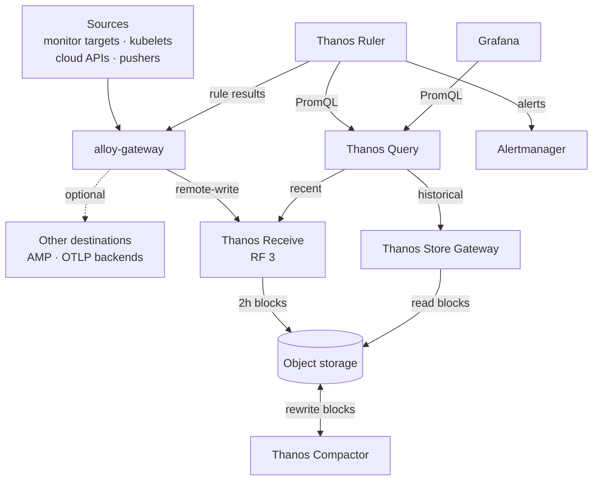
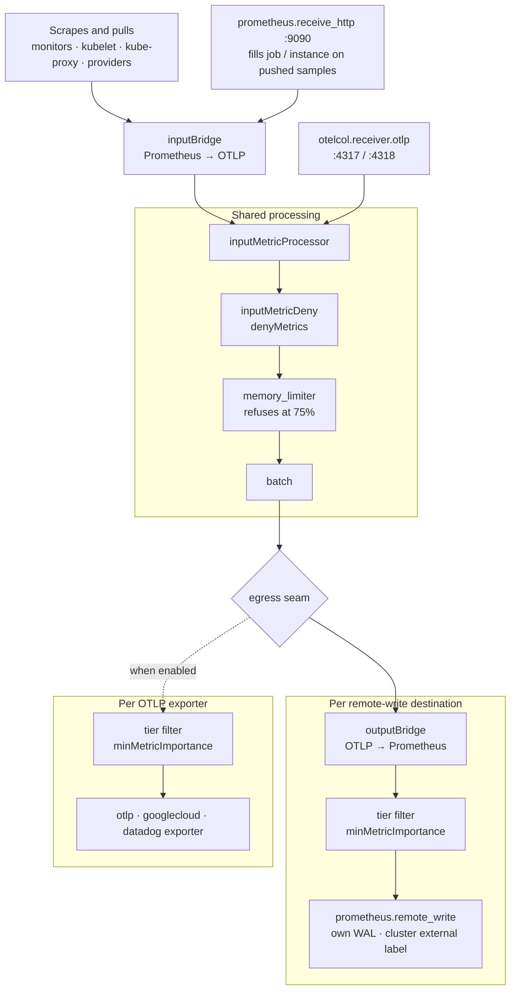
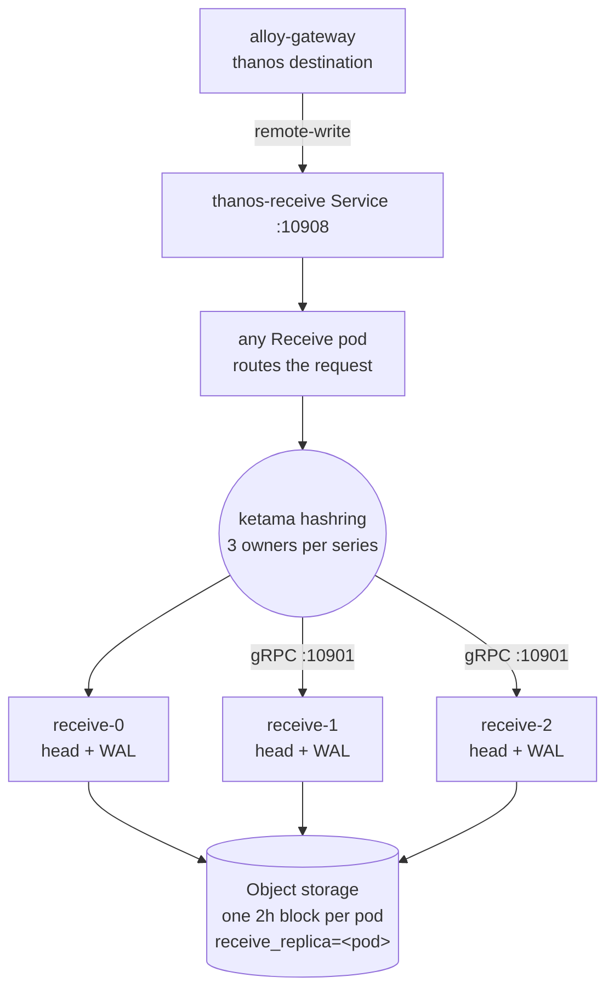
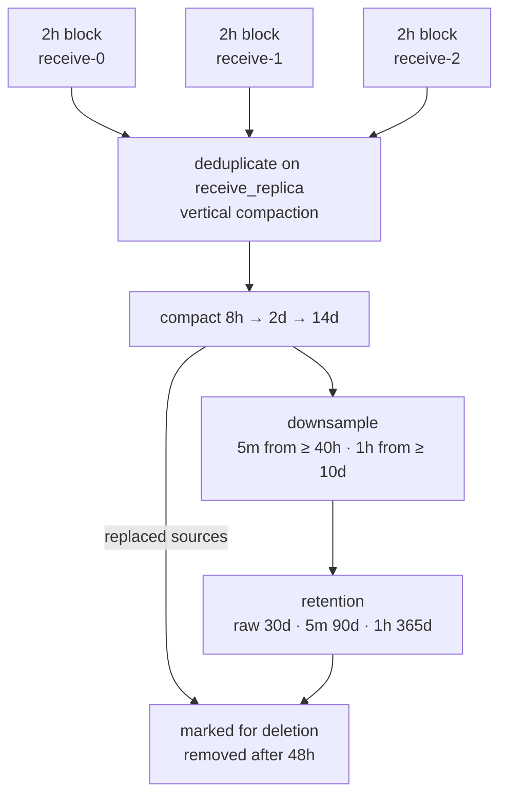
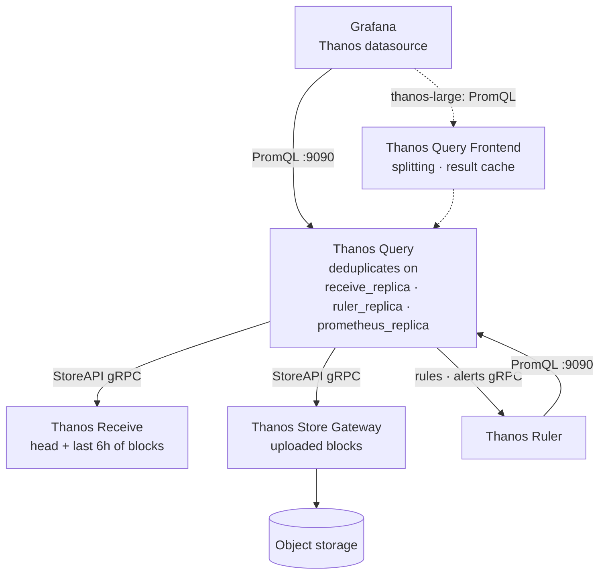
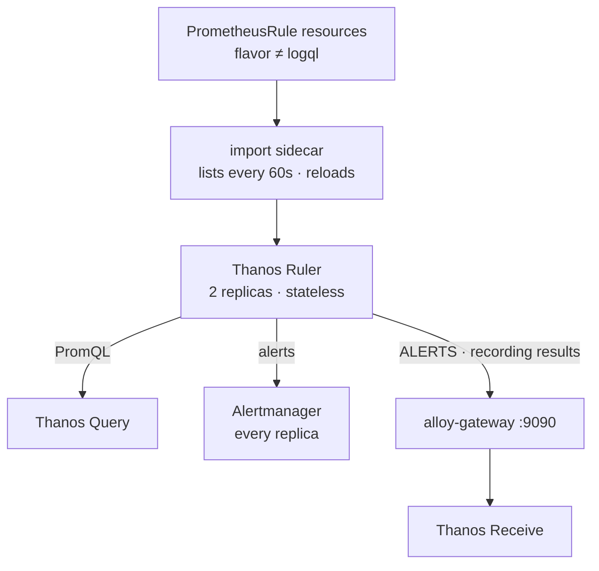

# Architecture

# Metrics Architecture

This page describes how metrics move through `materialize-monitoring`.
In the bundled stack, every metric enters through the [`alloy-gateway`](../../o11y-glossary/#alloy), which scrapes or receives it, processes it, and writes it to one or more destinations.
The default destination is the bundled [Thanos](../../o11y-glossary/#thanos).
Thanos keeps recent data in Receive, keeps everything older as blocks in object storage, and answers [PromQL](../../o11y-glossary/#promql) for Grafana and for the Thanos Ruler.

The other pages in this section cover each stage in depth:

| Page | Covers |
|---|---|
| [Collecting](../collecting/overview/) | The five ways metrics reach the gateway, and its ingress ports |
| [Scraping](../scraping/) | Monitor discovery, the kubelet scrape, and scrape configurations for a separately run Prometheus |
| [Storing](../storing/) | Destinations, importance tiers, the denylist, object storage, retention and downsampling |
| [Querying](../querying/) | PromQL through Grafana and the Thanos Query API |
| [Alerting > Configuring](../../alerting/configuring/) | The Thanos Ruler, and how `PrometheusRule` resources reach it |

The production checklist for this backend is [Production Best Practices > Metrics (Thanos)](../../operating/production-best-practices/#metrics-thanos).
The gateway's component-level pipeline is in the [metrics pipeline reference](../../reference/internal/pipelines/metrics/) (internal).

## End-to-end dataflow

Writes flow downward.
The gateway [collects](#collection) from every source, runs the shared [processing pipeline](#gateway-pipeline), and writes each destination its own filtered copy.
[Thanos Receive](#thanos-receive) replicates each write to three pods, serves the recent window, and uploads a block to object storage every two hours.
The [Compactor](#block-lifecycle) merges, deduplicates, downsamples, and expires those blocks in place.

Reads flow upward from Grafana into [Thanos Query](#read-path), which merges recent data from Receive with historical data from the Store Gateway.
The [Thanos Ruler](#rule-evaluation) queries the same path, sends alerts to Alertmanager, and writes its results back into the gateway, so rule output takes the same route as every other metric.

## Collection {#collection}

All metric collection runs in the `alloy-gateway` Deployment.
The `alloy-agent` DaemonSet collects logs only.
Container metrics come from the kubelet, which the gateway scrapes directly, so no per-node metrics agent is needed.

| Source | Reaches the gateway by | Default |
|---|---|---|
| `PodMonitor` and `ServiceMonitor` targets | Scrape, discovered from every monitor in the cluster | On. The chart ships monitors for Materialize, kube-state-metrics, node-exporter and each stack component |
| Kubelet `/metrics/cadvisor` | Scrape of every node's kubelet | On, every 60s |
| kube-proxy | Scrape, discovered by a server-side pod selector | On where kube-proxy runs |
| Cloud provider monitoring APIs | Pull through an in-process exporter | Off |
| Prometheus remote-write | Push to `:9090` | Listener on |
| OTLP | Push to `:4317` (gRPC) or `:4318` (HTTP) | Listener on |
| Thanos Ruler and Loki Ruler | Remote-write push to `:9090` | On |

The gateway replicas form an [Alloy cluster](https://grafana.com/docs/alloy/latest/get-started/clustering/).
Every scrape and pull is clustered, so each target has one owner among the replicas.
Adding a replica spreads scrape load without duplicating samples.
A cloud provider's API is therefore called once per interval, however many replicas run.

*See more:* [Collecting](../collecting/overview/), [Scraping](../scraping/), and [Cloud Provider Metrics](../collecting/cloud-provider-metrics/).

### Inside the gateway {#gateway-pipeline}

Prometheus input is bridged into OTLP at the start, processed by `otelcol.processor.*` components, and bridged back for remote-write.
Every scrape keeps the target's metric type, so a counter or histogram arrives typed at an OTLP destination.
The memory limiter refuses new data at 75% of its limit, and the refusal propagates back to the receivers as backpressure.

The stream forks after the shared stages.
Each destination has its own importance-tier filter **upstream** of its writer.
A remote-write destination's write-ahead log therefore holds only the series that destination accepts, and a stuck destination backs up its own WAL and no other.
Each remote-write destination also stamps a `cluster` external label.

*See more:* [Storing > The remote-write destinations](../storing/#the-remote-write-destinations), [Controlling what each destination stores](../storing/#controlling-what-each-destination-stores), and the [metrics pipeline reference](../../reference/internal/pipelines/metrics/) (internal).

## Thanos write path {#write-path}

### Thanos Receive {#thanos-receive}

Receive runs in `standalone` mode, where every pod both routes and ingests.
The pod that takes a request hashes each series onto an auto-generated ketama hashring and forwards it to the pods that own it.
With replication factor 3 a write succeeds once two of the three owners accept it.

At the default 3 replicas every pod owns every series.
The `thanos-large` profile runs 6, and each series then lives on 3 of the 6.

Each pod keeps its head and WAL on an `emptyDir`, cuts a block every two hours, and uploads it to object storage.
Local retention is 6h, which serves the recent window to queries until the Store Gateway has the uploaded blocks.
Every pod uploads its own copy of what it holds, labelled with its own `receive_replica`.
The [Compactor](#block-lifecycle) later merges those copies into one.

*See more:* [Production Best Practices > Receive](../../operating/production-best-practices/#receive-replication-is-the-availability-lever-not-mode) for the quorum table and zone spread,
and [Storage: ephemeral by default](../../operating/production-best-practices/#thanos-ephemeral-storage) for why Receive has no volume.

## Object storage and the block lifecycle {#block-lifecycle}

Object storage is the only durable copy of metric data.
Every other Thanos component either writes blocks into it or reads them out.

The Compactor is a **singleton**, because two compactors against one bucket corrupt it.
It works only on blocks older than its 30m consistency delay, so it never reads a block whose upload is still in progress.

| Stage | What happens |
|---|---|
| Deduplicate | Blocks are grouped by their external labels with `receive_replica` removed, so each replica's copy of a window lands in one group. Vertical compaction merges them into a single block and drops identical samples |
| Compact | Blocks are merged into longer ranges, 2h into 8h, 8h into 2d, and 2d into 14d |
| Downsample | A raw block spanning 40h or more gets a 5m copy. A 5m block spanning 10d or more gets a 1h copy |
| Retain | Each resolution expires on its own horizon, by default raw 30d, 5m 90d and 1h 365d |
| Delete | A block that a compaction replaced, or that retention expired, is marked for deletion and removed 48h later. The delay lets the Store Gateway load the replacement before the source disappears |

Vertical compaction also absorbs the few seconds of overlap Receive writes when a pod restarts.
Without it, the first overlap halts the Compactor, and a halted Compactor runs none of the stages above.

The Store Gateway reads blocks directly from the bucket and keeps an index-header cache on its own volume.

*See more:* [Storing > Retention and downsampling](../storing/#retention-and-downsampling),
[Production Best Practices > Retention & compaction](../../operating/production-best-practices/#thanos-retention-compaction),
and [`ThanosCompactHalted`](../../operating/o11y-troubleshooting/#thanos-compact-halted).

## Read path {#read-path}

Thanos Query presents a Prometheus-compatible API and holds no data of its own.
It discovers Receive, the Store Gateway and the Ruler through DNS SRV lookups, and fans each query out over gRPC.

A query that spans recent and historical data reads both, and Query merges the overlap.
It then deduplicates on the replica labels.
Each Receive replica's copy of a series, each Ruler replica's copy of a rule result, and a deduplicated block from the bucket all collapse to one series.

Grafana's `Thanos` datasource points at Thanos Query.
The `thanos-large` profile enables the Query Frontend and moves the datasource to it, while the Ruler stays on Thanos Query, so rules never evaluate against a cached result.

*See more:* [Querying](../querying/) and [Alerting > Configuring](../../alerting/configuring/#the-rulers-do-not-follow-the-query-frontend).

## Rule evaluation {#rule-evaluation}

The Thanos Ruler is stateless.
It evaluates by querying Thanos Query, keeps no TSDB of its own, and remote-writes every result to the gateway.
Rule output therefore reaches every destination the gateway writes to, and not only the bundled Thanos.

Both replicas evaluate every rule.
Each stamps its own `ruler_replica`, Thanos Query deduplicates on that label, and Alertmanager deduplicates the notifications.
The gateway fills in `job="thanos-ruler"` and a constant `instance` on the Ruler's samples.
The two replicas' series then differ only in `ruler_replica`, which is the label Query deduplicates on.

The Loki Ruler's recording rules arrive the same way, as remote-write to the gateway.

*See more:* [Alerting > Configuring](../../alerting/configuring/) for rule delivery and stateless mode, and [Alert Architecture](../../alerting/architecture/) for what Alertmanager does next.

## Destinations beyond the bundled Thanos {#other-destinations}

The gateway writes to any number of destinations at once, each filtered to its own importance tier.
The bundled Thanos is the default entry in that map, and it can be removed.

| Profile | Shape |
|---|---|
| `aws-amp-fanout` | Full fidelity in the bundled Thanos, and only essential series in Amazon Managed Prometheus |
| `otlp-metrics-honeycomb` | Gateway metrics to a generic OTLP backend |
| `otel-metrics-fanout` | Several OTLP backends at once, each on its own tier |

A deployment that already runs its own Prometheus can skip the gateway entirely and scrape Materialize with the configurations on [Scraping](../scraping/).

*See more:* [Storing > Other Metric Storage Backends](../storing/#other-metric-storage-backends).

## See more

- [Thanos components](https://thanos.io/tip/components/receive.md/) (official): Receive, Store, Compact, Query, Query Frontend and Rule.
- [Thanos Receive hashrings and replication](https://thanos.io/tip/proposals-done/201812-thanos-remote-receive.md/) (official).
- [Thanos Compactor](https://thanos.io/tip/components/compact.md/) (official): compaction levels, vertical compaction and downsampling.
- [Alloy clustering](https://grafana.com/docs/alloy/latest/get-started/clustering/) (official).
- [Metrics pipeline reference](../../reference/internal/pipelines/metrics/) (internal): the gateway's pipeline, component by component.
- [o11y Glossary](../../o11y-glossary/): definitions for the vocabulary used on this page.

