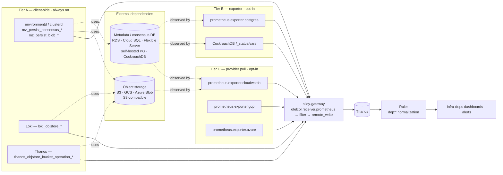

# Monitoring Materialize's External Dependencies

date: 2026-09-17


# Monitoring Materialize's External Dependencies


<table class="param-table">
  <tbody>
        <tr>
          <th>agent</th>
          <td>Claude Opus 5</td>
        </tr>
        <tr>
          <th>author</th>
          <td>Heather Lapointe</td>
        </tr>
        <tr>
          <th>lastmod</th>
          <td>2026-09-17 00:00:00 &#43;0000 UTC</td>
        </tr>
        <tr>
          <th>publishdate</th>
          <td>2026-09-17 00:00:00 &#43;0000 UTC</td>
        </tr>
        <tr>
          <th>status</th>
          <td>Draft</td>
        </tr>
  </tbody>
</table>


This doc proposes how `materialize-monitoring` covers the two services a Materialize deployment cannot run without and does not run itself: the **metadata (consensus) database** and the **object store**.
It is the design owed by the [External components row](../../roadmap/#infrastructure-dashboards-infra-) of the `infra-*` dashboard family, which today reads "object store yes, consensus DB effectively no" and is the last of that family's collection gaps without a plan.
Nothing here is ticketed yet.

The central claim is that **the client's measurement of a dependency is the SLI, and the dependency's own telemetry is the diagnosis.**
`environmentd` already times and counts every consensus round-trip and every blob operation it makes.
Loki and Thanos do the same for their buckets.
Those measurements define whether the dependency is working *for this deployment*, they are identical on every cloud, they need no cloud credentials, and most of them are already arriving.

Everything the provider publishes — CloudWatch, Cloud Monitoring, Azure Monitor, a `postgres_exporter`, CockroachDB's `/_status/vars` — answers the next question rather than the first one.
That half is where all the per-cloud variation lives, it costs money and configuration, and it is therefore **opt-in behind a uniform adapter contract** rather than a precondition for the dashboards existing.

A second claim carries the collection design.
**Provider metrics are pulled into the pipeline as an ingest source, never queried as a Grafana datasource.**
Pulling converts a cost proportional to how closely anyone watches into a cost proportional to how much is configured, puts the result in the same PromQL surface and the same retention as everything else, and makes a dependency series joinable with `mz_persist_blob_failures` inside a single expression.

<!--
Agent note: this doc records decisions and their *why*. When a decision lands in code, update the section and
check the matching row in "Chart-side prerequisites".

Weight collision: two other branches also carry a `20260917-` design doc (headlamp-cluster-management,
call-home-self-managed). Whoever merges second should renumber rather than leave a three-way weight tie.

Four things here are easy to get wrong and are stated deliberately:
  1. The shipped CockroachDB alerts target CockroachDB *Cloud*'s export prefix and match nothing a customer runs
     ("The coverage that exists is aimed at the wrong flavor"). Do not soften this into "needs updating".
  2. The three vantage points are not substitutable ("Three vantage points, none of them a substitute").
     Managed databases want the exporter AND the provider, which is the opposite of the obvious split.
  3. Object storage and the consensus database get *different* defaults, and the asymmetry is a finding
     rather than an inconsistency ("Why the two dependencies get different defaults").
  4. The self-monitoring circularity in "The stack cannot watch its own bucket fail".

This design is the first consumer of two declared-but-unimplemented mechanisms: the query registry's `rules:`
branch (no producer, `pre-rendered/rules/*` empty) and PrometheusRule rendering (no template). Both are
prerequisites rather than side quests; see the blocking rows.
-->

## Goals

Functional requirements, framed as value-first user stories.
Each describes *what* a user needs and *why it matters*; the [Technical BLUF](#technical-bluf) and the sections below describe *how* we deliver it.
Priority tags (**Must** / **Should** / **Could**) are relative to the first shipped version.

Four stakeholder classes consume this:

- **Self-managed operators**, who own the database and the bucket as well as Materialize, and for whom "Materialize is slow" and "the database is slow" are the same ticket.
- **Materialize support**, who are handed a degraded environment and need to establish within minutes whether the fault is inside Materialize or underneath it.
- **Cost owners**, who pay for the request volume, the stored bytes, and the provider API calls that observing any of it generates.
- **Maintainers of this repo**, who need one dashboard and one alert per question rather than one per cloud per flavor.

- **[Must] As a self-managed operator,** I want to know whether Materialize's slowness is its own or its database's, so that triage starts with a direction rather than a guess.
- **[Must] As a self-managed operator,** I want dependency coverage to work on the deployment the shipped Terraform provisions, so that the alerts I am given describe the system I actually run.
- **[Must] As a self-managed operator,** I want the default coverage to need no cloud credentials, so that observing a dependency is not gated on an IAM change I have to justify.
- **[Must] As Materialize support,** I want the error and latency a Materialize process *experienced* talking to a dependency, so that an incident is bounded by evidence rather than by the customer's account access.
- **[Must] As a self-managed operator,** I want one alert per failure mode rather than one per cloud, so that a page means the same thing whoever receives it.
- **[Should] As a self-managed operator,** I want provider-side capacity and saturation alongside the client's view, so that "the database is refusing connections" and "the database is out of connections" are distinguishable.
- **[Should] As a cost owner,** I want the provider-pull bill to be a function of what is configured and not of how many dashboards are open, so that observing the system does not get more expensive when it is being watched hardest.
- **[Should] As a self-managed operator,** I want dependency metrics to carry the same environment label as everything else, so that a multi-environment install can scope them.
- **[Should] As Materialize support,** I want the monitoring stack's own object-store dependency covered by the same mechanism, so that "Thanos is missing data" and "the bucket is unhealthy" are one investigation.
- **[Should] As a cost owner,** I want object-store growth and reclaimable waste visible, so that a bucket bill is explainable without an inventory report.
- **[Could] As a self-managed operator,** I want a synthetic probe against the bucket and the database, so that "no traffic" and "no problem" are distinguishable during a quiet period.
- **[Could] As a maintainer,** I want adding a seventh database flavor to be an adapter and a mapping table, so that flavor count does not multiply dashboard count.

## Technical BLUF

- **Three collection tiers, one contract.** Tier A is client-side and unconditional; tier B is a direct exporter against a reachable dependency; tier C is a pull from the cloud provider's metric API. Dashboards and alerts read a normalized `dep:*` family that every tier feeds, plus flavor-native families for drilldowns.
- **Tier A is already arriving and is almost entirely unread.** `mz_persist_consensus_failures` and `mz_persist_blob_failures` reach Thanos today and appear in exactly one alert between them; `loki_objstore_*` and the Thanos equivalents land and no query in the registry references them.
- **Provider metrics enter through `alloy-gateway`** as `prometheus.exporter.{cloudwatch,gcp,azure}`, joining the existing `otelcol.receiver.prometheus` bridge. They take the same filter, tier, and remote-write path as every other metric, and reach every configured destination.
- **Normalization is recording rules, not relabelling.** The mapping needs arithmetic — ratios, unit conversion, histogram quantiles — which a `prometheus.relabel` cannot express. This makes the design the first consumer of the query registry's `rules:` branch, which today has no producer.
- **PostgreSQL is the priority, not CockroachDB.** Every cloud wrapper this project ships provisions managed PostgreSQL. The 15 CockroachDB alerts already in `infra-alerts.yaml` target CockroachDB Cloud's `crdb_dedicated_*` export prefix and match nothing on any of them.
- **The two dependencies get different defaults, on purpose.** Object storage defaults to client-side only, because two of three clouds publish no usable server-side latency signal and the clients publish an excellent one. The consensus database defaults to client-side plus an exporter, because the exporter sees things no other vantage point can.
- **Dependency series are `infra-*`, not `env-*`,** until a values-supplied mapping says which database and which bucket serve which environment. Provider metrics arrive labelled by resource identifier and carry no Materialize identity.
- **Provider-side collection lags.** CloudWatch RDS metrics land at 60-second granularity a few minutes late, S3 storage metrics are daily. Alert `for:` windows and dashboard freshness annotations account for it, and no tier-C signal is used for a fast page.

## Non-goals

- **Provisioning or tuning the dependencies.** This repo observes a database and a bucket; the Terraform wrappers create them. A finding here may produce a recommendation there, and no resource moves.
- **Being the customer's database monitoring.** An operator with an existing PostgreSQL observability practice keeps it. The target is the subset a Materialize operator needs to triage Materialize, not a general RDS product.
- **Covering every dependency of every deployment shape.** Kafka, PostgreSQL *sources*, and other upstreams a customer connects to are a different subject with a different owner, and the source/sink dashboards cover them.
- **A cloud cost product.** Bucket growth and reclaimable waste are in scope because they are cheap and because a compactor that stops shows up there first. Cost attribution and forecasting are not.
- **Replacing the client-side signals with provider ones.** The provider view never becomes the default, however well configured.

## What exists today

| Capability | State | Where |
|---|---|---|
| Client-side consensus signals | ⚠️ Arriving, barely read | `mz_persist_consensus_failures` reaches Thanos and appears in one composite alert |
| Client-side blob signals | ⚠️ Arriving, barely read | `mz_persist_blob_failures`, `mz_persist_external_failed_count` and 13 siblings, all in the same composite alert |
| Loki object-store signals | ⚠️ Arriving, unread | 24 `loki_objstore_*` families land; no query in `packages/queries/` references any of them |
| Thanos object-store signals | ⚠️ Arriving, unread | `thanos_objstore_bucket_operation_*` lands; same |
| CockroachDB alerts | ⚠️ 15 defined, wrong flavor | `infra-alerts.yaml`, written against `crdb_dedicated_*` — CockroachDB Cloud's export prefix |
| PostgreSQL alerts | ❌ **None** | Nothing in the registry names a `pg_*` family |
| Object-store alerts | ❌ **None** | The composite `mz_persist_*` alert is the closest thing, and it names Materialize rather than the bucket |
| A `postgres_exporter` deployment | ❌ **Absent** | Two `postgres_exporter_*` *config* families were observed on a live install, from something outside this chart. Nothing here deploys one |
| Provider metric pull | ❌ **Absent** | No `prometheus.exporter.cloudwatch`, `.gcp` or `.azure` in the schema or any pipeline |
| Provider metric *push* | ✅ Shipped, opposite direction | `googleCloudExporter` and `datadogExporter` write metrics *out*. The GCP monitoring module already provisions a workload identity for it |
| Recording rules | ❌ Declared, no producer | The registry models `rules:`, no file uses the branch, and `pre-rendered/rules/{prometheus,thanos,loki}/` are all empty |
| Alerts as installable rules | ❌ Declared, no producer | `config.rules.prometheus.enabled` defaults true, no template emits a `PrometheusRule`, so an install gets no alerts at all |
| Telemetry-bucket housekeeping | ✅ Shipped | The monitoring module sets `AbortIncompleteMultipartUpload` and noncurrent-version expiry on AWS and GCP |
| Persist-bucket housekeeping | ⚠️ Not set | `aws/modules/storage` renders a lifecycle configuration only when `bucket_lifecycle_rules` is non-empty, and it models no multipart abort |

Two rows deserve emphasis because they are prerequisites rather than context.
**No alert this repo defines is installed anywhere**, so every alert proposed below inherits that gap.
**No recording rule can be produced**, so the normalization layer this design depends on has to build the mechanism it uses.

## The dependency surface, as actually deployed

The Terraform wrappers are the ground truth for what a self-managed deployment depends on, and they are more uniform than the general problem suggests.

| Cloud | Metadata backend | Persist backend | Access shape |
|---|---|---|---|
| AWS | RDS **PostgreSQL** | S3 | IRSA; `sslmode=require` |
| GCP | Cloud SQL **PostgreSQL** | GCS **via the S3-compatible XML API** | HMAC key in the DSN; private IP for the database |
| Azure | **PostgreSQL** Flexible Server | Azure Blob, native endpoint | Workload identity; `sslmode=require` |

A full install carries more of each than the table implies.
The monitoring module provisions its **own** telemetry bucket for Loki and Thanos, and optionally a **second** PostgreSQL instance for Grafana's state.
So an AWS deployment with the bundled stack has two PostgreSQL instances and two buckets, and all four are in scope for the same mechanism.

Three consequences follow, and the first is the useful one.

**PostgreSQL is the flavor that matters.**
Every wrapper provisions it, on all three clouds, through the same `postgres://` DSN shape.
CockroachDB appears nowhere in the self-managed Terraform except as an Ory subchart's hardcoded default, which those modules override.
It remains supported as a metadata backend and it is what Materialize Cloud runs, so it stays in scope — as the second flavor, behind the one every customer is handed.

**GCP's persist client is an S3 client.**
The DSN is `s3://KEY:SECRET@bucket/materialize?endpoint=https://storage.googleapis.com`, so `mz_persist_blob_*` on GCP is produced by the same code path as on AWS.
That is a gift to the normalized contract: the client-side tier needs no per-cloud handling for two of three clouds, and Azure's native blob client is the only divergence.

**Azure has no HMAC-style interop shim**, so its persist path and its provider metrics are both genuinely separate, and it is the cloud where the adapter work is real rather than nominal.

## Architecture



Four properties of this diagram carry the design.

**Tier A needs nothing new at the edges.**
Every arrow out of the client-side box already exists — these are processes this stack already scrapes, emitting families that already reach Thanos.
The work in tier A is entirely in the registry, the rules, and the dashboards, which is why it ships first and alone.

**Every tier converges before the filter, not after it.**
Provider-pulled metrics land in `otelcol.receiver.prometheus "inputBridge"` like everything else, so they inherit the deny list, the importance tiering, the per-destination remote-write fan-out, and the external labels without a single new seam.
A design that gave them their own path would have to re-derive all of that.

**The ruler is between the store and the consumers, not beside them.**
`dep:*` is a recorded series, so a dashboard reads one expression whether the deployment is on RDS, Cloud SQL, or a CockroachDB in a StatefulSet.
This is the component that does not exist today.

**The dependency observes itself through the stack that depends on it.**
Thanos's object-store metrics travel to Thanos.
That circularity is real and bounded, and [it is treated explicitly below](#the-stack-cannot-watch-its-own-bucket-fail).

## Three vantage points, none of them a substitute

The obvious split — self-hosted gets an exporter, managed gets the provider's metrics — is wrong, and getting it wrong is what makes managed-database coverage feel thin.

| Vantage point | Sees | Cannot see |
|---|---|---|
| **The client** (`mz_persist_*`, `loki_objstore_*`) | Latency and errors as experienced, including the network between, DNS, TLS, and the client's own pool | Anything about *why*. A saturated connection pool and a saturated database present identically |
| **The exporter** (`postgres_exporter`, `/_status/vars`) | Inside the database — connections by state, lock waits, dead tuples, transaction-ID age, per-table statistics for the consensus table itself | The box. A throttled EBS volume shows up as slowness with no local cause |
| **The provider** (CloudWatch, Cloud Monitoring, Azure Monitor) | The instance and the service — CPU, memory, IOPS, burst balance, storage headroom, service-side error rates | Inside the database. No provider publishes lock waits or table bloat |

**A managed database wants the exporter and the provider both.**
The provider sees the box it runs on; the exporter sees the database running on it.
Neither answers "is the consensus table bloating", which is the failure mode most specific to this workload — persist drives a high-churn compare-and-swap table, and a stalled autovacuum on it degrades every Materialize write while every instance-level metric stays flat.

That is also the argument for running `postgres_exporter` against RDS, Cloud SQL, and Flexible Server rather than treating them as covered by tier C.
All three accept a normal PostgreSQL connection from inside the cluster, which the deployment already has, using the credentials the operator already holds.
Tier B is therefore the recommended default for the consensus database on every flavor, managed or not, and tier C is the addition rather than the alternative.

## Why the two dependencies get different defaults

The two dependencies look symmetric and are not, and the asymmetry decides what ships on by default.

| | Consensus database | Object storage |
|---|---|---|
| Client-side signal quality | Good — latency and failure counts per operation | **Excellent** — every client times every operation by type, with error classification |
| Provider-side latency signal | Good on all three clouds | **Absent on GCS.** Opt-in and separately billed on S3. Good on Azure |
| Provider-side capacity signal | **Essential** — storage headroom, connection ceiling, IOPS, burst balance | Nearly irrelevant; object storage does not run out |
| Exporter available in-cluster | Yes, over the existing connection | No meaningful equivalent |
| Recommended default | Tier A **and** tier B | Tier A **only** |

Object storage gets the thinner default because the cheap tier is also the better one.
GCS publishes request counts by response code and no latency metric at all; S3's `FirstByteLatency` and `TotalRequestLatency` require per-bucket request metrics, which are opt-in and billed as custom metrics.
Meanwhile Loki, Thanos, and persist each already produce an operation-level latency histogram, for free, at full resolution, attributed to the operation that experienced it.

Tier C for object storage therefore earns its place on **capacity and waste** rather than health: bucket size, object count, and the growth rate that reveals a compactor that has stopped.
Those are the signals the clients cannot produce, they are free on S3 and GCS, and a daily granularity is appropriate for them.

## The coverage that exists is aimed at the wrong flavor

`infra-alerts.yaml` carries 15 CockroachDB alerts — disk, CPU, SQL latency, LSM read amplification, unavailable and under-replicated ranges, write-intent accumulation, memory, and a missing-backup check.
They are careful and well described, and every one of them reads a `crdb_dedicated_*` metric.

That prefix is CockroachDB **Cloud**'s metric export, not the metric names a CockroachDB node publishes on `/_status/vars`.
A self-hosted cluster emits `capacity_used`, `sys_cpu_combined_percent_normalized`, and `ranges_unavailable`; the alerts ask for `crdb_dedicated_capacity_used`, `crdb_dedicated_sys_cpu_combined_percent_normalized`, and `crdb_dedicated_ranges_unavailable`.
The expressions are correct for the deployment they were written against and match nothing on a deployment this project's Terraform produces, which provisions PostgreSQL rather than CockroachDB in the first place.

Nothing is currently broken by this, because [no alert in the registry is installed](#what-exists-today).
The consequence is for planning rather than for production: the consensus-database coverage that appears to exist is coverage of Materialize Cloud's infrastructure, carried forward from the field-engineering assets in `legacy/`.

The resolution is not to rewrite them.
They stay, as the CockroachDB **Cloud** adapter, which is a real flavor that Materialize Cloud runs and that a customer may point a self-managed deployment at.
The work is to add the adapters that were missing — PostgreSQL first, self-hosted CockroachDB second — and to route all of them through the normalized contract so that the next flavor does not produce a sixteenth parallel alert set.

## A normalized contract with flavor-native passthrough

The flavor count is the whole problem.
Six plausible consensus-database flavors and four object-store flavors, each with its own metric names, units, and label conventions, multiply into an unmaintainable dashboard and alert set if each is handled directly.

**Two layers, and the split is by who reads them.**

| Layer | Shape | Read by | Obligation |
|---|---|---|---|
| **Normalized** | `dep:*` recorded series, flavor-neutral names, fixed units, fixed label set | Alerts, and every summary panel | Every adapter MUST populate it, or MUST leave it absent rather than approximate it |
| **Flavor-native** | Whatever the exporter or provider emits, unchanged | Drilldown panels, one row per flavor | Passed through untouched; no adapter owes anything |

A proposed normalized core for the consensus database, deliberately small:

| Recorded series | Unit | Meaning |
|---|---|---|
| `dep:consensus_up` | 0/1 | The observer can reach the database |
| `dep:consensus_cpu_ratio` | 0–1 | Normalized CPU across the instance or cluster |
| `dep:consensus_storage_used_ratio` | 0–1 | Fraction of provisioned storage consumed |
| `dep:consensus_connections_used_ratio` | 0–1 | Open connections against the configured ceiling |
| `dep:consensus_commit_latency_seconds` | seconds | p99 write-transaction latency |
| `dep:consensus_xid_used_ratio` | 0–1 | Transaction-ID headroom consumed, the wraparound signal |

And for object storage:

| Recorded series | Unit | Meaning |
|---|---|---|
| `dep:objstore_request_errors:rate5m` | per second | Failed operations, by operation class |
| `dep:objstore_request_duration_seconds` | seconds | p99 operation latency, by operation class |
| `dep:objstore_bytes_used` | bytes | Stored size |
| `dep:objstore_object_count` | objects | Stored object count |

Three properties of this contract are load-bearing.

**Absence is a valid adapter answer, and it is not the same as zero.**
GCS publishes no latency, so the GCS tier-C adapter records no `dep:objstore_request_duration_seconds` rather than recording a constant.
A panel reading it shows "no data" for that source, which is true, and the tier-A series covers the same question from the client side anyway.

**Ratios rather than absolutes, wherever a ceiling exists.**
`FreeStorageSpace` in bytes is not comparable across a 100 GiB RDS instance and a 4 TiB one, and an alert threshold in bytes has to be re-derived per deployment.
This is also why relabelling cannot produce the contract: a ratio is a division, and `prometheus.relabel` rewrites labels.

**The flavor stays on the series as a label**, not baked into the name.
`dep:consensus_cpu_ratio{flavor="rds", ...}` lets one panel show every consensus database in a deployment, and lets an operator see immediately which adapter produced a number they distrust.

Naming this family is not free.
The roadmap's [deprecation-policy section](../../roadmap/#versioning-changelog-and-releases) records the **alert and recording-rule naming decision** as still open, and notes that it is free only until the alerting path ships.
This design is what forces it, since `dep:*` would be the first recorded series in the repository and the first precedent for the convention.

## The consensus database

### PostgreSQL, on any of the three clouds

Tier B is the recommended default, deployed as a `prometheus.exporter.postgres` against the same DSN the operator already holds.
The signals worth collecting, and why each is here rather than in a general PostgreSQL dashboard:

| Signal | Family | Why it matters to Materialize |
|---|---|---|
| Reachability | `pg_up` | The direct cause of a `mz_persist_consensus_failures` spike |
| Connections against the ceiling | `pg_stat_activity_count` vs `pg_settings_max_connections` | Persist holds a pool per process; a cluster scale-up can exhaust the ceiling and present as write failures across every environment at once |
| Connections by state | `pg_stat_activity_count{state=...}` | `idle in transaction` accumulating is a distinct fault from saturation and has a different fix |
| Dead tuples on the consensus table | `pg_stat_user_tables_n_dead_tup` | **The workload-specific failure.** Persist's compare-and-swap loop churns rows constantly; a stalled autovacuum degrades every write while every instance metric stays flat |
| Autovacuum recency | `pg_stat_user_tables_last_autovacuum` | The leading indicator for the row above |
| Transaction-ID headroom | `age(datfrozenxid)` | Wraparound is a hard stop, and a high-churn table on a small instance is the shape that reaches it. **Not a default exporter metric** — needs a custom query |
| Lock waits | `pg_locks_count{mode="..."}` | Distinguishes contention from slowness |
| Database size | `pg_database_size_bytes` | Growth on the metadata database is almost always the consensus table failing to compact |
| Replication lag | `pg_replication_lag` | Only where a replica exists; not provisioned by the wrappers today |

Two of these need work beyond enabling a collector.
**Transaction-ID age is not exposed by the default exporter** and needs a custom query in the exporter's configuration, which means the chart ships one rather than only a connection string.
**Table-level statistics need the exporter pointed at the right database and given `pg_monitor`**, and a least-privilege grant is part of the deliverable rather than an afterthought.

Tier C adds what the exporter cannot see, and the families differ per cloud:

| Cloud | Namespace | Signals that justify the pull |
|---|---|---|
| AWS RDS | `AWS/RDS` | `CPUUtilization`, `FreeableMemory`, `FreeStorageSpace`, `DatabaseConnections`, `ReadLatency`/`WriteLatency`, `DiskQueueDepth`, `BurstBalance`, `EBSIOBalance%`, `EBSByteBalance%`, `MaximumUsedTransactionIDs` |
| GCP Cloud SQL | `cloudsql.googleapis.com/database/` | `cpu/utilization`, `memory/utilization`, `disk/utilization`, `postgresql/num_backends`, `postgresql/transaction_id_utilization`, `up` |
| Azure Flexible Server | Azure Monitor, server resource | `cpu_percent`, `memory_percent`, `storage_percent`, `active_connections`, `connections_failed`, `iops`, `maximum_used_transactionIDs` |

The burst-balance family on AWS deserves a specific mention.
A `gp2` or `gp3` volume that exhausts its burst credit degrades to baseline IOPS, and every in-database metric stays normal while every Materialize write slows down.
It is invisible from tiers A and B, it is a genuine production failure mode, and it is the single strongest argument for tier C on the database side.

Each cloud publishes a transaction-ID headroom metric, which means the wraparound signal has two independent sources.
That is fine and worth keeping: the provider's is authoritative and lags, the exporter's is immediate and needs a custom query, and the normalized `dep:consensus_xid_used_ratio` takes whichever exists.

### CockroachDB

Two flavors, and they share nothing but a vendor.

**Self-hosted** exposes Prometheus metrics on `/_status/vars` over the HTTP port, unauthenticated even in secure mode.
Collection is an ordinary scrape — a ServiceMonitor if the cluster runs in Kubernetes, a static target otherwise.
Three families beyond the ones the existing alerts already name are worth adding, because each has no PostgreSQL analogue and no provider equivalent.

| Family | What it reports |
|---|---|
| `liveness_livenodes` | A node the rest of the cluster considers dead |
| `clock_offset_meannanos` | Clock skew, to which CockroachDB is unusually sensitive — a drifting node removes itself |
| `admission_*` | Admission control throttling low-priority work, which is the cluster protecting itself and reaches Materialize as latency |

**CockroachDB Cloud** publishes through its own metric export to CloudWatch, Cloud Monitoring, Datadog, or a Prometheus-scrapable endpoint, with the `crdb_dedicated_*` prefix the existing alerts use.
The Prometheus endpoint is the cheapest path and needs an API key; the CloudWatch path arrives through the same tier-C adapter as everything else.

The existing 15 alerts become the CockroachDB Cloud adapter unchanged, and a self-hosted adapter records the same `dep:*` series from the unprefixed names.
That is the normalized contract's first real test, and it is a fair one: the two flavors publish the same measurements under different names, which is exactly the case the layer exists for.

### Grafana's own database

The bundled Grafana optionally takes a PostgreSQL instance, and the monitoring module provisions one.
It gets the same tier-B exporter and the same `dep:*` series, at a lower severity — Grafana losing its database costs dashboards and alert history, not Materialize availability.
It is included because it is free once the mechanism exists, and because "the monitoring stack is down" is a question the monitoring stack should be able to answer about itself.

## Object storage

### The client-side view, which is the default

Three clients already measure the same bucket, and between them they cover every operation Materialize and the stack perform.

| Client | Families | Covers |
|---|---|---|
| `environmentd` / `clusterd` | `mz_persist_blob_failures`, `mz_persist_external_failed_count`, `mz_persist_external_blob_delete_noop_count`, and siblings | Persist's blob path — the one whose failure is a Materialize outage |
| Loki | 24 `loki_objstore_*` families | Chunk and index writes, and the reads that back every log query |
| Thanos | `thanos_objstore_bucket_operation_*`, `..._failures_total`, `..._duration_seconds` | Block upload, compaction, and store-gateway reads |

The Loki and Thanos families follow the same `objstore` convention, which means one pair of recording rules covers both and the adapter is nearly free.
The persist families are counters without a latency histogram, so `dep:objstore_request_duration_seconds` is recorded from Loki and Thanos and is absent for the persist bucket — an honest gap, and one worth raising upstream, since persist's own view of blob latency is the single most useful missing signal in this whole design.

Two conventions apply to reading these.

**Error rates are per operation class, not aggregate.**
A `DELETE` failing is compaction falling behind; a `GET` failing is a query returning wrong results or none.
Collapsing them produces an alert that fires for the wrong reason.

**The bucket label is not the bucket.**
Loki and Thanos label by their own configuration, persist by nothing, and the provider by bucket name.
Joining a client-side series to a provider-side one needs the mapping described under [environment scoping](#dependency-series-are-infra--until-a-mapping-exists).

### The provider-side view, which is about capacity

| Cloud | Signals worth pulling | Cost and granularity |
|---|---|---|
| S3 | `BucketSizeBytes`, `NumberOfObjects` | Free, **daily** |
| S3 | `AllRequests`, `4xxErrors`, `5xxErrors`, `FirstByteLatency`, `TotalRequestLatency` | Request metrics are **opt-in per filter and billed as custom metrics**; 1-minute granularity |
| GCS | `storage/total_bytes`, `storage/object_count`, `api/request_count` by response code | Free; request count is useful, **and there is no latency metric** |
| Azure Blob | `BlobCapacity`, `BlobCount`, `Transactions` by response type, `Availability`, `SuccessE2ELatency`, `SuccessServerLatency` | Free, and the most complete of the three |

The daily granularity on S3 storage metrics is not a defect for this purpose.
Bucket growth is a trend signal; a compactor that stopped is visible within a day and is not a page.

**Incomplete multipart uploads are the one cost signal no metric shows.**
Aborted uploads leave billed parts that do not appear in an object listing and are not counted by `BucketSizeBytes`.
Both persist and the Loki/Thanos clients use multipart uploads for large blocks.
The monitoring module already sets a seven-day `AbortIncompleteMultipartUpload` rule on its telemetry buckets, on AWS and on GCS through the XML API.
**The Materialize persist bucket has no equivalent** — `aws/modules/storage` renders a lifecycle configuration only when `bucket_lifecycle_rules` is non-empty and models no multipart abort at all.
That is a Terraform-repo finding rather than a monitoring one, and it belongs in this document because the monitoring work is what surfaced it.

### The stack cannot watch its own bucket fail

Thanos stores metrics in object storage, including the metrics describing object storage.
If the telemetry bucket becomes unavailable, the signal that says so is written to the thing that is unavailable.

The circularity is bounded rather than fatal, and the bound is worth stating precisely.
Thanos Receive holds recent samples in a local TSDB before shipping blocks, the ruler evaluates against the query path rather than against object storage directly, and Alertmanager runs in-cluster with no bucket dependency.
So an alert on a *recent* window still fires during a bucket outage; what is lost is the history of the outage, which is recoverable once the bucket returns.

Two design consequences follow.
**Object-store alerts evaluate over short windows** — the long-window variants are dashboard panels rather than alerts, because a long window is exactly what a bucket outage makes unanswerable.
**The telemetry bucket and the persist bucket are alerted separately**, even when a deployment puts them in the same account and region, because one of them can be watched reliably and the other can only be watched by a stack that is itself degraded.

## Pulling provider metrics into the pipeline

### The components

Alloy ships exporters for all three providers, and each becomes a typed component in the pipeline schema:

| Component | Wraps | Target |
|---|---|---|
| `prometheus.exporter.cloudwatch` | YACE | CloudWatch, by namespace and dimension or by tag discovery |
| `prometheus.exporter.gcp` | `stackdriver_exporter` | Cloud Monitoring, by metric prefix |
| `prometheus.exporter.azure` | `azure-metrics-exporter` | Azure Monitor, by resource type |

They run on the **gateway**, not the agent.
The agent is a DaemonSet and the pull is per-deployment rather than per-node, so running it on the agent would multiply every provider API call by the node count.
This is the same reasoning that moved cAdvisor off the agent, recorded in the roadmap's [pipelines section](../../roadmap/#pipelines-alloy), and it applies here more sharply because the duplicated calls would be billed.

The gateway runs multiple replicas, which makes duplication a live concern within a single role.
`clustering { enabled = true }` on the scrape is the existing answer for `prometheus.operator.*` and is required here for the same reason, with the same consequence if it is forgotten: a correct-looking dashboard and a bill multiplied by the replica count.

### Why pull rather than a Grafana datasource

Grafana has first-party datasources for all three providers, and using them would need no pipeline work at all.
The pull is still the right choice, for four reasons that compound.

| | Datasource | Pull into the pipeline |
|---|---|---|
| **Cost driver** | Per query, so per panel per viewer per refresh | Per scrape, fixed by configuration |
| **Retention** | The provider's — CloudWatch keeps 1-minute data for 15 days | The stack's — 30 days raw, a year downsampled |
| **Joinability** | None. A CloudWatch panel and a `mz_persist_*` panel cannot appear in one expression | Full. One PromQL surface, one label namespace |
| **Alerting** | A second alerting path with its own semantics | The same rules, the same Alertmanager |

The cost column is the decisive one and is worth making concrete.
A dashboard with ten provider-backed panels, open on a wall display refreshing every thirty seconds, issues 28,800 metric requests a day and costs more the more closely anyone is watching.
The same metrics pulled every five minutes cost the same whether nobody looks or everybody does.

A worked example for the pull side: a deployment with one RDS instance at 20 metrics and two buckets at 4 free storage metrics each, scraped every five minutes, is about 240,000 CloudWatch metric requests a month.
At CloudWatch's published `GetMetricData` rate that is on the order of a few dollars a month.
**These rates should be confirmed against current provider pricing before the number appears in customer-facing documentation** — the shape of the model is the durable part, not the figure.

The joinability column is the one that changes what can be asked.
"Show blob error rate beside the bucket's own 5xx rate, for the same five minutes" is one expression after the pull and is not expressible at all before it.

### Lag, and what it forbids

Provider metrics are not live, and the delay differs by provider and by metric.
CloudWatch instance metrics land at 1-minute granularity with a few minutes of delay; S3 storage metrics are daily and are published hours after the period they describe.
Cloud Monitoring and Azure Monitor are comparable.

**No tier-C signal backs a fast page.**
A page derived from a metric that is five minutes old is five minutes late by construction, and the client-side tier already answers the same question immediately.
Tier C alerts use `for:` windows sized well above the provider's publication delay, and they cover the slow-moving conditions — storage headroom, burst-credit exhaustion, connection ceilings — where minutes do not matter.

Dashboards annotate it rather than hiding it.
A panel whose data is inherently stale should say so, because an operator comparing a tier-A panel and a tier-C panel during an incident will otherwise read the gap between them as a contradiction.

### Cardinality and tiering

Provider exporters are cardinality traps.
YACE's tag-discovery mode will happily produce a series per resource per tag combination, and `stackdriver_exporter` on a broad prefix pulls metric descriptors nobody asked for.

Three controls, all of which already exist in this stack:

- **Configure by explicit resource, not by tag discovery**, wherever the deployment knows the resource — which the Terraform wrappers do, since they created it.
- **Assign `metricImportanceHint` deliberately.** The normalized core is `recommended`; the flavor-native families are `extended` or `diagnostic`. This is what keeps a Datadog or BYOC fan-out from carrying a provider's entire metric surface across a boundary at a per-metric price.
- **Let the deny list catch the rest**, since provider metrics pass through `inputMetricProcessor` like everything else.

## Dependency series are `infra-*` until a mapping exists

Every `env-*` dashboard scopes on `materialize_cloud_organization_name`.
No provider metric carries it, and no exporter does either — CloudWatch labels by `dimension_DBInstanceIdentifier` and ARN, `stackdriver_exporter` by `database_id` and `project_id`, `azure-metrics-exporter` by resource group and name.

So the dependency dashboards are `infra-*`, scoped to the cluster, which is the correct family for them regardless: the database and the bucket belong to the platform, not to an environment, and on a single-environment install the distinction is invisible anyway.

Making them environment-scopable needs a mapping the chart has to be told, because nothing can derive it.
The proposal is a **`dep_*_info` series generated from values**, mirroring the `_info` join idiom the upstream metric contract already established with `mz_object_info`:

```yaml
dependencies:
  consensus:
    - name: main
      flavor: rds
      resourceId: mzmon-prod-db
      environments: ["main"]
  objectStore:
    - name: persist
      flavor: s3
      bucket: mz-prod-storage-a1b2
      environments: ["main"]
    - name: telemetry
      flavor: s3
      bucket: mzmon-prod-telemetry
      role: monitoring
```

Rendered into an `_info` series, that makes `dep:consensus_cpu_ratio * on(...) group_left(...) dep_consensus_info` an ordinary join, and an `env-*` panel becomes possible without any adapter learning about Materialize.
It also gives the `role: monitoring` distinction the [circularity section](#the-stack-cannot-watch-its-own-bucket-fail) needs in order to alert the two buckets differently.

This is a **Should**, not a **Must**.
The dashboards are useful without it on every single-environment install, which is every install the wrappers currently produce.

## Alerting

Alerts read the normalized layer exclusively, which is what keeps the set at one alert per failure mode.

| Alert | Reads | Severity | Tier |
|---|---|---|---|
| Consensus unreachable | `dep:consensus_up` | critical | A/B |
| Consensus write latency degraded | `dep:consensus_commit_latency_seconds` | warning | B |
| Connection ceiling approaching | `dep:consensus_connections_used_ratio` | warning → critical | B/C |
| Storage headroom low | `dep:consensus_storage_used_ratio` | warning → critical | C |
| Transaction-ID wraparound risk | `dep:consensus_xid_used_ratio` | critical | B/C |
| Consensus table not vacuuming | `pg_stat_user_tables_*`, flavor-native | warning | B |
| Blob error rate elevated, by operation class | `dep:objstore_request_errors:rate5m` | warning → critical | A |
| Blob latency degraded | `dep:objstore_request_duration_seconds` | warning | A |
| Bucket growth without bound | `dep:objstore_bytes_used` | notice | C |

Three conventions, each of which prevents a specific bad alert.

**Client-side alerts carry the client as a label, not as a separate alert.**
Persist, Loki, and Thanos failing against the same bucket is one incident; three alerts for it is three pages.

**Severity follows the consumer, not the number.**
The same blob error rate is critical against the persist bucket and a warning against the telemetry bucket, because one is a Materialize outage and the other is a monitoring gap.

**Autovacuum is the one flavor-native alert**, deliberately.
It has no CockroachDB analogue and no provider equivalent, and forcing it into the normalized layer would invent a `dep:` series with exactly one producer.
An adapter-specific alert is the honest shape when a failure mode is genuinely specific to one flavor.

Every one of these is gated on a PrometheusRule template existing, which it does not.

## Dashboards

One dashboard, `infra-deps`, in the `infra-*` family, with a tab per dependency and a summary that answers the triage question first.

| Tab | Answers |
|---|---|
| **Summary** | Is either dependency unhealthy right now, from the client's point of view, with the deployment's consensus databases and buckets as status cells |
| **Consensus** | The normalized core over time, then the flavor-native drilldown for whichever adapter is present |
| **Object storage** | Error and latency by operation class and by client, then capacity and growth |
| **Provider** | Rendered only where tier C is configured, carrying the instance-level signals and a staleness annotation |

The Summary tab is the design's real deliverable, and its job is the one sentence support needs: *is the fault inside Materialize or underneath it*.
It therefore reads tier A only, so that it works on a deployment that configured nothing, and so that it is never the panel that is five minutes stale.

The **Provider** tab rendering conditionally is a departure from how the dashboards work today, where panels are present and empty when their metrics are absent.
It is justified here by the same argument the tenant-query-api doc makes about empty results: an empty panel teaches an operator that the metric does not exist, when in fact it was not configured.
A tab that is absent, with the summary naming what would enable it, is the more honest failure.

## Deployment shapes

| Shape | Tier A | Tier B | Tier C |
|---|---|---|---|
| Self-managed, our Terraform, any cloud | On | Recommended, one exporter per database | Opt-in, adapter chosen by the wrapper's own cloud |
| Self-managed, customer-provisioned infrastructure | On | Opt-in; the DSN is the only requirement | Opt-in; needs credentials we cannot assume |
| Self-managed, air-gapped or no provider access | On | Opt-in | Unavailable, and nothing degrades |
| Materialize Cloud | On | CockroachDB `/_status/vars` where reachable | The CockroachDB Cloud export, which is the existing alert set |
| kind, tier 1 | On | — | — |
| kind, tier 2 | On | Against the substrate's CNPG PostgreSQL | — |

The air-gapped row is the reason tier C is opt-in rather than defaulted-on-when-credentials-exist.
A deployment with no provider access loses the capacity signals and keeps every alert that pages, which is the property that makes the tiering honest rather than a way of describing a partial feature.

## Chart-side prerequisites

Work in **this** repo. Ordered roughly by dependency.
None of this is ticketed yet.

| Item | Why it is needed | Blocking? |
|---|---|---|
| **A `PrometheusRule` template**, rendering the registry's alerts into an installable resource | No alert this repo defines is installed anywhere today. Every alert below is documentation until this exists | **Blocking** for all alerting, and it is not specific to this design |
| **A recording-rule producer** — the registry's `rules:` branch rendered into `pre-rendered/rules/prometheus/` | The normalized `dep:*` layer is recording rules. The branch is modelled and has no producer | **Blocking** |
| **The `dep:*` naming decision**, settling the recording-rule and alert naming convention the roadmap records as open | This is the first recorded series in the repository and sets the precedent for every one after it | **Blocking** for the rules, cheap now and expensive later |
| **Tier-A queries and rules** — `mz_persist_*`, `loki_objstore_*`, `thanos_objstore_*` into the normalized contract | The default tier, and the only one that works everywhere. Nothing in the registry reads these families today | **Blocking** |
| **`infra-deps` dashboard**, Summary tab first | The deliverable | **Blocking** |
| **A `postgres_exporter` component** in the chart, with a custom query for transaction-ID age and a least-privilege grant documented | Tier B for the flavor every wrapper provisions. The default exporter does not publish the wraparound signal | **Blocking** for tier B |
| **A PostgreSQL adapter** — flavor-native families plus the rules that record `dep:*` from them | The gap this design exists to close | **Blocking** for tier B |
| **A self-hosted CockroachDB adapter**, and reclassifying the existing 15 alerts as the CockroachDB Cloud adapter | The existing set is correct for a flavor no wrapper provisions, and should be labelled as such rather than left implying general coverage | Should land with the PostgreSQL adapter |
| **Typed `prometheus.exporter.{cloudwatch,gcp,azure}` components** in the Alloy schema, with `clustering` on | Tier C ingest. Without clustering, every call is billed once per gateway replica | **Blocking** for tier C |
| **A values surface for tier C** — per-cloud adapter selection, explicit resource identifiers, scrape interval, and an importance assignment | Configuration, and the cardinality and cost controls | **Blocking** for tier C |
| **Credential wiring for the provider pull**, following the gateway-credentials pattern rather than values | Same constraint as every other credential: `helm get values` reads values, and they land in Terraform state | **Blocking** for tier C |
| **Terraform: a read-only provider role** on each cloud's monitoring module, attached to the existing telemetry identity | The GCP module already provisions a gateway identity for metric *writes*; this is the read counterpart on the same pattern | **Blocking** for tier C on the Terraform path |
| **`dependencies:` values block** and the `dep_*_info` series rendered from it | Environment scoping, and the `role: monitoring` distinction the two-bucket alerting needs | Not blocking; the dashboards work without it on a single-environment install |
| **A `dependency-monitoring` profile** composing the exporter, the adapter selection, and the dashboards | The assembled shape a consumer applies | Blocking for delivery |
| **Importance tiering on every new family** | Provider surfaces are large, and the fan-out destinations bill per metric | **Blocking** for tier C |
| **Persist-bucket lifecycle rule** (Terraform repo, not this one) — `AbortIncompleteMultipartUpload`, matching what the telemetry buckets already set | A billed leak nothing reclaims and no metric shows. Found while writing this; it is a fix rather than an observation | Not blocking; file separately |

## Testing

The kind tiers extend to cover this, and tier 2 already provides most of the substrate.

- **Tier-A round trip at tier 2.** Assert that `thanos_objstore_bucket_operation_*` and `loki_objstore_*` are queryable out of Thanos, bounded to a recent window. Tier 2 runs both backends against rustfs, so these families are genuinely produced there and tier 1 cannot see them at all.
- **The normalized rules produce series.** Assert `dep:objstore_request_errors:rate5m` is non-empty at tier 2. A recording rule that never fires is the failure mode a render test cannot see, and it is the same class of bug as `GATEWAY_UNFILTERED_PROM_METRICS` being written and read by nothing.
- **Tier-B against a real PostgreSQL.** The tier-2 substrate already runs CNPG for Grafana's state. Point the exporter at it and assert `pg_up`, the connection-ratio rule, and the custom transaction-ID query. This proves the exporter, the grant, and the custom query together, which is the part most likely to be silently wrong.
- **Absence is recorded as absence.** Configure an adapter that cannot produce a given `dep:*` series and assert it is absent rather than zero. The contract permits absence, and a rule that records a constant instead is a false negative on an alert.
- **Adapter equivalence.** Run the PostgreSQL and CockroachDB adapters against their respective fixtures and assert both populate the same `dep:*` series with the same label set. This is the one assertion that keeps the contract a contract.
- **Cardinality bound on tier C.** Assert a configured adapter produces series within a stated bound, against a recorded provider response rather than a live account. An exporter that silently discovers everything is the failure this catches, and it is expensive to discover in production.
- **Clustering.** With two gateway replicas, assert each provider target is scraped once. The failure is invisible in the data and visible only on the bill.
- **Alert rules install and evaluate.** Once the `PrometheusRule` template exists, assert the rules are loaded and that a deliberately-triggered condition fires. Every alert in this repo is currently untested in the only sense that matters.
- **Tier C without credentials degrades rather than fails.** Install with tier C configured and the credentials absent, and assert the stack comes up, the dashboards render, and the failure is reported rather than silent.

Tier 3 is where the provider pull can be proven against a real account, which is after the tag, and the same caveat the E2E docs already record for workload identity applies here.

## Documentation to update

- **A new page under `metrics/collecting/`** for the provider-pull path, beside the existing scraper, remote-write, and OTLP pages. It is a collection mechanism and belongs with the others.
- **An operator-facing dependency-monitoring page** — what the three tiers are, what each costs, what is lost by configuring none of them, and the least-privilege grants each needs. This is the artifact an operator reads before deciding, and the most important item here.
- `operating/troubleshooting-materialize.md` — the "is it Materialize or is it underneath" path currently has no entry point.
- `operating/production-best-practices.md` — the tier recommendation per deployment shape, and the multipart-upload lifecycle rule as a shared-responsibility item.
- `architecture.md` — the dependency surface is not described anywhere; the page starts at the chart.
- `reference/internal/pipelines/metrics.md` — the provider exporters as gateway components, and why they are not on the agent.
- `reference/stable-metrics/` — the `dep:*` family, once the naming decision lands, and whatever commitment it carries.
- `reference/internal/versioning.md` — recorded series are a new surface class, and the stability policy does not currently say anything about them.
- `reference/internal/roadmap.md` — the External components row, the collection-gaps table, and a follow-up-documentation entry. Updated alongside this doc.
- The **CockroachDB alert descriptions**, which should say which flavor they target. They currently read as general CockroachDB coverage.

## Open questions

- [ ] **Is `dep:` the right prefix**, and does a recorded series belong in the committed surface at all? The roadmap records the naming decision as open and free only until alerting ships. This design is what closes the window.
- [ ] **Should the normalized layer be recording rules or a query-registry construct?** Rules cost storage and need a ruler; a registry-level abstraction costs nothing at runtime and cannot be read by a customer's own Grafana or by an alert evaluated elsewhere. The recommendation is rules, and it is not obvious.
- [ ] **Does `postgres_exporter` ship as a subchart, an Alloy component, or a container in the gateway pod?** Alloy has `prometheus.exporter.postgres`, which avoids a workload entirely and puts a database credential in the gateway's environment. The subchart isolates the credential and adds a deployment.
- [ ] **How does the exporter reach a managed database it is not already connected to?** Cloud SQL is on a private IP, Flexible Server may be VNet-integrated, and the wrappers make Materialize reach them but say nothing about a second consumer.
- [ ] **Does the exporter get its own least-privilege role, or reuse Materialize's credential?** Reuse is what a customer will do anyway; a separate `pg_monitor` role is what should be documented. The chart cannot create either.
- [ ] **What does the persist blob path owe upstream?** Persist publishes failure counters and no latency histogram, which is the largest gap in the client-side tier. It belongs in the [metrics contract](../../roadmap/#metrics-contract-upstream-dependency) asks if it is wanted.
- [ ] **Is a synthetic probe worth it?** A put/get canary against the bucket and a `SELECT 1` against the database are the only signals that distinguish "healthy" from "idle". Both need a credential and a workload, and both are the kind of thing that is obviously right after the first incident where traffic had stopped for an unrelated reason.
- [ ] **Do tier-C credentials belong to the gateway or to a separate collector?** Giving the gateway cloud-provider read access widens the blast radius of a component that already holds every destination credential.
- [ ] **How is the CockroachDB Cloud API key handled**, given that its metric endpoint is the cheapest path and is outside every credential mechanism the chart has?
- [ ] **Is `dep:*` derived for Materialize Cloud too**, or is Cloud's existing CockroachDB alerting left alone? Two conventions for one dependency is the outcome nobody wants and the cheapest thing to do at every individual decision point.
- [ ] **What granularity does tier C scrape at**, and is it one interval or per-metric? Five minutes is right for storage and wrong for connection counts, and a single interval makes one of the two wrong.
- [ ] **Does the environment mapping belong in values, or should it be derived from the operator's `Materialize` resource?** The operator knows the metadata and persist URLs; nothing currently reads them, and a derived mapping cannot drift.
- [ ] **Should the Provider tab render conditionally**, given that every other dashboard in the repo shows empty panels instead? The argument for conditional rendering is good and the inconsistency is real.
- [ ] **How is a bucket shared between persist and telemetry handled?** The wrappers separate them; a customer-provisioned deployment may not, and the two get different alert severities.

