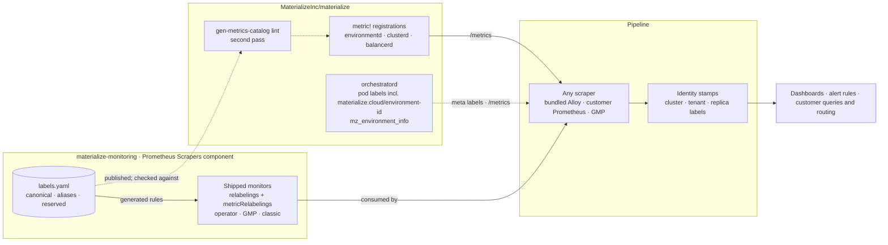

# A Label Vocabulary for Materialize Metrics

date: 2026-10-02


# A Label Vocabulary for Materialize Metrics


<table class="param-table">
  <tbody>
        <tr>
          <th>agent</th>
          <td>Claude Opus 5.5</td>
        </tr>
        <tr>
          <th>author</th>
          <td>Heather Lapointe</td>
        </tr>
        <tr>
          <th>lastmod</th>
          <td>2026-10-02 00:00:00 &#43;0000 UTC</td>
        </tr>
        <tr>
          <th>publishdate</th>
          <td>2026-10-02 00:00:00 &#43;0000 UTC</td>
        </tr>
        <tr>
          <th>status</th>
          <td>Draft</td>
        </tr>
  </tbody>
</table>


This doc proposes **one vocabulary of label names for the metrics Materialize emits**, a list of reserved names those metrics must not carry, and a two-pass path to both.
The first pass is relabeling in this repository's shipped scrapers, on this repository's release cadence.
The second pass is adoption in `MaterializeInc/materialize`, where the metrics are registered, until the relabeling has nothing left to do.
It owes the **label-family harmonization** item in [DEP-207](https://linear.app/materializeinc/issue/DEP-207).
It also writes down the relabeling contract that [DEP-109](https://linear.app/materializeinc/issue/DEP-109) planned and was canceled before writing.

The central claim is that **relabeling is how this repository makes a promise about labels it does not emit.**
Upstream metric labels are an [unstable interface](../../../stability/#unstable-interfaces) by policy, so nothing a consumer writes against them can be promised today.
A translation layer owned here turns that into a surface this repository can commit to.
Consumers are written once, against the canonical names.
The second pass changes who produces those names and nothing about what they are, so a consumer cannot observe it happening.

A second claim decides what moves upstream.
**The identity of the thing measured belongs to the emitter, and the identity of the process doing the emitting belongs to the pipeline.**
A Materialize cluster id means the same thing in every deployment, so Materialize should emit it under the canonical name.
A Kubernetes cluster, a namespace, and an environment's name differ by deployment, so they stay target and external labels permanently.
This is DEP-109's principle restated: a label that is the same across deployment modes is emitted correctly at the source, and one that varies is normalized in the pipeline.

The doc also settles **how every consumer keys a Materialize environment**, which several consumers are waiting on.
The key is `environment_id`, the `spec.environmentId` UUID of the `Materialize` resource, and it is carried on every series.
The display name is `environment_name`, carried on `mz_environment_info` and joined in rather than stamped everywhere.
Both are read from the `Materialize` resource, which is the only place either is declared.
`materialize_cloud_organization_name` is retired: it is the resource's `metadata.name`, copied through a pod label whose name describes Materialize Cloud's billing model rather than the value it holds.

<!-- more -->

<blockquote class="book-hint note">
The key words "MUST", "MUST NOT", "REQUIRED", "SHALL", "SHALL NOT",
"SHOULD", "SHOULD NOT", "RECOMMENDED", "MAY", and "OPTIONAL" in this
document are to be interpreted as described in
<a href="https://datatracker.ietf.org/doc/html/rfc2119" rel="external" class="external-link">RFC 2119</a>.
</blockquote>


The keywords carry the obligations on emitters, on the shipped monitors, and on the vocabulary file.
They appear on the reserved list, on the form of each relabeling rule, and on the order of the upstream renames.

<!--
Agent note: this doc records decisions and their *why*. When a decision lands in code, update the section and
check the matching row in "Chart-side prerequisites" or "Upstream work".

Six claims here are load-bearing and easy to soften by accident:
  1. `cluster` is emitted today, as a const label on two clusterd families, and it silently replaces the stack's
     own Kubernetes-cluster identity on them. Remote-write external_labels and both rulers fill `cluster` only
     where it is absent. Verified on a live self-managed GKE install at v26.43.0 and in
     src/compute/src/metrics.rs. It is a defect, not a style preference.
  2. Every alias rule is fill-if-empty with a `(.+)` capture, so it becomes a no-op the moment upstream emits the
     canonical name. That property is the whole reason the second pass is invisible to consumers. Do not
     "simplify" a rule to a plain replace.
  3. A label copied 1:1 from another label adds no series. Nothing here changes cardinality, which another team
     owns and which is out of scope.
  4. The canonical names are upstream's own newest spellings (the `_info` family, /metrics/public, the
     2026-07-08 cluster-metrics design doc). Keep it that way when adding rows; this doc adopts a vocabulary,
     it does not invent one.
  5. clusterd's cluster_id / replica_id stay target labels permanently. If clusterd ever emits them itself, the
     scrape renames its copy to exported_cluster_id, and /metrics/public appends a duplicate label name.
  6. environment_id is the bare spec.environmentId UUID, not environmentd's composite
     `<provider>-<region>-<uuid>-<ordinal>` (what `mz_environment_id()` returns, and whose UUID part upstream's
     EnvironmentId type calls `organization_id`). Uniqueness within a Kubernetes cluster is already enforced by
     orchestratord's check_environment_id_conflicts. Cloud reuses one UUID per organization across regions, which
     is why global uniqueness is a SHOULD and the global key is (cluster, environment_id).

The choice of environment key is the author's decision (2026-10-02). Revise its mechanics freely; do not reopen
the choice of key without them.

Counts are from materialize @ 6b71418 and the live install on 2026-10-02. Re-measure rather than hedge.
-->

## Goals

Functional requirements, framed as value-first user stories.
Priority tags (**Must** / **Should** / **Could**) are relative to the first shipped version.

The stakeholders are operators reading the shipped dashboards, customers who bring their own metrics backend, the authors of dashboards and alerts in this repository, Materialize engineers adding metrics upstream, and Materialize Cloud as it adopts this stack.

- **[Must] As any consumer of this stack's telemetry,** whether Console, the tenant-scoped read path, Cloud or a customer's own dashboards, I want one authoritative key for a Materialize environment, so that every consumer scopes to an environment the same way.
- **[Must] As an operator,** I want that key to be unique within my Kubernetes cluster and never to change, so that an environment's history stays one set of series for its whole life.
- **[Must] As an operator,** I want one label name for a Materialize cluster's id on every metric that describes a cluster, so that a query written against one family works against the next without `label_replace`.
- **[Must] As an operator running more than one Kubernetes cluster,** I want `cluster` on every series to name the Kubernetes cluster, so that alerts from two clusters never collapse into one incident.
- **[Must] As a customer with my own metrics backend,** I want Materialize's metrics to carry no label my backend claims for itself, so that ingest neither renames them nor lets them overwrite its own identity labels.
- **[Must] As a dashboard or alert author,** I want the canonical names in the scrape output before upstream changes anything, so that dashboards and rules migrate once rather than once per Materialize release.
- **[Must] As a customer with dashboards of my own,** I want a renamed label to keep its old name for a deprecation window, so that my dashboards move on my schedule rather than on upgrade.
- **[Must] As a customer routing alerts in my own Alertmanager,** I want the labels on shipped alerts to change only under the deprecation cycle, so that a routing tree written against them does not silently stop matching.
- **[Should] As a customer scraping Materialize with my own Prometheus,** I want the canonical names to come from the shipped monitors themselves, so that I get them without running the bundled pipeline.
- **[Should] As an operator,** I want an `_info` join to add a label that says what it names, so that the cluster and replica info metrics can be joined in one expression.
- **[Should] As an operator,** I want to rename an environment's display name without splitting its series, so that a name is a label for humans rather than part of every series' identity.
- **[Should] As an operator diagnosing an outage,** I want an environment's name to resolve while its environmentd is down, so that the dashboard for the broken environment still says which one it is.
- **[Should] As a Materialize engineer adding a metric,** I want CI to refuse a reserved label name and to flag a non-canonical spelling of a canonical concept, so that the vocabulary does not erode one metric at a time.
- **[Should] As a customer routing alerts,** I want one documented list of the labels on shipped metrics and alerts, so that routing has a contract to be written against.
- **[Could] As a Materialize Cloud engineer,** I want Cloud's scrape path to produce the same vocabulary, so that a query written for self-managed answers the same question in Cloud.
- **[Could] As an operator,** I want the build version to carry one label name across environmentd, clusterd, balancerd and persist, so that a version-skew panel needs no per-component cases.

## Technical BLUF

- **One cluster id, five label names.** `instance_id` on environmentd's controller metrics, `compute_instance` on the adapter's, `cluster_id` on the `_info` family, `compute_cluster_id` from the SQL exporter, and `cluster_environmentd_materialize_cloud_cluster_id` on everything clusterd emits. Replica id has three names, cluster name three, and a catalog object at least six.
- **The long form is named for its transport, not its meaning.** `cluster_environmentd_materialize_cloud_cluster_id` is the Kubernetes pod-label key `cluster.environmentd.materialize.cloud/cluster-id` passed through the scraper's sanitizer by `podTargetLabels`. Nobody upstream chose that name.
- **Upstream has already chosen the canonical spelling three times.** `mz_cluster_info` and `mz_replica_info`, the federated `/metrics/public` endpoint, and the upstream cluster-metrics design doc all use `cluster_id`, `replica_id`, `cluster_name` and `replica_name`. This design adopts that vocabulary and finishes it.
- **`cluster` is emitted today and it is destructive.** clusterd stamps `cluster="compute"` as a const label on `mz_timely_step_duration_seconds` and `mz_cluster_handle_command_duration_seconds`. Remote-write `external_labels` and both rulers fill `cluster` only where it is absent, so those series lose the Kubernetes-cluster identity the stack puts on everything else. No query reads either family, so the fix is free today.
- **Alias rules copy, never rename, and they retire themselves.** A rule fills `cluster_id` from `instance_id` only where `cluster_id` is empty and `instance_id` is not. When upstream emits `cluster_id`, the rule matches nothing. A 1:1 copy adds no series.
- **The rules belong in the shipped monitors, not the gateway.** The Prometheus Scrapers component is consumed directly by customers' own Prometheus and by the GMP flavor. A rule in the Alloy gateway reaches only the bundled path.
- **The transpiler has to learn to rename a pod label first.** `podTargetLabels` can only copy a pod label under its sanitized key. The operator flavor needs `relabelings`, GMP needs `targetLabels.fromPod[].to`, and the GMP flavor drops target relabelings silently today.
- **Process identity stays in the pipeline.** `cluster`, `namespace`, `pod`, the environment label, and clusterd's own cluster and replica ids are target or external labels, and remain so after the second pass.
- **The upstream hook already exists.** `bin/gen-metrics-catalog` walks every `metric!` invocation, records its label keys, and CI diffs the result. A reserved-name and canonical-spelling check is a lint over a file that is already generated.
- **The federated endpoint has a latent duplicate-label bug.** `add_replica_labels` appends `cluster_id` and `replica_id` without checking whether the series already has them. It is harmless only because no clusterd metric does yet. The second pass fixes it before any emitter adopts a canonical name.
- **Alert labels get the strictest treatment.** Rules pass `instance_id` and the long-form ids through to alerts, and an external routing tree may match on them. Rules aggregate by both names through the overlap, so an alert never loses a label inside the window.
- **An environment is keyed by `environment_id`, read from `Materialize.spec.environmentId`.** It is a UUID that orchestratord already resolves on first reconcile and already refuses to duplicate within a Kubernetes cluster, and the CRD forbids changing it because persist's layout depends on it. Every series from an environment's processes carries it.
- **An environment is named by `environment_name`, on `mz_environment_info` only.** The name is `metadata.name` today and could become a mutable `spec.environmentName`. Names are not unique and may change, so they are joined in, not stamped on every series, which is the same rule this doc applies to cluster and replica names.
- **The environment key needs one small upstream change before this repo can relabel it.** No pod label carries `spec.environmentId` today. orchestratord adding `materialize.cloud/environment-id` to the labels it puts on every pod, and emitting `mz_environment_info`, is a single change and the first item of upstream work.
- **`%%{mzEnvironmentFilter}` is the switch.** The query registry names the fragment 250 times and writes the environment label out 24 times, 22 of them in the two alert files. Moving the fragment from `materialize_cloud_organization_name` to `environment_id` is one change, made once the supported operator floor carries the pod label.
- **Cloud is the documented exception to global uniqueness.** Cloud sets `spec.environmentId` to the organization's UUID, which repeats in every region the organization uses. The globally unique key is therefore `(cluster, environment_id)`, which is one more reason `cluster` is reserved.

## Non-goals

- **Cardinality.** Series counts, per-shard label bounding ([PER-101](https://linear.app/materializeinc/issue/PER-101)), and dropping families belong to another team. Every change here is a rename or a 1:1 copy, and none adds or removes a series.
- **Metric names.** The `v2_mz_` prefix, units and suffixes are the same class of problem with a different mechanism, and `%%{mzSqlPrefix}` already handles the prefix.
- **Label values.** `status="ok"` beside `status="success"` is real and is left to a later pass. See [open questions](#open-questions).
- **The log vocabulary.** Loki stream labels are a committed surface with rules of their own. The environment key reaches logs as structured metadata; the rest of the log pipeline's names are a follow-up.
- **OpenTelemetry-native emission.** If Materialize emits OTLP itself one day, this vocabulary maps onto a `materialize.*` attribute namespace. Designing that mapping is not this doc.
- **Organization labels.** An organization is a Materialize Cloud billing concept with no counterpart in self-managed. Cloud MAY stamp one as a pipeline label of its own; the vocabulary does not define it.
- **Cloud's scrape configuration.** This doc says what Cloud would need in order to converge, not how Cloud's Pulumi gets there.
- **Tenancy classification.** Which families are environment-scoped is [DEP-272](https://linear.app/materializeinc/issue/DEP-272)'s question. This doc names the labels that classification reads.

## What exists today

| Capability | State | Where |
|---|---|---|
| Explicit `podTargetLabels` allowlist on every Materialize monitor | ✅ Shipped | `packages/prometheus-scrapers/podmonitor-{environmentd,clusterd,sql,materialize-operator}.yaml` |
| Kubernetes-cluster identity on every series and alert | ✅ Shipped | `cluster`, from `clusterName`, through remote-write `external_labels`, `--label` on the Thanos ruler, and `alert_relabel_configs` on the Loki ruler |
| Renaming target labels from meta labels into chosen names | ✅ Shipped, cAdvisor only | `scrapeconfig-cadvisor.yaml` maps node labels to `node`, `topology_kubernetes_io_*` and friends |
| A unique, immutable environment id | ✅ Shipped upstream | `Materialize.spec.environmentId`; orchestratord fills it from the license key or a random UUID on first reconcile and refuses a duplicate within the Kubernetes cluster |
| The environment id on any pod label or metric | ❌ **Missing** | orchestratord's pod labels carry the resource's name, namespace and resource id, and not `spec.environmentId` |
| An environment label on every series | ⚠️ Shipped, misnamed | `materialize_cloud_organization_name`, which is `metadata.name` copied from the `materialize.cloud/organization-name` pod label |
| An environment `_info` metric | ❌ **Missing** | No series carries an environment's name independently of its own processes |
| `metricRelabelings` on any Materialize monitor | ❌ **None** | All four declare `relabelings: []` or omit it, and none has metric rules |
| A canonical name for any Materialize entity | ❌ **Missing** | Five names for a cluster id; see [one concept, many names](#one-concept-many-names) |
| A reserved-label list | ❌ **Missing** | Nothing in `docs/content` names one |
| Label-name validation upstream | ❌ **Missing** | `metric!` takes free-form string literals; `gen-metrics-catalog` records label keys and checks none |
| `_info` payload labels qualified by entity | ⚠️ Partial | `cluster_id` and `replica_id` are; `name`, `type` and `size` are not, so two joins collide |
| GMP flavor honouring GMP's protected labels | ❌ **Missing** | `metricRelabelings` are cloned unfiltered; target `relabelings` are dropped without a warning |
| A machine-readable record of labels in use | ⚠️ Partial | `docs/assets/metrics/metrics.yaml` lists labels per metric, but only those in selector matchers, not `by`, `on`, `group_left` or joins |
| Documentation of the label families | ⚠️ Partial | The [style guide's label-family section](../../dashboard/style-guidelines/#materialize-metric-label-families), written as a field guide to the inconsistency rather than a fix for it |
| A label contract for alert routing | ❌ Owed | Listed under the [alerting design's](../20260917-alerting-self-managed/) documentation deliverables |

## One concept, many names

The live install has 77 distinct label names across environmentd, clusterd and the SQL exporter, not counting target labels.
Most are dimensions of a single measurement and are fine.
The identity labels are the problem, because identity labels are join keys.

| Concept | Names in use | Where each comes from |
|---|---|---|
| Materialize environment | `materialize_cloud_organization_name` · `organization_name` · `materialize_cloud_organization_id` · `mz_context_org_name` | the resource's `metadata.name`, through a pod label, on metrics · the same, as log structured metadata · Cloud only, cut from the name by a regex · Cloud only, from analytics annotations |
| Materialize cluster id | `instance_id` · `compute_instance` · `cluster_id` · `compute_cluster_id` · `cluster_environmentd_materialize_cloud_cluster_id` | environmentd controller metrics (33 `metric!` sites) · `mz_determine_timestamp` and two siblings in the adapter · the `_info` family and `/metrics/public` · the SQL exporter · clusterd, from the pod label |
| Materialize cluster name | `name` · `cluster_name` · `compute_cluster_name` | `mz_cluster_info` · `/metrics/public`, and this repository's own `mzClusterName` join · the SQL exporter |
| Replica id | `replica_id` · `compute_replica_id` · `cluster_environmentd_materialize_cloud_replica_id` | controller metrics and `mz_replica_info` · the SQL exporter · clusterd, from the pod label |
| Replica name | `name` · `replica_name` · `compute_replica_name` · `replica_full_name` | `mz_replica_info` · `/metrics/public` · the SQL exporter, twice |
| Catalog object | `object_id` · `global_id` · `collection_id` · `source_id` · `sink_id` · `id` | `mz_object_info` (both of the first two) · controller and wallclock-lag metrics · storage statistics · `mz_storage_regressed_offset_known` |
| Persist shard | `shard` · `shard_id` | persist-client (34 sites) · storage statistics (11) |
| The compute or storage half of clusterd | `cluster` · `server_name` | two const labels in `src/compute/src/metrics.rs` · the CTP transport metrics |
| Build version | `version` · `mz_version` | const labels on `mz_start_time_environmentd`, `mz_persist_metadata_seconds` and `mz_balancer_metadata_seconds` · the SQL exporter |

The consumers in this repository carry the cost.
The cluster picker's value comes from `compute_cluster_id` and is matched against three different label names, chosen per query: the long form 24 times, `instance_id` 18 times and `compute_cluster_id` 6 times.
The query author has to know which family a metric belongs to, and the [style guide](../../dashboard/style-guidelines/#materialize-metric-label-families) exists largely to tell them.
The `mzClusterName` and `mzObjectName` helpers exist because a name join needs a `label_replace` first.
The rendered `env-top` dashboard spells `instance_id` 254 times and the long form 156 times, and the rendered rules 86 and 113 times.

### The long form is named for its transport

The Materialize orchestrator labels every clusterd pod `cluster.environmentd.materialize.cloud/cluster-id`.
The monitors copy that pod label with `podTargetLabels`, and prometheus-operator sanitizes the key into a label name.
`cluster_environmentd_materialize_cloud_cluster_id` is therefore the label's route into Prometheus, spelled out.
It says nothing about what the value is, and it cannot be shortened without a rule that renames it, which no shipped monitor has.

Materialize Cloud reaches the same names by another route: a blanket `labelmap` over every pod label and every pod annotation, which also produces the `_size`, `_scale`, `_workers`, `_replica_role`, `_cluster_name` and `_replica_name` variants.
The shipped monitors copy only the id pair, which is why those variants are absent on self-managed.

### `name` means four things

`name` is the shard's name on 28 persist families, the cluster's name on `mz_cluster_info`, the replica's name on `mz_replica_info`, and the object's name on `mz_object_info`.
On an `_info` metric a label is the payload of a `group_left`, so an unqualified one collides with the next join:

```promql
# Even with the ids aligned, the second join's `name` overwrites the first's:
# the result carries the replica's name and has lost the cluster's.
mz_compute_replica_history_dataflow_count
  * on (cluster_id) group_left (name) mz_cluster_info
  * on (cluster_id, replica_id) group_left (name) mz_replica_info
```

`type` and `size` have the same problem.
`mz_cluster_info` and `mz_replica_info` both carry `size`, meaning the cluster's managed size on one and the replica's size on the other.

## Architecture



Three properties of this diagram carry the design.

**The vocabulary is one file, and everything else is generated from it.**
The monitors' rules in all three flavors, the docs table, the query-registry check and the upstream lint all read `labels.yaml`.
A canonical name added in one of those places and not the others is the drift this design exists to remove.

**The rules sit in the monitors, upstream of every scraper.**
A customer running their own Prometheus or GMP consumes the monitors directly, and the bundled gateway is one consumer among several.
Identity stamps are added after the rules, so nothing a rule does can touch `cluster`.

**The arrow into the upstream registrations is dotted.**
The second pass changes who produces the canonical names, not what they are.
Nothing to the right of the monitors changes when it happens.

## Reserved labels

A **reserved label** is a label name that some system on the path from emitter to reader assigns a meaning of its own.
Materialize metrics MUST NOT carry a reserved label.
Where one is emitted today, the shipped monitors MUST move its value to a canonical name and drop the reserved label, with no overlap.
A collision is a defect, and the colliding name has no consumer worth preserving.

| Label | Claimed by | What a collision does | Emitted by Materialize today |
|---|---|---|---|
| `cluster` | This stack's `clusterName` stamp and Alertmanager `group_by`; GMP's `prometheus_target` resource; Mimir's HA tracker; the kube-prometheus mixins | The external label and the rulers' stamp are skipped, so the series loses its Kubernetes-cluster identity. See [below](#cluster-is-live-today) | **Yes**, `cluster="compute"` on two clusterd families |
| `namespace` · `pod` · `container` · `endpoint` · `service` · `node` | prometheus-operator target labels; GMP (`namespace`); kube-state-metrics | Renamed to `exported_<name>` at scrape with `honor_labels: false`, or overwrites the target's identity with it on | No |
| `job` · `instance` | Prometheus target identity; OpenTelemetry's `service.name` and `service.instance.id`; GMP | As above; the gateway's OTLP bridge also refuses a sample without both | No |
| `le` · `quantile` | Histogram buckets and summaries | Valid only on series of those types | `quantile` on a gauge; see [deliberately unchanged](#deliberately-unchanged) |
| `project_id` · `location` | GMP's `prometheus_target` resource | GMP refuses any relabeling rule that writes them | No |
| `tenant_id` | Thanos Receive's tenant label, stamped on every series here as `default-tenant` | Receive's tenancy and any read-path enforcement built on it | No; balancerd's `tenant` is a different name |
| `replica` · `prometheus_replica` · `receive_replica` · `ruler_replica` · `__replica__` | High-availability deduplication in Thanos Query and Mimir | Deduplication drops or merges series that are not replicas of one another | No |
| `prometheus` | prometheus-operator's default external label | As `cluster` | No |
| `service` · `host` · `env` · `version` · `source` · `device` · `team` | Datadog's reserved tag keys | Datadog reads them as unified service tagging and log-source facets on the OTLP path to Datadog | **Yes**, `version` as a const label on three metadata families and a variable label on two persist families; `source` on twelve `metric!` sites |
| `service_*` · `k8s_*` · `cloud_*` · `host_*` · `deployment_*` · `telemetry_*` · `process_*` | OpenTelemetry resource attributes, as promoted to labels | Competes with the promoted attribute of the same name | No |
| `alertname` · `severity` · `audience` · `component` | This stack's alert routing; a rule's static labels override a series' labels | The metric's value is silently replaced on every alert the rule raises | No |
| `flavor` · `network_component` | This repository's dependency adapters and CNI monitors | Detection of the adapter or the dataplane | No |
| `exported_*` · `__*` | Prometheus itself | Collision output and internal labels respectively | No |

The list is closed by the vocabulary file and open to additions.
A name added to it is added for every emitter at once, which is the reason it lives in one place.

### `cluster` is live today

`src/compute/src/metrics.rs` registers two families with `const_labels: {"cluster" => "compute"}`.
On the live install every other series carries `cluster="default"`, from `clusterName`, and these two carry `cluster="compute"`.
The stamp fills `cluster` only where it is absent, in remote-write `external_labels`, in the Thanos ruler's `--label`, and in the Loki ruler's `alert_relabel_configs`.
That rule is correct, because it lets a destination's own `externalLabels` override the default.
It is also exactly why an emitted `cluster` wins.

The consequences depend on the destination:

| Destination | Effect |
|---|---|
| Any multi-cluster store | Both families answer "which Kubernetes cluster" with `compute`, for every cluster |
| This stack's Alertmanager | `group_by: [alertname, cluster, namespace]` would group an alert on either family across every cluster into one notification, and PagerDuty's `dedup_key` would merge them into one incident |
| Mimir with HA deduplication on | The HA tracker keys on `cluster` by default, so senders in different Kubernetes clusters look like replicas of one sender, and only one of them has its samples accepted |
| GMP | GMP sets `cluster` during collection and refuses rules that write it; how it resolves a metric label of that name is untested |

No query in the registry reads either family, so moving the label costs nothing today.
The canonical name is `server_name`, which the CTP transport metrics in `src/service/src/transport/metrics.rs` already use for the same compute-or-storage distinction.

### Names to avoid

A second tier is not reserved by any one system and is still ambiguous wherever Materialize's metrics share a store with anything else.
New metrics SHOULD NOT use these names, and existing uses SHOULD move to a qualified name through the alias mechanism.

| Name | Why it is ambiguous | Qualified replacement |
|---|---|---|
| `name` | Four meanings across Materialize families; cAdvisor's container name; first in Loki's `service_name` discovery list after `service` and `app` | `cluster_name` · `replica_name` · `object_name` · `shard_name` |
| `type` | Object type, source type, message type and a compute dimension, on different families | `object_type` · `source_type` · `sink_type` · `message_type` |
| `id` | cAdvisor's cgroup path; meaningless without an entity | `source_id` on `mz_storage_regressed_offset_known` |
| `size` | The cluster's size or the replica's, depending on the family; `size_class` is unrelated | `cluster_size` · `replica_size` |
| `version` | Datadog-reserved; means the process's build on some families and the writer's build on persist's part-version families | `build_version`, and a persist-chosen name for the second meaning |
| `source` | Datadog-reserved; also a Materialize catalog noun, which it never means here | Per family: which listener on the HTTP and balancer metrics, which collector on `mz_metrics_resource_usage` |
| `instance_id` | Reads as the id of Prometheus's `instance`, and as a VM in cloud vocabularies (`gce_instance`, EC2's `InstanceId`), which the provider pulls bring into the same store | `cluster_id` |
| `honeycomb` | A vendor routing hint baked into emission, constant `import` on two persist families | Nothing; the label carries no information |
| `environment` | Many installs already stamp it as an external label meaning production or staging | `environment_id` · `environment_name` |

## The canonical vocabulary

Five rules generate the table below.

1. A label naming a Materialize entity MUST be `<entity>_<property>`, where the entity is a catalog noun: `cluster_id`, `replica_name`, `shard_id`.
2. Every label on an `_info` metric MUST be entity-qualified, because each one is the payload of a `group_left`.
3. An identity label SHOULD take the name of the catalog column a reader would join it to in SQL.
4. A dimension label, one that describes the measurement rather than the thing measured, MAY be unqualified unless its name is in [names to avoid](#names-to-avoid).
5. Canonical names carry no vendor or product prefix.

The fifth rule is a choice, and the alternative was considered.
An `mz_` prefix would make every identity label collision-proof by construction, and it reads naturally beside `mz_*` metric names.
It loses on two counts.
Materialize Cloud already stamps `mz_cluster` as the **EKS cluster's** name, so `mz_cluster_id` would put a Materialize cluster one suffix away from a Kubernetes one in Cloud's own store.
And upstream has already chosen the unprefixed spelling in its three newest pieces of work, so a prefix would mean renaming the `_info` family, which was designed as the join target and is the newest part of the contract.

| Canonical | Meaning | Joins to | Aliases it replaces | Emitted under this name today by |
|---|---|---|---|---|
| `environment_id` | Materialize environment; see [the environment key](#the-environment-key) | `Materialize.spec.environmentId`; the UUID inside `mz_environment_id()` | `materialize_cloud_organization_name` as the scoping key · `materialize_cloud_organization_id` in Cloud | — |
| `environment_name` | The environment's display name, on `mz_environment_info` only | `spec.environmentName` if set, else `metadata.name` | `materialize_cloud_organization_name` as a display value | — |
| `cluster_id` | Materialize cluster | `mz_clusters.id` | `instance_id` · `compute_instance` · `compute_cluster_id` · `cluster_environmentd_materialize_cloud_cluster_id` | `_info` family, `/metrics/public` |
| `cluster_name` | Materialize cluster's name | `mz_clusters.name` | `name` on `mz_cluster_info` · `compute_cluster_name` | `/metrics/public`; this repository's `mzClusterName` join |
| `cluster_size` | A managed cluster's size | `mz_clusters.size` | `size` on `mz_cluster_info` | — |
| `replica_id` | Cluster replica | `mz_cluster_replicas.id` | `compute_replica_id` · `cluster_environmentd_materialize_cloud_replica_id` | Controller metrics, `mz_replica_info`, `/metrics/public` |
| `replica_name` | Replica's name | `mz_cluster_replicas.name` | `name` on `mz_replica_info` · `compute_replica_name` | `/metrics/public` |
| `replica_size` | Replica's size | `mz_cluster_replicas.size` | `size` on `mz_replica_info` | — |
| `object_id` | Catalog item | `mz_objects.id` | — | `mz_object_info` |
| `object_name` · `object_type` | Catalog item's name and type | `mz_objects.name` · `mz_objects.type` | `name` · `type` on `mz_object_info` | — |
| `collection_id` | A collection's global id | `mz_internal.mz_object_global_ids.global_id` | `global_id` on `mz_object_info` | Controller and wallclock-lag metrics |
| `source_id` · `sink_id` · `parent_source_id` | Source, sink, and a subsource's parent | `mz_sources.id` · `mz_sinks.id` | `id` on `mz_storage_regressed_offset_known` | Storage statistics |
| `source_type` · `sink_type` | Their connection types | `mz_sources.type` · `mz_sinks.type` | `type` on `mz_source_info` / `mz_sink_info` | — |
| `shard_id` | Persist shard | `mz_internal.mz_storage_shards.shard_id` | `shard` | Storage statistics |
| `shard_name` | Persist shard's name | — | `name` on `mz_persist_*` | — |
| `server_name` | The compute or storage half of clusterd | — | `cluster` (reserved) | CTP transport metrics |
| `build_version` · `build_type` | The emitting process's build | `mz_version()` | `version` on the start-time and metadata families · `mz_version` | `build_type` already, everywhere `version` is |
| `worker_id` · `process` · `workload_class` | Timely worker, replica process, workload class | — | — | Unchanged |

`collection_id` is preferred over `global_id` because it names an entity rather than a type, and because it is the spelling the controllers emit and the dashboards already group by.
The catalog is not consistent here either, and the alternative is recorded as an [open question](#open-questions).

### Deliberately unchanged

| Label | Why it stays |
|---|---|
| `quantile` on `mz_dataflow_wallclock_lag_seconds` | A hand-rolled summary on a gauge vector, which misuses a reserved name. Sixteen queries match on it, and the correct fix is a real histogram upstream, not a rename here. A recorded exception |
| The SQL exporter's labels | The `environmentd-sql` job is slated for deletion with the Tier 2 work in [the metrics contract](../../roadmap/#metrics-contract-upstream-dependency). Aliases are added only for labels a shipped query reads, which are `compute_cluster_id`, `compute_cluster_name` and `compute_replica_id` |
| `app` | A target label the gateway already derives from the pod's `app.kubernetes.io/name`, `app` or `k8s-app` label |

### Ids on series, names on `_info`

An id is part of a series' identity, and a name is not.
A label on a series is part of what makes it that series, so a label whose value changes ends one series and starts another, and every `rate()` across the change breaks.
Ids never change, so they MUST be on the series that describe their entity.
Names can change and are not unique, so a name SHOULD appear only on its entity's `_info` metric, and consumers join it in.

The rule covers environments, clusters and replicas alike.
clusterd pods carry `cluster-name` and `replica-name` **annotations**, and Cloud's annotation `labelmap` turns them into labels on every series.
The shipped monitors could copy them the same way, and this design deliberately does not.
The `_info` family reads the catalog on every scrape, so a name taken from it is current by construction.
An annotation is current only as of the pod's last template change, and a renamed cluster is exactly the case where the two disagree.
`/metrics/public` appending `cluster_name` and `replica_name` to every federated series is an existing departure from the rule, listed under [upstream work](#upstream-work).

## The environment key

An environment is one `Materialize` resource: one environmentd and the clusters, balancers and consoles it runs.

| Label | Source | Requirement |
|---|---|---|
| `environment_id` | `Materialize.spec.environmentId`, as the bare UUID in canonical lowercase hyphenated form | MUST be on every series an environment's own processes emit. MUST be unique within a Kubernetes cluster. SHOULD be unique across every Materialize install. MUST NOT change for the life of the environment |
| `environment_name` | `spec.environmentName` when that field exists and is set, otherwise `metadata.name` | SHOULD NOT change, and is not unique. SHOULD appear only on `mz_environment_info`. Consumers MUST NOT use it as a key |

### Why `spec.environmentId`

It is the only field the resource declares as the environment's identity, and its upstream guarantees already match what a key needs.

| Property | Where it is guaranteed |
|---|---|
| Always present | orchestratord fills a nil id on first reconcile, from the license key's environment id or from a random v4 UUID, and writes it back to the spec |
| Unique within the Kubernetes cluster | `check_environment_id_conflicts` lists every `Materialize` resource in the cluster and refuses to reconcile two with the same id |
| Immutable | The CRD's own documentation: the value "MUST NOT be changed in an existing instance", because persist's storage layout depends on it |

The alternatives each fail one of those.
`metadata.name` is unique only within a namespace and is chosen by whoever writes the manifest.
The namespace is a deployment choice and repeats across clusters.
`status.resourceId`, which prefixes every pod name and reaches pods as `materialize.cloud/mz-resource-id`, is unique within the cluster but is derived status rather than declared spec, and nothing outside the cluster knows it.

### The value is the UUID, not environmentd's environment id

environmentd is started with a composite `--environment-id`, `<cloud_provider>-<region>-<uuid>-<ordinal>`, which orchestratord builds with an ordinal of `0` and which `mz_environment_id()` returns in SQL.
Upstream's `EnvironmentId` type calls the UUID component `organization_id`.
`environment_id` carries the UUID alone.
The provider and region are deployment facts with labels of their own, and the ordinal is a constant.
A consumer joining from SQL takes the UUID component of `mz_environment_id()`.

### Global uniqueness is a SHOULD, and Cloud is why

| Where the id came from | Unique within the cluster | Unique globally |
|---|---|---|
| A license key carrying an environment id | ✅ Enforced | ✅ Unless one key is reused across installs |
| orchestratord's random default | ✅ Enforced | ✅ |
| Set by hand in the manifest | ✅ Enforced | ⚠️ Unless a manifest was copied between clusters |
| Materialize Cloud | ✅ Enforced | ❌ Cloud uses the organization's UUID, so it repeats in every region the organization uses |

The globally unique key is therefore `(cluster, environment_id)`.
A store holding more than one Kubernetes cluster MUST scope by both.
That is already the stack's behaviour, since `cluster` is stamped on every series, and it is one more reason `cluster` is [reserved](#reserved-labels).

### `mz_environment_info`

`mz_environment_info` carries `environment_id`, `environment_name` and `environment_namespace`, the namespace the resource lives in, with a constant value of 1.
It is the only series that names an environment.

orchestratord is the right emitter, rather than environmentd, for three reasons.
It already holds the resource, and every field the info metric carries is on it.
It emits one series per resource, where environmentd would emit one per generation and two during every blue/green rollout.
And it keeps emitting while environmentd is down, which is when a dashboard most needs to say which environment it is looking at.

The resource's namespace is `environment_namespace` and not `namespace`, because orchestratord's own `namespace` target label names the operator's namespace and an emitted `namespace` would be renamed `exported_namespace`.
It replaces `materialize_cloud_organization_namespace`, which on an environment's own series repeats the `namespace` target label.

kube-state-metrics can produce the same series today from its `customResourceState` support, with no upstream change, by reading the `Materialize` resource.
It is the fallback if the orchestratord change slips, and it covers operator versions that predate it.
Every join reads the info metric through `group by (cluster, environment_id, environment_name)`, which collapses identical series from two producers, so the bridge and orchestratord can overlap safely.
The join is on `(cluster, environment_id)`, never on `environment_id` alone, for the [uniqueness](#global-uniqueness-is-a-should-and-cloud-is-why) reason above.

### What consumers change

| Consumer | Today | After |
|---|---|---|
| `%%{mzEnvironmentFilter}` | `materialize_cloud_organization_name=~"$environmentNameList"` | `environment_id=~"$environmentList"` |
| The environment picker | `label_values` of the old label on `mz_compute_commands_total`, so an environment is listed only while its environmentd has reported within the dashboard's range | `mz_environment_info`, with `environment_id` as the value and the name as the display text, the shape the cluster picker already uses. Names are not unique, so the display SHOULD include the namespace |
| `mzEnvironmentName` in rules | A join through `up` on `namespace` | `* on (cluster, environment_id) group_left (environment_name) group by (cluster, environment_id, environment_name) (mz_environment_info)` |
| The namespace picker and `cAdvisorFilter` | `materialize_cloud_organization_namespace` | `environment_namespace` from `mz_environment_info` for the selected environments |
| Shipped alerts | The old label passed through on most of them, written out or through `mzEnvironmentName` | `environment_id` always, and `environment_name` where the rule joins it |
| [The tenant-scoped read path](../20260916-tenant-query-api/) | Injects a matcher on the old label | Injects `environment_id`, and `cluster` where the store spans clusters |
| Log structured metadata | `organization_name`, from the same pod label | `environment_id` beside it, from the new pod label |
| `kube_pod_labels` ([DEP-253](https://linear.app/materializeinc/issue/DEP-253)) | No Materialize labels | `materialize.cloud/environment-id` in the allowlist, so Kubernetes object metrics join to an environment |

### The transition is gated on the operator, not on a relabel

Every other alias in this design is a fill-if-empty copy of the same value under a new name.
The environment key cannot be one, because `environment_id` and `materialize_cloud_organization_name` hold different values, and no relabeling rule can derive a UUID from a name.
Its overlap is therefore "both labels present", and it starts when the operator puts the new pod label on the pods.

1. orchestratord adds `materialize.cloud/environment-id` to `default_labels()`, which reaches environmentd, balancerd and console pods directly and clusterd pods through the service labels orchestratord passes environmentd. It emits `mz_environment_info`. The label changes the pod template, so it reaches an environment's pods at its next rollout.
2. The shipped monitors add a target alias from that pod label to `environment_id`. On an older operator the meta label is absent and the rule does nothing.
3. [Compatibility](../../../compatibility/) declares the operator version that carries the label.
4. Once the supported operator floor includes that version, `%%{mzEnvironmentFilter}`, the picker, the namespace picker and `mzEnvironmentName` move to the new keys in one change. A `**Deprecated:**` note names `materialize_cloud_organization_name`, `_namespace` and `_id`.
5. After 30 days the old keys leave `podTargetLabels`.

Step 4 is a render-time switch, like `%%{mzSqlPrefix}`.
If a fleet ever needs both keys at once, the fragment can render either, and the dashboards are built for one or the other.

## The first pass: relabeling in the shipped monitors

### Where the rules live

| Home | Reaches | Verdict |
|---|---|---|
| **The shipped monitors** (`relabelings`, `metricRelabelings`) | Every consumer of the Prometheus Scrapers component: the bundled gateway, a customer's prometheus-operator, the GMP flavor, the classic scrape config | **Chosen** |
| The gateway's `otelcol.processor.filter "inputMetricProcessor"`, which [the pipelines page](../../pipelines/metrics/#where-relabeling-lives-three-phases) names as the home for "dashboard-contract normalization" | The bundled path only | Rejected. A customer scraping with their own Prometheus would see a different vocabulary from the one the shipped dashboards are written against |
| Recording rules | Whatever reads the recorded name | Rejected. A rename needs no arithmetic, and a recorded copy doubles the series. The [external-dependency design](../20260920-external-dependency-monitoring/#a-normalized-contract-with-flavor-native-passthrough) chose recording rules because its mapping needed ratios and unit conversion; this one does not |
| `label_replace` at query time | One query | Today's answer. It puts the cost on every consumer, which is the cost being removed |

The per-target placement has one cost: a rule appears in every monitor that needs it.
Generating the rules from one file makes the replication free, and keeps a cross-cutting rule from becoming the one monitor that forgot it.

### Four rule forms

Every rule the vocabulary generates takes one of four forms.

| Form | Applies to | Rendered as |
|---|---|---|
| **Target alias** | A pod label renamed into a canonical target label: clusterd's cluster and replica ids | A `relabelings` `replace` from `__meta_kubernetes_pod_label_*` (operator, classic); a `targetLabels.fromPod` entry with `to` (GMP) |
| **Metric alias** | An emitted label copied to its canonical name: `instance_id`, `shard`, `name` on a named family | A `metricRelabelings` fill-if-empty `replace` |
| **Reserved move** | An emitted reserved label: `cluster` | A metric alias to the canonical name, then a `labeldrop` of the reserved name |
| **Drop** | A constant label carrying no information: `honeycomb` | A `labeldrop` |

A metric alias MUST be fill-if-empty, and it MUST NOT overwrite a canonical label that is already present:

```yaml
# Fill cluster_id from instance_id only where cluster_id is empty and instance_id is not.
# Relabel regexes are fully anchored, so "u1;u1" and ";" both fail to match.
- sourceLabels: [cluster_id, instance_id]
  separator: ";"
  regex: ";(.+)"
  targetLabel: cluster_id
  replacement: "$1"
  action: replace
```

That form is what makes the second pass invisible.
Once upstream emits `cluster_id`, the joined value is `u1;u1` or `u1;`, the rule matches nothing, and the series is unchanged.
A plain `replace` would also produce the right value today, and would silently overwrite upstream's value tomorrow if the two ever disagreed.

An alias scoped to some families adds `__name__` to the source labels:

```yaml
# `name` on mz_cluster_info is the cluster's name. Elsewhere it means something else.
- sourceLabels: [__name__, cluster_name, name]
  separator: ";"
  regex: "mz_cluster_info;;(.+)"
  targetLabel: cluster_name
  replacement: "$1"
  action: replace
```

The target alias reads a meta label, which exists only during target relabeling:

```yaml
- sourceLabels: [__meta_kubernetes_pod_label_cluster_environmentd_materialize_cloud_cluster_id]
  regex: "(.+)"
  targetLabel: cluster_id
  replacement: "$1"
  action: replace
```

A copy of a label into another label with the same value cannot create a series, since the set of distinct label sets is unchanged.
It adds index entries and bytes per series, which is the whole of the cost.

### One vocabulary file

The vocabulary lives in `packages/prometheus-scrapers/labels.yaml`, owned by the Prometheus Scrapers component, because that is the component whose output changes.
A sketch of the shape:

```yaml
reserved:
  - name: cluster
    claimedBy: [this stack, gmp, mimir-ha, kube-prometheus]
canonical:
  - name: cluster_id
    meaning: Materialize cluster id
    joinsTo: mz_clusters.id
    valuePattern: "[su][0-9]+"
    fromPodLabel: cluster.environmentd.materialize.cloud/cluster-id
    aliases:
      - label: instance_id
        deprecatedIn: "x.y.z"
      - label: compute_instance
        deprecatedIn: "x.y.z"
      - label: cluster_environmentd_materialize_cloud_cluster_id
        deprecatedIn: "x.y.z"
  - name: server_name
    aliases:
      - label: cluster
        reserved: true
  - name: cluster_name
    aliases:
      - label: name
        families: [mz_cluster_info]
drop:
  - label: honeycomb
```

The transpiler renders each monitor's rules from it, in every flavor.
The query-registry build reads it to reject a query matching on a retired alias or on a reserved label.
The docsite renders the customer-facing label contract from it.
The upstream lint reads the `reserved` and `canonical` sections.

### The three flavors

| Flavor | Target alias | Metric rules | Gap today |
|---|---|---|---|
| prometheus-operator (deployed by the chart) | `relabelings` | `metricRelabelings` | None; the flavor is a verbatim passthrough |
| Classic scrape config | `relabel_configs` | `metric_relabel_configs` | None beyond the existing `FIXME_target_port` placeholder |
| GMP `PodMonitoring` | `targetLabels.fromPod[].to` | `metricRelabeling` | Target `relabelings` are dropped silently; GMP refuses any rule writing `project_id`, `location`, `cluster`, `namespace`, `job`, `instance` or `__address__`, and refuses `labelmap` outright |

The GMP flavor MUST fail the render on a rule it cannot express, rather than dropping it.
A rule dropped silently is a dashboard that is empty on one flavor and fine on the others, which no render test can see.
Whether GMP accepts a `labeldrop` of `cluster` is untested.
If it does not, the GMP flavor cannot correct the `cluster` collision at scrape, and the upstream fix is the only one available to it, which is one more reason to land that fix first.

### The overlap, and what retires it

A metric label rename is graded as visible and non-paging by the [deprecation policy](../20260823-deprecation-policy/#grade-the-ceremony-by-failure-mode), and the policy asks for a dual-publish shim where this repository's layer allows one.
The alias rules are that shim.

| Step | What changes | What a consumer sees |
|---|---|---|
| 1. Reserved moves and drops | `cluster` becomes `server_name`; `honeycomb` goes | Two families gain their Kubernetes-cluster identity. Nothing reads them |
| 2. Aliases ship | Every alias rule is added; both names present on every series | Nothing breaks. A `**Deprecated:**` release note names each alias and its replacement |
| 3. This repository migrates | Registry queries, dashboard selectors, variables and the `mzClusterName` / `mzObjectName` helpers move to canonical names | Dashboards unchanged in behaviour; the `label_replace` in each name join disappears |
| 4. Overlap holds | At least 30 days, measured from the release note | Customers move their own queries |
| 5. Aliases retire | `labeldrop` of each alias; the long-form keys leave `podTargetLabels` | Queries on old names go empty, as announced. A `**Removed:**` note |

Step 3 also decouples the dashboards from the Materialize version.
The canonical names are produced by the monitors against every Materialize release, so a dashboard on `cluster_id` works on a release that emits `instance_id` and on one that emits `cluster_id`.
Today a rename upstream would need a `min-mz-version` bump or a second arm in every affected query.

The pre-1.0 budget makes this cheap now.
The [deprecation policy](../20260823-deprecation-policy/#the-pre-10-breaking-change-budget) lists label-family harmonization as "cheaper before anyone queries the long-form labels", and asks whether it should block 1.0.
This design's answer is that the first pass SHOULD land before [DEP-205](https://linear.app/materializeinc/issue/DEP-205) stamps 1.0, and the second pass need not.

### Alerts keep both labels through the window

Alert labels are the strictest surface in the policy, because a routing tree that stops matching is silent.
Of the shipped rules, platform alerts pass `instance_id` through three times and the long-form ids five times, and workload alerts pass them seven times.
An external Alertmanager may route on any of them.

During the overlap, a rule that aggregates `by (instance_id)` MUST aggregate `by (cluster_id, instance_id)` instead.
Both labels are present and equal on every series, so the aggregation produces the same series and the alert carries both names.
At step 5 the alias drops out of the `by` clause with the rest.
The promtool tests that assert `by (…) (ALERTS)` on the old names change in the same pull request, which is the check that no alert lost a label early.

## The second pass: adoption upstream

### The order keeps it invisible

The second pass is a sequence, and the order matters more than the content.

1. **The lint lands first.** It refuses reserved names outright and flags a non-canonical spelling of a canonical concept on any new metric, with the existing ones on an exception list that only shrinks.
2. **The federated endpoint stops appending blindly.** `add_replica_labels` in `src/environmentd/src/http/metrics_public.rs` pushes `cluster_id`, `replica_id`, `process`, `cluster_name` and `replica_name` without checking for an existing label of the same name. A series carrying two values for one label name is invalid exposition.
3. **Reserved names go.** The two `cluster` const labels become `server_name`, and `honeycomb` is removed. These need no coordination, since the monitors already move them.
4. **Renames land, one family at a time, after the matching alias has shipped here.** Upstream MAY rename at any point after step 2 of the overlap. The fill-if-empty rule absorbs the change, and the release note here has already told consumers the new name.
5. **The exception list empties.** At that point every alias rule in the monitors is a no-op, and the next minor removes them.

The environment key sits outside this sequence.
orchestratord's pod label and `mz_environment_info` add names and rename nothing, so they can land first and in parallel, and the [environment transition](#the-transition-is-gated-on-the-operator-not-on-a-relabel) is gated on the operator version rather than on an alias.

The constraint on step 4 is one-directional.
Upstream renaming early is safe, because the alias covers it.
Upstream renaming a family that has no alias here yet is the one ordering that produces a visible break, and the lint's exception list is what makes that ordering visible before it merges.

### The hook already exists

`src/metrics-catalog/src/main.rs`, run as `bin/gen-metrics-catalog`, parses every `metric!` invocation with `syn` and writes each family's label keys into `doc/user/data/metrics.yml`.
`ci/test/lint-metrics-catalog.sh` fails CI when that file is stale.
A label lint is therefore a pass over a file that CI already guarantees is current, and needs no new extraction.

The lint reads the `reserved` and `canonical` sections of `labels.yaml`.
Where that file lives, and which repository is its source of truth, is an [open question](#open-questions).

Two label sources sit outside `metric!` and need the check separately:

| Source | Where | What it needs |
|---|---|---|
| Registry postprocessors | `register_postprocessor` in `src/ore/src/metrics.rs`; `workload_class` is appended this way in both environmentd and clusterd | The same reserved check, at registration |
| User-defined labels in a SQL metric sink | `src/compute/src/sink/metric_sink.rs`, which checks only the Prometheus grammar | A reserved-name refusal. A user who names a label `cluster` produces the same collision as the compute const label |

### What stays in the pipeline

Some labels never move upstream, and the second pass is done when everything else has.

| Label | Why it is the pipeline's |
|---|---|
| `cluster`, `namespace`, `pod`, `container`, `job`, `instance` | Process identity; differs by deployment, and owned by the scraper and the store |
| `environment_id` **on an environment's own series** | Environment identity for every process in it; a pod label orchestratord sets from the resource, copied by the monitors. orchestratord's own series MAY carry it as a dimension, since there it names the thing measured |
| `cluster_id` and `replica_id` **on clusterd's own series** | Process identity for a clusterd process. If clusterd emitted them, a monitor's target label of the same name would rename clusterd's copy to `exported_cluster_id`, and `/metrics/public` would append a duplicate |

The last row is the subtle one.
`cluster_id` is canonical everywhere, and the second pass makes environmentd emit it on the families that describe clusters from outside.
clusterd describes itself, and its identity arrives the way every other process's does.

## Materialize Cloud

Cloud's scrape configuration (internal) reaches the long forms through `labelmap` and adds three external labels of its own: `mz_cluster` (the EKS cluster), `mz_aws_region` and `mz_cloud_stack_name`.
Its alerting reads `cluster_environmentd_materialize_cloud_cluster_id` and `mz_cluster` directly.
Cloud sets `spec.environmentId` to the organization's UUID, and names each resource `environment-<organization-id>-<ordinal>`.
Cloud's usage pipeline (internal) calls that resource name the `environment_id` and calls `spec.environmentId` the `organization_id`, which is the reverse of this vocabulary.
Cloud also has a design (internal) proposing to collapse its organization and environment labels into one `environment_id` through relabeling, without fixing which of the two values it carries.
This doc fixes it: `environment_id` is the resource's `spec.environmentId`, in Cloud as everywhere, and the globally unique key is `(cluster, environment_id)` because Cloud repeats the UUID across regions.

Cloud converges by adopting the shipped monitors, which is already the [CLOM](../../roadmap/#clom--metrics-for-cloud-cloud-metrics) direction, and gets the aliases and the overlap with them.
Two decisions are Cloud's alone.
The first is `mz_cluster` against `cluster`: this stack stamps `cluster`, the ecosystem expects `cluster`, and Cloud's alerting would move with the adoption.
The second is whether Cloud sets `spec.environmentName` to the name a customer sees, since its `metadata.name` is an internal identifier and `environment_name` would otherwise show it.

## Upstream work

Work in **`MaterializeInc/materialize`**, in the order [above](#the-order-keeps-it-invisible).
None of it is ticketed yet.
The metrics owners are the SQL team's Improve Prometheus Metrics project, with persist's families coordinated with the persist team.

| Item | Why | Order |
|---|---|---|
| orchestratord adds `materialize.cloud/environment-id` to `default_labels()` | The only route for `environment_id` onto every series; everything environment-scoped waits on it | 1, additive |
| orchestratord emits `mz_environment_info{environment_id, environment_name, environment_namespace}`, one series per resource | The environment's name, available while environmentd is down | 1, additive |
| Label lint over `doc/user/data/metrics.yml`, reading the vocabulary | Stops the vocabulary eroding one metric at a time | 1 |
| Reserved check on postprocessor labels and on metric-sink user labels | Two label sources the lint cannot see | 1 |
| `add_replica_labels` replaces rather than appends | A latent duplicate label name the day any clusterd series carries `cluster_id` | 2 |
| `cluster` → `server_name` on the two compute families | Reserved collision | 3 |
| Remove `honeycomb` from the persist failure counters | A vendor hint with one constant value | 3 |
| `instance_id` and `compute_instance` → `cluster_id` | The largest family of aliases | 4, after the alias ships here |
| `_info` payload labels entity-qualified: `cluster_name`, `replica_name`, `object_name`, `object_type`, `source_type`, `sink_type`, `cluster_size`, `replica_size` | Two info joins in one expression | 4 |
| `global_id` → `collection_id` on `mz_object_info` | One name for a collection's id | 4 |
| `shard` → `shard_id`, persist `name` → `shard_name` | One name for a shard across persist and storage; coordinated with persist's cardinality work so the two land as one change per family | 4 |
| `version` → `build_version` on the start-time and metadata families | Datadog-reserved; one name across components | 4 |
| `source` qualified per family | Datadog-reserved and a catalog noun | 4, with each owning team |
| `mz_dataflow_wallclock_lag_seconds` as a real histogram or summary | Retires the `quantile` exception | Independent |
| An optional, mutable `spec.environmentName` on the `Materialize` resource, read by `mz_environment_info` in preference to `metadata.name` | A display name a person can change without recreating the resource | Independent; a CRD change |
| `/metrics/public` stops appending `cluster_name` and `replica_name` to every federated series | [Ids on series, names on `_info`](#ids-on-series-names-on-_info); a cluster rename splits every series it touches | After the info joins are the norm |
| orchestratord's per-resource reconciliation metrics carry `environment_id` | `env-upgrade`'s Reconciliation tab could then scope to one environment | Could; a change to the shared `k8s-controller` crate |

## Chart-side prerequisites

Work in **this** repo.
Ordered roughly by dependency.
None of this is ticketed yet; [DEP-207](https://linear.app/materializeinc/issue/DEP-207) is the umbrella.

| Item | Why it is needed | Blocking? |
|---|---|---|
| **`labels.yaml`** and its schema under `packages/mzmon-lib/schemas/` | The single source every other row generates from | **Blocking** |
| **The `cluster` move and the `honeycomb` drop** on the clusterd monitor | A live defect with no consumer to migrate. Can land by hand ahead of the generator | **Blocking**, and first |
| **Target-alias rendering** in the transpiler, per flavor | `podTargetLabels` cannot rename, so clusterd's ids cannot reach `cluster_id` without it | **Blocking** for clusterd |
| **Metric-alias, reserved-move and drop rendering** into `metricRelabelings` | The aliases themselves | **Blocking** |
| **GMP render refuses what it cannot express** — dropped target relabelings and rules on protected labels | A silently dropped rule is a flavor-specific empty dashboard | **Blocking** for the GMP flavor |
| **Environment target alias** from `materialize.cloud/environment-id` to `environment_id` on every Materialize monitor | Puts the key on every series once the operator sets the pod label; a no-op before | **Blocking** for the environment key |
| **Environment switch**: `%%{mzEnvironmentFilter}`, the environment and namespace pickers on `mz_environment_info`, and `mzEnvironmentName` through the info join | Step 4 of [the environment transition](#the-transition-is-gated-on-the-operator-not-on-a-relabel) | **Blocking** for retiring `materialize_cloud_organization_*`; waits on the operator floor |
| **Compatibility declaration** of the operator version that sets the pod label | The switch is safe only above it | **Blocking** for the switch |
| **`mz_environment_info` bridge** through kube-state-metrics `customResourceState`, with list and watch on `materializes` | Covers operators that predate the upstream info metric | Could |
| **Agent writes `environment_id`** as log structured metadata from the same pod label | One environment key across both engines | Should |
| **Registry migration**: queries, selectors in `env_top/selector.rs`, variables, and the `mzClusterName` / `mzObjectName` helpers onto canonical names | Step 3 of the overlap | **Blocking** for retiring aliases |
| **Alert rules aggregate by both names** through the window, with the promtool tests updated | No alert loses a label inside the window | **Blocking** for the registry migration |
| **Registry check** rejecting a reserved label as a matcher on a Materialize metric, and a retired alias anywhere | Keeps the registry on the vocabulary | Should |
| **Generated label-contract page** from `labels.yaml`, merged with the alerting design's owed label contract | One contract for routing and for queries | Should |
| **`kube_pod_labels` adopts the canonical names** when [DEP-253](https://linear.app/materializeinc/issue/DEP-253) lands, with `materialize.cloud/environment-id` in its allowlist and a metric alias on the kube-state-metrics monitor | Otherwise its join keys are `label_cluster_environmentd_materialize_cloud_cluster_id` and `label_materialize_cloud_organization_name`, two more spellings | Should, with DEP-253 |
| **E2E assertions** below | The failure mode is a rule that renders and does nothing | Should |
| **Alias retirement** after 30 days: `labeldrop` and the allowlist trimmed | Step 5 | Not blocking |

## Testing

The render tests prove a rule exists, and the important assertions are about what it does to real series.

- **Rule semantics, table-driven.** Every generated rule is applied to sample label sets: old name only, canonical only, both equal, neither. The canonical-only and both-equal cases MUST come out unchanged, which is the property that keeps the second pass invisible.
- **No cardinality change.** Against a live tier, the series count per Materialize job is equal before and after the aliases ship, within scrape noise. A 1:1 copy adds none, and a test that asserts it catches a rule that is accidentally not 1:1.
- **Kubernetes-cluster identity everywhere.** `count({job=~".*materialize.*", cluster!="<clusterName>"})` is zero. This is the assertion the `cluster` collision fails today.
- **Every alias has its canonical partner.** For each alias, `count({<alias>!=""} unless on (…) {<canonical>!=""})` is zero.
- **Reserved names absent.** No Materialize series carries a reserved label, read from `labels.yaml` rather than restated in the test.
- **GMP admission.** The rendered `PodMonitoring` resources are applied to a GKE cluster with managed collection on, because GMP's admission webhook is the only authority on which rules it accepts. The `cluster` drop is the case to watch.
- **Flavor parity.** For one Materialize release, the bundled path and a plain prometheus-operator Prometheus fed the same monitors produce the same label names on the same families.
- **Alert label sets.** The promtool tests' `by (…) (ALERTS)` assertions carry both names through the window and only the canonical name after.
- **Join correctness.** A query joining `mz_cluster_info` and `mz_replica_info` in one expression returns both `cluster_name` and `replica_name`, which fails today.
- **Environment key everywhere.** On an operator that sets the pod label, every series from environmentd, clusterd, balancerd and console carries `environment_id`, and its value equals the resource's `spec.environmentId`.
- **One info series per environment.** `count by (cluster, environment_id) (group by (cluster, environment_id, environment_name) (mz_environment_info))` is 1 for every environment, with orchestratord and the bridge both running.
- **A rename splits nothing.** Changing `spec.environmentName` changes `mz_environment_info` and no other series' label set.
- **The name survives an outage.** With environmentd scaled to zero, the environment picker still lists the environment by name.
- **Upstream lint.** A test fixture in `MaterializeInc/materialize` registers a metric with a reserved label and asserts the lint refuses it.

## Documentation to update

- **A customer-facing label contract page**, generated from `labels.yaml`: every canonical label, its meaning and join target, every alias with its retirement date, and the reserved list. It absorbs the alerting design's owed label contract, and it is the artifact a customer writes queries and routes against.
- `reference/internal/dashboard/style-guidelines.md` — the [label-family section](../../dashboard/style-guidelines/#materialize-metric-label-families) becomes a pointer to the contract page once the aliases ship, and the "query author writes the label" paragraph goes with it.
- `reference/internal/pipelines/metrics.md` — the [three-phase table](../../pipelines/metrics/#where-relabeling-lives-three-phases) names `inputMetricProcessor` as the home for dashboard-contract normalization. It moves to the monitors, and the table should say why.
- `reference/stability.md` — the canonical vocabulary becomes a public interface ("documented metric labels"), while raw upstream labels stay unstable. That is the central claim, written as policy.
- `reference/internal/versioning.md` — the same surface, in the policy of record.
- `reference/internal/queries/alerts.md` — its scoping guidance names the long-form label and a query-time `label_replace` from `pod`.
- `packages/prometheus-scrapers/README.md` — the allowlist rationale gains the aliases and the vocabulary file.
- `metrics/collecting/` — the GMP page states which rules the GMP flavor cannot express, once that is measured.
- `reference/internal/design-docs/20260916-tenant-query-api.md` — its [What exists today](../20260916-tenant-query-api/#what-exists-today) rows name `materialize_cloud_organization_name` and `organization_name` as the environment labels the proxy enforces on. The key becomes `environment_id`, with `cluster` where a store spans clusters.
- `logs-and-events/` — the structured-metadata reference gains `environment_id`.
- `compatibility.md` — the operator version that sets `materialize.cloud/environment-id`.
- `reference/internal/roadmap.md` — ✅ done. A workstream section and a follow-up-documentation entry point here.

## Open questions

- [ ] **Which repository owns `labels.yaml`?** The [DEP-109](https://linear.app/materializeinc/issue/DEP-109) position was that the source-of-truth contract lives with the producer and this repository records what it consumes. The reserved list is this stack's concern and the aliases are this repository's mechanism, which argues for here. The canonical names are upstream's to emit, which argues for there. A split, with upstream owning `canonical` and this repository owning `reserved` and `aliases`, is the likely answer.
- [ ] **Is `cluster_id` safe enough?** It is not reserved by anything verified, and it sits next to `cluster` in every store. Multi-cluster cost tooling keys on a configurable cluster label whose documented examples include `cluster_id`. This design accepts that residual risk in exchange for upstream's existing spelling, and the contract page should name it.
- [ ] **`collection_id` or `global_id`?** The catalog uses `global_id` for the column and the controllers use `collection_id` for the label. This doc picks the controllers' name; the persist and compute owners may see it differently.
- [ ] **Who owns `spec.environmentName`, and is it validated?** It is a CRD change upstream. A display name wants a length bound and nothing else, since uniqueness is explicitly not promised.
- [ ] **When does the operator floor move?** The environment switch waits on every supported operator setting the pod label, and the support window is set in [Compatibility](../../../compatibility/), not here. If that is long, the render-time switch is the way to ship both keys meanwhile.
- [ ] **Does the tenant claim become `environment_id`?** The [tenant-scoped read path](../20260916-tenant-query-api/#open-questions) left the claim's shape open pending control-plane identity. The label it enforces on is now settled; whether the claim carries the same UUID, or something the proxy maps to it, is still that design's question.
- [ ] **Should SQL expose the bare UUID?** `mz_environment_id()` returns the composite, so joining a metric to SQL means parsing it. A function or column returning `spec.environmentId` alone would make the join direct.
- [ ] **Should `server_name` exist at all on the two compute families?** The value is the constant `compute` on families only compute registers, so the label carries no information. Moving it is safe and dropping it is simpler; dropping is safe only while no storage-side family registers the same name.
- [ ] **Does the vocabulary extend to label values?** `status="ok"`, `status="success"` and `outcome="success"` coexist. A value vocabulary for the handful of dimensions alerts read would make thresholds portable across families, and it is a larger change than this one.
- [ ] **Do the other log structured-metadata names follow?** The environment key is settled for both engines. Whether `cluster_id` and `replica_id` replace the log pipeline's own spellings is the [one-picker-across-two-engines](../../dashboard/style-guidelines/#one-picker-across-two-engines) problem with a vocabulary behind it, and Loki stream labels move only under the deprecation cycle.
- [ ] **Should queries select Materialize components by `app` rather than by `job` value?** `job` is reserved and its value encodes the monitor's namespace and name, which a customer's own install will not match. Several shipped queries and alerts match on it.
- [ ] **Does Cloud keep `mz_cluster`?** Cloud's alerting reads it, and this stack stamps `cluster`. Adoption is the natural moment to converge.
- [ ] **Does GMP accept a `labeldrop` of `cluster`?** If not, GMP consumers wait for the upstream rename, and the GMP flavor's documentation says so.

