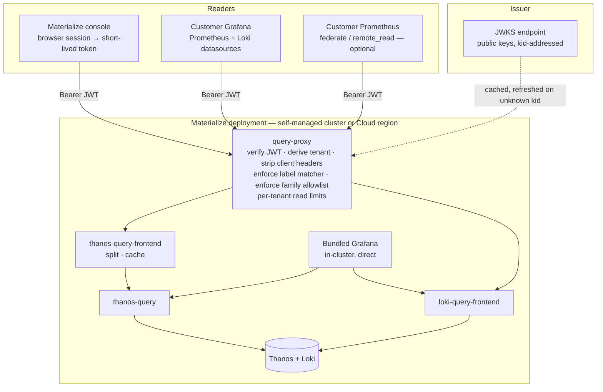

# A Tenant-Scoped Query API for Console and Customer Grafana

date: 2026-09-16

# A Tenant-Scoped Query API for Console and Customer Grafana

<table class="param-table">
  <tbody>
        <tr>
          <th>agent</th>
          <td>Claude Opus 5</td>
        </tr>
        <tr>
          <th>author</th>
          <td>Heather Lapointe</td>
        </tr>
        <tr>
          <th>lastmod</th>
          <td>2026-09-16 00:00:00 &#43;0000 UTC</td>
        </tr>
        <tr>
          <th>publishdate</th>
          <td>2026-09-16 00:00:00 &#43;0000 UTC</td>
        </tr>
        <tr>
          <th>status</th>
          <td>Ready</td>
        </tr>
  </tbody>
</table>

This doc proposes that **Thanos and Loki — or something that speaks their query languages — become a required part of every Materialize deployment**, self-managed and Cloud alike, and that both gain an authenticated read path scoped to exactly one tenant.

Two consumers motivate it, and they are the same feature.
The **Materialize console** stops rendering metrics from SQL against the environment it is describing and issues PromQL and LogQL instead.
A **customer** attaches their own Grafana to a public authenticated endpoint and gets the same data as a Prometheus and a Loki datasource for their environment.

The central claim is that **the read path is where this stack stops being optional.**
Everything built so far is composable by construction — every component can be turned off in favour of one a customer already runs — and that is the right posture for a collection stack.
It is the wrong posture for a surface the product itself depends on.
Once Console renders from PromQL, a deployment without a PromQL endpoint is a deployment with a broken Console, and the question changes from *which backend* to *what interface must exist*.

<!--
Agent note: this doc records decisions and their *why*. When a decision lands in code, update the section and
check the matching row in "Chart-side prerequisites".

Three things here are easy to get wrong and are stated deliberately: the unlabeled-metric-family problem in
"Label injection is not a tenant boundary", the revocation half of "What a token actually means", and the
claim that mandating the interface is not the same as mandating Thanos. Revise those rather than softening them.

Work spans repos. The proxy, the chart component, and the tenancy-class artifact land here; token issuance is
console and control-plane work; Console's own query layer is upstream. Rows below are the work-in-this-repo list.
-->

## Goals

Functional requirements, framed as value-first user stories.
Priority tags (**Must** / **Should** / **Could**) are relative to the first shipped version.

- **[Must] As a Materialize user,** I want Console's charts to go back further than a day, so that a question about last week is answerable at all.
- **[Must] As a Materialize user,** I want Console's charts to work while my environment is unhealthy, so that the tool for diagnosing an outage does not require the thing that is down.
- **[Must] As a security reviewer,** I want a read token to be able to address exactly one tenant, so that holding a valid credential is not the same thing as being allowed to read the fleet.
- **[Must] As a security reviewer,** I want tenant identity derived from a verified token rather than from a request header, so that a caller cannot name the tenant it reads.
- **[Must] As an operator,** I want the read endpoint to refuse to be published without an allowlist or an explicit acknowledgement, so that exposing it is a decision rather than an accident.
- **[Must] As a customer with my own Grafana,** I want a Prometheus datasource and a Loki datasource pointed at my environment, so that our dashboards live where the rest of our dashboards live.
- **[Should] As a customer with a dedicated Prometheus,** I want to federate or remote-read from that same endpoint, so that adopting our own long-term store does not mean a second integration.
- **[Should] As a Materialize support engineer,** I want Console and the Grafana dashboards to read the same query definitions, so that two surfaces cannot disagree about what a number means.
- **[Should] As an operator on a small install,** I want the mandated backends to fit, so that a requirement is not a sizing floor nobody warned me about.
- **[Must] As a compliance reviewer,** I want a grant that admits metrics to be separate from one that admits logs, so that reading numbers and reading message bodies are not the same permission.
- **[Should] As a compliance reviewer,** I want the audit record of who read my telemetry to be complete, so that "we have no record of that" and "that did not happen" are distinguishable.
- **[Should] As a maintainer,** I want one tenancy mechanism across self-managed, Cloud, and the BYOC control plane, so that we operate one read-authorization story rather than three.
- **[Should] As a maintainer,** I want the credential story for BYOC ingest and for reads to share an issuer, so that a customer environment carries one identity rather than two unrelated ones.
- **[Could] As a customer,** I want a read-only view of the reduced copy the control plane holds about me, so that what crosses the boundary is inspectable rather than described.

## Technical BLUF

- **For logs, tenancy exists and authentication does not. For metrics, neither exists.** Loki runs `auth_enabled: true` and takes the tenant from `X-Scope-OrgID`; Thanos Query has no tenancy at all and no notion of a caller. The two halves need different work, and a design that treats them as one surface will get the metrics half wrong.
- **Identity is derived from a verified JWT, never asserted by the client.** This is the same construction the [BYOC ingress](../20260813-byoc-observability/#identity-is-assigned-by-the-load-balancer-never-asserted-by-the-client) uses for writes, with a token where that has a certificate: strip every tenant-shaped header the client sent, set them from the verified claim, and reject the request if the claim is absent.
- **Verification is JWKS-based, so the proxy holds no per-tenant state.** Adding a tenant is issuing a token, not configuring the proxy — the property that makes the BYOC load balancer's verifier-CA model scale, restated for bearer tokens.
- **Label injection is not a tenant boundary on its own.** A large share of the series in Thanos carry no environment label — node-exporter, kube-state-metrics, cAdvisor, and orchestratord, which reconciles every environment in the cluster. Injecting a matcher makes those queries empty; omitting it leaks across environments. The resolution is a generated per-family tenancy class, not a cleverer rewriter.
- **The same mechanism resolves differently in self-managed and Cloud, and that is not a flaw to hide.** In self-managed the customer *is* the cluster operator, so cluster-scoped families are theirs to read. In Cloud they are not. One proxy, one token format, one policy input, two policy values.
- **Mandating the interface is not mandating Thanos.** What becomes required is a PromQL endpoint and a LogQL endpoint carrying the documented label contract, reachable through the proxy. Thanos and Loki are the bundled, supported, default implementation of that requirement; a customer already running Mimir or Grafana Cloud points the proxy at theirs.
- **This replaces the planned customer-scraped Prometheus endpoint.** A scrape endpoint delivers current samples to whoever can reach inward and keeps no history across the gap. A federated or remote-read endpoint on the proxy is strictly smaller than the query API and survives as an option for customers with a dedicated Prometheus.
- **Console should consume the query registry rather than write PromQL**, for the same reason panels do not. That promotes query IDs out of the internal surface the [deprecation policy](../20260823-deprecation-policy/#committed-surface) currently places them in, which is a real cost and should be paid deliberately.
- **A public read endpoint is a denial-of-service surface.** Thanos's `--store.limits.*` is global rather than per-caller, so per-tenant read limits belong at the proxy, and `thanos.queryFrontend` stops being optional.
- **Revocation is the hard half.** A stateless JWT cannot be withdrawn before it expires. Short lifetimes work for Console, which refreshes; they do not work for a datasource header a human pasted into Grafana.
- **Logs and metrics need separate grants, and so do the classes within each.** A metric is a number over a bounded label set; a log line is free text a developer wrote. One "may read telemetry" permission over-grants by however much the message bodies contain.
- **Loki is the right store for a forensic copy of an audit trail and the wrong one for the system of record.** Every mechanism in the log pipeline — rate limits, stream ceilings, drop and sampling stages, a best-effort flush — exists to shed load, which is correct for operational logs and disqualifying for a record whose value is completeness.
- **The `audit` log class exists in name only today.** `tenantMap.audit` is a values key, `GATEWAY_TENANT_MAP_AUDIT` reaches the gateway's ConfigMap, and no pipeline stage reads it — the same defect as `GATEWAY_UNFILTERED_PROM_METRICS` before [DEP-232](https://linear.app/materializeinc/issue/DEP-232) found it.
- **BYOC ingest should exchange its certificate for a short-lived token rather than replace it.** That collapses revocation from CRL freshness to token lifetime and lets the receiver verify identity itself instead of trusting an injected header — but the exchange must be authenticated by the certificate, and the destination `oauth2` block models no TLS for the token request.

## Non-goals

- **Replacing Grafana.** The bundled Grafana keeps reading the backends directly in-cluster. This is a second read path for consumers that are not Grafana, and for Grafanas that are not ours.
- **Replacing SQL introspection.** `mz_internal` stays the right answer for questions about objects and query plans. What moves is the *time series*, which is the part SQL keeps badly.
- **Query federation across tenants.** A support engineer wanting to ask one question of many environments is a real need and a different feature with a different authorization model. See [open questions](#open-questions).
- **Writes.** The proxy is read-only. Ingest authentication is the [BYOC](../20260813-byoc-observability/) and [in-cluster mTLS](../20260816-tls-authentication/) work, and nothing here changes it.
- **Inventing an identity provider.** This consumes an issuer and its JWKS. Who mints tokens, and how a human authenticates to get one, is control-plane and console work.
- **Per-user authorization inside a tenant.** The token names a tenant. Whether a particular human may see that tenant is decided before the token is issued, not by the proxy.

## What exists today

| Capability | State | Where |
|---|---|---|
| PromQL endpoint | ✅ Shipped, unauthenticated | `thanos-query.<ns>.svc:9090`, `ClusterIP` |
| LogQL endpoint | ✅ Shipped, unauthenticated | `loki-query-frontend.<ns>.svc:3100`, `ClusterIP` |
| Loki multi-tenancy | ✅ Shipped | `auth_enabled: true`; tenant from `X-Scope-OrgID`, written per `pipeline.logging.tenancy.tenantMap` |
| Loki per-tenant limits | ✅ Shipped | `loki.limits_config`, sized for a medium install |
| Thanos multi-tenancy | ❌ **Absent** | Query has no tenant concept; Receive's tenancy is a write-path feature and does not reach the read path |
| Thanos read limits | ⚠️ Global only | `--store.limits.request-series` / `--store.limits.request-samples` on Store Gateway, not per caller |
| `thanos.queryFrontend` | ⚠️ Off by default | Available; the Grafana datasource points at `thanos-query` directly, so enabling it today caches nothing |
| Environment label on metrics | ✅ Shipped | `materialize_cloud_organization_name`, the label every `env-*` dashboard scopes on |
| Environment label on logs | ✅ Shipped | `organization_name`, relabelled by the agent from the pod label; structured metadata rather than a stream label |
| Metric tiering artifact | ✅ Shipped | `metric-tiers.yaml`, generated from the query registry, anchored-regex per family |
| Query registry as the single source of expressions | ✅ Shipped | `packages/queries/`; panels take both expression and description from it |
| Grafana public-exposure guard | ✅ Shipped | Render refuses a `LoadBalancer` with no allowlist unless `connections.grafana.allowPublicAccess` |
| NetworkPolicy on every workload | ✅ Shipped | Ingress narrowed to known peers |
| **Any authenticated read path** | ❌ **Missing** | Reaching the Service is the whole authorization decision |
| **A per-family tenancy classification** | ❌ **Missing** | The registry grades families by importance, not by what scope they describe |
| **JWT verification anywhere in the stack** | ❌ **Missing** | Destination `authType` covers `oauth2` as a *client*; nothing verifies a token as a server |

The pattern is the same one the [TLS doc](../20260816-tls-authentication/#what-exists-today) names on the write path, in the opposite direction.
There, the values surface implies more security than the deployment has.
Here, the deployment has no read authorization at all and nothing implies otherwise — which is defensible while the only reader is an in-cluster Grafana behind a NetworkPolicy, and stops being defensible the moment a browser or a customer's Grafana is on the other end.

## What Console reads today, and why it is not enough

Console renders an environment's resource charts by querying SQL relations inside that environment.
That path has four properties, and only the first is usually discussed.

| Property | Consequence |
|---|---|
| The history is short — on the order of a day | No question whose answer is "compared to last week" can be asked. Capacity decisions, regression hunting, and post-incident review all fall outside the window |
| It requires a working SQL connection to the environment | The chart is unavailable exactly when the environment is unhealthy, which is when a user looks at it |
| It is scoped to one environment's own view of itself | Nothing about the Kubernetes substrate, the operator, an upgrade in flight, or a cluster with no running replica is visible, because the environment cannot see any of it |
| Observation is billed to the observed | Loading a dashboard is `environmentd` work, so the cost of watching scales with how closely it is watched |

The second and third are worse than the first, and they are the ones a longer retention window would not fix.
An environment that will not accept connections cannot be diagnosed through a path that requires accepting a connection.

This stack already collects the answers, at higher fidelity and for thirty days raw and a year downsampled — for the customers who install it.
The gap is not collection.
The gap is that no authenticated, tenant-scoped way to read it exists, so a first-party product surface cannot depend on it.

Note that the roadmap's [`console` row](../../roadmap/#materialize-components-beyond-the-environment) is a different subject with the same word in it.
That row tracks Console as a *monitored component* — it exposes no metrics that reach Thanos.
This doc is about Console as a *consumer*.
Neither blocks the other.

## Architecture

Three properties of this diagram carry the design.

**The proxy is the only path that crosses a trust boundary.**
The bundled Grafana keeps its direct in-cluster datasources, so nothing about today's deployment changes for an operator who never publishes the endpoint.

**The proxy holds no tenant list.**
It holds an issuer, an audience, a JWKS URL, and a policy artifact generated from the query registry.
Everything tenant-specific arrives in the token.

**The query frontends sit between the proxy and the backends, not beside them.**
That is a change: `thanos.queryFrontend` is off by default today and the Grafana datasource points past it.
A public endpoint needs its splitting and caching, so the read path acquires a component it currently only offers.

## Mandating the backends is mandating an interface

The roadmap's stated goal is composability — *every component can be turned off in favour of one a customer already runs*.
A hard dependency from Console appears to contradict that, and the contradiction is real if the requirement is written as "install our Thanos".

**Write the requirement as an interface instead.**
A Materialize deployment MUST be able to answer, for its own tenant:

| Requirement | Satisfied by |
|---|---|
| A Prometheus-compatible query API over the documented metric and label contract | Bundled Thanos; or Mimir, Cortex, Grafana Cloud, Amazon Managed Prometheus, any Prometheus-API store the collection path already writes to |
| A Loki-compatible query API over the documented log label contract | Bundled Loki; or any Loki-API store |
| Both reachable through a tenant-scoped, authenticated endpoint | The proxy, pointed at whichever of the above is deployed |

That keeps the composability claim intact and truthful: the customer still chooses the backend, and the levers that turn each subchart off still work.
What they can no longer do is choose *nothing* and expect Console to render.

Four consequences follow, and all four are costs rather than details.

**The metric and label contract becomes load-bearing in a way it is not today.**
The [deprecation policy](../20260823-deprecation-policy/#coordinated-surface-materialize-metrics-and-labels) already grades Materialize metrics and labels as a coordinated surface.
Console reading them makes a rename a product outage rather than a dashboard bug, which argues for the [1.0 stamp](../../roadmap/#versioning-changelog-and-releases) landing before Console cuts over rather than after.

**Sizing acquires a floor.**
A requirement that does not fit in the smallest supported Materialize install is not a requirement, it is a recommendation with consequences.
The `loki-small` and `loki-test` profiles exist; the [Thanos sizing profiles are still net-new work](../20260803-terraform-modules/#sizing-profiles-medium-is-the-chart-defaults), and a documented minimum envelope for "the read path works" is part of this.

**Cloud adoption stops being an independent track.**
[Adopting the stack in Materialize Cloud via Pulumi](https://linear.app/materializeinc/issue/CLO-182) is a prerequisite for Console dashboards in Cloud, not a parallel effort.

**A deployment that opts out needs a defined degradation.**
Console MUST detect the absence of a reachable endpoint and say so, rather than rendering empty charts.
An empty chart and a broken chart look identical, and the distinction is the whole difference between "nothing happened" and "we cannot tell".

## Authentication: a bearer JWT verified against a JWKS

### Two issuers, one verification path

The deployments differ in who can mint a token and agree on how one is checked.

| | **Cloud** | **Self-managed** |
|---|---|---|
| Issuer | The console identity provider already authenticating the session | An in-cluster issuer: the operator or the monitoring release, holding a signing key and publishing a JWKS endpoint. A customer's own OIDC provider is the alternative |
| How Console gets a token | Exchanges the browser session for a short-lived, audience-scoped observability token | Same exchange, against the in-cluster issuer |
| How a customer's Grafana gets one | Issued in Console, or forwarded from the user's own OIDC session | Issued in Console, or minted from the customer's IdP with a mapped claim |
| What the proxy is configured with | Issuer URL, audience, JWKS URL | Identical |

The proxy's verification is the same code in both: fetch the JWKS, check `alg` against an allowlist, resolve `kid`, verify the signature, then check `iss`, `aud`, `exp`, and `nbf` with a bounded clock skew.
**Asymmetric signatures only.** A shared secret would mean the proxy holds material that can mint tokens, which converts a read-path compromise into a fleet-wide forgery.

Multiple issuers must be configurable, because a self-managed customer federating their own IdP and the shipped in-cluster issuer can both be live during a migration.

### The claim contract

| Claim | Required | Meaning |
|---|---|---|
| `iss` | ✅ | Must match a configured issuer |
| `aud` | ✅ | Must match this proxy's configured audience. A token minted for another service MUST NOT be accepted here |
| `exp`, `nbf` | ✅ | Bounded lifetime; the proxy enforces a configured maximum regardless of what the token claims |
| `sub` | ✅ | Logged, never used for authorization |
| `jti` | ✅ | The revocation handle. Required even before revocation is implemented, because retrofitting it means reissuing every token |
| Tenant claim | ✅ | The authoritative tenant. Absent means reject, never a default |
| Scope claim | ✅ | The grant: which signal-and-class pairs this token admits. Two axes, not one — see [separate grants](#logs-and-metrics-need-separate-grants). Absent means no grant, never a default |

**The tenant claim's name and shape is a decision, not a detail**, and it is the same decision the BYOC doc leaves open for the certificate subject.
The two should agree: whatever identifies an environment on the write path should identify it on the read path, so that one identity vocabulary covers both directions.
Left as an [open question](#open-questions) for the same reason it is open there — it depends on control-plane identity outside this repo.

### What a token actually means

This section is deliberately the same shape as the [TLS doc's equivalent](../20260816-tls-authentication/#what-a-certificate-actually-means), and carries the same weight within this doc.

The backends implement no per-caller authorization.
Thanos Query answers any question it is asked; Loki answers for whatever tenant the header names.
So **every authorization decision in this design is made by the proxy**, and a bypass of the proxy is a bypass of all of it.

Three consequences, all load-bearing.

**The proxy is a single point of enforcement and must be the only path.**
The backends' Services stay `ClusterIP`, their NetworkPolicies must admit the proxy and the bundled Grafana and nothing else, and no second ingress may target them.
This is exactly the constraint the BYOC design places on its receiver, and it fails the same way: quietly, and only for the traffic that took the other path.

**The audience check is the difference between a read token and a general credential.**
Without it, any token the same issuer mints for any purpose reads the tenant's telemetry.

**Revocation is the hard half, and it does not have a free answer.**
A stateless JWT is valid until it expires.
Console can hold a token that lives minutes because Console refreshes.
A datasource header pasted into a customer's Grafana cannot refresh, so its token must live long enough to be useful and is therefore a bearer credential with a meaningful compromise window.

Three options, ranked:

1. **Short-lived tokens plus a refresh flow**, for every consumer that can refresh. Correct, and it does not cover Grafana's static header.
2. **Medium-lived tokens with a `jti` denylist checked at the proxy**, cached with a short TTL and fed from an issuance record Console owns. Covers the static-header case, costs the proxy a piece of state it otherwise would not have, and makes denylist freshness load-bearing — a list refreshed every five minutes is a five-minute revocation window.
3. **Long-lived tokens with no revocation.** Simplest, and the only control left is rotating the signing key, which revokes every token at once.

**Recommendation: option 1 for Console, option 2 for datasource tokens.**
This is the same trade the BYOC doc makes for [certificate lifetime](../20260813-byoc-observability/#the-license-as-credential-carrier), reaching the same place from the other direction, and the denylist is the token analogue of the CRL that doc puts at the load balancer.

## Tenancy enforcement

### Logs already have tenancy; metrics have none

The two backends are at different starting points, and conflating them is the main risk in this section.

**Loki.** Tenancy is real and enforced inside Loki: `auth_enabled: true`, tenant from `X-Scope-OrgID`, per-tenant limits and retention already configured.
The proxy's job for logs is to *set that header from the verified claim and refuse to let a client set it*.
That is a small, complete answer — **when the pipeline writes one tenant per environment**.
Today `tenantMap` defaults to `static`, so an entire self-managed install writes to one tenant, which is correct there (one install, one customer) and insufficient in Cloud.
Cloud's collection must run `byEnvironment`, and the chart already warns that a non-static map spreads logs across tenants a single datasource cannot read — a warning that becomes the proxy's requirement rather than a caveat.

**Thanos.** There is no tenancy to enforce.
Receive's tenant handling is a write-path feature that partitions ingestion; Query fans out across everything the Store Gateway can see and has no caller concept.
So the metrics half is built rather than configured, and it is built out of label enforcement.

### Label injection is not a tenant boundary

The obvious construction is the `prom-label-proxy` one: parse the PromQL, inject `materialize_cloud_organization_name="T"` into every selector, and replace rather than merge any matcher the caller wrote on that label.
That is necessary and it is not sufficient, for a reason that is specific to this stack and easy to discover late.

**A large share of the series in Thanos carry no environment label at all.**
node-exporter and cAdvisor describe nodes, and kube-state-metrics describes cluster objects.
orchestratord's reconciliation metrics carry no organization label *by design*, because one operator reconciles every environment in the cluster.
The roadmap says so directly, and the `env-upgrade` dashboard is built around the split.

Injecting a matcher on a label a family does not have makes every such query return empty.
Not injecting it lets a Cloud tenant read another tenant's node and operator metrics.
Neither is acceptable, and no amount of rewriter cleverness decides between them, because the decision is about what a family *describes* rather than about the query.

### A generated tenancy class per family

**Decision: classify every metric family by the scope it describes, generate the classification from the query registry, and make the proxy read it.**

This is the same machinery as `metric-tiers.yaml` — anchored-regex fragments per family, generated rather than hand-maintained, so a rename cannot silently drop a family out of the policy.

| Class | Describes | Enforcement |
|---|---|---|
| `environment` | One Materialize environment; carries the environment label | Matcher injected, replacing any caller-supplied matcher on that label |
| `cluster` | The substrate underneath — nodes, pods, the operator, the monitoring stack itself | Readable only by a token whose scope claim admits it. **Self-managed: admitted by default.** **Cloud: never, for a customer token** |
| `denied` | Anything not classified | Rejected. The default for an unknown family MUST be denial, or a new metric family is readable by everyone until someone notices |

The third row is the fail-closed one and it has a cost worth stating: a metric family added upstream is invisible to Console until it is classified here.
That is the correct direction for the failure to point, and it makes classification part of adding a family rather than a follow-up.

**Self-managed and Cloud give different answers for the `cluster` class, and the difference is not an inconsistency.**
In self-managed the customer operates the cluster; node and operator metrics are theirs, and withholding them would be absurd.
In Cloud they are shared infrastructure describing other customers' workloads too.
One mechanism, one policy artifact, one token format — and one configured policy value that differs by deployment.
That value is the single most security-relevant setting in the design and should be refused rather than defaulted when the deployment kind is not stated.

### The PromQL traps

Enforcement happens on the parsed expression, never on the request string.
The following are the cases that break a naive implementation, and each needs a test.

| Case | Why it matters |
|---|---|
| `label_replace` / `label_join` | Can synthesize a value for the enforced label. Enforcement at the selector still holds, because the source series were already filtered — but a rewriter that enforces on the *output* labels is wrong |
| `absent()` / `absent_over_time()` | Leaks existence rather than values. Narrow, real, and worth deciding explicitly rather than by omission |
| Subqueries, `@` modifiers, `offset` | Nested selectors are still selectors; a rewriter that only walks the top level misses them |
| `/api/v1/series`, `/api/v1/labels`, `/api/v1/label/<name>/values` | Take `match[]` rather than `query`. Unenforced, they enumerate every environment's label values — a directory of the fleet |
| `/api/v1/metadata`, `/api/v1/targets`, `/api/v1/status/*` | Carry no series and still disclose. Default to denial and allowlist what Console needs |
| Recording rules whose output drops the enforced label | A pre-computed series with no environment label is in the `cluster` class by the rule above, which is the right answer and needs to be checked when a rule is added |
| Query parameters that are not the query | `start`, `end`, `step`, `timeout`, `limit` bound cost rather than access, and belong in the limits section — but an unbounded `step` is a cheap way to make an expensive query |

### The LogQL traps

Loki's header does the real work, so this list is shorter and not empty.

- **The stream selector must still be enforced** whenever the Loki tenant is coarser than the token's tenant — which is the default self-managed shape, where one tenant holds every namespace. There, `organization_name` is structured metadata rather than a stream label, so the enforceable axis is `namespace`, and that is a materially weaker filter. Say so rather than implying parity with the metrics path.
- **Metric queries over logs** (`rate`, `count_over_time`, and the aggregations on top) go through the same enforcement as the selector they wrap.
- **`line_format` and `label_format`** can reshape output. As with `label_replace`, enforcement belongs at the selector.
- **`/loki/api/v1/labels` and `/label/<name>/values`** enumerate, exactly as their Prometheus analogues do.
- **Tailing (`/loki/api/v1/tail`, WebSocket)** is a long-lived connection whose token expires mid-stream. Decide whether it is offered at all; if it is, the connection must be closed at token expiry rather than inheriting the lifetime of the socket.

## Logs and metrics need separate grants

The scope claim above is a **Must**, and it carries two axes rather than one.

**Signal is an axis because the two disclose differently.**
A metric is a number over a bounded label set, and what it reveals is whatever the label names say — knowable in advance, and the thing the tenancy classification already reasons about.
A log line carries a message body: free text a developer wrote, which in practice contains query fragments, object names, user identifiers, and whatever an error formatter put into a string.
A single "may read telemetry" grant over-grants by however much those bodies contain.
The redaction work the [BYOC design](../20260813-byoc-observability/#redaction) specifies exists precisely because log content is not safe by default, and a read path that treats logs and metrics as one permission discards that distinction at the last hop.

**Class is an axis because both signals already have one.**
The two class sets are analogous rather than identical, and neither is new here.

| Signal | Classes | Source | State |
|---|---|---|---|
| Metrics | `environment`, `cluster`, `denied` | Generated per family from the query registry | Proposed by this doc |
| Logs | `default`, `infra`, `audit`, `environment` | `pipeline.logging.tenancy.tenantMap` | Shipped, except `audit` — see [Audit records](#audit-records-two-stores-two-requirements) |

So a grant is a set of signal-and-class pairs, and the token's scope claim lists them.

**The log half is nearly free and the metric half is not**, which is the reverse of the asymmetry in [tenancy enforcement](#logs-already-have-tenancy-metrics-have-none).
Log classes map to Loki tenants, so enforcing a log-class grant is deciding which `X-Scope-OrgID` values the proxy will set for a given token — a lookup, not a rewrite.
Metric classes have no such backing, which is why they need the generated classifier.

Recommended defaults, stated as a matrix because that is what a reviewer will ask for:

| Audience | Metrics | Logs |
|---|---|---|
| Console, ordinary user | `environment` | None by default |
| Console, customer administrator | `environment`; `cluster` in self-managed | `default`, `environment` |
| Customer Grafana service token | As issued, never wider than the issuer holds | As issued, never wider than the issuer holds |
| Audit reader | None | `audit` only |
| Materialize support against a self-managed install, with consent | `environment`, `cluster` | `default`, `infra`, `environment` |

Two rules matter more than the defaults.

**A token MUST NOT be issuable with a scope wider than the issuing human holds.**
Without that rule the datasource token is a privilege-escalation primitive: a user with metrics-only access in Console mints a logs token and reads what Console would not show them.

**An unlisted combination is denied**, the same rule as an unclassified metric family.
A grant matrix that defaults open has the failure mode of a fail-open classifier, one level up and harder to notice.

The honest cost is configuration.
This is more surface than one "read telemetry" switch, and it is the kind of setting that gets opened to its widest value once and never revisited.
The mitigation is narrow defaults and a Console surface that displays what a token can actually reach, not a document asking people to be careful.

## Audit records: two stores, two requirements

There are two distinct things called an audit log here, and conflating them is the main risk in this section — the same shape the BYOC doc's [support bundles](../20260813-byoc-observability/#support-bundles) have.

**The system of record** answers who changed what: DDL, grants and roles inside Materialize, and token issuance and revocation in the control plane.
Materialize's own audit events already live in the catalog, written transactionally with the change they describe and retained indefinitely.

**The forensic copy** answers what happened around an incident: what the proxy served, who read which tenant, what the pipeline admitted or dropped.
Most of that has no home today.

The property that separates them is **whether a missing record is acceptable**, and it decides the store.

| | System of record | Forensic copy |
|---|---|---|
| Example | Materialize audit events; token issuance and revocation | Proxy read records; pipeline decisions; gateway admission |
| Requirement | Complete, ordered, tamper-evident, retained for years | Best-effort, correlatable, retained for months |
| Store | A database, written transactionally with the event | Loki, at a dedicated tenant |
| May a record be dropped? | Never | Yes, under load, by design |

**Loki is built to shed, and that is disqualifying for the first column.**
Per-tenant ingestion rate and burst limits, an active-stream ceiling, `stage.drop`, `stage.limit`, `stage.sampling`, an ephemeral WAL, and a best-effort flush on ingester shutdown are all shipped and all correct for operational logs.
A compliance question is rarely "what do you have"; it is "is this all of it", and a pipeline with a documented drop policy cannot answer the second.

**Recommendation: keep the system of record in a database, and mirror a copy into Loki.**
The mirror is one-directional and tolerant of loss precisely because authority lives elsewhere.
What it buys is correlation — an audit event beside the logs and the metrics from the same minute, in one query language, reachable through the read path this doc builds.
That is the thing a database cannot give, and it is the reason to do it at all.

Where a record must live only in Loki, the object store supplies what Loki does not: [Object Lock or WORM in compliance mode, object versioning, and the bucket-freeze procedure](../../../../logs-and-events/storing/#disaster-recovery) are already documented.
State the limit alongside them rather than letting the feature list imply more than it gives: **WORM protects a chunk after it is written and does nothing about a line that was never ingested.**
Immutability is not completeness, and an audit record needs both.

### The proxy's own read record

This design creates an audit stream that does not exist today: who read which tenant's telemetry, with which token.
Three constraints shape where it goes, and the third is the one that is easy to get backwards.

- **It must not be writable by the tenant it describes.** A customer who can write to the tenant holding their own access records holds a record worth nothing.
- **It must be readable separately from the telemetry**, which is what the `audit` class in the grant matrix is for.
- **Its collection must not depend on the proxy.** The proxy writes to stdout and the agent collects it like any other workload's logs. A proxy that ships its own audit trail through itself puts that trail inside its own blast radius, and the compromise that matters most is the one that would edit the evidence.

### The `audit` class exists in name only

`pipeline.logging.tenancy.tenantMap.audit` is a values key, and `GATEWAY_TENANT_MAP_AUDIT` is written into the gateway's env ConfigMap — where nothing reads it.
The rendered pipeline reads `GATEWAY_TENANT_MAP_INFRA` and `GATEWAY_TENANT_MAP_ENVIRONMENT`; the audit variable has no consumer and no stage assigns anything to the class.

This is the same defect as `GATEWAY_UNFILTERED_PROM_METRICS`, which the roadmap records as having been written to the ConfigMap and read by nothing until [DEP-232](https://linear.app/materializeinc/issue/DEP-232) found it, leaving `minMetricImportance` on remote-write silently inert.
**Deciding what produces the audit class is therefore a prerequisite rather than a detail**: a tenancy key with no producer routes nothing, and a grant that admits a class nothing writes to is a permission over an empty set.

## The proxy

### Request path

1. Terminate TLS.
2. Verify the bearer token: JWKS by `kid`, signature, `iss`, `aud`, `exp`, `nbf`, and the configured maximum lifetime. Check `jti` against the denylist.
3. Derive the tenant from the verified claim. **Absent means reject**, never a default.
4. Strip every tenant-shaped header the client sent — `X-Scope-OrgID`, `THANOS-TENANT`, and anything else the backends read — before any further processing.
5. Parse the query. Classify every referenced family. Reject if any family is `denied`, or `cluster` where the token's scope does not admit it.
6. Rewrite: inject the environment matcher into every selector over an `environment`-class family, replacing any caller-supplied matcher on that label.
7. Set `X-Scope-OrgID` from the claim for Loki.
8. Apply per-tenant limits: maximum time range, maximum `step` resolution, concurrent requests, requests per second.
9. Forward to the query frontend. Stream the response back unmodified.
10. Emit an audit record: `sub`, `jti`, tenant, endpoint, the rewritten query, and the outcome.

Step 4 before step 5 is not stylistic.
A rewriter that runs before headers are stripped can be made to produce a correct query against the wrong tenant.

### Build or compose

Two shapes, and the cheaper one is not obviously worse.

**Compose.** An Envoy `jwt_authn` filter — mature, JWKS-aware, handles `kid` rotation and caching — injecting the verified claim as a header, in front of `prom-label-proxy` for metrics and the Loki query frontend for logs.
Each component does what it was built for, and the JWT half is code nobody here has to write or audit.
The limits are real: `prom-label-proxy` enforces a single label and knows nothing about per-family classes, per-tenant read limits live in neither component, and the LogQL half has no equivalent.

**Build.** One Rust service in this workspace, using an existing PromQL parser and LogQL parser, implementing verification, classification, rewriting, and limits in one place.
It is the only shape that implements the whole policy, it matches the rest of the repo, and it is the shape where a subtle rewriting bug is ours.

**Recommendation: compose for a first cut behind a feature flag, build for what ships.**
The composed shape is a fast way to prove the authentication story end to end and to get Console building against a real endpoint.
It cannot express the family classification, which is the part of this design most likely to be wrong, so it should not be the thing that reaches a public endpoint.

### Read limits and the query frontend

A published read endpoint is a denial-of-service surface aimed at a fan-out query engine.
Thanos's existing protections (`--store.limits.request-series`, `--store.limits.request-samples`) are global: one tenant's expensive query is bounded, and one tenant's *many* expensive queries are not.

Three requirements follow.

- **Per-tenant limits at the proxy**, because that is the only component that knows who is asking.
- **`thanos.queryFrontend` becomes required for the read path**, for query splitting and result caching, and the proxy points at it. This settles the [open question the Terraform doc raises](../20260803-terraform-modules/#open-questions) about enabling the frontend without routing through it, in the narrow case of the proxy — the bundled Grafana's datasource is a separate decision.
- **A maximum range and minimum step**, so that a year-wide query at a one-second step is refused rather than attempted.

### Endpoint shape

| Signal | Base path | What the client appends |
|---|---|---|
| Metrics | `/prometheus` | `/api/v1/query`, `/api/v1/query_range`, … — Grafana's Prometheus datasource does this natively |
| Logs | `/loki` | `/loki/api/v1/query_range`, … |

**The Loki base path is a trap worth stating.**
Grafana's Loki datasource appends a path that already begins with `/loki`, so a base path of `/loki` produces `/loki/loki/api/v1/...`.
Pick the base path so the concatenation is right, and assert it in a test, because the symptom is a 404 that reads like a broken deployment.

In self-managed the host is the chart's ingress.
In Cloud it is per-environment or per-organization under the console's domain, which is also where the tenant claim's shape matters: a host that names the environment and a token that names a different one MUST be refused rather than reconciled.

## A customer's Grafana as a datasource

Three ways a customer's Grafana authenticates, in the order they should be preferred.

| Option | How | Best for | Cost |
|---|---|---|---|
| **Forward OAuth identity** | The customer's Grafana authenticates users against the same issuer and forwards the user's access token to the datasource | Any deployment where Grafana and Console share an identity provider | Per-user, short-lived, no stored secret — the best posture, and it constrains the customer's Grafana setup |
| **Service token in a custom header** | A token issued in Console, pasted into `secureJsonData` as an `Authorization: Bearer` header | Everything else, including every Grafana that is not OIDC-backed | A medium-lived bearer credential living in Grafana's database. Needs issuance, listing, and revocation in Console |
| **OAuth2 client credentials** | Where the Grafana version and datasource support it | Machine-to-machine without a stored long-lived token | Support varies by datasource and version; not a plan that works everywhere |

**Recommendation: ship the service token, document the forwarded identity as the preferred posture.**
The service token is the only option that works against an arbitrary Grafana, which is what "a customer attaches their Grafana" actually means.
Its whole risk is the revocation problem above, which is why `jti` is required from the first token issued.

Two things ship with it or it is not usable:

- **A datasource snippet per signal** in the customer-facing docs, including the tenant behaviour and the base-path trap.
- **A token management surface in Console** — issue, name, list with last-used, revoke. A credential with no revocation UI is a credential nobody can rotate.

## This replaces the customer-scraped Prometheus endpoint

The earlier plan was to expose a Prometheus endpoint that a customer with a dedicated service would scrape into their own environment.
**That is superseded by this design**, and the reasons are properties of scraping rather than problems of implementation.

| Scrape endpoint | Query API |
|---|---|
| Pull: the customer's Prometheus must reach inward, which is a network conversation per customer and an inbound path into the environment | Push-free: the customer's client dials out to a published endpoint over TLS |
| Delivers the current sample. History exists only in what the customer collected | Answers over the full retained range, including before the customer integrated |
| A gap in the customer's scraper is a permanent hole | An outage in the customer's reader loses nothing |
| Cannot answer a range question, so Console still needs a separate path | One path serves Console, the customer's Grafana, and the customer's Prometheus |
| Authentication is a second, unrelated mechanism on a second endpoint | Same token, same tenant derivation, same audit record |

**Federation survives as an endpoint on the proxy rather than as the integration story.**
A customer who genuinely wants the data in their own Prometheus — for alerting rules that live with their other alerting rules, most often — is well served by `/federate` or remote-read on the same host, behind the same token, with the same label enforcement applied to the selector set.
That is strictly less machinery than the query API, not more, which is why it is listed as a **Should** rather than deferred: once the query API exists, the federated endpoint is a small addition, and it is the one shape the query API does not cover.

## Console should consume the query registry, not write PromQL

Panels in this repo write no PromQL.
They take both the expression and the description from `packages/queries/`, and porting the dashboards to that model surfaced four real defects that had been invisible while expressions were restated per panel.

**Console should consume the same registry, by query ID, over the same proxy.**
The alternative is Console maintaining its own expressions, which guarantees that Console and the Grafana dashboards eventually disagree about what a number means — and the disagreement surfaces during an escalation, when two people are reading two numbers with the same name.

The mechanism is an artifact: the registry already generates `metric-tiers.yaml` and the dashboards, and it can generate a query manifest — ID, expression, required variables, description, tenancy class — published with the release and consumed by Console.

**This has a cost that must be paid deliberately.**
The [deprecation policy](../20260823-deprecation-policy/#committed-surface) places query IDs *outside* the customer-facing committed surface, on the explicit ground that their consumers are our own dashboards and our own Terraform module.
Console consuming them makes that no longer true.
Either query IDs join the committed surface with the cooldown that implies, or the manifest is versioned separately and Console pins a version.
**Recommendation: pin a version.** The registry is edited constantly and freezing its identifiers would slow the thing it exists to make fast, whereas a pinned manifest gives Console a stable contract and gives the registry room to move.

## Token exchange for BYOC ingest

The [BYOC design](../20260813-byoc-observability/#two-stage-verification-with-one-revocation-checkpoint) authenticates a customer's gateway with a client certificate carried in the license, verified twice: at the load balancer, which can check revocation, and at the receiver, which cannot.
This design introduces a token issuer and a token verifier, which raises a fair question — should the write path use tokens too?

**The answer is yes for the credential and no for the component.**
Ingest should exchange its certificate for a short-lived token; the exchange endpoint should be a sibling of the read proxy rather than the read proxy itself.

### Why the ingest path wants a token

**It collapses revocation.**
BYOC's revocation is a CRL at the load balancer with a refresh interval, and that doc states plainly that any network path reaching the gateway pod while bypassing the load balancer also bypasses revocation.
A short-lived token makes expiry the revocation mechanism, enforced by every verifier including the receiver, with a window equal to the token lifetime rather than to CRL freshness.
That removes the design's sharpest operational caveat instead of mitigating it.

**It makes the receiver self-sufficient about identity.**
The BYOC receiver reads the tenant from a header the load balancer injected, which is why that design must strip everything tenant-shaped the client sent and fail closed when the header is absent.
A signed claim removes the header entirely: there is nothing to overwrite, because identity arrives inside the thing already being verified.

**Most of the issuance service is being built anyway.**
The BYOC doc ranks *short-lived credentials with automated renewal, bootstrapped from the license* as [option 1](../20260813-byoc-observability/#the-license-as-credential-carrier) and says it is right if an issuance service exists.
The marginal cost of an exchange endpoint beside a JWKS-verifying proxy is far below the cost of standing one up alone, which is most of why that option was ranked first and chosen second.

### Why it does not replace mTLS

**The certificate is what makes the exchange safe.**
It is the only credential in the customer's cluster that is not a static secret, and it already has a renewal story through cert-manager and the license.
Exchanging it for a token keeps that property; replacing it with anything else discards it.

**A token adds an online dependency to a path that has none.**
mTLS needs nothing reachable at hand-off time.
A token needs an issuer reachable at refresh, and an exchange endpoint that is down long enough stops ingest while the network and the backends are healthy.
The gateway's WAL converts that into a bounded delay rather than a loss, which is real mitigation and not elimination.
**Direct mTLS on the ingest path must keep working as the fallback**, which is also what makes the migration a gradual one rather than a cutover.

### The blocker, stated precisely

Alloy's destination `oauth2` block models `clientId`, `clientSecret`, `scopes`, and `tokenUrl` — **and no TLS configuration for the token request.**
Every destination carries client TLS for the destination itself; none of it reaches the token endpoint.

So the exchange as modeled today would authenticate with a client secret: a long-lived bearer credential sitting in the customer's cluster, which is exactly what choosing a certificate avoided.
**An `oauth2.tls` block on the destination schema is a hard prerequisite**, and without it this proposal is strictly worse than the mTLS it would extend.
It is a small addition — the same client-TLS shape the destination already has, applied one level in — and it is listed with the other prerequisites below.

### Why the exchange is not the read proxy

The read proxy is a data plane: it terminates customer connections, parses untrusted query text, and answers with telemetry.
A credential issuer holds signing material.
Combining them means a bug in a PromQL parser reachable from a public endpoint sits in the same process as the ability to mint identities for the ingest path.

**Separate deployments, shared vocabulary.**
Same issuer, same JWKS, same claim names, same tenant identity — and different processes, different network exposure, and different blast radius.
The shared part is the valuable part, and it is the part that costs nothing to share.

## Deployment shapes

| | Self-managed | Cloud | BYOC control plane |
|---|---|---|---|
| Proxy | A `Deployment` in the monitoring chart, off by default | A fleet in front of the regional backends, behind the existing edge | The same component, pointed at our backends |
| Issuer | In-cluster, published by the operator or the release; or the customer's own OIDC provider | The console identity provider | The console identity provider |
| Loki tenancy | `static` is sufficient — one install, one customer | `byEnvironment` is **required** | Per the [BYOC open question](../20260813-byoc-observability/#open-questions) on customer-versus-environment tenancy |
| `cluster`-class families | Readable — the customer operates the cluster | **Never** for a customer token | Never for a customer token |
| Exposure | The chart's ingress, guarded like Grafana's | The existing edge | Internal, plus the customer-facing read described below |

**The control-plane column answers an open question the BYOC doc leaves standing.**
That doc asks whether a customer gets visibility into the reduced copy we hold about them, and notes that it reopens a tenancy boundary the design otherwise keeps closed.
The same proxy, pointed at the control-plane backends with the tenant derived from the same claim, is the answer — and it reopens nothing, because the boundary is enforced by the same mechanism that enforces it everywhere else.
That turns "what crosses the boundary" from a document a customer reads into a dataset a customer queries, which is a materially stronger trust position than the generated egress schedule alone.

## Chart-side prerequisites

Work in **this** repo. Ordered roughly by dependency.
None of this is ticketed yet.

| Item | Why it is needed | Blocking? |
|---|---|---|
| **Per-family tenancy classification** in the query registry, generated as an artifact beside `metric-tiers.yaml` | The policy input the proxy enforces. Everything about the metrics half depends on it, and hand-maintaining it guarantees drift | **Blocking** — the metrics path is not safe without it |
| **The `query-proxy` component**: Deployment, Service, ServiceAccount, NetworkPolicy, optional Ingress | The feature | **Blocking** |
| **Issuer values surface** — issuer URL(s), audience, JWKS URL, allowed algorithms, maximum token lifetime, deployment kind | Configuration, and the deployment-kind value that decides `cluster`-class readability | **Blocking** |
| **The grant matrix as a values surface**, signal × class, denying anything unlisted | Logs and metrics are separate permissions, and so are the classes within each. A single read grant over-grants by whatever the log bodies contain | **Blocking** |
| **A producer for the `audit` log class** — a stage that assigns it, and a gateway that reads `GATEWAY_TENANT_MAP_AUDIT` | The class is a values key and an env var with no consumer. A grant admitting a class nothing writes to is a permission over an empty set | **Blocking** for the audit grant |
| **The proxy's read-audit stream**, written to stdout and collected by the agent, landing in a tenant the audited party cannot write | A read path with no record of reads cannot be reviewed, and a record the proxy ships through itself is inside its own blast radius | **Blocking** for exposure |
| **`oauth2.tls` on the destination schema** — client TLS for the *token request*, not only for the destination | Without it a BYOC token exchange authenticates with a long-lived client secret, which is what choosing a certificate avoided | **Blocking** for [token exchange](#token-exchange-for-byoc-ingest), not for reads |
| **Fail-closed defaults at render time** — refuse to render with an unset audience, an unset deployment kind, or a symmetric algorithm | Each of those defaults quietly to something wrong, and all three are valid YAML | **Blocking** |
| **Public-exposure guard**, mirroring `connections.grafana.allowPublicAccess` | The endpoint is designed to be published, which makes publishing it *by accident* the failure to guard against | **Blocking** for the ingress |
| **NetworkPolicy narrowing on Thanos Query and the Loki query frontend** to the proxy and the bundled Grafana | The proxy is the only enforcement point, so a second path is a bypass of all of it | **Blocking** |
| **`thanos.queryFrontend` on the read path**, with the proxy pointed at it | Per-tenant read cost control on a public endpoint. Settles the routing half of a standing open question | **Blocking** for exposure |
| **Per-tenant read limits** — range, step, concurrency, rate | Thanos's limits are global; the proxy is the only component that knows the caller | **Blocking** for exposure |
| **Audit logging** of tenant, subject, `jti`, rewritten query, and outcome | A read path with no record of reads cannot be reviewed after an incident | **Blocking** for exposure |
| **`jti` denylist** with a documented refresh interval | Revocation for datasource tokens. The freshness interval *is* the revocation window | Should land with datasource tokens |
| **Query manifest artifact** — ID, expression, variables, description, tenancy class — versioned independently of the registry | Lets Console consume the registry without freezing query IDs | Blocking for Console, not for the endpoint |
| **`query-proxy` profile** composing the component, ingress, issuer wiring, and the query frontend | The assembled shape a consumer applies | Blocking for delivery |
| **Terraform variables** for the above, with credentials outside the values | Same constraint as every other credential: `helm get values` reads values, and they land in state | Blocking for the Terraform path |
| Cloud collection running `tenantMap: byEnvironment` | Loki's enforcement is the log half. A static tenant in Cloud means the proxy has nothing to enforce with | Blocking for Cloud logs |
| A documented minimum sizing envelope for "the read path works" | A mandate that does not fit the smallest supported install is not a mandate | Blocking for the mandate, not the feature |

## Testing

The kind tiers extend to cover this, and the important assertions are the negative ones.

- **Cross-tenant read denial.** A token for tenant A queries a series that exists only for tenant B and gets an empty result, with the rewritten query in the audit record proving the matcher was injected rather than the series merely being absent.
- **Header spoofing.** A valid token for A sent alongside `X-Scope-OrgID: B` and a `materialize_cloud_organization_name="B"` matcher written into the query. The claim wins on both. This is the confused-deputy case the BYOC design names on the write path, and it is the same bug class here.
- **Unlabeled family denial.** A customer-class token in a Cloud-configured proxy queries a node-exporter or orchestratord family and is **rejected**, not silently emptied. The distinction matters: an empty result teaches a user that the metric does not exist.
- **Unknown family denial.** A family absent from the classification artifact is rejected, proving the default is closed.
- **Deployment-kind divergence.** The same token and the same query against a self-managed-configured proxy returns the cluster-scoped data. One test, two configurations, because the difference is the design's most security-relevant setting.
- **Enumeration endpoints.** `/api/v1/series`, `/api/v1/labels`, and their Loki analogues are enforced, asserted by a label-values call that would otherwise return another tenant's values.
- **Token validation.** Expired, wrong audience, wrong issuer, unknown `kid`, symmetric algorithm, and `alg: none` are each rejected, individually.
- **Revocation.** A token on the denylist is rejected within the configured refresh interval, and the test asserts the interval rather than assuming immediacy.
- **Rewriter fidelity.** A corpus of every expression in the query registry is parsed, rewritten, and re-parsed, asserting the result is a valid query that differs from the input only in the enforced matcher. The registry is the corpus, which means the test grows with the dashboards.
- **Limits.** A query exceeding the maximum range or minimum step is refused with a useful error rather than attempted.
- **Base-path concatenation.** A real Grafana Loki datasource against the configured base path returns data, because the failure mode is a 404 that reads like a broken install.
- **Grant separation.** A metrics-only token is refused on every LogQL endpoint and a logs-only token on every PromQL endpoint, asserted per endpoint rather than once — the enforcement is per handler, and a handler added later is the one that will miss it.
- **Grant escalation.** An issuance request for a scope wider than the requester holds is refused. This is the privilege-escalation path that makes datasource tokens dangerous, and it lives in Console rather than the proxy, so it needs a test on that side too.
- **Audit completeness under load.** Drive the proxy past its rate limit and assert that refused requests are still recorded. An audit stream that is the first thing shed under load records exactly the traffic that did not matter.
- **Audit independence.** Partition the proxy's own read path and assert its audit records still reach Loki, proving collection does not route through the component being audited.
- **Audit write isolation.** A tenant token is refused when writing to the tenant holding its own access records.

## Documentation to update

- **A customer-facing read-endpoint page**: what the endpoint is, how to get a token, the two datasource snippets, what a tenant can and cannot read, and the federation option. This is the artifact a customer integrates against and the most important item here.
- `metrics/querying.md` — the proxy as a query path beside the in-cluster one, and the tenancy classes.
- `logs-and-events/` — the equivalent for LogQL, including the structured-metadata-versus-stream-label limitation on the self-managed shape.
- `dashboards/grafana/architecture.md` — the datasource section gains an external-Grafana half; today it documents the in-cluster datasources only.
- `architecture.md` — the read path currently ends at Grafana.
- `reference/stability.md` and `reference/internal/versioning.md` — whichever of the query-manifest options is chosen changes what is committed.
- `reference/internal/roadmap.md` — ✅ done. A read-path section and a follow-up-documentation entry point here.
- `operating/production-best-practices.md` — publishing the endpoint is a shared-responsibility item with a checklist of its own.
- `logs-and-events/storing.md` — the retention section mentions audit-relevant streams as a tiered-retention example; it should say what the `audit` class is and, until a producer exists, that nothing populates it.
- A **compliance-facing audit page** stating which record is the system of record, what the Loki copy is for, and what WORM does and does not guarantee. The distinction is the whole answer to an auditor's question and it is currently in nobody's document.

## Open questions

- [ ] **What is the tenant claim, exactly** — a single opaque identifier, or an organization and environment pair? It should match whatever the [BYOC certificate identity](../20260813-byoc-observability/#open-questions) settles on, and both depend on control-plane identity outside this repo.
- [ ] **Who issues tokens in self-managed?** The operator holding a signing key is the smallest answer and makes the operator a credential issuer, which it is not today. The customer's own OIDC provider avoids that and cannot be assumed present.
- [ ] **Compose or build?** The recommendation above is compose first, build for what ships. Whether the composed shape is worth building at all depends on how quickly Console needs something to develop against.
- [ ] **Is `cluster`-class data ever readable by a Cloud customer token?** Aggregate node pressure affecting their environment is genuinely useful to them and is derived from series describing other tenants' workloads. Pre-aggregated, environment-scoped recording rules are the safe version of yes.
- [ ] **Does the proxy serve the bundled Grafana too**, rather than Grafana keeping direct datasources? One path is easier to reason about and adds a hop and a failure mode to the deployment that works today.
- [ ] **Is tailing offered?** A long-lived connection and a short-lived token do not compose, and closing at expiry is a worse user experience than not offering it.
- [ ] **Cross-tenant queries for support.** A support engineer asking one question of many environments is the single most useful query this design forbids. A separate operator-class token is the obvious shape and needs its own authorization story, not an exemption in this one.
- [ ] **Does Console degrade or hide?** A deployment with no endpoint could hide the charts or show them disabled with an explanation. Hiding is cleaner and teaches nobody that the capability exists.
- [ ] **Does the mandate apply retroactively?** Existing self-managed installs without the monitoring stack get a Console with no charts on upgrade. That is a migration with a communication plan, not a release note.
- [ ] **What is the minimum sizing envelope**, and does it fit the smallest install we support? This needs measuring rather than asserting, and the answer decides whether the mandate is honest.
- [ ] **Is the rewriter's correctness testable enough to trust?** The registry corpus is a strong test and it only covers expressions we wrote. A customer's Grafana sends arbitrary PromQL, which is the case the corpus does not reach.
- [ ] **Does a customer's read of the control-plane copy ship with the rest**, or wait? It is the strongest trust argument BYOC has and it depends on the control-plane deployment existing at all.
- [ ] **What feeds the `audit` log class?** Materialize's audit events mirrored in, the proxy's read records, the control plane's issuance records, Kubernetes audit — the class was declared without an answer and the answer decides its retention and its limits.
- [ ] **Does the audit mirror into Loki carry a completeness marker** — a sequence number or a periodic count from the system of record — so that a gap is detectable rather than invisible? Without one the copy cannot tell "nothing happened" from "the line was dropped", which is most of why it is not the system of record.
- [ ] **Are log classes really tenants?** Mapping them onto `tenantMap` makes the grant a lookup and makes per-class retention and limits free, and it multiplies the tenant count by the class count. Worth confirming against Loki's per-tenant overhead before committing.
- [ ] **Is `cluster`-class metric access a class or a role?** It is modelled here as a class in the grant matrix, and it behaves more like an operator role that also implies wider log access. Collapsing the two would simplify the matrix and would couple two decisions that may want to move separately.
- [ ] **Does BYOC ingest adopt token exchange before or after the read path ships?** The exchange endpoint is cheap once the issuer exists and it is a change to a path that currently works, which argues for after.
- [ ] **What is the ingest token lifetime**, and does the gateway's WAL bound comfortably exceed the outage the exchange endpoint can have? The two numbers have to be chosen together, and choosing them apart is how a bounded delay becomes a loss.

