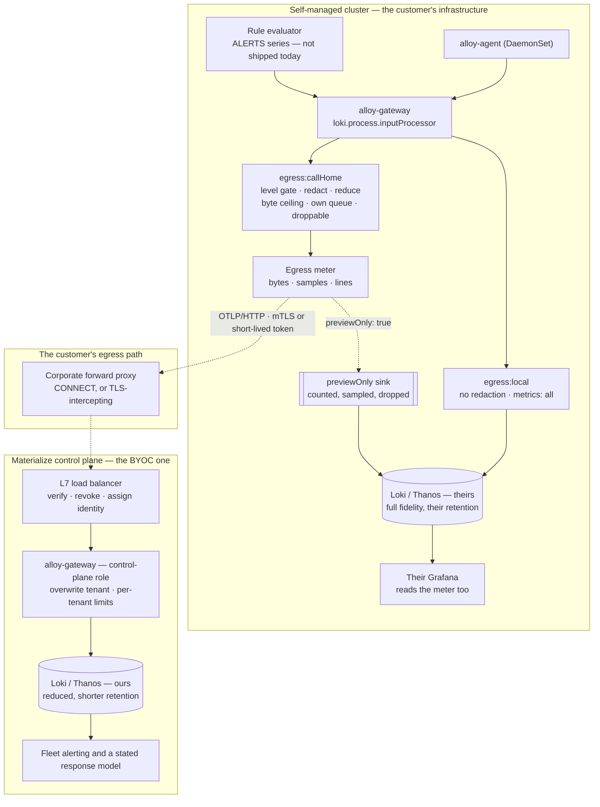

# Call-Home: Opt-In Telemetry from Self-Managed to the Control Plane

date: 2026-09-17

# Call-Home: Opt-In Telemetry from Self-Managed to the Control Plane

<table class="param-table">
  <tbody>
        <tr>
          <th>agent</th>
          <td>Claude Opus 5</td>
        </tr>
        <tr>
          <th>author</th>
          <td>Heather Lapointe</td>
        </tr>
        <tr>
          <th>lastmod</th>
          <td>2026-09-17 00:00:00 &#43;0000 UTC</td>
        </tr>
        <tr>
          <th>publishdate</th>
          <td>2026-09-17 00:00:00 &#43;0000 UTC</td>
        </tr>
        <tr>
          <th>status</th>
          <td>Ready</td>
        </tr>
  </tbody>
</table>

This doc proposes **call-home for self-managed Materialize**: an opt-in channel by which a customer-operated deployment reports a bounded amount of telemetry to a Materialize-operated control plane, so that Materialize can notice and react to problems without holding access to the customer's cluster.

The [BYOC design](../20260813-byoc-observability/) already builds the pipe.
It names self-managed opt-in as a **Should** and describes it in a paragraph: the same channel, a flag, and a certificate.
That paragraph is correct about the mechanism and wrong about the size of the problem.

The central claim of this doc is that **in self-managed the mechanism is the easy half and consent is the feature.**
A BYOC customer bought an operated service, so telemetry crossing the boundary is the thing they purchased.
A self-managed customer bought software they run themselves, frequently *because* it runs where their data does, and every byte that leaves is a concession.
The design that follows is therefore organized around a bounded, monotone, locally-visible egress ladder whose lowest useful rung is **alerts alone** — not around a pipeline, which already exists.

<!--
Agent note: this doc records decisions and their *why*. When a decision lands in code, update the section and
check the matching row in "Chart-side prerequisites".

This doc deliberately does not restate the BYOC pipeline work. Anything about map-shaped log destinations,
per-destination redaction, or queue isolation belongs in 20260813-byoc-observability.md and is referenced
from here. If that doc moves, fix the references rather than copying the content back.

Three claims here are load-bearing and easy to soften by accident: that nothing in a default install evaluates
alerting rules today, that a TLS-intercepting forward proxy defeats mTLS outright, and that receiving a signal
creates a support obligation. Revise them rather than hedging them.

Work spans repos. The tier ladder, the preview mode, the egress meter and the profile land here; the ingress,
issuance and the response model are control-plane work.
-->

## Goals

Functional requirements, framed as value-first user stories.
Priority tags (**Must** / **Should** / **Could**) are relative to the first shipped version.

Four stakeholder classes consume this, and they are not the BYOC four.

- **Self-managed customers**, who did not buy an operated service and are being asked to send something they currently send nothing of.
- **Their security and compliance reviewers**, who decide whether the flag may be turned on at all.
- **Materialize support and SRE**, who are blind to these deployments between escalations.
- **Materialize product and release engineering**, who cannot today say what versions the self-managed fleet runs or how a release behaved after it shipped.

- **[Must] As a self-managed customer,** I want the channel to be off until I turn it on, so that upgrading the monitoring stack never starts sending anything.
- **[Must] As a self-managed customer,** I want a small number of named levels rather than a matrix of switches, so that deciding what to share is one decision I can explain to my security team.
- **[Must] As a compliance reviewer,** I want an exact, generated statement of what each level sends, so that approving it does not require trusting a prose description.
- **[Must] As a compliance reviewer,** I want to see what *would* be sent before anything is sent, so that the review is performed against my own data rather than against an example.
- **[Must] As a self-managed operator,** I want to see locally how much left and what it was, so that the bound is something I measure rather than something I am told.
- **[Must] As a self-managed operator,** I want Materialize to be unable to widen or enable this remotely, so that the level I chose is the level that holds.
- **[Must] As a self-managed operator,** I want a control-plane outage or a blocked egress path to be invisible to my own monitoring, so that opting in cannot degrade what already works.
- **[Must] As Materialize support,** I want to know that a customer's environment is unhealthy without waiting for a ticket, so that the first message in the thread can be ours.
- **[Must] As a security reviewer,** I want each deployment to authenticate as itself with a credential Materialize can revoke unilaterally, so that a churned or compromised customer loses the channel without a change on their side.
- **[Should] As a self-managed operator behind a corporate egress proxy,** I want the channel to work through it, so that "opt in" is not blocked by the network shape my company mandates.
- **[Should] As Materialize release engineering,** I want to know which versions the fleet runs and how a release behaved after it shipped, so that a regression is visible as a fleet trend rather than as a series of unrelated tickets.
- **[Should] As Materialize support on a live escalation,** I want a consented, time-boxed increase in fidelity, so that a hard case does not require a screen-share and does not permanently raise the customer's baseline.
- **[Should] As a self-managed customer,** I want a written statement of what Materialize does with what I send, so that the exchange is reciprocal rather than one-directional.
- **[Could] As a self-managed customer,** I want to read the copy the control plane holds about me, so that what crossed is inspectable rather than described.
- **[Could] As an air-gapped operator,** I want an offline equivalent, so that a deployment with no egress at all is not excluded from the support benefit.

## Technical BLUF

- **Call-home is not a new channel.** It is the [BYOC gateway-to-gateway channel](../20260813-byoc-observability/#architecture) with a much lower default, an explicit consent model, and a bound the customer can verify. Building a second ingress would give Materialize two things to operate and customers two things to review.
- **The deliverable is a ladder, not a surface.** Five named levels, each strictly containing the one below, each with a published egress schedule and a measured volume envelope. One dial, monotone, so "higher sends more" needs no matrix to understand.
- **The lowest useful level is alerts, and it is the cheapest thing in the design.** Alert state is one metric family. Forwarding it is an allowlist on a fan-out that already ships, which is far smaller than the `essential` tier the BYOC design sends.
- **Nothing in a default install evaluates alerting rules.** `pre-rendered/rules/prometheus/` is empty, no template emits a `PrometheusRule`, `thanos.ruler.enabled` is `false`, and `tags.alertmanager` is `false`. The alerts level is blocked on rules being *evaluated*, not on anything in this design.
- **Alert state and alert notification are different signals and both are wanted.** The `ALERTS` series is the stream Materialize can query and trend; an Alertmanager webhook is the event that pages a human. The series is the first to ship because it reuses the channel; the webhook needs [routing](https://linear.app/materializeinc/issue/DEP-216) that does not exist yet.
- **A level below alerts is worth having.** A heartbeat carrying install identity, component versions and stack health discloses close to nothing and answers the two fleet questions nobody can answer today: what is running, and what went dark.
- **The bound has to be measurable locally or it is not a bound.** A shipped egress meter — bytes, samples and lines per destination, already exposed by the gateway — plus a dashboard panel, is what turns a promise into an observation.
- **Preview before send.** A `previewOnly` destination runs the full processing chain, counts and samples the result locally, and drops before the writer. It is the compliance artifact that a generated schedule cannot be, because it is the customer's own data.
- **Widening is customer-side only.** The control plane must have no mechanism to enable or raise a level remotely. The time-boxed elevation for an escalation is the single exception and therefore carries the strongest construction: customer-approved, self-expiring, audited.
- **mTLS and JWT are not alternatives here; they are bootstrap and steady state.** The recommendation is a certificate from the license as the identity of record, exchanged for a short-lived token that is what travels. Direct mTLS ships first because it needs nothing that does not exist.
- **A TLS-intercepting forward proxy defeats mTLS outright**, and that shape is common in exactly the segment this feature targets. That makes the token path a reachability requirement rather than a security preference.
- **OTLP/HTTP, not OTLP/gRPC, is the right default wire for self-managed.** BYOC's gRPC choice assumes a cloud network Materialize helped configure. Corporate forward proxies handle HTTP well and gRPC badly.
- **Receiving a signal creates an obligation.** Collecting alerts Materialize does not act on is worse than collecting nothing, because the customer reasonably infers that someone is watching. A stated response model is a prerequisite for the alerts level, not a follow-up.
- **The fleet is larger and quieter than BYOC's.** Self-managed installs outnumber BYOC environments and mostly emit nothing interesting, which changes the control-plane sizing question from throughput to tenant count.

## Non-goals

- **A second ingress, a second credential story, or a second pipeline.** This is the [BYOC channel](../20260813-byoc-observability/) with different defaults. Anything that cannot be expressed as a values overlay on that channel is out of scope here.
- **Re-specifying the pipeline work BYOC owns.** Map-shaped log destinations, per-destination redaction, and per-destination queue isolation are that doc's blocking prerequisites and are dependencies of this one.
- **Inbound access of any kind.** Nothing here opens a path into a customer's cluster. Call-home is egress the customer initiates, and a design that ever needs to dial inward has become a different feature.
- **Replacing the customer's own monitoring.** The local stack stays primary and full-fidelity, exactly as in BYOC. Nothing crossing changes what is kept.
- **Licensing or usage reporting.** Whether Materialize already reports entitlement or usage from self-managed installs is a control-plane question that this design should converge with rather than duplicate. See [open questions](#open-questions).
- **Air-gapped support in the first version.** A deployment with no egress cannot call home. The offline equivalent is named and deferred.
- **Customer access to the control-plane Grafana.** Same position as BYOC. A customer's read of their own copy, if it happens, goes through the [tenant-scoped proxy](../20260916-tenant-query-api/#deployment-shapes).
- **Deciding the support contract.** This doc states that a response model is required and what it has to cover. What Materialize commits to is a commercial decision.

## What exists today

| Capability | State | Where |
|---|---|---|
| Metric fan-out to N destinations, each with its own tier floor | ✅ Shipped | `pipeline.metrics.gateway.destination.otel.*`, `minMetricImportance`, `profiles/otel-metrics-fanout.values.yaml` |
| Metric importance tiers, generated from the query registry | ✅ Shipped | `pre-rendered/metrics/metric-tiers.yaml` |
| Metric denylist on the gateway | ✅ Shipped | `pipeline.metrics.gateway.denyMetrics` |
| Swappable destination tail (`egress` seam) | ✅ Shipped | `packages/alloy-pipelines/gateway-dest-stub.yaml` |
| Client TLS and auth types on every destination | ✅ Shipped | `tls.{ca,cert,key}` plus `*File` carriers; `none` / `basicAuth` / `bearer` / `oauth2` / `sigv4` |
| Gateway server-side TLS on all four ingest ports | ✅ Shipped | `pipeline.{logging,metrics}.gateway.server.tls`, `profiles/mtls.values.yaml` and the phase overlays |
| Certificate issuance and renewal | ✅ Shipped | `templates/certificates.yaml`, `certificates.enabled`; renewal measured across five rotations |
| Alert **definitions** | ✅ Shipped as documentation | `packages/queries/materialize-alerts.yaml`, `infra-alerts.yaml`, rendered to [Common Alerts](../../../stable-metrics/common-alerts/) |
| **Alert rule evaluation** | ❌ **Absent** | `templates/alerts/` is empty, nothing reads `config.rules.prometheus.enabled`, `pre-rendered/rules/prometheus/` holds only a `.gitkeep`, and `thanos.ruler.enabled` is `false` |
| **Alertmanager** | ⚠️ Bundled, off | `tags.alertmanager: false`; routing is [DEP-216](https://linear.app/materializeinc/issue/DEP-216), unstarted |
| **Logs to more than one destination** | ❌ Missing | One `loki.write "destination"`, one `egress` seam — [BYOC's blocking row](../20260813-byoc-observability/#chart-side-prerequisites) |
| **Per-destination log processing and redaction** | ❌ Missing | `inputProcessor` is global — same row |
| **A trust bundle for non-public CAs** | ❌ Not shipped | [DEP-236](https://linear.app/materializeinc/issue/DEP-236). Needed for any customer whose egress proxy presents a corporate certificate |
| **`oauth2.tls` on destinations** | ❌ Missing | Named by the [query-API doc](../20260916-tenant-query-api/#the-blocker-stated-precisely); blocks exchanging a certificate for a token |
| **An egress meter the customer can read** | ❌ Missing | The gateway exposes per-destination counters; no dashboard panel or documented query presents them as "what left" |
| **Any notion of a consent level** | ❌ Missing | Destinations are configured individually; nothing composes them into a stated posture |

Two rows carry most of the work in this doc, and neither is a pipeline feature.
The alert-evaluation row is why the cheapest level cannot ship yet.
The consent-level row is the feature itself.

## Architecture

The dashed edge is the only flow that leaves the cluster, and it does not exist at the default level.

Three properties of this diagram carry the design.

**The call-home branch is a fork, and it is absent at level 0.**
The local path reaches the customer's own backends with no dependency on the branch existing, being configured, or working.
This is the [BYOC isolation property](../20260813-byoc-observability/#per-destination-isolation-is-a-hard-requirement-not-a-nicety) inherited unchanged, and it matters more here because the customer opted in as a favour rather than as a purchase.

**The meter sits before the exit, not beside it.**
Everything that leaves is counted on the way out, and the same counter feeds the customer's dashboard and the published volume envelope.
A meter computed anywhere else measures intent rather than egress.

**Preview is the same branch with the writer replaced.**
That is what makes it trustworthy: the preview is not a simulation of the chain, it is the chain, terminating one component earlier.

## The consent ladder

A self-managed customer is not choosing between destinations.
They are choosing how much of their operational surface a vendor may see, and that decision is made once, by someone who will not read a values reference.

**Decision: five named levels, strictly nested, with one values key selecting them.**

| Level | Name | What crosses | What it answers for Materialize | Default |
|---|---|---|---|---|
| 0 | `off` | Nothing | — | ✅ |
| 1 | `heartbeat` | Deployment identity, component and chart versions, monitoring-stack health, a periodic liveness timestamp | What is running where, and which install stopped reporting | |
| 2 | `alerts` | Level 1 plus alert state — which alerts are firing, since when, at what severity | What is wrong, right now, without a ticket | |
| 3 | `metrics` | Level 2 plus the `essential` metric tier | Why, quantitatively, and whether it is a trend | |
| 4 | `diagnostics` | Level 3 plus allowlisted, redacted, `WARN`-and-above Materialize and infrastructure logs | What the component actually said | |

Plus one that is not a rung, because it is temporary:

| | Name | What crosses | Construction |
|---|---|---|---|
| — | `elevated` | A higher tier and relaxed redaction, for a bounded window | Customer-approved, self-expiring, audited. Never a standing configuration |

Four properties of this ladder are deliberate.

**Nesting, so the dial is monotone.**
A customer at level 2 sends strictly less than one at level 3.
A non-nested design — logs without metrics, say — is defensible and produces a matrix, and a matrix is a thing security teams say no to rather than read.

**Level 0 is the default and stays the default across upgrades.**
A chart upgrade that starts sending anything is the single failure that would end this feature's credibility, and it is the kind of failure that a values default drifting in a refactor produces silently.
This belongs in a render assertion, not in review discipline.

**The levels are assembled by profiles, not by the operator.**
Consistent with [profiles as documentation](../20260803-terraform-modules/#profiles-are-documentation-with-one-exception), each level is a composable overlay — `callhome-heartbeat`, `callhome-alerts`, and so on — that sets the destination, the tier floor, the redaction chain and the budget together.
An operator who assembles a level by hand will get four of the five settings right, which is the failure mode the [mTLS validator work](../20260816-tls-authentication/#per-component-notes) already found on a different feature.

**Every level publishes a generated schedule and a measured envelope.**
The schedule says what crosses, generated the way `metric-tiers.yaml` is, because a hand-maintained list drifts on the first rename.
The envelope says how much, in bytes per day per environment, measured rather than estimated.
A level without both is not reviewable, and "opt in to an unknown quantity" is not an offer a compliance team can accept.

### Level 1 is worth building on its own

The instinct is to treat a heartbeat as a placeholder under the real feature.
It is the highest ratio of value to disclosure in the design.

It answers two questions nobody at Materialize can answer today.
**What does the self-managed fleet run?** Version adoption, chart version, which components are enabled, which profiles are in use.
That is the input to every deprecation decision and every "how many customers does this break" question, and today it is a guess assembled from support threads.
**Which install went dark?** A deployment that stops heartbeating has either been uninstalled or has broken in a way that took the monitoring stack with it, and those are worth distinguishing.

What crosses is a small, fixed, enumerable record.
It carries no metric series, no log lines, no object names, no query text — which makes it the one level that can plausibly be approved without a compliance review, and therefore the one that a customer can turn on the same day they are asked.

The discipline it requires is that the record stays fixed and enumerable.
The pressure to add "just one more field" to a heartbeat is constant, and the moment its contents are open-ended, the reason it was easy to approve is gone.
The schedule for level 1 should be an explicit list of field names in the docsite, and adding a field should be a change to that list.

## The alerts level

This is the level the request for this design centres on, and it is the most interesting one, for two reasons that pull in opposite directions.

It is the **smallest** thing that makes Materialize useful on a self-managed deployment: an alert is already the distilled statement that something is wrong, produced by rules Materialize wrote, over metrics Materialize defined.
It compresses an environment's health into a handful of series.

It is also the level that **nothing currently produces**.

### Nothing evaluates alerting rules today

The alert definitions exist and are good.
They live in the query registry and render to the docsite as [Common Alerts](../../../stable-metrics/common-alerts/).
They are not evaluated anywhere in a default install:

- `charts/materialize-monitoring/templates/alerts/` contains no templates.
- No template reads `config.rules.prometheus.enabled`, which defaults `true` and does nothing.
- `pre-rendered/rules/prometheus/` contains a `.gitkeep`.
- `thanos.ruler.enabled` defaults `false`, so the bundled evaluator is off.
- `tags.alertmanager` defaults `false`, so the bundled notifier is off.

The [roadmap already records this correction](../../roadmap/#rules--alerts) — the row was marked done on the strength of the documentation.
Restating it here is not redundancy: it sets the dependency order.
**The alerts level is blocked on rule evaluation shipping, and on nothing in this design.** A call-home channel that forwards alert state from a stack that evaluates no rules forwards an empty set, which is worse than not offering the level, because it looks like good news.

### Alert state and alert notification are two signals

They are frequently conflated, and the design needs both eventually and one of them first.

| | **Alert state** (`ALERTS` series) | **Alert notification** (Alertmanager webhook) |
|---|---|---|
| Produced by | The rule evaluator, continuously | Alertmanager, after grouping, inhibition and silences |
| Shape | A metric family with alert name, severity, state and labels | An event, batched, with an annotation and a runbook link |
| Travels on | The existing metric fan-out | A second client, a second credential, a second ingress path |
| Gives Materialize | History, trend, and the ability to write its own rules over it | Exactly what the customer's own on-call saw |
| Depends on | Rule evaluation | Rule evaluation **and** [Alertmanager routing](https://linear.app/materializeinc/issue/DEP-216) |
| Cost to build | An allowlist on a shipped fan-out | An ingress, a receiver, and credential wiring for a client that is not the gateway |

**Recommendation: the alerts level ships as the state series, and the webhook follows.**

The state series is close to free.
`ALERTS` is one family; forwarding it is an allowlist on `pipeline.metrics.gateway.destination.otel`, which already supports per-destination selection.
It also gives Materialize the better raw material — a series can be trended, joined against version, and alerted on centrally with grouping that is fleet-shaped rather than per-install, which is the thing [the BYOC doc names](../20260813-byoc-observability/#control-plane-scale) as the difference between collecting signal and being paged on it.

The webhook is the thing that carries the customer's *actual* notification, post-silence, and it is worth having precisely because it tells Materialize what the customer's on-call was told.
It is not first because it adds a second client with its own credential path and depends on routing that is unstarted.

One consequence to design for now rather than discover: an alert state series forwarded from a stack whose Alertmanager has the alert silenced will show firing at Materialize while the customer has deliberately suppressed it.
Silences are a statement of intent and the control plane should be able to see them, or Materialize will page itself on something a customer already decided to ignore.
That argues for the webhook sooner rather than later, and for silence state being part of what the webhook path carries.

### Where the series has to come from

The fan-out happens at the gateway, so the alert state series has to traverse the gateway to be forwardable.
Loki's ruler already remote-writes recording-rule samples back to `prometheus.receive_http` on the gateway, which is the shape this needs.
Whatever evaluates the metric rules has to be wired the same way, or the series will be in Thanos and invisible to the destination that would forward it.

That is a checkable requirement rather than an assumption, and it belongs in the [prerequisites](#chart-side-prerequisites) because getting it wrong produces a level that renders correctly and forwards nothing.

## Bounding the volume credibly

"Limited to what a customer is comfortable with" is the requirement, and a values key that names a tier does not satisfy it.
A tier is a statement about *what*; comfort is mostly a question about *how much*, and about whether the answer can be checked.

Three mechanisms, in the order they matter.

### Preview before send

**Decision: a `previewOnly` mode on the call-home destination.**

The destination is configured exactly as it would be, the full processing chain runs — selection, redaction, sampling, rate limiting — and the branch terminates in a counter and a local sample rather than a writer.
Nothing leaves the cluster.

This is cheap, because the [BYOC per-destination chain](../20260813-byoc-observability/#multi-destination-for-logs) already ends in a per-destination writer; preview replaces that writer with a sink.
It is the most valuable compliance artifact in the design, and it is valuable for a reason a generated schedule cannot match: **the review happens against the customer's own data.**
A schedule says "log bodies of class `infra` at `WARN` and above cross".
A preview says "here are the 412 lines that would have crossed in the last hour, and here they are".

The preview output goes to the customer's own Loki, at a stream they can query and dashboard, with a retention they set.

### An egress meter, shipped and visible

The gateway already exposes per-destination counters for what it sent.
Nothing turns those into an answer to "how much left".

**Decision: a shipped dashboard row — bytes, samples and lines per destination, per signal, with the call-home destination broken out — plus a documented query.**
The bound is credible when the customer measures it, and a number they have to construct themselves is a number they will not construct.

The same counters are what make the published volume envelope per level a measurement rather than an estimate, which is the difference between a reviewable claim and a plausible one.

### A hard ceiling, enforced on the branch

Selection bounds what crosses in kind; it does not bound it in volume, and the cases where volume spikes are exactly the incidents where the branch matters — a crash loop, a log storm, a cardinality explosion.

**Decision: an explicit byte-rate ceiling on the call-home branch, defaulted per level, enforced with the existing `stage.limit` and the metric-side equivalent, and shed rather than queued on breach.**

The asymmetry the BYOC design establishes applies unchanged and matters more here: the call-home branch is [droppable and the local branch is not](../20260813-byoc-observability/#per-destination-isolation-is-a-hard-requirement-not-a-nicety).
A self-managed customer who opted in as a favour must never experience their own log delivery degrading because a vendor's endpoint was slow.

A shed event is itself worth reporting — at the next level up, and in the local meter — because a silently truncated call-home stream gives Materialize a misleading picture precisely during the incident it exists for.

### The reciprocal half

A bound the customer can verify addresses their exposure.
It does not address what happens on the other side, and a compliance review will ask.

Three commitments belong in the customer-facing document alongside the schedule: **retention** (shorter than theirs, stated in days), **access** (who at Materialize can read it, and that reads are audited by the same mechanism the [query proxy](../20260916-tenant-query-api/#the-proxys-own-read-record) uses), and **deletion** (what happens on churn, and how long it takes).
Without those three, "we hold a reduced copy" is an open-ended statement, and the generated schedule's precision about *what* only highlights the vagueness about *afterwards*.

## Authentication: mTLS, JWT, or both

This is the open decision the design was asked to settle, and the self-managed case has three properties the [BYOC answer](../20260813-byoc-observability/#the-license-as-credential-carrier) did not have to weigh.

### What differs from BYOC

**The network is the customer's, and it frequently intercepts TLS.**
A large share of the self-managed segment reaches the internet through a corporate forward proxy.
Where that proxy tunnels with `CONNECT`, mTLS passes through untouched.
Where it *intercepts* — terminating TLS, re-signing with a corporate CA, inspecting, and re-originating — **client-certificate authentication cannot work at all**, because the proxy would have to present the client's certificate without holding its private key.
A bearer credential survives that hop; a client certificate does not.
This is not a security trade.
It is a reachability fact, and it decides whether a customer can opt in.

The same shape also requires the [trust bundle](../20260816-tls-authentication/#object-storage-is-in-scope-in-one-direction) that [DEP-236](https://linear.app/materializeinc/issue/DEP-236) tracks, since the gateway will be presented with the proxy's corporate certificate rather than the control plane's.

**Churn and revocation are ordinary rather than exceptional.**
BYOC customers are operated accounts.
Self-managed installs get decommissioned, forked into test clusters, cloned into staging, and left running after a contract ends.
Revocation is a routine operation in this segment, and [`otelcol.receiver.otlp` has no CRL support](../20260813-byoc-observability/#two-stage-verification-with-one-revocation-checkpoint), which leaves CRL freshness at the load balancer as the only control and its refresh interval as the revocation window.

**The credential should carry the consent grant.**
This is the argument specific to this design.
The level a customer agreed to is a fact the control plane would rather verify than trust, because a client that sends more than its level permits should be refused at the ingress rather than accepted and cleaned up later.
A signed claim carries that naturally and is re-issued when the customer changes level.
A certificate can carry it in a SAN or an OID, and changing it then means re-issuing a certificate, which turns a configuration change into a PKI operation.

### The comparison

| | **mTLS** (certificate from the license) | **JWT** (short-lived, JWKS-verified) |
|---|---|---|
| Online dependency at send time | None | An issuer reachable at refresh |
| Survives a TLS-intercepting proxy | ❌ No | ✅ Yes |
| Revocation | CRL at the load balancer; window is the refresh interval | Expiry; window is the token lifetime |
| Identity at the receiver | Injected header the receiver must trust and overwrite | A verified claim inside the request |
| Carries the consent grant | Awkwardly, and re-issuance is a PKI operation | Naturally, and re-issuance is a token refresh |
| Per-tenant state at the ingress | None — a verifier CA | None — a JWKS |
| Presentable by Alertmanager as a client | Yes, via its `http_config` TLS settings | Yes, as a static bearer or via client credentials |
| Works today with what is shipped | ✅ Yes | ❌ Needs an issuer, and [`oauth2.tls`](../20260916-tenant-query-api/#the-blocker-stated-precisely) on the destination schema |
| Long-lived secret sitting in the customer's cluster | The certificate, for its lifetime | The bootstrap credential only |

### Recommendation

**The certificate is the identity of record; the token is what travels.**

This is the [token-exchange shape the query-API doc proposes for BYOC ingest](../20260916-tenant-query-api/#token-exchange-for-byoc-ingest), and self-managed is the deployment where its advantages are largest rather than marginal — because of the proxy problem, because churn makes revocation routine, and because the consent grant wants to live in the credential.

Concretely, in the order it should ship:

1. **Direct mTLS first**, using the license-carried certificate, for the levels that ship first. It needs nothing that does not exist, and the [BYOC ingress will already verify it](../20260813-byoc-observability/#two-stage-verification-with-one-revocation-checkpoint). This is what makes the first customer possible.
2. **Token exchange next**, authenticated by that same certificate, with the grant in the claim. This is what makes the feature reachable for proxied customers and revocable in minutes instead of a CRL interval.
3. **Both paths stay supported.** mTLS has no online dependency, which is a real property to keep for customers whose networks make an issuer round trip fragile.

Two constraints that fall out and should not be traded away.

**A static bearer token as the primary credential is not acceptable.**
It is the obvious shortcut — it works through every proxy, it needs no PKI, and a customer can paste it into values.
It is also a long-lived secret in a customer's cluster with no renewal story, landing in `helm get values` and in Terraform state, which is [the constraint the query-API doc places on every credential](../20260916-tenant-query-api/#chart-side-prerequisites).
Its one legitimate use is as the bootstrap credential for the exchange, where its exposure window is one exchange rather than a contract term.

**Whichever credential is chosen, identity is not asserted by the client.**
The BYOC receiver [overwrites client-supplied tenant metadata unconditionally and fails closed when the load balancer asserted nothing](../20260813-byoc-observability/#identity-is-assigned-by-the-load-balancer-never-asserted-by-the-client).
That construction carries over unchanged, and the token path improves on it by removing the header entirely: identity arrives inside the thing already being verified.

## Reaching the control plane from a customer network

The BYOC design chose OTLP over gRPC, and the reasoning was sound for an account Materialize helped configure.
Self-managed networks are not that, and two of its conclusions should be revisited for this path.

**Default to OTLP/HTTP on 4318 rather than gRPC on 4317.**
Corporate forward proxies handle HTTP well and gRPC badly — HTTP/2 over `CONNECT` is frequently downgraded, buffered, or refused outright, and the failure is a hang rather than an error.
Both receivers already exist on the gateway, so this is a default rather than a feature.
gRPC stays available for customers with a direct egress path, where its single long-lived connection is genuinely better.

**Forward-proxy configuration is part of the values surface.**
An operator behind a proxy needs to name it, and needs the corporate CA in the trust bundle.
Neither is expressible today in a way this path can use, and "configure it in the pod's environment" is the kind of instruction that produces a support ticket per customer.

**A blocked or failing egress path is a local alert, not silence.**
If call-home cannot reach the control plane, the customer should know — both because they turned it on for a reason, and because the alternative is Materialize treating a network failure as a healthy quiet environment.
The heartbeat's absence is the control-plane-side signal; a local alert on export failure is the customer-side one, and they are not the same alert.

**Air-gapped deployments are out of scope and should be named.**
A meaningful share of self-managed installs have no egress by policy, and for them the entire feature is unavailable.
The offline equivalent — a periodic exportable bundle the customer reviews and transfers — reuses the preview mode's processing chain and is worth building if the segment matters.
It is deferred, not dismissed, and the reason to name it is that "call home" quietly excludes those customers from the support benefit everyone else gets.

## Receiving a signal creates an obligation

This is the section most likely to be skipped and the one most likely to cause harm.

The moment a customer turns this on, they reasonably believe someone is watching.
If Materialize collects alerts into a store nobody is paged on, the customer has taken a disclosure risk and received nothing, and will discover that during their first incident — which is the worst possible moment to find out, and the kind of thing that ends the programme for every other customer too.

**Three things must exist before the alerts level is offered, and none of them is in this repo.**

| Requirement | What it means |
|---|---|
| A routing destination | Fleet alerts reach a rota that has agreed to receive them, with grouping that is fleet-shaped rather than one page per install |
| A stated response | What Materialize does on receipt, within what time, and under which support tier. It may legitimately be "we open a ticket during business hours" — it may not be unstated |
| A stated non-response | What Materialize explicitly does *not* watch for, so that the customer's own on-call rota is not quietly reduced on a false assumption |

The third is the one that gets omitted and it carries the most risk.
A customer who believes the vendor is watching will staff accordingly.

The [BYOC doc's dependency on Alertmanager routing](../20260813-byoc-observability/#control-plane-scale) is the same observation from the collection side: without routing, the control plane collects signal nobody is paged on, which is half the value.
In self-managed it is worse than half, because the customer paid for the other half in disclosure.

## Control-plane shape and scale

The control plane is [the BYOC one](../20260813-byoc-observability/#control-plane-scale), and reusing it is the recommendation.
Three properties of the self-managed fleet change its sizing question.

**Tenant count dominates throughput.**
A BYOC fleet is a manageable number of environments each sending an `essential` tier.
A self-managed fleet is potentially an order of magnitude more installs, most of them at level 1 or 2, sending almost nothing.
The cost is per-tenant overhead — Loki stream and index overhead, Thanos series churn, per-tenant limit configuration — rather than ingest volume, and it is the number that has to be computed before this ships rather than discovered.

That reframes [the BYOC open question](../20260813-byoc-observability/#open-questions) about whether the tenant is the customer or the environment.
For self-managed, a tenant per *install* with the customer as a label is likely right, because installs are the unit that appears, disappears and gets cloned, and because a support engineer's question is nearly always about one install.

**Identity is three-part, not two.**
A self-managed cluster commonly hosts several Materialize environments, and a customer commonly runs several clusters.
The identity has to carry customer, install, and environment, and the install component has to survive a cluster being rebuilt or the history detaches from the thing it describes.
A cloned cluster presenting a duplicate install identity is the specific failure to design against, and it is common in this segment because staging is made by copying production.

**Version skew is wider than anywhere else.**
Self-managed customers upgrade on their own schedule, so the ingress must accept pipeline versions as old as the [deprecation policy](../20260823-deprecation-policy/) promises, with no version-coupled expectations of its clients.
This is the strongest argument for the wire format staying plain OTLP with the existing label contract.

**Quiet installs need to be distinguishable from absent ones.**
At level 1 the expected traffic is a heartbeat and nothing else, which makes "no data" the normal state for almost every signal.
The control plane's alerting has to be built on heartbeat absence rather than on telemetry absence, or every healthy install looks like an outage.

## What this shares with BYOC, and what it does not

Reusing the BYOC channel is the recommendation, and stating the differences precisely is what keeps the shared parts shared.

| | BYOC | Self-managed call-home |
|---|---|---|
| Default posture | On — it is what the customer bought | **Off** |
| Consent | Implied by the contract | **Explicit, per install, at a named level** |
| Default fidelity | `essential` metrics plus redacted logs | **Heartbeat, or alerts** |
| Who deploys the stack | The stack deployer, with our defaults | The customer, through Helm or Terraform |
| Network path | An account Materialize helped configure | The customer's, frequently via an intercepting proxy |
| Credential distribution | The deployer | The license |
| Revocation frequency | Rare | Routine |
| Support obligation | Contractual, already defined | **Undefined, and a prerequisite** |
| Fleet shape | Fewer, louder | More, quieter |
| Pipeline | The same | The same |

The last row is the point of the table.
Everything structural is shared; everything that differs is policy, defaults, and the consent apparatus — which is why this is a values-and-profile feature on top of the BYOC work rather than a parallel one beside it.

## Chart-side prerequisites

Work in **this** repo. Ordered roughly by dependency.
None of it is ticketed yet.

| Item | Why it is needed | Blocking? |
|---|---|---|
| **All [BYOC blocking prerequisites](../20260813-byoc-observability/#chart-side-prerequisites)** — map-shaped log destinations, per-destination processing, per-destination queue and drop policy, the tenant overwrite, the log-bridge transform, and the redaction stage set | This design is defaults and consent on top of that channel. Nothing above level 3 exists without them | **Blocking**, inherited |
| **Rule evaluation actually shipping** — a template that emits the bundled rules, and an evaluator enabled by default in the bundled shape | Nothing evaluates alerting rules today, so the alerts level would forward an empty set that reads as good news | **Blocking** for levels 2 and up |
| **Alert state reaching the gateway** — whatever evaluates metric rules remote-writes to `prometheus.receive_http`, as Loki's ruler already does | The fan-out happens at the gateway. Series that land in Thanos without traversing it cannot be forwarded | **Blocking** for the alerts level |
| **The `callHome.level` values surface**, defaulting `off`, with the level profiles that assemble each rung | The feature. A level assembled by hand is a level with four of five settings right | **Blocking** |
| **A render assertion that the default sends nothing**, re-checked on every values change | A default that drifts to on in a refactor is the one failure that ends the programme | **Blocking** |
| **`previewOnly` on the call-home destination** — full chain, counted and sampled locally, dropped before the writer | The compliance artifact a generated schedule cannot be, because it runs on the customer's own data | **Blocking** for the review story |
| **A byte-rate ceiling per level**, shed rather than queued, with the shed event reported | Selection bounds kind, not volume, and volume spikes during exactly the incidents this exists for | **Blocking** |
| **The egress meter** — a dashboard row and a documented query over the existing per-destination counters | A bound the customer cannot measure is a bound they have to take on faith | **Blocking** for the consent claim |
| **The heartbeat producer** — a fixed, enumerable record of deployment identity, versions, enabled components and stack health | Level 1, and the only signal that distinguishes a quiet install from an absent one | **Blocking** for level 1 |
| **A generated egress schedule per level**, extending the `metric-tiers.yaml` pattern to log classes and heartbeat fields | A hand-maintained list drifts on the first rename, and this one is a compliance artifact | **Blocking** for the review story |
| **OTLP/HTTP as the call-home default wire**, with gRPC available | Corporate forward proxies handle HTTP well and gRPC badly, and the failure is a hang | **Blocking** for proxied customers |
| **Forward-proxy and corporate-CA configuration** on the call-home destination, depending on [DEP-236](https://linear.app/materializeinc/issue/DEP-236) | An intercepting proxy presents its own certificate; without the bundle the connection cannot be verified at all | **Blocking** for proxied customers |
| **A local alert on call-home export failure** | Otherwise a blocked egress path is silence on both sides, and silence reads as health | **Blocking** for exposure |
| **Three-part identity** — customer, install, environment — stable across cluster rebuild and non-duplicating across a clone | A cloned staging cluster presenting production's identity merges two installs' telemetry | **Blocking** |
| **`oauth2.tls` on the destination schema** | Without it the token exchange authenticates with a long-lived client secret, which is what choosing a certificate avoided | **Blocking** for the token path, not for mTLS |
| **The `elevated` window** — a time-boxed tier raise that expires on its own and cannot be set remotely | The alternative is a support escalation that permanently raises a customer's baseline | Should land with level 3 |
| **An Alertmanager webhook receiver path**, with its own credential wiring | Carries what the customer's on-call actually saw, including silences | After [DEP-216](https://linear.app/materializeinc/issue/DEP-216) |
| **Terraform variables** for the level, the credential reference and the proxy, with credentials outside the values | `helm get values` reads values, and they land in state | Blocking for the Terraform path |
| Per-tenant control-plane limits sized for install count rather than volume | The self-managed fleet's cost is tenant overhead, not ingest | Blocking for capacity planning |

## Testing

The kind tiers extend to cover this, and the assertions that matter are the ones about *not* sending.

- **The default sends nothing.** A default install with a reachable control-plane endpoint configured in the environment emits zero bytes to it. Asserted at tier 1 on the render and at tier 2 on the wire, because a values default and a rendered destination can disagree.
- **Upgrade preserves the level.** Install at level 0, upgrade the chart across a version, and assert the level and the byte count are unchanged. This is the failure that would matter most and the one no fresh-install test can see.
- **Level nesting.** For each adjacent pair, assert the lower level's egress is a strict subset of the higher one's. A level that sends something the level above does not is a matrix pretending to be a ladder.
- **Preview sends nothing.** With `previewOnly` on and the full chain configured, assert the local preview stream is populated and the destination received nothing. Both halves — a preview that also sends is the worst possible bug in this design.
- **The ceiling sheds rather than queues.** Drive the branch past its byte ceiling and assert the local destination sees no gap, no back-pressure, and that the shed is counted. This is the [BYOC isolation assertion](../20260813-byoc-observability/#testing) with a volume trigger rather than a partition.
- **Redaction, positively and negatively**, per the BYOC suite: known-sensitive synthetic lines absent from the call-home destination *and present* locally.
- **The alerts level forwards real alert state.** Fire a synthetic alert and assert the series arrives. This is the test that fails today for the right reason, and it is the one that proves the evaluator is wired to the gateway rather than only to Thanos.
- **A revoked credential is refused** within the documented window, with the window asserted rather than immediacy assumed.
- **Proxied egress.** A tier-2 variant behind a TLS-intercepting forward proxy with its own CA: assert the token path succeeds and that the mTLS path fails with a diagnosable error rather than a hang. The second half is what stops this being a support ticket per customer.
- **Identity does not collide on a clone.** Duplicate the install and assert the control plane distinguishes the two, or refuses the second — either is acceptable, silently merging them is not.
- **Heartbeat absence is detectable.** Stop an install at level 1 and assert the control plane distinguishes "gone" from "quiet" inside the documented interval.

## Documentation to update

- A **customer-facing call-home page**: the levels, the generated schedule for each, the measured volume envelope, how to preview before enabling, how to read the local meter, how to turn it off, and the three reciprocal commitments — retention, access, deletion. This is the artifact a compliance team reads, and it is the most important item in this list.
- A **support-expectations statement** saying what Materialize does on receipt and, explicitly, what it does not watch for. Belongs with the support documentation rather than here, and the alerts level should not ship without it.
- `operating/production-best-practices.md` — the shared responsibility model gains a call-home row, and the checklist gains the decision.
- `alerting/` — the alerts level is a consumer of the rule set, and the page should say that nothing evaluates rules until that ships.
- `metrics/storing.md` and `logs-and-events/storing.md` — the control plane as a destination in the fan-out, mirroring the BYOC additions.
- `reference/internal/roadmap.md` — a call-home section and a follow-up-documentation entry pointing here.
- [Securing](../../../../operating/securing/) — the credential choice and the forward-proxy shape, once settled.

## Open questions

- [ ] **mTLS or JWT for what ships first?** The recommendation above is mTLS first and token exchange next, with both retained. The counter-argument is that shipping mTLS first means proxied customers cannot opt in at all for a release or two, and they may be the majority of the segment. Measuring that proportion would settle it.
- [ ] **Does Materialize already call home from self-managed for licensing or usage?** If an entitlement or usage report already leaves these clusters, this design should extend it rather than open a second channel — and the customer conversation is materially easier when the answer names an existing channel carrying more rather than a new one.
- [ ] **Is level 1 separable from the rest?** It discloses little enough to ship on its own timeline, and doing so would give the fleet-version answer long before the pipeline work lands. The risk is that a heartbeat shipped alone accretes fields until it is level 2 without the review.
- [ ] **Who evaluates alerting rules in the bundled shape** — Thanos Ruler enabled by default, or a `PrometheusRule` set for an operator the customer already runs? The second assumes prometheus-operator; the first is a component and a cost turned on for everyone.
- [ ] **Does alert state forwarding require the whole metric fan-out to be configured?** An allowlist of one family on a full destination is the cheap implementation and pulls in a destination block the customer may find larger than the thing they agreed to send.
- [ ] **What is the heartbeat interval**, and does its absence alert immediately or after a documented number of misses? The interval sets both the fleet-side noise floor and how quickly a dark install is noticed.
- [ ] **Is the tenant the install or the customer?** This doc leans install-with-customer-as-a-label, which is the opposite lean to the one a support engineer's cross-environment question wants. It should agree with whatever [BYOC settles](../20260813-byoc-observability/#open-questions).
- [ ] **What is the per-install control-plane cost**, and what fleet size does the first deployment size for? Tenant overhead rather than ingest volume, and nobody has computed it.
- [ ] **Can the `elevated` window be customer-initiated rather than customer-approved?** Initiated is stronger and puts the work on the customer during an incident; approved is faster and requires a request mechanism Materialize can send.
- [ ] **Does the customer get to read their own copy?** The [tenant-scoped proxy answers this](../20260916-tenant-query-api/#deployment-shapes) for BYOC with the same mechanism, and it is a stronger trust argument here than there, because the disclosure was voluntary.
- [ ] **Is the offline bundle worth building**, and how large is the air-gapped segment? The processing chain is shared with preview mode, so the marginal cost is the transfer format and a verification story.
- [ ] **Does opting in change the support contract**, and should a higher level carry a faster response? Tying fidelity to responsiveness is an honest incentive and it turns a privacy decision into a commercial one, which may be the wrong conversation to force.
- [ ] **Where does the consent record live**, and can Materialize show a customer what they agreed to? An opt-in with no auditable record is one a customer can reasonably dispute after an incident.

